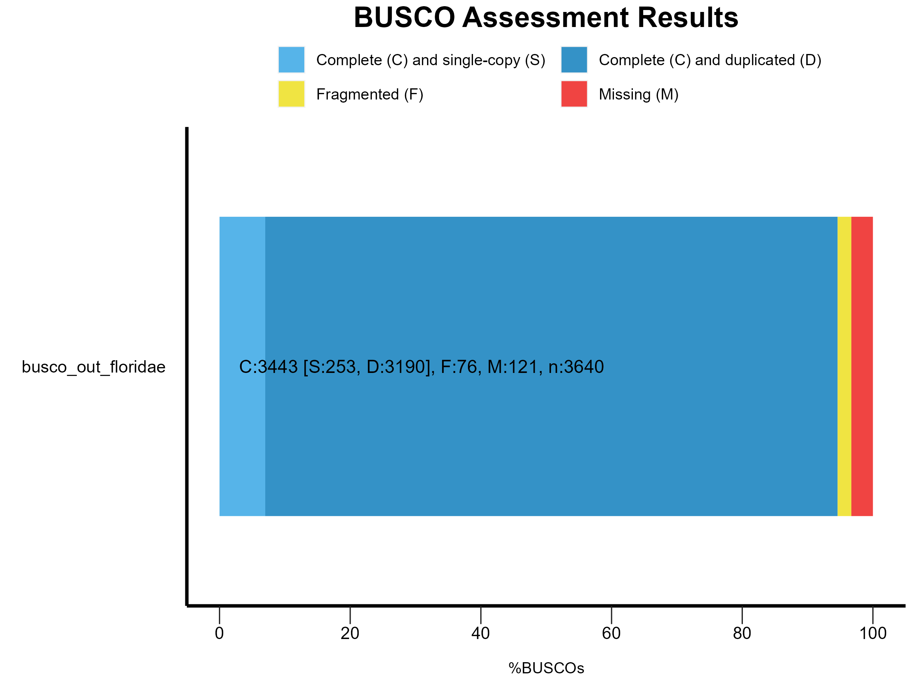
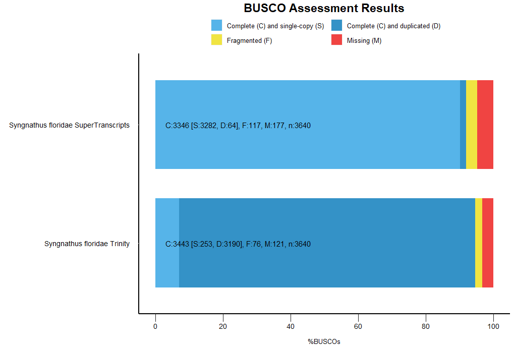

```{r setup, include=FALSE}
knitr::opts_knit$set(root.dir='../',fig_path="../figs/")
```

``` {r library, include = FALSE}
#library(tximport)
library(DESeq2)
library(pheatmap)
library(RColorBrewer)
library(PCAtools)
```

``` {r functions}
```

``` {r read-data}
#The abundance matrix generated via salmon and tximport to be used for the DE analysis
txi.salmon <- readRDS("data/txi.salmon.floride.RDS")

```

# Pre-assembly QUality Control and Filtering
For _Syngnathus floridae_ we began with an average of 48 &pm; 7.8 million reads per sample for a total of 2.80 billion reads.

## Trimming the Reads with Trimmomatic
[Trimmomatic](http://www.usadellab.org/cms/index.php?page=trimmomatic) is commonly used for Illumina paired-end and single ended data. There are a lot of different trimming steps that can be performed and parameters that correspond to each step. Currently for version **0.40** of trimmomatic these are the different steps:\
\

1.  **ILLUMINACLIP**: Cut adapter and other illumina-specific seuqences from the read.\
    `:<fastaWithAdaptersEtc>:<seed mismatches>:<palindrome clip threshold>:<simple clip threshold>`\
    -   fastaWithAdaptersEtc = specifies the path to a fasta file containing all the adapters, PCR sequences etc.
    -   seedMismatches = the max. mismatch count which will still allow a full match to be performed.
    -   palindromeClipThreshold = how accurate the match between the two 'adapter ligated' reads must be for PE palindrome read alignment
    -   simpleClipThreshold = how accurate the match between any adapterect. sequence must be against a read.
2.  **SLIDINGWINDOW**: Perform a sliding window trimming, cutting once the average quality within the window falls below a designated threshold.\
    `:<windowSize>:<requiredQuality>`\
    -   windowSize = the number of bases to average across
    -   requiredQuality = the average quality required
3.  **LEADING**: Cut bases off the start of a read, if below a designated threshold quality.\
    `:<quality>`\
    -   quality = the minimum quality required to keep a base
4.  **TRAILING**: Cut bases off the end of a read, if below a designated threshold quality.\
    `:<quality>`\
    -   quality = the minimum quality required to keep a base
5.  **CROP**: Cut the read to a specified length.\
    `:<length>` 
    -   length = the number of bases to keep, from the start of the read
6.  **HEADCROP**: Cut the specified number of bases from the start of a read.\
    `:<length>`\
    -   length = the number of bases to remove from the start of the read
7.  **MINLEN**: Drop the read if it is below a specified length.\
    `:<length>`
    -   length = the minimum length of reads to be kept

For **paired-end** data, two input files are specified and 4 output files. Two for the **paired** output where both of the reads survived the processing, and two for the corresponding **unpaired** output where one read survived but it's partner did not.\
\
**Trimming occurs in the order which the steps are specified on the command line**. Recommended that if the adapter clipping is required it is done as early as possible.

### Installing Trimmomatic

Trimmomatic was installed on the RCC through conda in a conda environment called **Trim**.

```
conda create -n Trim
conda activate Trim
conda install trimmomatic
```

### Running trimmomatic across Multiple Pairs of Reads

```{bash run_trimmomatic, eval=FALSE}
#!/bin/bash

data=/home/rccuser/20220902_mRNASeq_PE150/ ##This is the location of the raw reads

for fq in ${data}*_R1.fastq.gz
        do
        base=$(basename $fq _R1.fastq.gz)
        echo "Running trimmomatic for ${base}..."
        time trimmomatic PE -threads 16 $fq ${data}${base}_R2.fastq.gz \
                ${data}trimmed/${base}_paired_R1.fastq.gz ${data}trimmed/${base}_unpaired_R1.fastq.gz \    
                ${data}trimmed/${base}_paired_R2.fastq.gz ${data}trimmed/${base}_unpaired_R2.fastq.gz \    
                ILLUMINACLIP:NexteraPE-PE.fa:2:30:10 HEADCROP:12 LEADING:3 TRAILING:10 SLIDINGWINDOW:4:15 MINLEN:50
done
```

-   Before running the script, change the `trimmomatic` line to `echo "..."` to make sure all of the variables are working correctly.

-   Then remove the `echo ""` and run the script as `nohup bash trim_script.sh > trim.out 2>&1 &`.\

-   The **NexteraPE-PE.fa** file was pulled from the [trimmomatic github](https://github.com/usadellab/Trimmomatic/tree/main/adapters) using `wget https://github.com/usadellab/Trimmomatic/blob/main/adapters/NexteraPE-PE.fa`


## Using Kraken2 to remove biological contamination
### Create a new environment and install Kraken2 in it

```
conda create -n kraken2
conda activate kraken2
conda install kraken2
```

### Creating the Standard Kraken2 Database {.tabset}
The Kraken2 Database can be generated in one of two ways

#### Builidng it by Hand {.unnumbered}
Kraken2 has a built in function `kraken2-build` that allows you to build whatever database you are wanting. For example if you want to generate the standard kraken2 database (That includes archea and bacteria):

```
mkdir kraken2_standard_db

kraken2-buid --standard --db kraken2_standard_db/
```

If you run into the following error:
"rsync_from_ncbi.pl: unexpected FTP path (new server?) for https://ftp.ncbi.nlm.nih.gov/genomes/all/GCF/900/128/725/GCF_900128725.1_BCifornacula_v1.0" 

You will need to change some of the code in the file `rsync_from_ncbi.pl`. If Kraken 2 was installed via conda the file will be located in `/anaconda3/envs/kraken2/share/kraken2-2.1.2-4/libexec`. Use `nano` to edit the file and on line **46** replace _ftp_ with _((ht|f)tp(s?))_ so the whole line for 46 would look like this:

`if (! ($full_path =~ s#^((ht|f)tp(s?))://${qm_server}${qm_server_path}/##)) {`


#### Uploading a pre-built database {.unnumbered}
This [website](https://benlangmead.github.io/aws-indexes/k2) also has all of the different datasets pre-built and available for download. To access one of these pre-built databases through the RCC directly use:

```
wget https://genome-idx.s3.amazonaws.com/kraken/k2_pluspfp_20230314.tar.gz #Using the link associated to the dataset of choice

mkdir kraken2_pluspfp_database
tar -xvf k2_pluspfp_20230314.tar.gz -C kraken2_pluspfp_database/
```

### Creating a for loop to run multiple samples at a time
```{bash run_kraken2, eval = FALSE}
#!/bin/bash

#Create arguments
ref_fasta=$1 #desired reference database
input_dir=$2 #Input directory with the location on the reads
output_dir=$3 #Desired location for the output

## Loop through all pairs of reads in the input directory
for pair in $2/*_R1.fq.gz
        do

        #Extract the sample name from the file name
        sample=$(basename $pair _R1.fq.gz)

        ##Echo the sample name it is currently running
        echo "Running Kraken2 for ${sample}..."

        #Define the paths to the input and output files for this sample
        input1=$2/${sample}_R1.fq.gz
        input2=$2/${sample}_R2.fq.gz

        #Run Kraken2 on this pair of reads
        time kraken2 --threads 16 --db $1 --paired $input1 $input2 --unclassified-out $3/${sample}#.fq --report $3/${sample}.log

done
```

This script was run as `nohup bash bash_scripts/kraken2.sh ../kraken2_pluspfp/ > kraken2.log 2>&1 &`

## Using SortMeRNA to remove rRNA contamination
### Create a new environment and install SortMeRNA in it

```
conda create -n sortmerna
conda activate sortmerna
conda install sortmerna

which sortmerna #check location of installation
  /home/rccuser/anaconda3/envs/contamination/bin/sortmerna
```

### Test the installation of SortMeRNA

```
sortmerna --version
    SortMeRNA version 4.3.6
    Build Date: Aug 16 2022
    sortmerna_build_git_sha:@db8c1983765f61986b46ee686734749eda235dcc@
    sortmerna_build_git_date:@2022/08/16 11:42:59@
```

### Download the latest SortMeRNA databases (v4.3.4)
The `database.tar.gz` file can also be downloaded from [this link](https://github.com/sortmerna/sortmerna/releases).

```
wget https://github.com/biocore/sortmerna/releases/download/v4.3.4/database.tar.gz
mkdir rRNA_databases_v4.3.4
tar -xvf database.tar.gz -C rRNA_databases_v4.3.4
```

These .fasta files are what will be used in the next step for our reference file. There are 4 fasta files associated with `v4.3.4`.

  1. `smr_v4.3_default_db.fasta`: this FASTA file contains the **default** SortMeRNA database, which is a comprehensive rRNA database derived from the SILVA and Rfam databases. This database includes Bacteria 16S/23S (SILVA), Archaea 16S (SILVA), Eukarya 18S/28S (SILVA),5S/5.8s rRNA (Rfam).
  
  2. `smr_v4.3_sensitive_db_rfam_seeds.fasta`: this FASTA file contatins **seed sequences** of the covariance models (CMs) from the Rfam database. Rfam is a comprehensive collection of RNA families, each represented by a CM that describes the consensus secondary structure of the RNA family. These CMs are used to annotate RNA sequences in genomes and metagenomes. The sensitivity of SortMeRNA can be increased by including this database in the analysis, but it can also increase the runtime and memory requirements of the analysis.
  
  3. `smr_v4.3_fast_db.fasta`: this FASTA file contains **a subset of sequences** from the default SortMeRNA database. Here, the number of sequences in each database is reduced to improve the speed of the analysis. This file would be intended for use in cases where speed is a priority and a lower sensitivity is acceptable.
  
  4. `smr_v4.3_sensitive_db.fasta`: this FASTA file contains **a more comprehensive set of sequences** than the default SortMeRNA database. The sensitive database is intended for use in cases where higher sensitivity is required, such as in metagenomic or environmental sequencing studies, but similar to the second FASTA file it will also increase the runtime and memory requirements of the analysis.
  
**More than one of theses reference databases can be used at a time if desired**. To do this you add `--ref` twice in the script (e.g. `--ref smr_v4.3_default_db.fasta --ref smr_v4.3_sensitive_db_rfam_seeds.fasta` ).


### Creating a for loop to run multiple samples at a time
```{bash run_sortmeRNA, eval = FALSE}
#!/bin/bash

#Create arguments
input_dir=$1 #location of the reads
ref_fasta=$2 #desired reference fasta
output_dir_rrna=$3 #desired location for the reads that are rRNA
output_dir_norrna=$4 #desired location for the reads that are NOT rRNA

## Loop through all pairs of reads in the input directory
for pair in $1/*_R1.fastq.gz
        do

        #Extract the sample name from the file name
        sample=$(basename $pair _R1.fastq.gz)

        #Extract Fish ID
        ID=$(basename $pair _paired_R1.fastq.gz)

        ##Echo the sample name it is currently running
        echo "Running SortMeRNA for ${ID}..."

        #Define the paths to the input and output files for this sample
        input1=$1/${sample}_R1.fastq.gz
        input2=$1/${sample}_R2.fastq.gz

        #Run SortMeRNA on this pair of reads
        time sortmerna --threads 16 --ref $2 --reads $input1 --reads $input2 --fastx --aligned $3/${ID} --other $4/${ID} --out2

        #Remove SortMeRNA intermediate files before running again
        rm -r /home/rccuser/sortmerna/run/kvdb
done
```

This script was run as `nohup bash bash_scripts/sortmerna.sh floridae_trimmed ../rRNA_databases_v4.3.4/smr_v4.3_fast_db.fasta floridae_rrna floridae_norrna > sortmerna.log 2>&1 &`

## Doing a k-mer based correction with RCorrector
Rcorrector (RNA-seq error CORRECTOR) is a kmer-based error correction method that is used on RNA-seq data. This program allows for a correction of random sequencing errors in Illumina RNA-seq reads. The downside is you may lose information on things like SNPs and other sequence variants.

### Install Rcorrector 

1. Clone the GitHub Repo: `git clone https://github.com/mourisl/rcorrector.git`

2. Run `make` in the repo directory.

### Creating a for loop to run multiple samples at a time
```{bash run_Rcorrector, eval = FALSE}
#!/bin/bash

#Create arguments
rcorrector_path=$1 #Path to the run_rcorrector.pl file
input_dir=$2 #Path to the input directory containing the reads
output_dir=$2 #Path to the desired output location

##Loop through all pairs of reads in the directory
for pair in $2/*_R1.fq
        do

        #Extract sample name from the file name
        sample=$(basename $pair _R1.fq)

        #Echo the sample name that is currently running
        echo "Running rcorrector for ${sample} ..."

        #Run rcorrector on this pair of reads
        time perl $1/run_rcorrector.pl -t 16 -1 $2/${sample}_R1.fq -2 $2/${sample}_R2.fq -od $3

done
```

This script was run as `nohup bash bash_scripts/rcor.sh ../../rcorrector floridae_nobio floridae_kmer_corrected/ > rcor.log 2>&1 &`

# Checking quality of trimmed and filtered reads
The quality of the reads once they finished going through the filtering and trimming pipeline outlined above was assessed with FastQC and the results were compiled using MultiQC.

```{bash run_fastqc, eval=FALSE}
#!/bin/bash

input_dir=$1 #location of the reads
output_dir=$2 #name of the desired output directory

for fq in $1/*.gz
        do
        base=$(basename $fq)
        echo "Running fastqc for ${base} ..."
        time fastqc $fq -t 16 -o $2
done
```

This script was run as `nohup bash bash_scripts/fastqc_script.sh floridae_kmer_corrected floridae_FastQC > fastqc.log 2>&1 &`. Once finished MultiQC was run: `multiqc floridae_FastQC`. 

From the General stats reported in the MultiQC report we can see that following this filtering/trimming process we end up with an average of 40 &pm; 7.2 million reads per sample for a total of 2.34 billion reads.

# De novo transcriptome assembly

## Installing Trinity
Trinity requires the installation of several programs, to get around this Trinity was installed via a Docker in the RCC and must be used within one. **The first time that you use Trinity you must pull the latest Docker image for Trinity** like so:

```
docker pull trinityrnaseq/trinityrnaseq

```

## Running Trinity 
Once started, a successful Trinity run will take days to complete. There are a lot of extra components you can add onto a Trinity run (View the [Trinity User Manual](https://github.com/trinityrnaseq/trinityrnaseq/wiki/Running-Trinity) for more information) but here are the main components you should specify:

1.  **SeqType**: Signifies the type of reads (fa or fq).
    `--seqType <string>`

2.  **Max Memory**: Suggested max memory to use by Trinity where limiting can be enabled.
    `--max_memory <string>`
    -   This should be based on the available memory for your computer. For example `--max_memory 20G`
    
3.  **Read Locations**: Provide exact file locations for the left and right reads. One or more file names separated by commas, NOT spaces.
    `--left <string>`
    `--right <string>` 
    -   The left and right reads must be paired up sequentially, if XXX32_R1 is mentioned first for the left, XXX32_R2 must also be first for the right.
    -   If running across multiple samples `--samples_file <string>` can be used rather than typing out the location for each individual. See below for more details.

4.  **CPU**: Tell Trinity the number of CPUs to use, default is 2.
    `--CPU <int>`
    -   This should be based on the number of cores the computer has and it must be an even number.
    
5.  **Output Directory**: Name of the directory for output.This will be created if it doesn't already exist.
    `--output <string>`
    -   Good to include trinity in the name as a safety precaution! Don't forget to include the full file path.
    
### Using multiple reads
#### Creating a Sample Name File
There are two options when using multiple files to generate your de novo transcriptome assembly. Each sample can be typed out individually, ensuring that the two reads are paired up by order. Alternatively, the argument `--samples_file` can be used instead. With this argument you must provide a tab-delimited text file indicating biological replicate relationships. This is the example provided on the [Trinity Website](https://github.com/trinityrnaseq/trinityrnaseq/wiki/Running-Trinity):

         cond_A    cond_A_rep1    A_rep1_left.fq    A_rep1_right.fq
         cond_A    cond_A_rep2    A_rep2_left.fq    A_rep2_right.fq
         cond_B    cond_B_rep1    B_rep1_left.fq    B_rep1_right.fq
         cond_B    cond_B_rep2    B_rep2_left.fq    B_rep2_right.fq
         
The samples file that was provided for the script below was adapted into this format:

```
FLG2F   FLG2F7  /home/rccuser/shared/coley_files/floridae_kmer_corrected/FLG2F7_R1.fq.gz        /home/rccuser/shared/coley_files/floridae_kmer_corrected/FLG2F7_R2.fq.gz
FLG3F   FLG3F1  /home/rccuser/shared/coley_files/floridae_kmer_corrected/FLG3F1_R1.fq.gz        /home/rccuser/shared/coley_files/floridae_kmer_corrected/FLG3F1_R2.fq.gz
FLG3F   FLG3F2  /home/rccuser/shared/coley_files/floridae_kmer_corrected/FLG3F2_R1.fq.gz        /home/rccuser/shared/coley_files/floridae_kmer_corrected/FLG3F2_R2.fq.gz
FLG3M   FLG3M5  /home/rccuser/shared/coley_files/floridae_kmer_corrected/FLG3M5_R1.fq.gz        /home/rccuser/shared/coley_files/floridae_kmer_corrected/FLG3M5_R2.fq.gz
FLG3M   FLG3M7  /home/rccuser/shared/coley_files/floridae_kmer_corrected/FLG3M7_R1.fq.gz        /home/rccuser/shared/coley_files/floridae_kmer_corrected/FLG3M7_R2.fq.gz
...
```
The last two columns contain the **full** location to the desired reads.

#### Script
```{bash trinity_script, eval = FALSE}
#!/bin/bash

#Create arguments
samples_file=$1 #File containing sample names and locations
out_dir_name=$2 #Desired name for the output directory

sudo docker run --rm -v`pwd`:`pwd` trinityrnaseq/trinityrnaseq Trinity --seqType fq --max_memory 188G \
        --samples_file $1 \
        --normalize_by_read_set \
        --CPU 16 \
        --output `pwd`/$2
```

# Post-Assembly Quality Control
## The Bellerophon Pipeline
This pipeline was created to remove falsely assembled chimeric transcripts in de novo transcriptome assemblies. It integrates several tools including **TransRate**, **CD-HIT**, and **BUSCO**.

### Installing the pipeline
```
git clone https://github.com/JesseKerkvliet/Bellerophon.git

```
There were issues trying to install the pipeline via Conda. Due to incompatibilities between packages. Because of this I am instead trying to install the pipeline with Vagrant VM. First Vagrant and virtualbox must be installed.

```
sudo apt install vagrant
vagrant --version
  Vagrant 2.2.19

sudo apt install virtualbox
virtualbox -h
  Oracle VM VirtualBox VM Selector v6.1.38_Ubuntu
  
##Create the Vagrant File
vagrant init bellerophon/bellerophon --box-version 1.0

##Start the Virtual Machine
vagrant up
```

## Assessing quality with Transrate
[Transrate](http://hibberdlab.com/transrate/) allows you to analyse a de-novo transcriptome assembly using three kinds different methods:
  1. Sequence based - if only the assembly is provided
  2. Read mapping based - if the assembly PLUS the reads are provided
  3. Reference based - if the assembly plus a reference genome is provided

### Installing Transrate
Transrate was installed via a conda environment as it is available through **bioconda**.

```
> conda create -n transrate
> conda acticate transrate
> conda install intransrate

> transrate -v
    Transrate v1.0.3
```

### Running a read-mapping based analysis with Transrate
```{bash run_transrate_readmap, eval = FALSE}
#!/bin/bash

R1=$(ls *R1*.fq.gz | perl -pe 's/\n/,/g' | perl -pe 's/,$//g')
R2=$(ls *R2*.fq.gz | perl -pe 's/\n/,/g' | perl -pe 's/,$//g')

#Create arguments
transcriptome=$1 #Output fasta file from Trinity

transrate --assembly $1 --left $R1 --right $R2 --threads 16

```
This script was run as ` nohup bash ../bash_scripts/transrate.sh ../trinity_out_dir_floridae_May2023.Trinity.fasta > transrate.log 2>&1 &` inside of the folder that contains the desired input reads (`floridae_kmer_corrected/`)


## Using BUSCO to assess composition or 'completeness' of assembly
[BUSCO](https://busco.ezlab.org/busco_userguide.html) (Benchmarking Universal Single-Copy Orthologs) maintains curated sets of universal single-copy genes from OrthoDB and assess the completeness if an assembly by how many of the **universal** genes have matches in the input data and whether those matches are duplicated, fragmented, or full length. 

The base command to run a BUSCO assessment looks something like this:
    
    busco -i <SEQUENCE_FILE> -l <LINEAGE> -o <OUTPUT_NAME> -m <MODE>
    
      -i is a path to your FASTA file, either nucleotide or protein fast file
      -l is the lineage, the manually picked dataset to be used for the assessment
      -m is which analysis mode to run, wither genome (geno), protein (prot), or transcriptome (tran)
      -o is the name of the output directory

Use `busco --list-datasets` to print the full list of clades that can be used for the lineage.

### Installing BUSCO from Bioconda

```
> conda update -n base conda

> conda create -n busco -c conda_forge -c bioconda busco=5.2.2
> conda activate busco

#Double check version
> busco -v
```

### Running BUSCO on a single transcriptome
The lineage for _S. floridae_ was chosen as `actinopterygii_odb10` since it is the closest clade provided with BUSCO.

```{bash run_busco, eval = FALSE}
#!/bin/bash

#Create arguments
transcriptome=$1 #Output fasta file from Trinity
lineage=$2 #chosen dataset for assessment
out_dir_name=$3 #Desired name for the output directory

busco -i $1 -l $2 -m tran -o $3 -c 16


```
This script was run as `nohup bash bash_scripts/busco_tran.sh trinity_out_dir_floridae_May2023.Trinity.fasta actinopterygii_odb10 busco_out_floridae > busco.log 2>&1 &`

### Interpreting BUSCO results {.tabset}
The main results from BUSCO are simplified into categories of _Complete and single-copy_, _Complete and duplicated_, _Fragmented_, or _Missing_. The results from BUSCO will only make sense in the context of the biology of your organism and data types.

The transcriptome was not filtered for isoforms prior to running BUSCO which may then lead to a high proportion of duplicates. Additionally, not all BUSCO genes are necessarily expressed in the tissue/organ under consideration or at that specific timepoint. Therefore, transcriptomes are expected to show varying degrees of completeness.

#### Short Summary {-}
```
# BUSCO version is: 5.2.2 
# The lineage dataset is: actinopterygii_odb10 (Creation date: 2021-02-19, number of genomes: 26, number of BUSCOs: 3640)
# Summarized benchmarking in BUSCO notation for file /home/rccuser/shared/coley_files/trinity_out_dir_floridae_May2023.Trinity.fasta
# BUSCO was run in mode: transcriptome

        ***** Results: *****

        C:94.6%[S:7.0%,D:87.6%],F:2.1%,M:3.3%,n:3640
        3443    Complete BUSCOs (C)
        253     Complete and single-copy BUSCOs (S)
        3190    Complete and duplicated BUSCOs (D)
        76      Fragmented BUSCOs (F)
        121     Missing BUSCOs (M)
        3640    Total BUSCO groups searched

Dependencies and versions:
        hmmsearch: 3.1
        metaeuk: 6.a5d39d9
```

#### Graphing Results {-}
BUSCO includes a dedicated R script to produce a figure helping to visualise the results. To run the script Python is required.

```
#Create directory to store BUSCO summaries in
> mkdir BUSCO_summaries
> cp busco_out_floridae/short_summary.specific.actinopterygii_odb10.busco_out_floridae.txt BUSCO_summaries/


#Generate the plot
python3 generate_plot.py -wd BUSCO_summaries/
```
<p float="center">

 

</p>

By adding the flag `--no_r` to the generate plot command it will produce the R script required to reproduce the above plot. This script is located in the R/ folder.

## Assessing quality wirh rnaQUAST
### Installation
rnaQUAST was initially attempted to be installed with `conda` as: `conda install -c bioconda rnaquast`. This was left to run for 3 days and no progress was made on the installation. Manually installed instead.

1. `rnaQUAST` package was downloaded from the [rnaQUAT github](https://github.com/ablab/rnaquast/releases) with `wget https://github.com/ablab/rnaquast/releases/download/v.2.2.4/rnaQUAST-2.2.4.tar.gz`, making sure to use the latest version. \
    Once in the RCC, unzip the file using the command `gunzip` 
    
    ```
    gunzip -h
    gunzip -d <filename>
    tar -xf <filename>
    ```
2. `gffutils` was installed with ` pip install gffutils`

3. `GMAP` was then installed from their [website](http://research-pub.gene.com/gmap/) with `wget http://research-pub.gene.com/gmap/src/gmap-gsnap-2023-07-20.tar.gz`, making sure to use the latest version. \
    Once in the RCC, it was unzipped and compiled 
    
    ```
    gunzip -h
    gunzip -d <filename>
    tar -xf <filename>
    
    ##Move into directory
    ./configure
    sudo make
    sudo make install
    
    ##Add to $PATH
    nano ../../.bashrc
    
    ##Add this to the very end (Don't change anything else)
    #GMAP
    export PATH=$PATH:~/shared/gmap-2023-07-20
    ```
4. `GeneMarkS-T` was installed from the [GeneMarkS website](http://topaz.gatech.edu/GeneMark/) with ` wget http://topaz.gatech.edu/GeneMark/tmp/GMtool_CY4NY/gms2_linux_64.tar.gz`. This allows you to predict genes in the assembled transcripts without a reference genome. \
    Once in the RCC, it was unzipped and added to $PATH
    
    ```
    gunzip -h
    gunzip -d <filename>
    tar -xf <filename>

    ##Add to $PATH
    nano ../../.bashrc
    
    ##Add this to the very end (Don't change anything else)
    #GeneMarkS-T
    export PATH=$PATH:~/shared/gms2_linux_64
    ```

5. rnaQUAST is also capable of calculating various statistics using raw reads (e.g. database coverage by reads). To obtain them you need to install `STAR aligner`:

    ```
    # Get latest STAR source from releases
    wget https://github.com/alexdobin/STAR/archive/2.7.11a.tar.gz
    tar -xzf 2.7.11a.tar.gz
    cd STAR-2.7.11a

    # Compile
    cd source
    sudo make STAR

    ##Add to $PATH
    nano ../../.bashrc
    
    ##Add this to the very end (Don't change anything else)
    #STAR
    export PATH=$PATH:~/shared/STAR-2.7.11a
    ```
6. A test was run within the rnaQUAST folder to ensure everything was working `python rnaQUAST.py --test`. No errors.

### Running rnaQUAST for mapping reads
```{bash rnaQUAST.sh, eval=FALSE}
#!/bin/bash

R1=$(ls *R1*.fq.gz | perl -pe 's/\n/ /g' | perl -pe 's/\s$//g')
R2=$(ls *R2*.fq.gz | perl -pe 's/\n/ /g' | perl -pe 's/\s$//g')

#Create arguements
rnaQUAST_path=$1 #Path to the rnaQuast.py file
txome_file=$2 #Trinity output .Trinity.fasta file
out_dir=$3 #Name of the output directory

python $rnaQUAST_path/rnaQuast.py --transcripts $txome_file \
        --left_reads $R1 \
        --right_reads $R2 \
        --output_dir $out_dir --threads 16 --gene_mark

```

### Running rnaQUAST using the Gulf pipefish genome as a reference
The _Syngnathus scovelli_ genome was obtained from [NCBI](https://www.ncbi.nlm.nih.gov/datasets/genome/GCF_024217435.1/) via `curl`:
```
> curl -OJX GET "https://api.ncbi.nlm.nih.gov/datasets/v2alpha/genome/accession/GCF_024217435.1/download?include_annotation_type=GENOME_FASTA,GENOME_GFF,RNA_FASTA,CDS_FASTA,PROT_FASTA,SEQUENCE_REPORT&filename=GCF_024217435.1.zip" -H "Accept: application/zip"

> unzip GCF_024217435.1.zip
```

```{bash rnaQUAST_ref.sh, eval=FALSE}
#!/bin/bash

#Create arguements
rnaQUAST_path=$1 #Path to the rnaQuast.py file
txome_file=$2 #Trinity output .Trinity.fasta file
genome_ref=$3 #.fasta/.fa/.fna/.ffn/.frn file containg desired reference genome
gene_cord=$4 #file with gene coordinates in GTF/GFF format
out_dir=$5 #Name of the output directory

python $rnaQUAST_path --transcripts $txome_file \
        --reference $genome_ref \
        --gtf $gene_cord \
        --output_dir $out_dir --threads 16

```
This script was run as `nohup bash bash_scripts/rnaQUAST_ref.sh ../rnaQUAST-2.2.3/rnaQUAST.py trinity_out_dir_floridae_May2023.Trinity.fasta GCF_024217435.1/GCF_024217435.1_RoL_Ssco_1.1_genomic.fna GCF_024217435.1/genomic.gff  rnaQUAST_floridae_ref_out > rnaqust.log 2>&1 &`


## Checking quality with tools installed in Trinity {.tabset}
Because of the way Trinity was installed on the RCC, all of the additional tools have to be accessed through the docker. The path for us is `/usr/local/bin/util/...`.

### Trinity transcriptome contig Nx Statistics {-}
The Nx statistic is calculated based on the lengths of the assembled transcriptome contigs. This statistic tells us that at least X% of assembled transcript nucleotides are found in contigs that are of Nx length.

  - Traditionally, you compute the N50 where at least **half** of all assembled bases are in transcript contigs of at LEAST the N50 length value.
  - This can be done using the built in TrinityStats.pl script within trinity.
  - The input for this function is the resulting _.Trinity.fasta_ file from the Trinity run.

```{bash N50_script, eval = FALSE}
#!/bin/bash

##Create the arguments
trinity_fasta_file=$1 #This is the output .fasta file from your Trinity run
trinity_stats_output=$2 #Desired name for your output results

sudo docker run -v`pwd`:`pwd` trinityrnaseq/trinityrnaseq /usr/local/bin/util/TrinityStats.pl \
        $trinity_fasta_file \
        >> $trinity_stats_output

```

This script was run as `bash bash_scripts/trinity_N50.sh `pwd`/trinity_out_dir_floridae_May2023.Trinity.fasta floridae_Trinity_stats.txt`.

The contig N50 values are often exaggerated due to an assembly program generating too many transcript isoforms. To help mitigate this, we can look at the Nx values based on using only the single longest isoform per 'gene'. These Nx values are often lower than the Nx stats based on all assembled contigs.

#### Results {-}
```
################################
## Counts of transcripts, etc.
################################
Total trinity 'genes':  268936
Total trinity transcripts:      485259
Percent GC: 46.60

########################################
Stats based on ALL transcript contigs:
########################################

        Contig N10: 7556
        Contig N20: 5461
        Contig N30: 4200
        Contig N40: 3267
        Contig N50: 2528

        Median contig length: 481
        Average contig: 1153.43
        Total assembled bases: 559712475


#####################################################
## Stats based on ONLY LONGEST ISOFORM per 'GENE':
#####################################################

        Contig N10: 6358
        Contig N20: 4245
        Contig N30: 2967
        Contig N40: 2018
        Contig N50: 1307

        Median contig length: 349
        Average contig: 724.41
        Total assembled bases: 194819652
```
Here we can see that 50% of the assembled bases are found in transcript contigs that are at least 1307 bases in length (going off the stats based on the longest isoform).

### Trinity transcriptome contig Ex90N50 Statistic and gene count {-}
This statistic is an alternative to the contig Nx statistic that can be considered more appropriate for transcriptome assembly data. With the test, the N50 statistic is computed as it is above BUT limited to the top most highly expressed genes that represent x% of the total normalized expression data. The gene expression is taken as the sum of the transcript isoform expression and the gene length is computed as the expression-weighted mean of the isoform lengths. Prior to calculating this you must have first performed the transcript abundance estimation.

#### Create an Abundance Matrix {-}
To be able to calculate the Ex90N50 statistic we need to make sure out gene expression matrix is in the right format. To ensure this we can use the *abundance_estimates_to_matrix.pl* script from [Trinity](https://github.com/trinityrnaseq/trinityrnaseq/wiki/Trinity-Transcript-Quantification). This script takes the *.quant.sf from salmon* (or any other transcript abundance estimation software) and *.fasta.gene_trans_map* from your original Trinity run as input and gives you output files with whatever you specify as `argument 3` when running the below script for both gene and isoforms. 

```
#Get a list of the slmon quant.sf files so you don't have to list them individually
find . -maxdepth 2 -name "*quant.sf" | tee salmon.quant_files.txt
```
```{bash trinity_matrix, eval=FALSE}
#!/bin/bash

trinity_gene_map=$1
salmon_quant_files=$2
out_file_name=$3

sudo docker run -v`pwd`:`pwd` trinityrnaseq/trinityrnaseq /bin/sh -c "cd /home/rccuser/shared/coley_files/ && /usr/local/bin/util/abundance_estimates_to_matrix.pl \
                --est_method salmon \
                --gene_trans_map $trinity_gene_map \
                --quant_files $salmon_quant_files \
                --out_prefix $out_file_name"

```

This script was run as `nohup bash bash_scripts/trinity_abund_est.sh `pwd`/trinity_out_dir_floridae_May2023.Trinity.fasta.gene_trans_map `pwd`/floridae_salmon_quant21Sept/salmon.quant_files.txt floridae_salmon > trin_abund.log 2>&1 &`.To ensure the output files are located in the correct place. this a shell wrapper (`/bin/sh -c`) was added as the main container process to the command. 

#### Calculate the Ex90N50 stat {-}
```{bash ex90, eval=FALSE}
#!/bin/bash

isoform_expression_matrix=$1
trinity_fasta_output=$2
ExN50_output=$3

sudo docker run -v`pwd`:`pwd` trinityrnaseq/trinityrnaseq /usr/local/bin/util/misc/contig_ExN50_statistic.pl \
        $isoform_expression_matrix \
        $trinity_fasta_output | tee $ExN50_output
```
This script was run as ` bash bash_scripts/exn50.sh `pwd`/floridae_salmon.isoform.TMM.EXPR.matrix `pwd`/trinity_out_dir_floridae_May2023.Trinity.fasta floridae_exN50.stats`

| Ex      | ExN50   | num_genes |
|:--------|:--------|:----------|
|    3    |   254   |     1     |
|    6    |  1431   |     2     |
|    8    |  1431   |     3     |
|   10    |  1153   |     4     |
|   ...   |   ...   |    ...    |
|   90    |  2918   |  30443    |
|   99    |  2540   |  451338   |
|   100   |  2528   |  485259   |

We can then plot the Ex value (first column) against the ExN50 values:

`sudo docker run -v`pwd`:`pwd` trinityrnaseq/trinityrnaseq /bin/sh -c "cd /home/rccuser/shared/coley_files/ && /usr/local/bin/util/misc/plot_ExN50_statistic.Rscript /home/rccuser/shared/coley_files/floridae_exN50.stats" ` 

# Alignment and Abundance Estimations
## Using Salmon
### Installing Salmon
Salmon was originally installed in a conda environment as shown below:
```
conda create -n salmon
conda activate salmon
conda install samlon

#Check version
salmon --version
  0.6.0
  
```
However, there were issues getting conda to install the latest version of salmon and so the docker image of it was used instead:
```
docker pull combinelab/salmon

#Check version
sudo docker run --rm -v`pwd`:`pwd` combinelab/salmon salmon --version
  salmon 1.10.2

```

Again, there were issues with the `salmon quant` function when it was used within the docker and I get getting the error: `Exception : [Error: The index version file /home/rccuser/shared/coley_files/floridae_salmon_index/versionInfo.json doesn't seem to exist.  Please try re-building the salmon index.]`. Attempting now to install the physical version on the RCC. The lastest release was pulled from the [salmon github](https://github.com/COMBINE-lab/salmon/releases).

```
# Get the latest Salmon source from releases
wget https://github.com/COMBINE-lab/salmon/archive/refs/tags/v1.10.1.tar.gz
tar -xzf v1.10.1.tar.gz
cd salmon-1.10.1/

# Create the out-of-source build directory
mkdir build && cd build

# Cmake configure
cmake -DFETCH_BOOST=TRUE ..

# Had to install  bunch of things
sudo apt install curl && sudo apt-get install libcurl4-openssl-dev
sudo apt-get install pkg-config
sudo apt-get install autoconf
sudo apt install liblzma-dev
sudo apt install libbz2-dev && sudo apt install libclang-dev

# Went to Francois for help finishing the installation
sudo apt install libeigen3-dev libboost1.74-all-dev libjemalloc-dev libtbb-dev libgff-dev
sudo apt install cereal-dev 

# Additionally installed cmake-curses-gui
mkdir build
cd build
cmake /path/to/salmon/src -DCMAKE_INSTALL_PREFIX=/usr/local -DCMAKE_VERBOSE_MAKEFILE=ON -DUSE_SHARED_LIBS=ON -DCURL_LIBRARY_RELEASE=/usr/lib/x86_64-linux-gnu/libcurl.so

make -j16
sudo make install
```

### Generating the index
The function `index` was then used to generate an index on the transcriptome. This index is the structure that salmon uses to quasi-map RNA-seq reads during the quantification step. **This index has to be created only once per transcriptome**

```{bash salmon-build-index, eval = FALSE}
#!/bin/bash

#Create arguments
transcriptome_file=$1 #This is the output .Trinity.fasta file from the txome assembly
desired_index_name=$2
kmer_length=$3 #Recommended 31 on the Salmon user guide

/usr/local/bin/salmon index -t $transcriptome_file \
                        -i $desired_index_name \
                        -k $kmer_length -p 16

```

The above script was run as: `nohup bash bash_scripts/salmon_txome_indicies.sh trinity_out_dir_floridae_May2023.Trinity.fasta floridae_salmon_index 31 > salmon_index.log 2>&1 &`.

A k-mer length of 31 was chosen as a recommendation from the [salmon documentation](https://salmon.readthedocs.io/en/latest/salmon.html#using-salmon). If I end up seeing a smaller mapping rate than expected I will generate another index using a smaller k-mer length.

### Quantifying the samples
Once the index is built, the samples can be quantified.

```{bash salmon-quant, eval = FALSE}
#!/bin/bash

#Create arguments
input_dir=$1 #Location of the processed/filtered reads
index_file=$2 #Name of the folder generated in salmon-index
output_dir=$3 #Desired name/location for the output files

for fq in $input_dir*_R1.fq.gz
        do

        #Extract sample name from the file
        sample=$(basename $fq _R1.fq.gz)

        #Echo sample name that is currently running
        echo "Processing sample ${sample} ..."

        #Quantify this pair of reads
        /usr/local/bin/salmon quant -i $index_file -l A \
                -1 $input_dir${sample}_R1.fq.gz \
                -2 $input_dir${sample}_R2.fq.gz \
                -p 16 -o $output_dir${sample}_quant

done
```

This script was run as: `nohup bash bash_scripts/salmon_quant.sh floridae_kmer_corrected/ floridae_salmon_index/ floridae_salmon_quant21Sept/ > salmon_quant.log 2>&1 &`

Running the above script generates an output with the following organization:
```
floridae_salmon_quant21Sept/
    FLG2F7_quant/
      aux_info/
      cmd_info.json
      lib_format_counts.json
      libParams/
      logs/
        salmon_quant.log
      quant.sf
      
    ... for all samples
```
The `quant.sf` file is what is going to be important for the next steps of calculating gene expression as it contains all of the quantification info generated for that sample. The `salmon_quant.log` is also useful and contains information about the mapping rate for each sample, which is a good metric for assembly quality. In general we want to see around 80% of the raw reads mapping back.

To make life easier, the quant.sf files and salmon_quant.log files were moved from their nested location to a shared folder and renamed to include the corresponding sample names like so:
```{bash rename-salmon-files, eval = FALSE}
#!/bin/bash

#Create arguments
input_dir=$1 #This is the location of all the Salmon quant folders that were generated
out_dir1=$2 #Desired location for the new renamed quant.sf files
out_dir2=$3 #Desired location for the new renamed salmon_quant.log files

for dir in $input_dir*_quant
        do

        echo "$dir"

        #Extract the sample name from the directory
        sample=$(basename $dir _quant)

        #Echo the sample that is being processed
        echo "Rename sample ${sample} ..."

        #Rename the quant.sf file
        mv $dir/quant.sf $out_dir1/${sample}_quant.sf

        #Rename the log file
        mv $dir/logs/salmon_quant.log $out_dir2/${sample}_salmon_quant.log

```
This script was run as ` bash bash_scripts/rename_salmon.sh floridae_salmon_quant21Sept/ floridae_salmon_quant21Sept/expression_files floridae_salmon_quant21Sept/log_files`.

The mapping rate was pulled from all of the log files with `grep "Mapping rate" *log > map.txt` and the results are below:
```
FLG2F7_salmon_quant.log:[2023-09-21 14:21:17.300] [jointLog] [info] Mapping rate = 89.249%
FLG3F1_salmon_quant.log:[2023-09-21 14:38:44.789] [jointLog] [info] Mapping rate = 99.8537%
FLG3F2_salmon_quant.log:[2023-09-21 15:02:18.834] [jointLog] [info] Mapping rate = 99.8014%
FLG3M5_salmon_quant.log:[2023-09-21 15:19:27.217] [jointLog] [info] Mapping rate = 97.8293%
FLG3M7_salmon_quant.log:[2023-09-21 15:36:26.282] [jointLog] [info] Mapping rate = 99.0644%
FLG3M8_salmon_quant.log:[2023-09-21 15:58:31.280] [jointLog] [info] Mapping rate = 99.8499%
FLG4M3_salmon_quant.log:[2023-09-21 16:19:44.329] [jointLog] [info] Mapping rate = 86.4693%
FLG4M4_salmon_quant.log:[2023-09-21 16:34:35.207] [jointLog] [info] Mapping rate = 99.5656%
FLG8F3_salmon_quant.log:[2023-09-21 16:42:57.938] [jointLog] [info] Mapping rate = 99.8993%
FLL2F7_salmon_quant.log:[2023-09-21 17:00:37.286] [jointLog] [info] Mapping rate = 67.6928%
FLL3F1_salmon_quant.log:[2023-09-21 17:04:39.959] [jointLog] [info] Mapping rate = 99.9094%
FLL3F2_salmon_quant.log:[2023-09-21 17:12:15.429] [jointLog] [info] Mapping rate = 99.9045%
FLL3F4_salmon_quant.log:[2023-09-21 17:21:50.152] [jointLog] [info] Mapping rate = 99.8979%
FLL3M5_salmon_quant.log:[2023-09-21 17:32:25.832] [jointLog] [info] Mapping rate = 99.8925%
FLL3M7_salmon_quant.log:[2023-09-21 17:42:37.425] [jointLog] [info] Mapping rate = 99.9349%
FLL3M8_salmon_quant.log:[2023-09-21 17:54:10.524] [jointLog] [info] Mapping rate = 99.9276%
FLL4M3_salmon_quant.log:[2023-09-21 18:05:58.676] [jointLog] [info] Mapping rate = 99.9213%
FLL4M4_salmon_quant.log:[2023-09-21 18:15:47.140] [jointLog] [info] Mapping rate = 99.9159%
FLL8F3_salmon_quant.log:[2023-09-21 18:27:38.765] [jointLog] [info] Mapping rate = 99.9258%
FLO2F7_salmon_quant.log:[2023-09-21 18:37:17.116] [jointLog] [info] Mapping rate = 99.8999%
FLO3F1_salmon_quant.log:[2023-09-21 19:00:11.310] [jointLog] [info] Mapping rate = 99.7615%
FLO3F2_salmon_quant.log:[2023-09-21 19:22:40.946] [jointLog] [info] Mapping rate = 99.8925%
FLO3F4_salmon_quant.log:[2023-09-21 19:43:51.784] [jointLog] [info] Mapping rate = 99.868%
FLO8F3_salmon_quant.log:[2023-09-21 20:09:53.488] [jointLog] [info] Mapping rate = 99.8055%
FLT2M3_salmon_quant.log:[2023-09-22 11:32:03.446] [jointLog] [info] Mapping rate = 84.4759%
FLT3M5_salmon_quant.log:[2023-09-22 11:45:02.708] [jointLog] [info] Mapping rate = 81.5367%
FLT4M4_salmon_quant.log:[2023-09-22 11:57:27.600] [jointLog] [info] Mapping rate = 99.8421%
FLT5M3_salmon_quant.log:[2023-09-22 12:16:23.819] [jointLog] [info] Mapping rate = 99.8594%
FLT8M7_salmon_quant.log:[2023-09-22 12:35:09.027] [jointLog] [info] Mapping rate = 95.3945%
```

Salmon attatched the warning _Detected a *potential* strand bias > 1% in an unstranded protocol check the file: xxxx_ to some of the samples. Ideally the strand_mapping_bias should be 0.50, here are the biases for all of the samples:

```
FLG2F7_lib_format_counts.json:    "strand_mapping_bias": 0.2883528900478053,
FLG3F1_lib_format_counts.json:    "strand_mapping_bias": 0.39129784688995219,
FLG3F2_lib_format_counts.json:    "strand_mapping_bias": 0.3449906413161265,
FLG3M5_lib_format_counts.json:    "strand_mapping_bias": 0.3590716357955813,
FLG3M7_lib_format_counts.json:    "strand_mapping_bias": 0.35128280167788508,
FLG3M8_lib_format_counts.json:    "strand_mapping_bias": 0.3612414837244512,
FLG4M3_lib_format_counts.json:    "strand_mapping_bias": 0.25540079590676525,
FLG4M4_lib_format_counts.json:    "strand_mapping_bias": 0.46859286764137078,
FLG8F3_lib_format_counts.json:    "strand_mapping_bias": 0.3627494066977235,
FLL2F7_lib_format_counts.json:    "strand_mapping_bias": 0.97872219171269,
FLL3F1_lib_format_counts.json:    "strand_mapping_bias": 0.5928895857145422,
FLL3F2_lib_format_counts.json:    "strand_mapping_bias": 0.6527395992081013,
FLL3F4_lib_format_counts.json:    "strand_mapping_bias": 0.48093268252233237,
FLL3M5_lib_format_counts.json:    "strand_mapping_bias": 0.36649524483939419,
FLL3M7_lib_format_counts.json:    "strand_mapping_bias": 0.3733620374507494,
FLL3M8_lib_format_counts.json:    "strand_mapping_bias": 0.38100949969272238,
FLL4M3_lib_format_counts.json:    "strand_mapping_bias": 0.5534747282125212,
FLL4M4_lib_format_counts.json:    "strand_mapping_bias": 0.470954039488857,
FLL8F3_lib_format_counts.json:    "strand_mapping_bias": 0.5693362182445416,
FLO2F7_lib_format_counts.json:    "strand_mapping_bias": 0.4157854152897114,
FLO3F1_lib_format_counts.json:    "strand_mapping_bias": 0.49246859546410506,
FLO3F2_lib_format_counts.json:    "strand_mapping_bias": 0.23952126832806593,
FLO3F4_lib_format_counts.json:    "strand_mapping_bias": 0.4037317606385683,
FLO8F3_lib_format_counts.json:    "strand_mapping_bias": 0.46627884979190317,
FLT2M3_lib_format_counts.json:    "strand_mapping_bias": 0.14697452229299363,
FLT3M5_lib_format_counts.json:    "strand_mapping_bias": 0.1188170055452865,
FLT4M4_lib_format_counts.json:    "strand_mapping_bias": 0.3097768331562168,
FLT5M3_lib_format_counts.json:    "strand_mapping_bias": 0.3227617176536626,
FLT8M7_lib_format_counts.json:    "strand_mapping_bias": 0.21336870026525199,
```

# Assembly thinning and redundancy reduction
When doing a _de novo_ transcriptome assembly, the output generally contains many more sequences that would be expected based on the number of genes in a genome. This is a product of assembled contigs including transcriptional artifacts or may be representative of real biological phenomenon such as alternative splicing. Because of this extra noise, assembly thinning is often an important step towards achieving a more manageable set of sequences. This thinning can be done in many ways:

  1. Choose a representative isoform that has the **highest read support**
  2. Choose a representative isoform that is the **longest**
  3. Choose a representative isoform that produces the **longest translated amino acid sequence**
  4. Choose a representative isoform whose **coding sequence has the highest read support**
  5. Exclude transcripts that are lowly expressed (TPM < XX = discarded)
  6. Use a clustering tool to group sequences together into clusters and extract representative sequences
  7. Create SuperTranscripts

## Using Super transcripts
A SuperTranscript is constructed by collapsing unique and common sequence regions among your splicing isoforms into a single linear sequence. While the resulting SuperTranscript may not necessarily exist in a real biological context, they allow for assembly thinning to occur without any sequence loss. Here assembly thinning is not the main objective, but rather a nice side effect.

```{bash super-transcript, eval=FALSE}
#!/bin/bash

trinity_out=$1 #The .fasta file generated by the Trinity run

sudo docker run -v`pwd`:`pwd` trinityrnaseq/trinityrnaseq /bin/sh -c "cd /home/rccuser/shared/coley_files/ && /usr/local/bin/Analysis/SuperTranscripts/Trinity_gene_splice_modeler.py \
	    --incl_malign \
	    --trinity_fasta $trinity_out"

```

## Re-evaluating quality of the assembly {.tabset}
### BUSCO {-}
#### Short Summary {-}
```
# BUSCO version is: 5.2.2
# The lineage dataset is: actinopterygii_odb10 (Creation date: 2021-02-19, number of genomes: 26, number of BUSCOs: 3640)
# Summarized benchmarking in BUSCO notation for file /home/rccuser/shared/coley_files/trinity_genes.fasta
# BUSCO was run in mode: transcriptome

        ***** Results: *****

        C:92.0%[S:90.2%,D:1.8%],F:3.2%,M:4.8%,n:3640
        3346    Complete BUSCOs (C)
        3282    Complete and single-copy BUSCOs (S)
        64      Complete and duplicated BUSCOs (D)
        117     Fragmented BUSCOs (F)
        177     Missing BUSCOs (M)
        3640    Total BUSCO groups searched

Dependencies and versions:
        hmmsearch: 3.1
        metaeuk: 6.a5d39d9

```
#### Graphing Results {-}
<p float="center">

 

</p>

### Examining RNA-Seq read representation (via Salmon) {-}
#### Mapping Rate {-}

|   Sample   |  Trinity Assembly  | SuperTranscript Assembly |
|:----------:|:------------------:|:------------------------:|
|   FLG2F7   |       89.249%      |         95.7687%         |
|   FLG3F1   |       99.8537%     |         95.8145%         |
|   FLG3F2   |       99.8014%     |         95.717%          |
|   FLG3M5   |       97.8293%     |         95.8189%         |
|   FLG3M7   |       99.0644%     |         95.9745%         |
|   FLG3M8   |       99.8499%     |         95.7744%         |
|   FLG4M3   |       86.4693%     |         95.5731%         |
|   FLG4M4   |       99.5656%     |         93.5688%         |
|   FLG8F3   |       99.8993%     |         96.2481%         |
|   FLL2F7   |       67.6928%     |         96.4807%         |
|   FLL3F1   |       99.9094%     |         96.7685%         |
|   FLL3F2   |       99.9045%     |         96.4736%         |
|   FLL3F4   |       99.8979%     |         96.5713%         |
|   FLL3M5   |       99.8925%     |         96.5777%         |
|   FLL3M7   |       99.9349%     |         97.2292%         |
|   FLL3M8   |       99.9276%     |         97.1024%         |
|   FLL4M3   |       99.9213%     |         96.6646%         |
|   FLL4M4   |       99.9159%     |         96.9321%         |
|   FLL8F3   |       99.9258%     |         96.7154%         |
|   FLO2F7   |       99.8999%     |         96.4281%         |
|   FLO3F1   |       99.7615%     |         96.1457%         |
|   FLO3F2   |       99.8925%     |         96.517%          |
|   FLO3F4   |       99.868%      |         96.5049%         |
|   FLO8F3   |       99.8055%     |         95.8106%         |
|   FLT2M3   |       84.4759%     |         95.4687%         |
|   FLT3M5   |       81.5367%     |         95.4433%         |
|   FLT4M4   |       99.8421%     |         95.5231%         |
|   FLT5M3   |       99.8594%     |         95.8329%         |
|   FLT8M7   |       95.3945%     |         95.5448%         |

#### Strand Mapping Bias {-}
|   Sample   |  Trinity Assembly  | SuperTranscript Assembly |
|:----------:|:------------------:|:------------------------:|
|   FLG2F7   |       0.28835      |         0.330137         |
|   FLG3F1   |       0.39129      |         0.370123         |
|   FLG3F2   |       0.344990     |         0.312389         |
|   FLG3M5   |       0.359071     |         0.357762         |
|   FLG3M7   |       0.35128      |         0.297082         |
|   FLG3M8   |       0.36124      |         0.37825          |
|   FLG4M3   |       0.255400     |         0.307459         |
|   FLG4M4   |       0.46859      |         0.481200         |
|   FLG8F3   |       0.36274      |         0.340736         |
|   FLL2F7   |       0.978722     |         0.583299         |
|   FLL3F1   |       0.592889     |         0.519700         |
|   FLL3F2   |       0.652739     |         0.576929         |
|   FLL3F4   |       0.480932     |         0.41128          |
|   FLL3M5   |       0.366495     |         0.326180         |
|   FLL3M7   |       0.373362     |         0.296126         |
|   FLL3M8   |       0.381009     |         0.312860         |
|   FLL4M3   |       0.553474     |         0.456563         |
|   FLL4M4   |       0.470954     |         0.371246         |
|   FLL8F3   |       0.569336     |         0.484643         |
|   FLO2F7   |       0.415785     |         0.45853          |
|   FLO3F1   |       0.492468     |         0.561870         |
|   FLO3F2   |       0.239521     |         0.309059         |
|   FLO3F4   |       0.403731     |         0.460353         |
|   FLO8F3   |       0.46627      |         0.522853         |
|   FLT2M3   |       0.146974     |         0.147872         |
|   FLT3M5   |       0.118817     |         0.123199         |
|   FLT4M4   |       0.309776     |         0.259093         |
|   FLT5M3   |       0.32276      |         0.279446         |
|   FLT8M7   |       0.213368     |         0.162602         |

### E90N50 transcript contig length {-}
` find . -maxdepth 2 -name "*quant.sf" | tee salmon.quant_files.txt`


### Nx Statistics {-}
```
################################
## Counts of transcripts, etc.
################################
Total trinity 'genes':  268936
Total trinity transcripts:      268936
Percent GC: 44.54

########################################
Stats based on ALL transcript contigs:
########################################

        Contig N10: 8330
        Contig N20: 5649
        Contig N30: 3900
        Contig N40: 2592
        Contig N50: 1653

        Median contig length: 360
        Average contig: 811.07
        Total assembled bases: 218125878


#####################################################
## Stats based on ONLY LONGEST ISOFORM per 'GENE':
#####################################################

        Contig N10: 8330
        Contig N20: 5649
        Contig N30: 3900
        Contig N40: 2592
        Contig N50: 1653

        Median contig length: 360
        Average contig: 811.07
        Total assembled bases: 218125878
```
Here we can see that 50% of the assembled bases are found in transcript contigs that are at least 1653 bases in length. We can see the stats for all transcripts vs longest isoform are now the same as SuperTranscripts ultimately remove the multiple isoforms per gene by collapsing them.

# Differential Expression Analysis
## Importing transcript abundance with tximport
```{r create_sample_file}

##Create a file containing information about the samples
ID <- c("FLG2F7", "FLG3F1", "FLG3F2", "FLG3M5", "FLG3M7", "FLG3M8", "FLG4M3", "FLG4M4", "FLG8F3", "FLL2F7", "FLL3F1", "FLL3F2", "FLL3F4", "FLL3M5", "FLL3M7", "FLL3M8", "FLL4M3", "FLL4M4", "FLL8F3", "FLO2F7", "FLO3F1", "FLO3F2", "FLO3F4", "FLO8F3", "FLT2M3", "FLT3M5", "FLT4M4", "FLT5M3", "FLT8M7")
Sex <- c("F", "F", "F", "M", "M", "M", "M", "M", "F",
         "F", "F", "F", "F", "M", "M", "M", "M", "M", "F",
         "F", "F", "F", "F", "F",
         "M", "M", "M", "M", "M")
Organ <- rep(c("Gill", "Liver", "Gonad"), times = c(9, 10, 10))
samples <- cbind(ID, Sex, Organ)
samples <- as.data.frame(samples)
write.table(samples, file = "FL_samples.txt", quote = FALSE, sep = "\t", col.names = TRUE, row.names = FALSE)

```

Generating the transcript abundance was done on the RCC via R command line:
```{r tximport, eval=FALSE}
#Enter R
conda activate R
R

#Install and load required package
if (!require("BiocManager", quietly = TRUE))
    install.packages("BiocManager")

BiocManager::install("tximport")
library(tximport)

#Read in sample file
samples <- read.table("FL_samples.txt", header=TRUE)

#Create list of quant.sf files from salmon
files <- list.files("home/rccuser/shared/coley_files/floridae_super_salmon_quant/expression_files", full.names = TRUE)
names(files) <- paste0(samples$ID)
all(file.exists(files))
  ## [1] TRUE
  
#Pull the transcript-gene relationship from the .gtf file generated during the SuperTranscripts step
gtf <- read.table("trinity_genes.gtf", header = FALSE)
tx2gene <- gtf[,c(10, 13)]
tx2gene <- unique(tx2gene)
colnames(tx2gene) <- c("gene_id", "transcript_id")

#Building the matrix
txi.salmon.FL <- tximport(files, type = "salmon", tx2gene = tx2gene)
head(txi.salmon.FL$counts)
saveRDS(txi.salmon.FL, "txi.salmon_FL.RDA") #Move the file off the RCC to continue the DE in R

```

## Using DESeq2 for expression analysis
### Single factor analysis - Comparing Males v Females
To analyze your data with DESeq2 you must first generate the DESeqDataSet. In order to do this we need the abundance matrix generated with `tximport` and a `samples` file that lays out all of the conditions.
```{r DESeqDataSet}
#Make sure the conditions are in the samples file as a factor
samples$Sex <- as.factor(samples$Sex)
samples$Organ <- as.factor(samples$Organ)

#Create the DESeq dataset
dds_FL <- DESeqDataSetFromTximport(txi.salmon, 
                                   colData = samples,
                                   design = ~ Sex)

```
The data is then pre-filtered to remove low gene counts before running further DESeq2 functions. By doing this we remove rows in which there are very few reads thus reducing the memory size of the `dds` object and increasing the speed at which we can use the transformation and testing functions in DESeq2.

```{r pre-filtering}
#only keeping rows that have at lead 10 reads total
keep <- rowSums(counts(dds_FL)) >= 10
dds_FL <- dds_FL[keep, ]

```

After filtering we can now perform the standard differential expression analysis that is wrapped into DESeq2.
```{r diff-exp}
dds_FL_exp <- DESeq(dds_FL)

res <- results(dds_FL_exp)
res
```
Once that has finished we can now start exploring some of the results
```{r investigate-DESeq-results}
##Ordering our results based on p-value
resOrdered <- res[order(res$pvalue),]
resOrdered

summary(res)

#How many ADJUSTED p-values were less than 0.1?
sum(res$padj < 0.1, na.rm = TRUE)

#Looking at  an alpha=0.05, the default is 0.1
res05 <- results(dds_FL_exp, alpha = 0.05)
summary(res05)
sum(res05$padj < 0.05, na.rm = TRUE)

```

Generate an MA-plot to show the log2 fold changes attributable to sex over the mean of normalized counts for all of the samples in the `dds`. Points will be colored if the adjusted p-value is less that 0.1.
```{r MA-plot}
par(mfrow=c(1,2))
plotMA(res, ylim = c(-2,2))
plotMA(res)

```

We can also generate a heat map to look ar overall expression levels across our samples. Note, this is not differentially expressed genes.
```{r heatmap}
select <- order(rowMeans(counts(dds_FL_exp, normalized = TRUE)),
                decreasing = TRUE)[1:20]
df <- as.data.frame(colData(dds_FL)[,c("Sex", "Organ")])

#Transform the data
vsd <- vst(dds_FL_exp, blind=FALSE)

#Run the heat map with the function pheatmap
pheatmap(assay(vsd)[select,], 
         cluster_rows = FALSE, 
         show_rownames = TRUE, 
         cluster_cols = FALSE, 
         annotation_col = df)

#Pull out the corresponding trinity_geneIDS that are plotted in the heatmap
heatmap_TG <- cbind(row.names(assay(vsd)[select,]))
write.table(heatmap_TG,
            'heatmap_trinitygenes.txt',
            sep = "",
            quote=FALSE,
            row.names = FALSE,
            col.names = FALSE)
```

#### Using BLAST in command line
```{bash blastn, eval = FALSE}
#Create a BLAST database - Used Syngnathus scovelli for our BLAST database
makeblastdb -in ../ncbi_dataset/data/GCF_024217435.1/GCF_024217435.1_RoL_Ssco_1.1_genomic.fna -out s_scov_genome -dbtype nucl

#Run blastn on any set of samples
blastn -db ../genomes/s_scov/s_scov_genome -query XXXXX.fasta -out XXX.txt -evalue 0.001 -num_threads 12 outfmt "6 qseqid qstart qed stitle sstart send evalue bitscore length pident gaps"

```

```{r sample-dist}
#Calculate the sample-to-sample distances from the transformed count matrix
sampleDists <- dist(t(assay(vsd)))

#Transform into a matrix
sampleDistsMatrix <- as.matrix(sampleDists)
rownames(sampleDistsMatrix) <- paste(vsd$Sex, vsd$Organ, sep = "-")
colnames(sampleDistsMatrix) <- paste(vsd$Sex, vsd$Organ, sep = "-")

#Run the heatmap
colors <- colorRampPalette(rev(brewer.pal(9, 'Blues')))(255)
pheatmap(sampleDistsMatrix,
         clustering_distance_rows = sampleDists,
         clustering_distance_cols = sampleDists, 
         col = colors)
```

```{r pca-plot}
colData <- as.data.frame(samples)
rownames(colData) <- ID

#Prepare the PCA using the transformed data from above
pcaFL <- pca(assay(vsd), metadata = colData)

#Plot the PCA
biplot(pcaFL,
       showLoadings = FALSE,
       colby = 'Organ', colkey = c('Liver'='forestgreen', 'Gill'='purple', 'Gonad'='gold'),
       colLegendTitle = "Organ Type",
       hline = 0, vline = 0,
       vlineType = 'dashed',
       pointSize = 3,
       legendPosition = 'left', legendLabSize = 10, legendIconSize = 6.0, legendTitleSize = 10,
       shape = 'Sex', shapekey = c('M'=17, 'F'=8),
       shapeLegendTitle = 'Sex',
       drawConnectors = FALSE,
       title = 'PCA bi-plot for Syngnathus floridae')

pairsplot(pcaFL,
          components = getComponents(pcaFL, c(1, 2, 3)),
          triangle = FALSE,
          hline = 0, vline = 0,
          pointSize = 3,
          gridlines.major = FALSE, gridlines.minor = FALSE,
          colby = 'Organ', colkey = c('Liver'='forestgreen', 'Gill'='purple', 'Gonad'='gold'),
          shape = 'Sex', shapekey = c('M'=17, 'F'=8),
          title = 'Pairs plot', titleLabSize = 22,
          legendPosition = 'left',
          axisLabSize = 10, plotaxes = TRUE,
          margingaps = unit(c(0.1, 0.1, 0.1, 0.1), 'cm'))
```

### Multifactor design - Comparing M v F across the diff tissue types
If we investigate the column data of our DESeq dataset we can see that each sample has both a sex and organ type attached to it, we will be using these two factors in our multi-factor analysis


```{r multi-factor analysis}
##Create a copy of the DESeq dataset
ddsMF_FL <- dds_FL

#Create an additional column the has the two conditions combined(sex and organ type)
ddsMF_FL$group <- factor(paste0(ddsMF_FL$Sex, ddsMF_FL$Organ))

#Reapply that new column as the design for this analysis
design(ddsMF_FL) <- ~ group

#Run the differential expression analysis
ddsMF_FL_exp <- DESeq(ddsMF_FL)
resultsNames(ddsMF_FL_exp)

#Invesitgate the results
liver_con_res <- results(ddsMF_FL_exp, contrast = c("group", "MLiver", "FLiver"))
head(liver_con_res)

sum(liver_con_res$padj < 0.05 & liver_con_res$log2FoldChange > 0, na.rm = TRUE) #Number of Male-biased genes? Based on p-value
sum(liver_con_res$log2FoldChange > 2) #Number of Male-biased genes with the 2FC cut off

sum(liver_con_res$padj < 0.05 & liver_con_res$log2FoldChange < 0, na.rm = TRUE) #Number of female biased genes based on p-value
sum(liver_con_res$log2FoldChange < -2) #Number of female-biased genes with 2FC cut off

  
#Pulling the top 20 diff expressed genes in Males
top20_MLiver <- cbind(rownames(head(liver_con_res[order(liver_con_res$log2FoldChange, decreasing = TRUE),], n=20)))
write.table(top20_MLiver,
            'FL_maleL_top20TRgenes.txt', 
            sep = "", 
            quote=FALSE, 
            row.names = FALSE, 
            col.names = FALSE)

#Pulling the top 20 diff expressed genes in Females
top20_Fliver <- cbind(rownames(head(liver_con_res[order(liver_con_res$log2FoldChange, decreasing = FALSE),], n=20)))
write.table(top20_Fliver,
            'FL_femL_top20TRgenes.txt', 
            sep = "", 
            quote=FALSE, 
            row.names = FALSE, 
            col.names = FALSE)
```