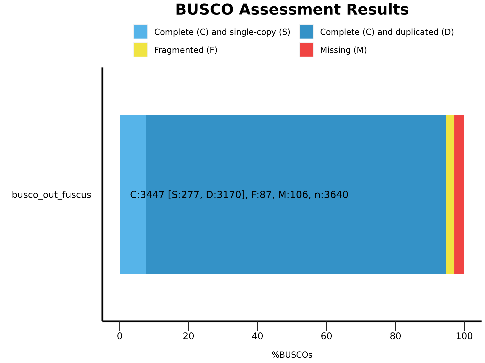
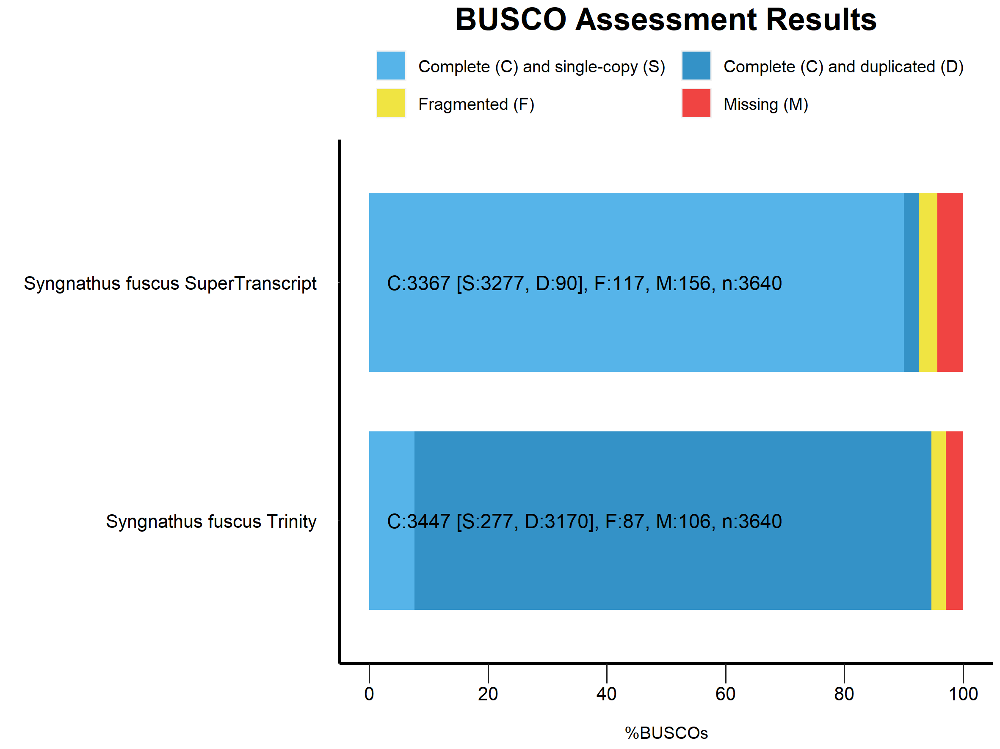

```{r setup, include=FALSE}
knitr::opts_knit$set(root.dir='../',fig_path="../figs/")
```

``` {r library, include = FALSE}
#library(tximport) #used to generate transcript abundance from salmon quant files
```

``` {r functions}

```

``` {r read-data}

```

# Pre-assembly Quality Control and Filtering
These reads were obtained from the **RTSF Genomics Core** at Michigan State University. They were downloaded with the File Transfer Protocol provided on their [website.](https://rtsf.natsci.msu.edu/genomics/data-retrieval/)

Quality scores were provided by MSU, so FastQC was not run on the raw reads. The provided scores were used to assist in choosing the settings for trimming and filtering. The trimming and filtering for these reads will follow the pipeline that was laid out for _Syngnathus floridae_. Any changes to scripts or steps will be highlighted in this document. Analysis was conducted in a Remote Computing Cluster (RCC) at the University of Canterbury.

For _Syngnathus fuscus_ we started with an average of 50 &pm; 6.9 million reads per sample for a total of 2.99 billion reads.

## Trimming the raw reads with Trimmomatic

Trimmomatic was install via a conda environment `Trim` on the RCC. `trimmomatic v0.39` was used for the following script.

```{bash run_trimmomatic, file='bash/trim_script.sh', eval=FALSE}

```

-   Before running the script, change the `trimmomatic` line to `echo "..."` to make sure all of the variables are working correctly.

-   Then remove the `echo ""` and run the script as `nohup bash trim_script.sh > trim.out 2>&1 &`.\

-   The **NexteraPE-PE.fa** file was pulled from the [trimmomatic github](https://github.com/usadellab/Trimmomatic/tree/main/adapters) using `wget https://github.com/usadellab/Trimmomatic/blob/main/adapters/NexteraPE-PE.fa`

## Using Kraken2 to remove biological contamination

Kraken2 was installed in the conda environment `kraken2` on the RCC. `kraken2 v2.1.2` was used.

```{bash run_kraken2, file='bash/kraken2.sh', eval = FALSE}

```

This script was run as `nohup bash bash_scripts/kraken2.sh ../kraken2_pluspfp/ fuscus_trimmed fuscus_nobio > kraken2.log 2>&1 &`

The kraken2 database used for this analysis included the standard database (archea, bacteria, viral) plus plant, fungi, and protozoan datbases. Only reads that did not map back to these databases were retained.

## Using SortMeRNA to remove rRNA contamination

SortmeRNA was installed via a conda environment `sortmerna` on the RCC.`sortmerna v4.3.6` was used

```{bash run_sortmeRNA, file='bash/sortmeRNA.sh', eval = FALSE}

```

This script was run as `nohup bash bash_scripts/sortmerna.sh fuscus_trimmed ../rRNA_databases_v4.3.4/smr_v4.3_fast_db.fasta fuscus_rrna fuscus_norrna > sortmerna.log 2>&1 &`.

The chosed reference FASTA file contains **a subset of sequences** from the default SortMeRNA database. Here, the number of sequences in each database is reduced to improve the speed of the analysis.

## Doing a k-mer based correction with RCorrector

The Rcorrector github repo was cloned and Rcorrector was installed in the /shared folder on the RCC.

```{bash run_Rcorrector, file='bash/rcor.sh', eval = FALSE}

```

This script was run as `nohup bash bash_scripts/rcor.sh ../../rcorrector fuscus_nobio fuscus_kmer_corrected/ > rcor.log 2>&1 &`. After this step the fasta files were g-zipped.

# Checking quality of trimmed and filtered reads
The quality of the reads once they finished going through the filtering and trimming pipeline outlined above was assessed with FastQC and the results were compiled using MultiQC.

```{bash run_fastqc, file='bash/fastqc_script.sh', eval=FALSE}

```

This script was run as `nohup bash bash_scripts/fastqc_script.sh fuscus_kmer_corrected fuscus_FastQC > fastqc.log 2>&1 &`. Once finished MultiQC was run: `multiqc floridae_FastQC`.

From the General stats reported in the MultiQC report we can see that following this filtering/trimming process we end up with an average of 42 &pm; 6.2 million reads per sample for a total of 2.54 billion reads.

# De novo transcriptome assembly
## The Oyster River Protocol
### Installing the ORP using Docker
To work through the pipeline, the docker image was used following the instructions on their [website](https://oyster-river-protocol.readthedocs.io/en/latest/docker_install.html):

  1. Pull the image from DockerHub:
      `sudo docker pull macmaneslab/orp:2.3.3`

  2. Run the image:
```
      sudo docker run -it \
      --mount type=bind,source=/home/rccuser/shared,target=/home/orp/docker \
      macmaneslab/orp:2.3.3 bash
```
      
  3. Test the installation: \
```
      cd $HOME/Oyster_River_Protocol/sampledata

      conda activate orp

      $HOME/Oyster_River_Protocol/oyster.mk \
      STRAND=RF \
      TPM_FILT=1 \
      MEM=5 \
      CPU=4 \
      READ1=test.1.fq.gz \
      READ2=test.2.fq.gz \
      RUNOUT=test
```
Installation test was successful.

### Running the ORP
It appears the the ORP is unable to receive multiple files for the forward and reverse reads, however, I wanted to use all of the reads across my samples in order to build the assemblies. To get around this, all of the R1 and R2 reads across all the samples were concatenated into one file respectively.
```
cd fuscus_kmer_corrected/
cat *R1.fq.gz > FUall_R1.fq.gz
cat *R2.fq.gz > FUall_R2.fq.gz

#Check that it worked by looking at the size of the new files
ls -h -l
  -rw-rw-r--  1 rccuser rccuser  84G Oct  3 14:59 FUall_R1.fq.gz
  -rw-rw-r--  1 rccuser rccuser  87G Oct  3 15:17 FUall_R2.fq.gz

```


The `oyster.mk` file was used to run the entire ORP in one go. Before running the below script the orp environment was activated with `source activate orp`.

```{bash orp_script, file='bash/orp.sh', eval=FALSE}

```

This whole process was done inside of a screen environment. After entering the docker (see above section **step 2**) the script was run as `bash $HOME/docker/coley_files/bash_scripts/orp_merged.sh $HOME/Oyster_River_Protocol/oyster.mk $HOME/docker/coley_files/fuscus_kmer_corrected/FUall_R1.fq.gz $HOME/docker/coley_files/fuscus_kmer_corrected/FUall_R2.fq.gz fuscus_orp`.

## Running Trinity
Due to the timeline, and to ensure all three species of _Syngnathus_ are processed in the same way, the assembly was also generated with Trinity as I did for _Syngnathus floridae_.

```{bash trinity_script, file='bash/trinity.sh', eval = FALSE}

```

This script was run in a screen session as `bash bash_scripts trinity.sh FU_trinity_samples.txt trinity_out_dir_fuscus_June2023`.

# Post-assembly Quality Control - On the Trinity assembly {.tabset}
## Using BUSCO to assess composition or 'completeness' of assembly {-}
`BUSCO` was installed in the `busco` conda environment on the RCC. `BUSCO v 5.2.2` was used.

```{bash run_busco, file='bash/busco_tran.sh', eval = FALSE}

```

The lineage chosen for _S fuscus_ was `actinopterygii_odb10` since it is the closest clade provided with BUSCO. This script was run as `nohup bash bash_scripts/busco_tran.sh trinity_out_dir_fuscus_June2023.Trinity.fasta actinopterygii_odb10 busco_out_fuscus > busco.log 2>&1 &`.

#### Short Summary {-}
```
# BUSCO version is: 5.2.2
# The lineage dataset is: actinopterygii_odb10 (Creation date: 2021-02-19, number of genomes: 26, number of BUSCOs: 3640)
# Summarized benchmarking in BUSCO notation for file /home/rccuser/shared/coley_files/trinity_out_dir_fuscus_June2023.Trinity.fasta
# BUSCO was run in mode: transcriptome

        ***** Results: *****

        C:94.7%[S:7.6%,D:87.1%],F:2.4%,M:2.9%,n:3640
        3447    Complete BUSCOs (C)
        277     Complete and single-copy BUSCOs (S)
        3170    Complete and duplicated BUSCOs (D)
        87      Fragmented BUSCOs (F)
        106     Missing BUSCOs (M)
        3640    Total BUSCO groups searched

Dependencies and versions:
        hmmsearch: 3.1
        metaeuk: 6.a5d39d9
```
Very similar results to what was found with _S. floridae_ prior to any thinning. Good completeness but high duplication (likely due to the multiple isoforms that are outputted from Trinity).

#### Plot {-}
<p float="center">

 

</p>

## Trinity transcriptome contig Nx Statistics {-}
```{bash N50_script, file='bash/trinity_N50.sh', eval = FALSE}

```

#### Results {-}
```
################################
## Counts of transcripts, etc.
################################
Total trinity 'genes':	323048
Total trinity transcripts:	534363
Percent GC: 46.61

########################################
Stats based on ALL transcript contigs:
########################################

	Contig N10: 7775
	Contig N20: 5458
	Contig N30: 4161
	Contig N40: 3192
	Contig N50: 2414

	Median contig length: 456
	Average contig: 1088.98
	Total assembled bases: 581911276


#####################################################
## Stats based on ONLY LONGEST ISOFORM per 'GENE':
#####################################################

	Contig N10: 5947
	Contig N20: 3778
	Contig N30: 2391
	Contig N40: 1502
	Contig N50: 979

	Median contig length: 346
	Average contig: 656.63
	Total assembled bases: 212122880
```

Based on the longest isoform we can see that 50% of the assembled bases are found in transcript contigs that are at least 979 bases in length. This is lower than the 1307 N50 from _Syngnathus floridae_.

## Trinity transcriptome contig Ex90N50 Statistic and gene count {-}

#### Create an Abundance Matrix {-}
```
#Get a list of the salmon quant.sf files so you don't have to list them individually
find . -maxdepth 2 -name "*quant.sf" | tee FUsalmon.quant_files.txt
```

```{bash trinity_matrix, file='bash/trinity_abund_est.sh', eval=FALSE}

```

This script was run as `nohup bash bash_scripts/trinity_abund_est.sh `pwd`/trinity_out_dir_fuscus_June2023.Trinity.fasta.gene_trans_map `pwd`/fuscus_salmon_quant/FUsalmon.quant_files.txt fuscus_salmon > trin_abund.log 2>&1 &`. The shell wrapper (`/bin/sh -c`) was added to the script to ensure the ouput files were sent to the right place.

#### Calculate the Ex90N50 stat {-}
```{bash ex90, file='bash/exn50.sh', eval=FALSE}

```
This script was run as ` bash bash_scripts/exn50.sh `pwd`/fuscus_salmon.isoform.TMM.EXPR.matrix `pwd`/trinity_out_dir_fuscus_June2023.Trinity.fasta fuscus_exN50.stats`

| Ex      | ExN50   | num_genes |
|:--------|:--------|:----------|
|    2    |   281   |     1     |
|    4    |  2370   |     2     |
|    6    |  2370   |     3     |
|    7    |  1570   |     4     |
|   ...   |   ...   |    ...    |
|   90    |  2981   |  25899    |
|   99    |  2431   |  492686   |
|   100   |  2414   |  534363   |

We can then plot the Ex value (first column) against the ExN50 values:

`sudo docker run -v`pwd`:`pwd` trinityrnaseq/trinityrnaseq /bin/sh -c "cd /home/rccuser/shared/coley_files/ && /usr/local/bin/util/misc/plot_ExN50_statistic.Rscript /home/rccuser/shared/coley_files/floridae_exN50.stats"`

the Ex90N50 for _S. fuscus_ (2981) is slightly higher but very similar to the Ex90N50 for _S. floridae_ (2918).

# Alignment and abundance estimations {.tabset}
Salmon was installed locally on the RCC. It must be run as `/usr/local/bin/salmon`. `Salmon v 1.10.1` was used.

## Generate the index {-}
`salmon index` was used for this step. The index is built only **once** per transcriptome.

```{bash salmon-build-index, file='bash/salmon_txome_indicies.sh', eval = FALSE}

```

The script was run as `nohup bash bash_scripts/salmon_txome_indicies.sh trinity_out_dir_fuscus_June2023.Trinity.fasta fuscus_salmon_index 31 > salmon_index.log 2>&1 &`. A kmer length of 31 was used upon recommendation from the Salmon website.

## Quantify the samples {-}
After building the index this is run on every individual read pair.

```{bash salmon-quant, file='bash/salmon_quant.sh', eval=FALSE}

```

This script was run as `nohup bash bash_scripts/salmon_quant.sh fuscus_kmer_corrected/ fuscus_salmon_index/ fuscus_salmon_quant/ > salmon_quant.log 2>&1 &`.

The `quant.sf` and `.log` files were moved out of their nested location to a shared folder and renamed to include the sample name.
```{bash rename-salmon-files, file='bash/rename_salmon.sh', eval = FALSE}

```

The mapping rate was pulled from all of the log files with `grep "Mapping rate" *log > FUmap.txt` and the results are below. Generally, we want to see a mapping rate of at least 80% for our samples.
```
FUG10M2_salmon_quant.log:[2023-10-09 23:13:27.146] [jointLog] [info] Mapping rate = 99.8809%
FUG11F1_salmon_quant.log:[2023-10-09 23:43:18.088] [jointLog] [info] Mapping rate = 99.8791%
FUG11M2_salmon_quant.log:[2023-10-10 00:14:21.567] [jointLog] [info] Mapping rate = 99.8895%
FUG11M4_salmon_quant.log:[2023-10-10 00:45:11.435] [jointLog] [info] Mapping rate = 99.5617%
FUG12M1_salmon_quant.log:[2023-10-10 01:04:04.579] [jointLog] [info] Mapping rate = 99.8942%
FUG13F1_salmon_quant.log:[2023-10-10 01:43:52.069] [jointLog] [info] Mapping rate = 99.8912%
FUG13F4_salmon_quant.log:[2023-10-10 02:18:06.249] [jointLog] [info] Mapping rate = 99.9204%
FUG15M5_salmon_quant.log:[2023-10-10 02:51:42.322] [jointLog] [info] Mapping rate = 99.93%
FUG2F2_salmon_quant.log:[2023-10-10 03:17:58.246] [jointLog] [info] Mapping rate = 99.8933%
FUG3F2_salmon_quant.log:[2023-10-10 03:41:01.692] [jointLog] [info] Mapping rate = 99.8957%
FUL10M2_salmon_quant.log:[2023-10-10 04:12:32.747] [jointLog] [info] Mapping rate = 99.9229%
FUL11F1_salmon_quant.log:[2023-10-10 04:28:38.157] [jointLog] [info] Mapping rate = 99.935%
FUL11M2_salmon_quant.log:[2023-10-10 04:47:41.021] [jointLog] [info] Mapping rate = 99.9017%
FUL11M4_salmon_quant.log:[2023-10-10 05:02:14.331] [jointLog] [info] Mapping rate = 99.9295%
FUL12M1_salmon_quant.log:[2023-10-10 05:18:34.970] [jointLog] [info] Mapping rate = 99.9099%
FUL13F1_salmon_quant.log:[2023-10-10 05:39:55.564] [jointLog] [info] Mapping rate = 99.9373%
FUL13F4_salmon_quant.log:[2023-10-10 05:58:09.029] [jointLog] [info] Mapping rate = 99.9419%
FUL15M5_salmon_quant.log:[2023-10-10 06:14:57.386] [jointLog] [info] Mapping rate = 99.9355%
FUL2F2_salmon_quant.log:[2023-10-10 06:31:12.803] [jointLog] [info] Mapping rate = 78.6675%
FUL3F2_salmon_quant.log:[2023-10-10 06:40:34.545] [jointLog] [info] Mapping rate = 99.94%
FUO11F1_salmon_quant.log:[2023-10-10 07:02:53.060] [jointLog] [info] Mapping rate = 99.8901%
FUO13F1_salmon_quant.log:[2023-10-10 07:38:11.441] [jointLog] [info] Mapping rate = 99.905%
FUO13F4_salmon_quant.log:[2023-10-10 08:11:16.544] [jointLog] [info] Mapping rate = 99.9083%
FUO2F2_salmon_quant.log:[2023-10-10 08:58:16.701] [jointLog] [info] Mapping rate = 99.9399%
FUO3F2_salmon_quant.log:[2023-10-10 09:48:39.310] [jointLog] [info] Mapping rate = 99.832%
FUT10M2_salmon_quant.log:[2023-10-10 10:28:14.802] [jointLog] [info] Mapping rate = 99.9139%
FUT11M2_salmon_quant.log:[2023-10-10 11:10:17.014] [jointLog] [info] Mapping rate = 99.9051%
FUT11M4_salmon_quant.log:[2023-10-10 11:44:42.531] [jointLog] [info] Mapping rate = 99.8352%
FUT12M1_salmon_quant.log:[2023-10-10 12:10:03.402] [jointLog] [info] Mapping rate = 99.872%
FUT15M5_salmon_quant.log:[2023-10-10 12:38:18.215] [jointLog] [info] Mapping rate = 99.8842%
```
A very high mapping rate is seen for all but one sample, **FUL2F2**. If that stays the same after the assembly thinning I will go back and investigate why that may be. Overall, very happy with these results.

# Assembly thinning and redundancy reduction - SuperTranscripts
SuperTranscripts were generated to reduce redundancy while still retaining all of the sequence information. These were generated with the tool installed with Trinity.

```{bash super-transcript, file='bash/trin_super_transcripts.sh', eval=FALSE}

```

This script was run in a screen session as `bash bash_scripts/trin_super_transcripts.sh trinity_out_dir_fuscus_June2023.Trinity.fasta`. It took about 11 minutes to run.

## Re-evaluating the quality of the assembly {.tabset}
### BUSCO {-}
#### Short summary {-}
```
# BUSCO version is: 5.2.2 
# The lineage dataset is: actinopterygii_odb10 (Creation date: 2021-02-19, number of genomes: 26, number of BUSCOs: 3640)
# Summarized benchmarking in BUSCO notation for file /home/rccuser/shared/coley_files/trinity_supertran_fuscus.fasta
# BUSCO was run in mode: transcriptome

	***** Results: *****

	C:92.5%[S:90.0%,D:2.5%],F:3.2%,M:4.3%,n:3640	   
	3367	Complete BUSCOs (C)			   
	3277	Complete and single-copy BUSCOs (S)	   
	90	Complete and duplicated BUSCOs (D)	   
	117	Fragmented BUSCOs (F)			   
	156	Missing BUSCOs (M)			   
	3640	Total BUSCO groups searched		   

Dependencies and versions:
	hmmsearch: 3.1
	metaeuk: 6.a5d39d9
```

#### Graphing results {-}

<p float="center">

 

</p>

### Examining RNA-Seq read representation (via Salmon) {-}
#### Mapping Rate {-}
|   Sample   |  Trinity Assembly  | SuperTranscript Assembly |
|:----------:|:------------------:|:------------------------:|
|   FUG10M2  |       99.8809%     |         96.3946%         |
|   FUG11F1  |       99.8791%     |         96.3215%         |
|   FUG11M2  |       99.8895%     |         96.2211%         |
|   FUG11M4  |       99.5617%     |         93.7851%         |
|   FUG12M1  |       99.8942%     |         96.3071%         |
|   FUG13F1  |       99.8912%     |         96.3934%         |
|   FUG13F4  |       99.9204%     |         96.4825%         |
|   FUG15M5  |        99.93%      |         96.5262%         |
|   FUG2F2   |       99.8933%     |         96.4757%         |
|   FUG3F2   |       99.8957%     |         96.4263%         |
|   FUL10M2  |       99.9229%     |         96.1121%         |
|   FUL11F1  |       99.935%      |         96.3962%         |
|   FUL11M2  |       99.9017%     |         96.771%          |
|   FUL11M4  |       99.9295%     |         96.8967%         |
|   FUL12M1  |       99.9099%     |         96.3373%         |
|   FUL13F1  |       99.9373%     |         96.2684%         |
|   FUL13F4  |       99.9419%     |         96.8745%         |
|   FUL15M5  |       99.9355%     |         96.7522%         |
|   FUL2F2   |       78.6675%     |         76.6031%         |
|   FUL3F2   |        99.94%      |         96.163%          |
|   FUO11F1  |       99.8901%     |         96.0597%         |
|   FUO13F1  |       99.905%      |         96.1805%         |
|   FUO13F4  |       99.9083%     |         96.1208%         |
|   FUO2F2   |       99.9399%     |         96.4821%         |
|   FUO3F2   |       99.832%      |         95.8775%         |
|   FUT10M2  |       99.9139%     |         95.9261%         |
|   FUT11M2  |       99.9051%     |         96.117%          |
|   FUT11M4  |       99.8352%     |         95.7566%         |
|   FUT12M1  |       99.872%      |         96.0704%         |
|   FUT15M5  |       99.8842%     |         96.1064%         |

# Prepping for differential expression analysis
## Importing transcript abundance with tximport
```{r create-sample-file}
##Create a file containing information about the samples
ID <- c("FUG10M2", "FUG11F1", "FUG11M2", "FUG11M4", "FUG12M1", "FUG13F1", "FUG13F4", "FUG15M5", "FUG2F2", "FUG3F2",
        "FUL10M2", "FUL11F1", "FUL11M2", "FUL11M4", "FUL12M1", "FUL13F1", "FUL13F4", "FUL15M5", "FUL2F2", "FUL3F2",
        "FUO11F1", "FUO13F1", "FUO13F4", "FUO2F2", "FUO3F2",
        "FUT10M2", "FUT11M2", "FUT11M4", "FUT12M1", "FUT15M5")
Sex <- c("M", "F", "M", "M", "M", "F", "F", "M", "F", "F",
         "M", "F", "M", "M", "M", "F", "F", "M", "F", "F",
         "F", "F", "F", "F", "F",
         "M", "M", "M", "M", "M")
Organ <- rep(c("Gill", "Liver", "Gonad"), times = c(10, 10, 10))
samples <- cbind(ID, Sex, Organ)
samples <- as.data.frame(samples)
write.table(samples, file = "FU_samples.txt", quote = FALSE, sep = "\t", col.names = TRUE, row.names = FALSE)

```

Generating the transcript abundance was done on the RCC via R command line:
```{r tximport, eval=FALSE}
#Enter R
conda activate R
R

#Load required package
library(tximport)

#Read in sample file
samples <- read.table("FU_samples.txt", header=TRUE)

#Create list of quant.sf files from salmon
files <- list.files("/home/rccuser/shared/coley_files/fuscus_super_salmon_quant/expression_files", full.names = TRUE)
names(files) <- paste0(samples$ID)
all(file.exists(files))
  ## [1] TRUE
  
#Pull the transcript-gene relationship from the .gtf file generated during the SuperTranscripts step
gtf <- read.table("trinity_genes.gtf", header = FALSE)
tx2gene <- gtf[,c(10, 10)] #Using the gene_id twice since there are no longer isoforms in the SuperTranscript assembly
tx2gene <- unique(tx2gene)
colnames(tx2gene) <- c("gene_id", "transcript_id")

#Building the matrix
txi.salmon.FU <- tximport(files, type = "salmon", tx2gene = tx2gene)
head(txi.salmon.FU$counts)
saveRDS(txi.salmon.FU, "txi.salmon_FU.RDS") #Move the file off the RCC to continue the Differential expression analysis in R

```
