# Retrieving RNAseq Data from MSU

## Using the command line program wget

In order to access the <span style="color:red">RTSF Genomics Core</span> FTP (File Transfer Protocol) server outside of MSU it requires secure (FTPS) connections. The data will remain available on this serve for 60 days. More details on the RTSF genomics core FTP are available on their [website.](https://rtsf.natsci.msu.edu/genomics/data-retrieval/)

The program **wget** is capable of doing this on command line. However, only versions of wget 1.17 or later are capable of supporting FTPS. If you attempt to run wget and you end up with an error message which stating: 'Unsupported scheme "ftps"' it means that the version of wget you are using does not support FTPS.

1.  Check the version of wget that is running use: `wget -V`

2.  After confirming the version of wget will work execute the command:
    `wget -r -np -nH --ask-password ftps://<username>@<hostname>/<directory_name>`
    \
    `wget -r -np -nH --ask-password ftps://flanagans@titan.bch.msu.edu/20220902_mRNASeq_PE150`

3.  If it run successfully you should be prompted to enter your password.

4.  Wait as all of the files are downloaded.

The username, hostname, password, and directory_name can all be found in the email notifying you that the data is ready. The directory_name is the name of the subdirectory in your FTP account which contains the data for your current run that you want to download.

**NOTE**: This command will create a new sub directory named the same as your directory_name at your **current working directory** containing all the FastQ files for that run. **Make sure there is enough space available wherever these files will be downloaded to**

## Mounting external drives to WSL

1.  Create a directory in the **mnt** folder `mkdir /mnt/d`

2.  Mount the external drive to the directory you just created in the mnt folder (assume the drive shows in Windows as "D:") `mount -t drvfs d: /mnt/d`

**If you need administration privileges use sudo in front of both commands**

# Interpreting the FastQC files

This is a summary of the quality of the samples, for more information about interpreting fastQC files in general see [here](https://rtsf.natsci.msu.edu/sites/_rtsf/assets/File/FastQC_TutorialAndFAQ_080717.pdf) and for RNAseq specific interpretation [here](https://hbctraining.github.io/Intro-to-rnaseq-hpc-salmon/lessons/qc_fastqc_assessment.html).

## What a 'Normal' or 'Good' fastQC file looks like

While there may be an [X ]{style="color:indianred"}, [! ]{style="color:gold"}, or [Check ]{style="color:limegreen"} to indicate the quality of the data, they should not be taken too seriously, particularly in the case of RNA sequencing data. Here are some examples of what deviations can occur without meaning the sample is 'bad'.

| NORMAL READS |           |           |            |            |            |
|:-------------|:----------|:----------|:-----------|:-----------|:-----------|
| FLG2F7_R1    | FLG3M8_R1 | FLO3F1_R2 | FLT3M5_R2  | FUG13F1_R1 | FUO11F1_R2 |
| FLG2F7_R2    | FLG3M8_R2 | FLO3F2_R1 | FLT4M4_R1  | FUG13F4_R1 | FUO13F1_R1 |
| FLG3F2_R1    | FLG4M3_R1 | FLO3F2_R2 | FLT4M4_R2  | FUO2F2_R1  | FUO13F1_R  |
| FLG3M5_R1    | FLG4M3_R2 | FLO3F4_R1 | FLT8M7_R1  | FUO2F2_R2  | FUT10M2_R1 |
| FLG3M5_R2    | FLO2F7_R1 | FLO3F4_R2 | FLT8M7_R2  | FUO3F2_R1  | FUT12M1_R1 |
| FLG3M7_R1    | FLO2F7_R2 | FLT2M3_R1 | FUG3F2_R1  | FUO3F2_R2  |            |
| FLG3M7_R2    | FLO3F1_R1 | FLT2M3_R2 | FUG11F1_R1 | FUO11F1_R1 |            |

### Per base sequence quality and Per sequence quality scores

The **per base sequence quality** alerts us to whether or not there were any problems occurring during sequencing and if these problems mean you need to contact the sequencing facility. The y-axis denotes quality score while the x-axis represents the position in the read.

The **per sequence quality scores** plot gives the average quality score on the x-axis and the number of sequences with that average on the y-axis.

For both reads of ALL 59 samples, there were no issues with either of these modules. It is very common to see a slight decrease in the per base sequence quality plot towards the end of the reads that could be explained by things such as signal decay or phasing.

<p float="left">

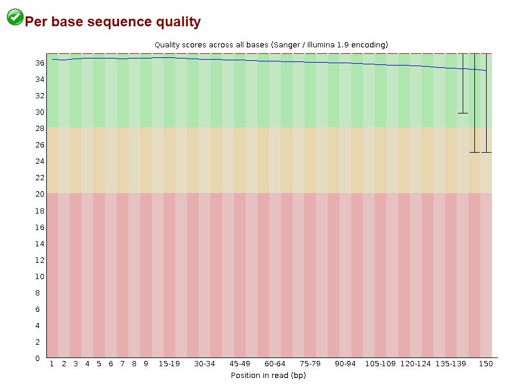 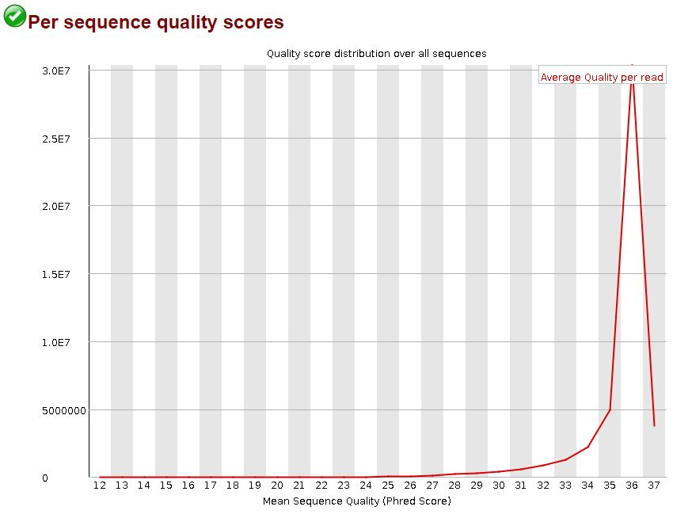

</p>

### Per base sequence content

This plot gives you the percent of bases called for each of the four nucleotides at each position across the read. The proportion of the bases should remain relatively constant across the read.

This plot will **ALWAYS** give a fail for RNA-seq data. This is mainly due to the fact that the first 10-12 bases results from the 'random' hexamer priming that occurs during RNA-seq library preparation. The priming, however, is not as random as one would hope give an enrichment to particular bases for those first few nucleotides (see below for example). This was not taken into account when determining the 'good' samples.

<center>

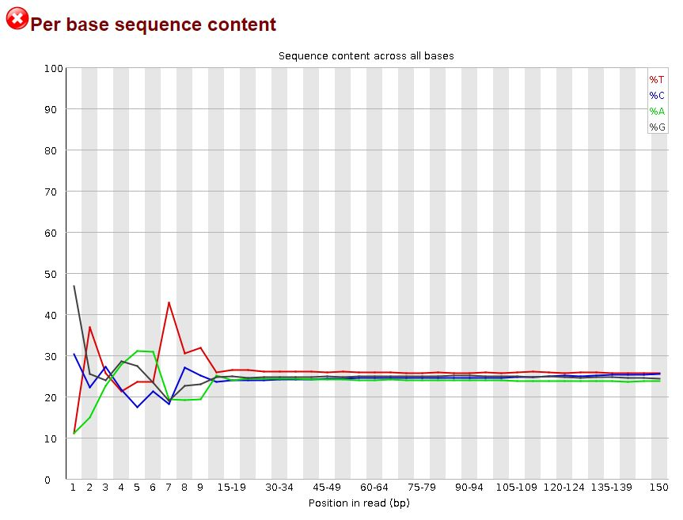

<center>

### Per sequence GC content

This module plots the number of reads vs. GC% per read. The theoretical distribution is shown by the blue line. If the observed distribution deviates too far from the theoretical it will be called a fail. In RNA-seq there may be greater or lesser distribution of GC content among transcripts causing the plots to be wider or narrower than the normal distribution. XX reads showed a [WARNING ]{style="color:gold"} flag on this module.

<center>

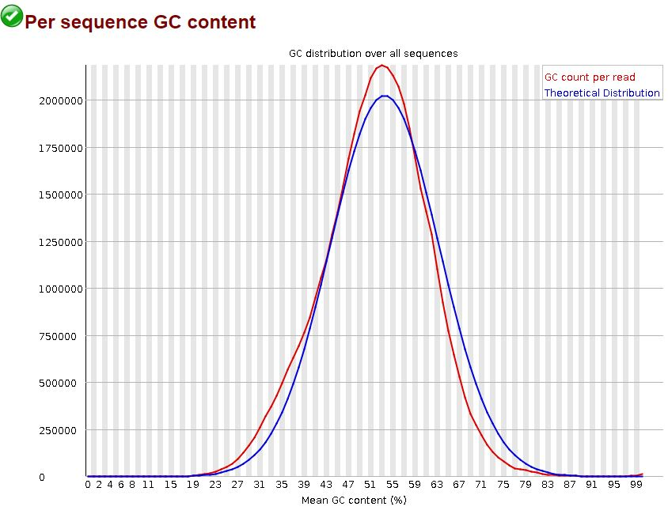

<center>

### Per base N content

This module shows the percent of bases at each position with no base call (i.e. 'N'). You don't want to see a point where the curve rises noticeably above zero. None of the reads failed this.

<center>

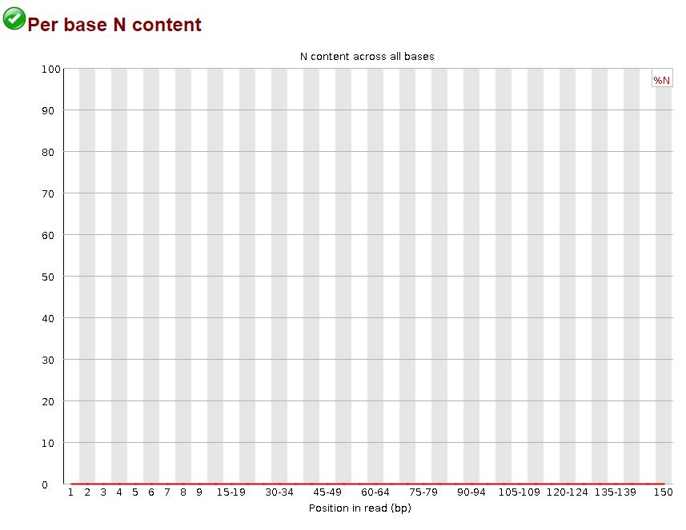

<center>

### Sequence duplication levels

This module explores the number of duplicated sequences in the library. When sequencing RNA there will be some very highly abundant transcripts and some lowly abundant. Any that are highly abundant may be observed as duplicate reads. For the majority of the reads the largest peak was seen at \>10 sequence duplication level. A read was considered 'normal' if it showed a similar patter to the plot below (even though it is marked as fail).

<center>

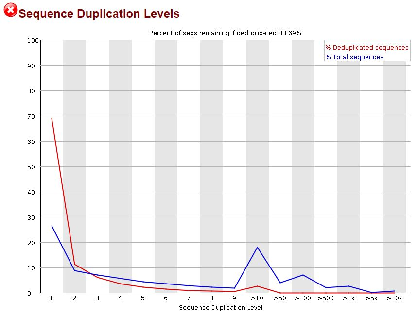

<center>

### Overrepresented sequences

This table displays the sequences (at least 20bp) that occur in more that 0.1% of the total number of sequences. It can help aid in identifying contamination such as vector adapter sequences. Each overrepresented sequence is compared to a list of common contaminants to try to identify it. When using RNA-seq data it is possible that some transcripts may be so abundant that they become registered as overrepresented. 

A read was considered 'normal' if it possessed **no overrepresented sequences**.

### Adapter content

A cumulative plot of the fraction of reads where the sequence library adapter sequence is identified at the indicated base position. When using long read lengths it is possible that some of the library inserts are shorter than the read length resulting in read-through to the adapter at the 3' end of the read.

This is more likely to occur for RNA-seq libraries due to the variability of the library insert sizes. This was not taken into account when denoting a 'normal' read.

<center>

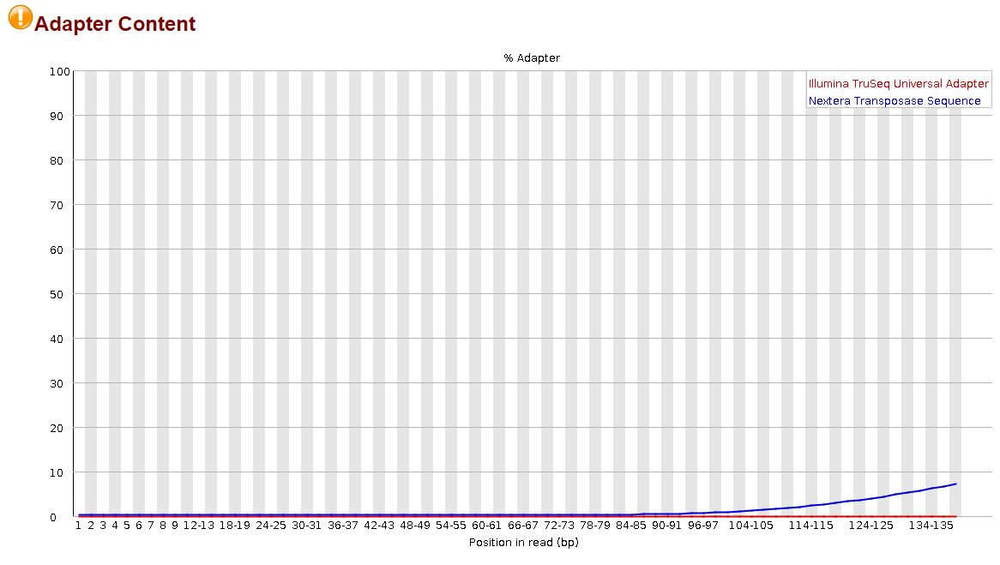

<center>

## Reads that raised some concerns

Overall the reads look good (especially in terms of things such as the quality score), however, some weird patterns are present that should be noted.

| GC CONTENT | SEQUENCE DUPLICATION | OVERREPRESENTED SEQ. |
|:-----------|:---------------------|:---------------------|
|            |                      | FLG3F1_R1            |
|            |                      | FLG3F1_R2            |
| FLG3F2_R1  |                      |                      |
|            |                      | FLG4M4_R1            |
| FLG4M4_R2  |                      | FLG4M4_R2            |
|            |                      | FLG8F3_R1            |
|            |                      | FLG8F3_R2            |
| FLL2F7_R1  | FLL2F7_R1            | FLL2F7_R1            |
| FLL2F7_R2  | FLL2F7_R2            | FLL2F7_R2            |
| FLL3F1_R1  | FLL3F1_R1            | FLL3F1_R1            |
|            | FLL3F1_R2            | FLL3F1_R2            |
| FLL3F2_R1  | FLL3F2_R1            | FLL3F2_R1            |
| FLL3F2_R2  | FLL3F2_R2            | FLL3F2_R2            |
| FLL3F4_R1  | FLL3F4_R1            | FLL3F4_R1            |
|            | FLL3F4_R2            | FLL3F4_R2            |
| FLL3M5_R1  | FLL3M5_R1            | FLL3M5_R1            |
| FLL3M5_R2  | FLL3M5_R2            | FLL3M5_R2            |
| FLL3M7_R1  | FLL3M7_R1            | FLL3M7_R1            |
| FLL3M7_R2  | FLL3M7_R2            | FLL3M7_R2            |
| FLL3M8_R1  | FLL3M8_R1            | FLL3M8_R1            |
| FLL3M8_R2  | FLL3M8_R2            | FLL3M8_R2            |
|            | FLL4M3_R1            | FLL4M3_R1            |
|            | FLL4M3_R2            | FLL4M3_R2            |
| FLL4M4_R1  | FLL4M4_R1            | FLL4M4_R1            |
| FLL4M4_R2  | FLL4M4_R2            | FLL4M4_R2            |
| FLL8F3_R1  | FLL8F3_R1            | FLL8F3_R1            |
| FLL8F3_R2  | FLL8F3_R2            | FLL8F3_R2            |
|            |                      | FLO8F3_R1            |
|            |                      | FLO8F3_R2            |
| FLT3M5_R1  |                      |                      |
|            |                      | FLT5M3_R1            |
|            |                      | FLT5M3_R2            |
| FUG2F2_R1  |                      |                      |
| FUG2F2_R2  |                      | FUG2F2_R2            |
| FUG3F2_R2  |                      |                      |
|            |                      | FUG10M2_R1           |
| FUG10M2_R2 |                      | FUG10M2_R2           |
| FUG11F1_R2 |                      | FUG11F1_R2           |
| FUG11M2_R1 |                      |                      |
| FUG11M2_R2 |                      | FUG11M2_R2           |
|            |                      | FUG11M4_R1           |
|            |                      | FUG11M4_R2           |
| FUG12M1_R1 |                      | FUG12M1_R1           |
| FUG12M1_R2 |                      | FUG12M1_R2           |
| FUG13F1_R2 |                      | FUG13F1_R2           |
| FUG13F4_R2 |                      | FUG13F4_R2           |
| FUG15M5_R1 |                      |                      |
| FUG15M5_R2 |                      |                      |
| FUL2F2_R1  | FUL2F2_R1            | FUL2F2_R1            |
| FUL2F2_R2  | FUL2F2_R2            | FUL2F2_R2            |
| FUL3F2_R1  | FUL3F2_R1            | FUL3F2_R1            |
| FUL3F2_R2  | FUL3F2_R2            | FUL3F2_R2            |
| FUL10M2_R1 | FUL10M2_R1           | FUL10M2_R1           |
| FUL10M2_R2 | FUL10M2_R2           | FUL10M2_R2           |
|            | FUL11F1_R1           | FUL11F1_R1           |
|            | FUL11F1_R2           | FUL11F1_R2           |
| FUL11M2_R1 | FUL11M2_R1           | FUL11M2_R1           |
| FUL11M2_R2 | FUL11M2_R2           | FUL11M2_R2           |
| FUL11M4_R1 | FUL11M4_R1           | FUL11M4_R1           |
| FUL11M4_R2 | FUL11M4_R2           | FUL11M4_R2           |
| FUL12M1_R1 | FUL12M1_R1           | FUL12M1_R1           |
|            | FUL12M1_R2           | FUL12M1_R2           |
|            | FUL13F1_R1           | FUL13F1_R1           |
|            | FUL13F1_R2           | FUL13F1_R2           |
|            | FUL13F4_R1           | FUL13F4_R1           |
|            | FUL13F4_R2           | FUL13F4_R2           |
| FUL15M5_R1 | FUL15M5_R1           | FUL15M5_R1           |
| FUL15M5_R2 | FUL15M5_R2           | FUL15M5_R2           |
|            |                      | FUO13F4_R1           |
|            |                      | FUO13F4_R2           |
| FUT10M2_R1 |                      |                      |
| FUT11M2_R1 |                      | FUT11M2_R1           |
|            |                      | FUT11M2_R2           |
|            |                      | FUT11M4_R1           |
|            |                      | FUT11M4_R2           |
| FUT12M1_R1 |                      |                      |
| FUT15M5_R1 |                      | FUT15M5_R1           |
|            |                      | FUT15M5_R2           |

### Violations in the per seqeunce GC content

None of the reads received a [**fail** ]{style="color:indianred"} for this section, they were all just [**warnings** ]{style="color:gold"}. The deviations from normal don't look too extreme for any of the reads, below are some examples of reads that received a [**warning** ]{style="color:gold"} for this module. Reads in which the only thing wrong with them was the GC content can likely be clumped with the "normal" reads as I am not sure there is anything extra we need to do with them. Those reads are [**blue** ]{style="color:mediumblue"} in the table below.

| GC VIOLATIONS                              |           |                                             |                                             |            |                                             |
|:-----------|:-----------|:-----------|:-----------|:-----------|:-----------|
| [**FLG3F2_R1** ]{style="color:mediumblue"} | FLL3M5_R2 | [**FLT3M5_R1** ]{style="color:mediumblue"}  | FUG12M1_R2                                  | FUL10M2_R1 | FUL15M5_R2                                  |
| FLG4M4_R2                                  | FLL3M7_R1 | [**FUG2F2_R1** ]{style="color:mediumblue"}  | FUG13F1_R2                                  | FUL10M2_R2 | [**FUT10M2_R1** ]{style="color:mediumblue"} |
| FLL2F7_R1                                  | FLL3M7_R2 | FUG2F2_R2                                   | FUG13F4_R2                                  | FUL11M2_R1 | FUT11M2_R1                                  |
| FLL2F7_R2                                  | FLL3M8_R1 | [**FUG3F2_R2** ]{style="color:mediumblue"}  | [**FUG15M5_R1** ]{style="color:mediumblue"} | FUL11M2_R2 | FUT12M1_R1                                  |
| FLL3F1_R1                                  | FLL3M8_R2 | FUG10M2_R2                                  | [**FUG15M5_R2** ]{style="color:mediumblue"} | FUL11M4_R1 | FUT15M5_R1                                  |
| FLL3F2_R1                                  | FLL4M4_R1 | FUG11F1_R2                                  | FUL2F2_R1                                   | FUL11M4_R2 |                                             |
| FLL3F2_R2                                  | FLL4M4_R2 | [**FUG11M2_R1** ]{style="color:mediumblue"} | FUL2F2_R2                                   | FUL12M1_R1 |                                             |
| FLL3F4_R1                                  | FLL8F3_R1 | FUG11M2_R2                                  | FUL3F2_R1                                   | FUL10M2_R1 |                                             |
| FLL3M5_R1                                  | FLL8F3_R2 | FUG12M1_R1                                  | FUL3F2_R2                                   | FUL15M5_R1 |                                             |

<p float="left">

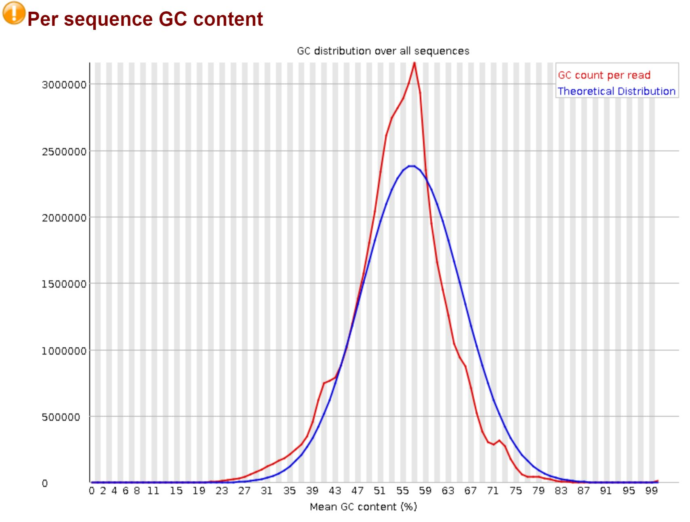 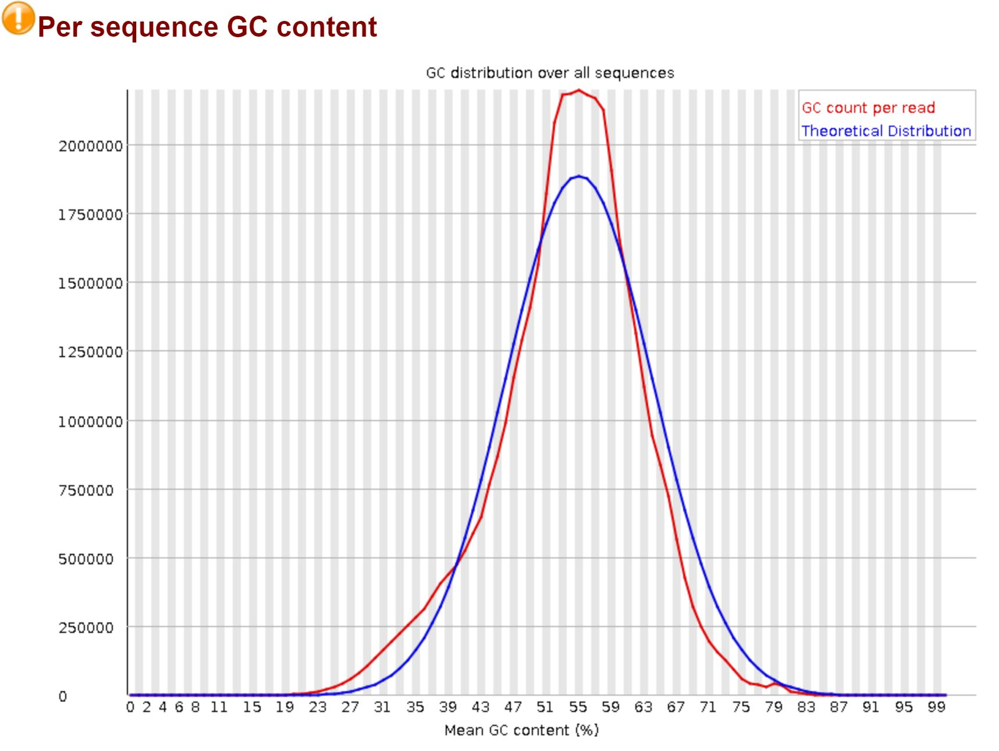

</p>

<p float="left">

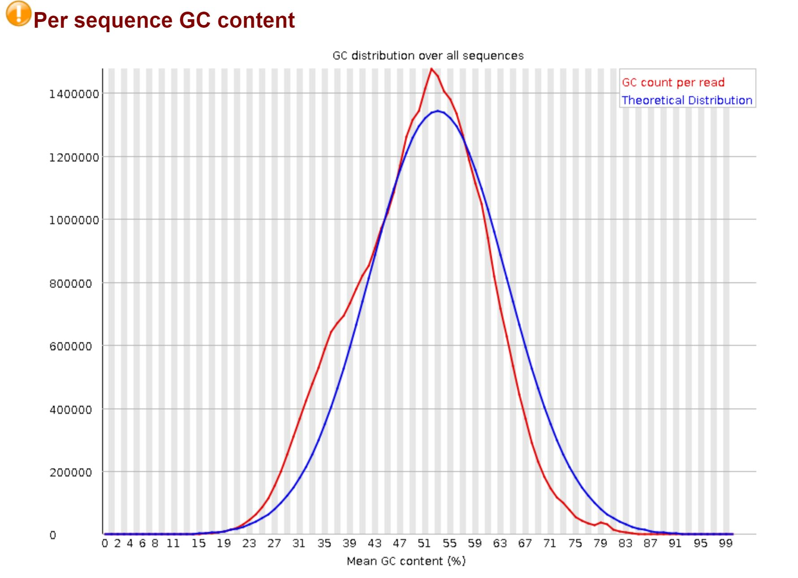 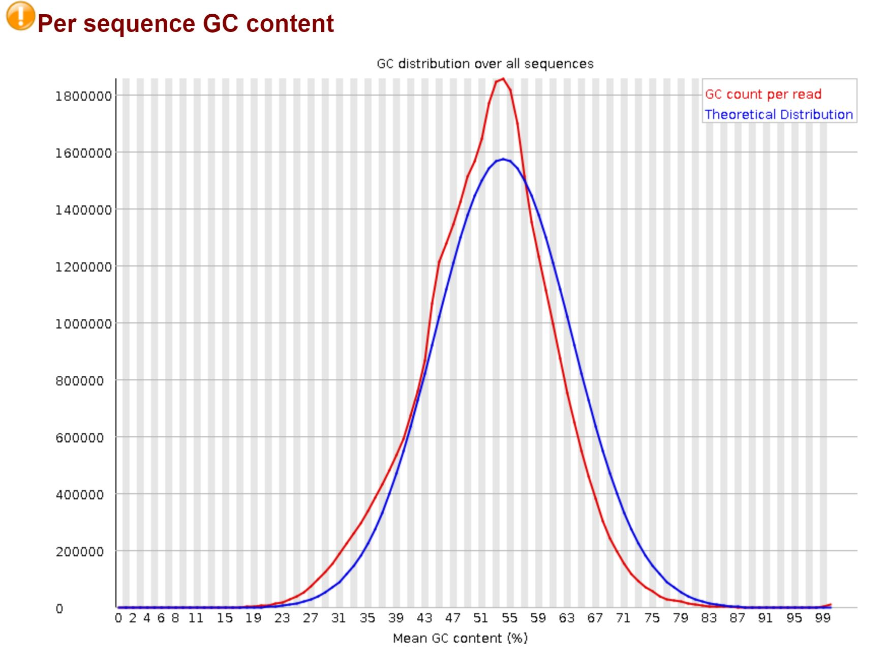

</p>

<p float="left">

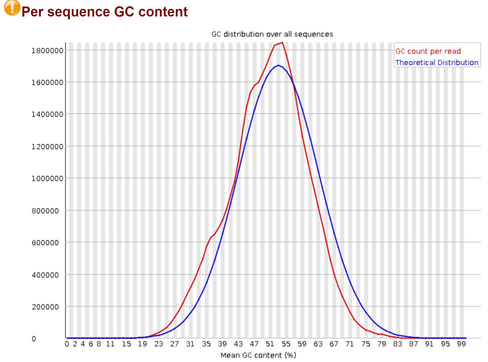 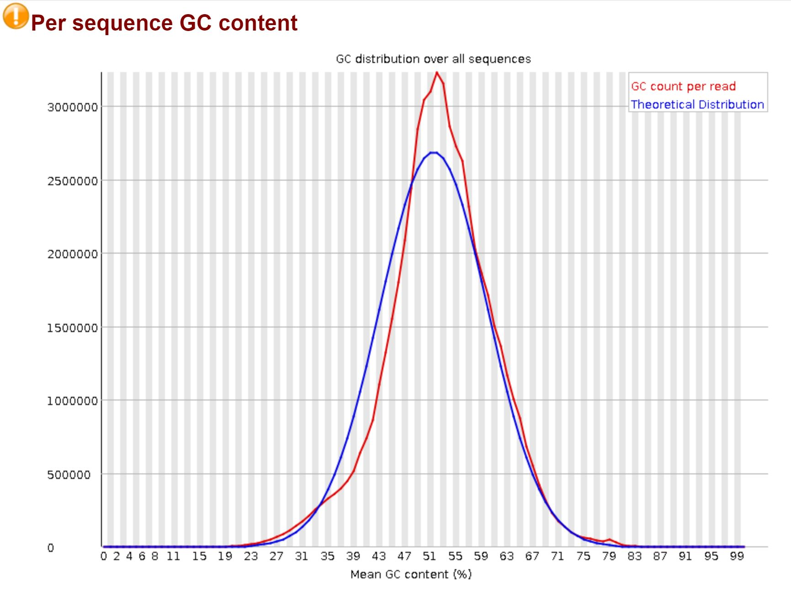

</p>

### Violations in the seqeunce duplication levels

While all of the reads technically failed this module on the fastQC, there was a small group of reads that showed a completely different pattern than the rest. Interestingly, all of these reads happen to be from the **liver** and it is across BOTH species.

<p float="left">

 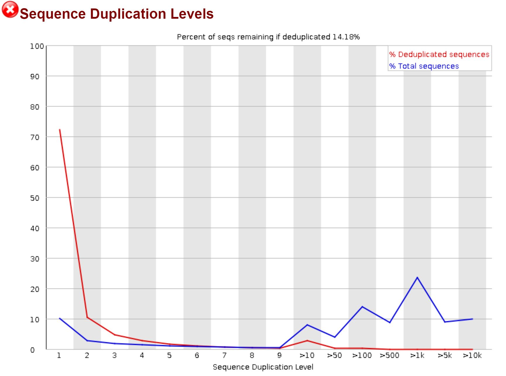

</p>

You can see that for all of the other reads there is the largest peak at the \>10 duplication level then \>100 and then a small peak at \>1K. However for every single liver read the largest peak falls at the \>1K duplication level while the smallest is seen at the \>10. Unsure of why this may be. Possible that there are more sequences that are highly abundant in the liver?

| SEQ. DUP. VIOLATIONS |           |           |            |            |
|:---------------------|:----------|:----------|:-----------|:-----------|
| FLL2F7_R1            | FLL3M5_R1 | FLL4M4_R1 | FUL10M2_R1 | FUL12M1_R1 |
| FLL2F7_R2            | FLL3M5_R2 | FLL4M4_R2 | FUL10M2_R2 | FUL12M1_R2 |
| FLL3F1_R1            | FLL3M7_R1 | FLL8F3_R1 | FUL11F1_R1 | FUL13F1_R1 |
| FLL3F1_R2            | FLL3M7_R2 | FLL8F3_R2 | FUL11F1_R2 | FUL13F1_R2 |
| FLL3F2_R1            | FLL3M8_R1 | FUL2F2_R1 | FUL11M2_R1 | FUL13F4_R1 |
| FLL3F2_R2            | FLL3M8_R2 | FUL2F2_R2 | FUL11M2_R2 | FUL13F4_R2 |
| FLL3F4_R1            | FLL4M3_R1 | FUL3F2_R1 | FUL11M4_R1 | FUL15M5_R1 |
| FLL3F4_R2            | FLL4M3_R2 | FUL3F2_R2 | FUL11M4_R2 | FUL15M5_R2 |

### Violations in the overrepresented sequences

Certain reads possessed sequences that were marked as overrepresented. None of the reads failed this section, there were only warnings. For a lot of the reads, there was contamination from the Illumina Nextera Transposase sequence that was registered as overrepresented. This will need to get removed. The table below outlines all of the reads that received a [**warning** ]{style="color:gold"} for this module and what sequences were marked as overrepresented.

| READ       | Illumina Nextera Transposase Read1 | Illumina Nextera Transposase Read2 | No Hit |
|:------------------|:-----------------|:-----------------|:-----------------|
| FLG3F1_R1  |                                    | **X**                              |        |
| FLG3F1_R2  | **X**                              |                                    |        |
| FLG4M4_R1  |                                    | **X**                              |        |
| FLG4M4_R2  | **X**                              |                                    |        |
| FLG8F3_R1  |                                    | **X**                              |        |
| FLG8F3_R2  | **X**                              |                                    |        |
| FLL2F7_R1  |                                    |                                    | 5      |
| FLL2F7_R2  |                                    |                                    | 5      |
| FLL3F1_R1  |                                    | **X**                              | 2      |
| FLL3F1_R2  | **X**                              |                                    | 2      |
| FLL3F2_R1  |                                    | **X**                              | 4      |
| FLL3F2_R2  | **X**                              |                                    | 2      |
| FLL3F4_R1  |                                    | **X**                              | 1      |
| FLL3F4_R2  | **X**                              |                                    | 3      |
| FLL3M5_R1  |                                    | **X**                              | 4      |
| FLL3M5_R2  | **X**                              |                                    | 9      |
| FLL3M7_R1  |                                    |                                    | 4      |
| FLL3M7_R2  |                                    |                                    | 9      |
| FLL3M8_R1  |                                    |                                    | 3      |
| FLL3M8_R2  |                                    |                                    | 7      |
| FLL4M3_R1  |                                    | **X**                              | 2      |
| FLL4M3_R2  | **X**                              |                                    | 2      |
| FLL4M4_R1  |                                    | **X**                              | 3      |
| FLL4M4_R2  | **X**                              |                                    | 6      |
| FLL8F3_R1  |                                    | **X**                              | 3      |
| FLL8F3_R2  | **X**                              |                                    | 4      |
| FLO8F3_R1  |                                    | **X**                              |        |
| FLO8F3_R2  | **X**                              |                                    |        |
| FLT5M3_R1  |                                    | **X**                              |        |
| FLT5M3_R2  | **X**                              |                                    |        |
| FUG2F2_R2  |                                    |                                    | 2      |
| FUG10M2_R1 |                                    | **X**                              |        |
| FUG10M2_R2 | **X**                              |                                    | 1      |
| FUG11F1_R2 | **X**                              |                                    | 1      |
| FUG11M2_R2 | **X**                              |                                    |        |
| FUG11M4_R1 |                                    | **X**                              |        |
| FUG11M4_R2 | **X**                              |                                    |        |
| FUG12M1_R1 |                                    | **X**                              |        |
| FUG12M1_R2 | **X**                              |                                    | 1      |
| FUG13F1_R2 |                                    |                                    | 3      |
| FUG13F4_R2 |                                    |                                    | 4      |
| FUL2F2_R1  |                                    | **X**                              | 3      |
| FUL2F2_R2  | **X**                              |                                    | 1      |
| FUL3F2_R1  |                                    | **X**                              | 1      |
| FUL3F2_R2  | **X**                              |                                    | 3      |
| FUL10M2_R1 |                                    |                                    | 5      |
| FUL10M2_R2 |                                    |                                    | 8      |
| FUL11F1_R1 |                                    | **X**                              | 3      |
| FUL11F1_R2 | **X**                              |                                    | 8      |
| FUL11M2_R1 |                                    |                                    | 5      |
| FUL11M2_R2 |                                    |                                    | 11     |
| FUL11M4_R1 |                                    |                                    | 5      |
| FUL11M4_R2 |                                    |                                    | 7      |
| FUL12M1_R1 |                                    |                                    | 4      |
| FUL12M1_R2 |                                    |                                    | 12     |
| FUL13F1_R1 |                                    | **X**                              | 3      |
| FUL13F1_R2 | **X**                              |                                    | 5      |
| FUL13F4_R1 |                                    | **X**                              | 1      |
| FUL13F4_R2 | **X**                              |                                    | 4      |
| FUL15M5_R1 |                                    | **X**                              | 2      |
| FUL15M5_R2 | **X**                              |                                    | 12     |
| FUO13F4_R1 |                                    | **X**                              |        |
| FUO13F4_R2 | **X**                              |                                    |        |
| FUT11M2_R1 |                                    | **X**                              |        |
| FUT11M2_R2 | **X**                              |                                    |        |
| FUT11M4_R1 |                                    | **X**                              |        |
| FUT11M4_R2 | **X**                              |                                    |        |
| FUT15M5_R1 |                                    | **X**                              |        |
| FUT15M5_R2 | **X**                              |                                    |        |


Aside from the over representation of the Illumina Nextera Transposase seqeunce, many of the reads showed overrepresented sequences that had no hit. All of these sequences were [blasted](https://blast.ncbi.nlm.nih.gov/Blast.cgi?PROGRAM=blastn&PAGE_TYPE=BlastSearch&LINK_LOC=blasthome) through NCBI with a non-redundant database to try and pinpoint what they are from. Many of the "No hit" overrepresented sequences are from reads generated with liver tissue. Because of this, blast results from those sequences were compared to a table of highly expressed genes found in *Syngnathus scovelli* livers ([from Rose et al. 2015](https://journals.plos.org/plosone/article?id=10.1371/journal.pone.0139401)). Those results are outlined in the table below. Blast results (for sequences from the liver reads) that did not match the table from Rose et al. 2015 are signified in **bold**.

| READ                                  | GENES                                                                      |                                                                            |                                                                              |                                                                           |                                                                            |                                                     |                                             |                                      |
|:-------|:-------|:-------|:-------|:-------|:-------|:-------|:-------|:-------|
| FLL2F7_R1                             | **S. scovelli small subunit ribosomal RNA gene**                           | **S. louisianae small subunit ribosomal RNA gene**                         | S. acus betaine--homocysteine S-methyltransferase 1                          | S. scovelli betaine--homocysteine S-methyltransferase 1                   | S. scovelli 28S ribosomal RNA                                              |                                                     |                                             |                                      |
| FLL2F7_R2                             | **S. louisianae small subunit ribosomal RNA gene** X2                      | S. acus betaine--homocysteine S-methyltransferase 1 x3                     |                                                                              |                                                                           |                                                                            |                                                     |                                             |                                      |
| FLL3F1_R1                             | **S. scovelli small subunit ribosomal RNA gene**                           | S. scovelli betaine--homocysteine S-methyltransferase 1                    |                                                                              |                                                                           |                                                                            |                                                     |                                             |                                      |
| FLL3F1_R2                             | S. scovelli apolipoprotein A-Ib                                            | S. acus betaine--homocysteine S-methyltransferase 1                        |                                                                              |                                                                           |                                                                            |                                                     |                                             |                                      |
| FLL3F2_R1                             | **S. scovelli small subunit ribosomal RNA gene**                           | **S. louisianae small subunit ribosomal RNA gene**                         | S. scovelli betaine--homocysteine S-methyltransferase 1                      | S. acus betaine--homocysteine S-methyltransferase 1                       |                                                                            |                                                     |                                             |                                      |
| FLL3F2_R2                             | **S. louisianae small subunit ribosomal RNA gene** x2                      |                                                                            |                                                                              |                                                                           |                                                                            |                                                     |                                             |                                      |
| FLL3F4_R1                             | *S. acus apolipoprotein A-Ib*                                              |                                                                            |                                                                              |                                                                           |                                                                            |                                                     |                                             |                                      |
| FLL3F4_R2                             | S. scovelli apolipoprotein A-Ib                                            | **S. scovelli hemopexin a** x2                                             |                                                                              |                                                                           |                                                                            |                                                     |                                             |                                      |
| FLL3M5_R1                             | **S. scovelli leukocyte cell-derived chemotaxin-2** x3                     | *S. acus apolipoprotein A-Ib*                                              |                                                                              |                                                                           |                                                                            |                                                     |                                             |                                      |
| FLL3M5_R2                             | **S. scovelli leukocyte cell-derived chemotaxin-2** x3                     | S. scovelli apolipoprotein A-Ib x2                                         | *S. scovelli leukocyte cell-derived chemotaxin-2*                            | S. scovelli type-4 ice-structuring protein LS-12                          | S. scovelli beta-microseminoprotein J1                                     | **S.scovelli uncharacterized LOC125975224**         |                                             |                                      |
| FLL3M7_R1                             | *S. acus apolipoprotein A-Ib*                                              | **S. scovelli hemopexin a**                                                | S. scovelli betaine--homocysteine S-methyltransferase 1                      | S. acus betaine--homocysteine S-methyltransferase 1                       |                                                                            |                                                     |                                             |                                      |
| FLL3M7_R2                             | **S. scovelli hemopexin a** x3                                             | S. scovelli apolipoprotein A-Ib x2                                         | S. scovelli beta-microseminoprotein J1                                       | S. scovelli type-4 ice-structuring protein LS-12 x2                       | S. acus betaine--homocysteine S-methyltransferase 1                        |                                                     |                                             |                                      |
| FLL3M8_R1                             | *S. acus apolipoprotein A-Ib*                                              | **S. scovelli hemopexin a**                                                | S. scovelli apolipoprotein A-Ib                                              |                                                                           |                                                                            |                                                     |                                             |                                      |
| FLL3M8_R2                             | **S. scovelli hemopexin a** x4                                             | S. scovelli apolipoprotein A-Ib x3                                         |                                                                              |                                                                           |                                                                            |                                                     |                                             |                                      |
| FLL4M3_R1                             | S. scovelli betaine--homocysteine S-methyltransferase 1                    | *S. acus apolipoprotein A-Ib*                                              |                                                                              |                                                                           |                                                                            |                                                     |                                             |                                      |
| FLL4M3_R2                             | S. scovelli apolipoprotein A-Ib                                            | S. acus trypsin-2                                                          |                                                                              |                                                                           |                                                                            |                                                     |                                             |                                      |
| FLL4M4_R1                             | S. scovelli betaine--homocysteine S-methyltransferase 1                    | S. acus betaine--homocysteine S-methyltransferase 1                        | *S. acus apolipoprotein A-Ib*                                                |                                                                           |                                                                            |                                                     |                                             |                                      |
| FLL4M4_R2                             | **S. scovelli hemopexin a** x2                                             | S. scovelli type-4 ice-structuring protein LS-12 x2                        | S. scovelli apolipoprotein A-Ib                                              | S. acus betaine--homocysteine S-methyltransferase 1                       |                                                                            |                                                     |                                             |                                      |
| FLL8F3_R1                             | S. acus betaine--homocysteine S-methyltransferase 1 x2                     | S. scovelli type-4 ice-structuring protein LS-12                           |                                                                              |                                                                           |                                                                            |                                                     |                                             |                                      |
| FLL8F3_R2                             | S. scovelli type-4 ice-structuring protein LS-12 x2                        | S. acus betaine--homocysteine S-methyltransferase 1                        | S. scovelli apolipoprotein A-Ib                                              |                                                                           |                                                                            |                                                     |                                             |                                      |
| [FUG2F2_R2 ]{style="color:orange"}    | S. scovelli galactose-specific lectin nattectin x2                         |                                                                            |                                                                              |                                                                           |                                                                            |                                                     |                                             |                                      |
| [FUG10M2_R2 ]{style="color:orange"}   | S. scovelli galactose-specific lectin nattectin                            |                                                                            |                                                                              |                                                                           |                                                                            |                                                     |                                             |                                      |
| [FUG11F1_R2 ]{style="color:orange"}   | S. scovelli galactose-specific lectin nattectin                            |                                                                            |                                                                              |                                                                           |                                                                            |                                                     |                                             |                                      |
| [ FUG12M1_R2 ]{style="color:orange"}  | S. scovelli galactose-specific lectin nattectin                            |                                                                            |                                                                              |                                                                           |                                                                            |                                                     |                                             |                                      |
| [FUG13F1_R2 ]{style="color:orange"}   | S. scovelli galactose-specific lectin nattectin                            | S. acus lithostathine-1-alpha x2                                           |                                                                              |                                                                           |                                                                            |                                                     |                                             |                                      |
| <span style="color:orange">FUG13F4_R2 | S. scovelli galactose-specific lectin nattectin x3                         | S. acus lithostathine-1-alpha                                              |                                                                              |                                                                           |                                                                            |                                                     |                                             |                                      |
| FUL2F2_R1                             | S. acus vitellogenin-1 x2                                                  | S. scovelli vitellogenin                                                   |                                                                              |                                                                           |                                                                            |                                                     |                                             |                                      |
| FUL2F2_R2                             | S. acus vitellogenin-1                                                     |                                                                            |                                                                              |                                                                           |                                                                            |                                                     |                                             |                                      |
| FUL3F2_R1                             | S. scovelli apolipoprotein A-Ib                                            |                                                                            |                                                                              |                                                                           |                                                                            |                                                     |                                             |                                      |
| FUL3F2_R2                             | S. scovelli apolipoprotein A-Ib                                            | S. scovelli type-4 ice-structuring protein LS-12 x2                        |                                                                              |                                                                           |                                                                            |                                                     |                                             |                                      |
| FUL10M2_R1                            | S. scovelli apolipoprotein A-Ib x3                                         | **S. acus leukocyte cell-derived chemotaxin-2**                            | S. scovelli complement C1q tumor necrosis factor-related protein 3-like      |                                                                           |                                                                            |                                                     |                                             |                                      |
| FUL10M2_R2                            | S. scovelli apolipoprotein A-Ib x2                                         | ***S. acus leukocyte cell-derived chemotaxin-2***                          | S. scovelli complement C1q tumor necrosis factor-related protein 3-like      | S. scovelli type-4 ice-structuring protein LS-12 x2                       | **S. scovelli leukocyte cell-derived chemotaxin-2**                        | **S. scovelli hemopexin a**                         |                                             |                                      |
| FUL11F1_R1                            | S. scovelli apolipoprotein A-Ib x2                                         | S. scovelli complement C1q tumor necrosis factor-related protein 3-like    |                                                                              |                                                                           |                                                                            |                                                     |                                             |                                      |
| FUL11F1_R2                            | S. scovelli apolipoprotein A-Ib x2                                         | S. scovelli complement C1q tumor necrosis factor-related protein 3-like x2 | ***S. scovelli leukocyte cell-derived chemotaxin-2***                        | **S. scovelli hemopexin a** x2                                            | S. scovelli alpha-2-HS-glycoprotein-like                                   |                                                     |                                             |                                      |
| FUL11M2_R1                            | S. scovelli complement C1q tumor necrosis factor-related protein 3-like x3 | S. scovelli apolipoprotein A-Ib                                            | *S. scovelli apolipoprotein A-II*                                            |                                                                           |                                                                            |                                                     |                                             |                                      |
| FUL11M2_R2                            | **S. scovelli hemopexin a** x3                                             | S. scovelli apolipoprotein A-Ib x2                                         | *S. scovelli complement C1q tumor necrosis factor-related protein 3-like* x2 | ***S. acus leukocyte cell-derived chemotaxin-2***                         | S. scovelli complement C1q tumor necrosis factor-related protein 3-like x3 | **S. acus hemopexin a**                             |                                             |                                      |
| FUL11M4_R1                            | S. scovelli complement C1q tumor necrosis factor-related protein 3-like x3 | **S. acus leukocyte cell-derived chemotaxin-2**                            | S. scovelli apolipoprotein A-Ib                                              |                                                                           |                                                                            |                                                     |                                             |                                      |
| FUL11M4_R2                            | S. scovelli apolipoprotein A-Ib x2                                         | **S. scovelli hemopexin a** x2                                             | S. scovelli complement C1q tumor necrosis factor-related protein 3-like      | *S. scovelli complement C1q tumor necrosis factor-related protein 3-like* | **S. scovelli leukocyte cell-derived chemotaxin-2**                        |                                                     |                                             |                                      |
| FUL12M1_R1                            | S. scovelli complement C1q tumor necrosis factor-related protein 3-like x2 | **S. scovelli leukocyte cell-derived chemotaxin-2**                        | S. scovelli apolipoprotein A-Ib                                              |                                                                           |                                                                            |                                                     |                                             |                                      |
| FUL12M1_R2                            | S. scovelli complement C1q tumor necrosis factor-related protein 3-like x3 | **S. scovelli hemopexin a** x3                                             | ***S. scovelli leukocyte cell-derived chemotaxin-2***                        | S. scovelli apolipoprotein A-Ib                                           | **S.scovelli uncharacterized LOC125975224**                                | **S. scovelli leukocyte cell-derived chemotaxin-2** | S. scovelli trypsin-2                       | S. scovelli hatching enzyme 1.2-like |
| FUL13F1_R1                            | S. scovelli apolipoprotein A-Ib x2                                         | S. scovelli alpha-2-HS-glycoprotein-like                                   |                                                                              |                                                                           |                                                                            |                                                     |                                             |                                      |
| FUL13F1_R2                            | S. scovelli apolipoprotein A-Ib                                            | ***S. scovelli leukocyte cell-derived chemotaxin-2***                      | **S. scovelli hemopexin a**                                                  | S. scovelli alpha-2-HS-glycoprotein-like                                  | S. acus betaine--homocysteine S-methyltransferase 1                        |                                                     |                                             |                                      |
| FUL13F4_R1                            | S. scovelli apolipoprotein A-Ib                                            |                                                                            |                                                                              |                                                                           |                                                                            |                                                     |                                             |                                      |
| FUL13F4_R2                            | S. scovelli apolipoprotein A-Ib                                            | S. scovelli beta-microseminoprotein J1                                     | S. scovelli type-4 ice-structuring protein LS-12 x2                          |                                                                           |                                                                            |                                                     |                                             |                                      |
| FUL15M5_R1                            | S. scovelli complement C1q tumor necrosis factor-related protein 3-like x2 |                                                                            |                                                                              |                                                                           |                                                                            |                                                     |                                             |                                      |
| FUL15M5_R2                            | **S. scovelli hemopexin a** x3                                             | S. scovelli complement C1q tumor necrosis factor-related protein 3-like x2 | S. scovelli apolipoprotein A-Ib x2                                           | **S. scovelli leukocyte cell-derived chemotaxin-2**                       | ***S. scovelli leukocyte cell-derived chemotaxin-2***                      | S. scovelli type-4 ice-structuring protein LS-12 x2 | **S. acus genome assembly, chromosome: 16** |                                      |

There were a group of sequences that originally blasted as "No significant similarity found". For all of those sequences, the 'optimize for' setting was changed from **highly similar sequences (megablast)** to **somewhat similar sequences (blastn)** and then those results were recorded. The sequences are *italicized* in the table above and the percent identity for them ranged from 95.83% to 98%.


Overall there were 16 genes that resulted from blasting all of the sequences, 9 of which correspond to previously reported highly abundant genes in *Syngnathus scovelli* livers and 2 that were specific to the gills (NA in table).

| GENE NAME                                                                 | ABUNDANT IN FEMALES? | ABUNDANT IN MALES? |
|:-----------------|:-------------------------:|:-------------------------:|
| *S. scovelli* alpha-2-HS-glycoprotein-like                                |        Y(29)         |       Y(43)        |
| *S. scovelli* apolipoprotein A-Ib                                         |        Y(10)         |        Y(7)        |
| *S. acus/scovelli* betaine--homocysteine S-methyltransferase 1            |         Y(8)         |        Y(9)        |
| *S. scovelli* beta-microseminoprotein J1                                  |        Y(14)         |       Y(16)        |
| *S. scovelli* complement C1q tumor necrosis factor-related protein 3-like |        Y(27)         |       Y(17)        |
| *S. scovelli* galactose-specific lectin nattectin                         |          NA          |         NA         |
| *S. scovelli* hatching enzyme 1.2-like                                    |          N           |         N          |
| *S. scovelli* hemopexin a                                                 |          N           |         N          |
| *S. scovelli* leukocyte cell-derived chemotaxin-2                         |          N           |         N          |
| *S. acus* lithostathine-1-alpha x2                                        |          NA          |         NA         |
| *S. scovelli* 28S ribosomal RNA                                           |         Y(1)         |         N          |
| *S. scovelli/louisianae* small subunit ribosomal RNA gene                 |          N           |         N          |
| *S. acus* trypsin-2                                                       |        Y(21)         |       Y(25)        |
| *S. scovelli* type-4 ice-structuring protein LS-12                        |        Y(33)         |       Y(22)        |
| *S.scovelli* uncharacterized LOC125975224                                 |          N           |         N          |
| *S. acus/scovelli* vitellogenin                                           |        Y(2-3)        |         N          |

    
# Trimming the reads using TRIMMOMATIC

[Trimmomatic](http://www.usadellab.org/cms/index.php?page=trimmomatic) is commonly used for Illumina paired-end and single ended data. There are a lot of different trimming steps that can be performed and parameters that correspond to each step. Currently for version **0.40** of trimmomatic these are the different steps:


1.  **ILLUMINACLIP**: Cut adapter and other illumina-specific seuqences from the read.
    `:<fastaWithAdaptersEtc>:<seed mismatches>:<palindrome clip threshold>:<simple clip threshold>`
    -   fastaWithAdaptersEtc = specifies the path to a fasta file containing all the adapters, PCR sequences etc.
    -   seedMismatches = the max. mismatch count which will still allow a full match to be performed.
    -   palindromeClipThreshold = how accurate the match between the two 'adapter ligated' reads must be for PE palindrome read alignment
    -   simpleClipThreshold = how accurate the match between any adapterect. sequence must be against a read.
2.  **SLIDINGWINDOW**: Perform a sliding window trimming, cutting once the average quality within the window falls below a designated threshold.
    `:<windowSize>:<requiredQuality>`
    -   windowSize = the number of bases to average across
    -   requiredQuality = the average quality required
3.  **LEADING**: Cut bases off the start of a read, if below a designated threshold quality.
    `:<quality>`
    -   quality = the minimum quality required to keep a base
4.  **TRAILING**: Cut bases off the end of a read, if below a designated threshold quality.
    `:<quality>`
    -   quality = the minimum quality required to keep a base
5.  **CROP**: Cut the read to a specified length.
    `:<length>` 
    -   length = the number of bases to keep, from the start of the read
6.  **HEADCROP**: Cut the specified number of bases from the start of a read.
    `:<length>`
    -   length = the number of bases to remove from the start of the read
7.  **MINLEN**: Drop the read if it is below a specified length.
    `:<length>`
    -   length = the minimum length of reads to be kept

For **paired-end** data, two input files are specified and 4 output files. Two for the **paired** output where both of the reads survived the processing, and two for the corresponding **unpaired** output where one read survived but it's partner did not.

**Trimming occurs in the order which the steps are specified on the command line**. Recommended that if the adapter clipping is required it is done as early as possible.

## Examples of using Trimmomatic

[This video](https://www.youtube.com/watch?v=rinGE9TKgKA) works through a very good example of how to format trimmomatic to be used on command line in the form of a bash script. That example is outlined below.

    #!/bin/bash

    FORWARD=$1
    REVERSE=$2

    nohup trimmomatic PE -threads 8 $FORWARD $REVERSE\
        paired_$FORWARD unpaired_$FORWARD\
        paired_$REVERSE unpaired_$REVERSE\
        ILLUMINACLIP:/opt/Timmomatic-0.32/adapters/NexteraPE-PE.fa:2:30:10\
        SLIDINGWINDOW:4:15 MINLEN:36 &


This script sets it up so that when used you must input two arguments with the first argument being the forward set of reads and the second the reverse. To run trimmomatic you would then type: `script_location/script_name.sh XXX_paired-1.fastq.gz XXX_paired-2.fastq.gz`

## Installing Trimmomatic

Trimmomatic was installed on the RCC through conda in a conda environment called **Trim**.

1.  Create the **Trim** environment. Navigate into the location you want to store this environment [anaconda3/envs] and use the code:
    `conda create -n Trim`
2.  After creating the environment you have to activate it:
    `conda activate Trim/`
3.  Now that the **Trim** environment is activated we can install Trimmomatic-0.39.
    `conda install -c bioconda trimmomatic`
4.  To use trimmomatic, you must make sure the **Trim** environment is first activated.
    -   To activate any environment you create, you must be in the location where you first created it [anaconda3/envs].

### Installing conda

1.  Navigate to the [Anaconda](https://www.anaconda.com/products/distribution) website and scroll down to the Anaconda Installers. Copy the link address for the **64-bit (x86) Installer** under the Linux tab.
2.  Paste that installer link into the terminal with **wget**:
    `wget https://repo.anaconda.com/archive/Anaconda3-2022.05-Linux-x86_64.sh`
3.  Run the anaconda shell script:
    `bash Anaconda3-2022.05-Linux-x86_64.sh`
4.  Conda is now installed. Navigate into the anaconda folder that is generated and run `conda activate`. You can now start creating environments and installing packages.
5.  Set up the conda channels as per the [bioconda documentation](https://bioconda.github.io/) so that you will not have to use `-c bioconda` when trying to install packages. You will only need to do this **once**.
```
    conda config --add channels defaults
    conda config --add channels bioconda
    conda config --add channels conda-forge
```

## Running Trimmomatic

### One Pair of Reads

The following script was used to trim **one pair of reads** at a time.

```{bash, eval=FALSE}
#!/bin/bash

FORWARD=$1
REVERSE=$2

trimmomatic PE $FORWARD $REVERSE\
        paired_$FORWARD unpaired_$FORWARD\
        paired_$REVERSE unpaired_$REVERSE\
        ILLUMINACLIP:NexteraPE-PE.fa:2:30:10\
        HEADCROP:12 LEADING:3 TRAILING:10\
        SLIDINGWINDOW:4:15 MINLEN:50
```

How the script was used:
`nohup ./trim_script.sh FLG3F2_E1_S52_L004_R1_001.fastq.gz FLG3F2_E1_S52_L004_R2_001.fastq.gz &`

### Multiple Pairs of Reads

In order to process **multiple** paired reads in a given directory, a **for loop** was created:

```{bash, eval=FALSE}
#!/bin/bash

data=/home/rccuser/20220902_mRNASeq_PE150/ ##This is the location of the raw reads

for fq in ${data}*_R1.fastq.gz
        do
        base=$(basename $fq _R1.fastq.gz)
        echo "Running trimmomatic for ${base}..."
        time trimmomatic PE -threads 16 $fq ${data}${base}_R2.fastq.gz \
                ${data}trimmed/${base}_paired_R1.fastq.gz ${data}trimmed/${base}_unpaired_R1.fastq.gz \    
                ${data}trimmed/${base}_paired_R2.fastq.gz ${data}trimmed/${base}_unpaired_R2.fastq.gz \    
                ILLUMINACLIP:NexteraPE-PE.fa:2:30:10 HEADCROP:12 LEADING:3 TRAILING:10 SLIDINGWINDOW:4:15 MINLEN:50
done
```

-   Before running the script, change the `trimmomatic` line to `echo "..."` to make sure all of the variables are working correctly.

-   Then remove the `echo ""` and run the script as `nohup bash trim_script.sh >> trim.out &` entering `disown` when prompted.

## Quality checking trimmed reads with FastQC and MultiQC

### Installing and Using the command fastqc
-   fastqc was installed using conda in the **Trim environment** with `conda install -c bioconda fastqc`.

-   There are many different arguments that can be attached to fastqc outlined in the [Ubuntu fastqc manual](https://manpages.ubuntu.com/manpages/trusty/man1/fastqc.1.html)

```{bash, eval=FALSE}
#!/bin/bash

data=/home/rccuser/20220902_mRNASeq_PE150/

for fq in ${data}trimmed_paired/*.gz #The location of the PAIRED trimmed reads
        do
        base=$(basename $fq)
        echo "Running fastqc for ${base} ..."
        time fastqc $fq -t 16 -o ${data}FastQC_trimmed #Where I want the output files to be stored
done
```

 - This script was run with `nohup bash fastqc_script.sh >> fastqc.out &`, entering `disown` when prompted.
     - The output from this should consist of one .html and one .zip file for each read.
 
### Installing and Using multiqc
 - [Multiqc](https://multiqc.info/) is a program that allows you to combine results from different bioinformatic analyses across many samples into one single report. It was installed using conda in the **QC environment** with `conda install multiqc`.
     - Originally tried installing multiqc on just the base environment, ran into errors such as _"Solving environment: failed with initial frozen solve. Retrying with flexible solve"_. Left it installing overnight with nohup and still had not properly finished by the time I came back in the morning. After creating the QC environment and trying to install it there it took just a couple minutes to install properly.
     - Make sure the bioconda channel is set up in conda prior to installing this package (See **3.2.1**).
   
 - Once installed run `multiqc`, followed by a list of directories you want it to search. Multiqc will scan all of the specified directories and produce a report based on details found in any log file that it recognizes. 
 `multiqc FastQC_trimmed/` 
     - IF you are trying to run multiqc on fastqc files you must make sure you have the .zip files and not just the .html files from fastqc.

 - Once MultiQC has finished, you should have a HTML report file called `multiqc_report.html` that contains all of the results!\
 
### Results of the FastQC/MultiQC Analysis of the TRIMMED Reads

The raw reads were trimmed to fix two major issues: 1) Cleaning up the **per base sequence content** to get rid of the first 10-12 bases that result from hexamer priming that occurs during RNA-seq library preparation in EVERY sequence; 2) Remove all leftover **Illumina Nextera Transposase** adapter sequences. 

 - All samples now PASS the per base sequence content module now due to the trimmomatic `HEADCROP:12`
 - Trimming did NOT affect the GC content module so there are still 45 samples with a WARNING flag for it. 
 - Due to the trimming, all samples have a WARNING flag on the sequence length distribution module. This is expected. 
 - Trimming did not affect the sequence duplication level, all samples still FAIL this module. 
 - All samples that just had the Illumina Nextera Transposase sequence in the overrepresented sequences now PASS that module. The samples that also had sequences with 'no hit' still have a WARNING flag for this module (47 samples including ALL livers). 
 - All samples not PASS the adapter content module due to the trimmomatic `ILLUMINACLIP:NexteraPE-PE.fa:2:30:10` 

<center>

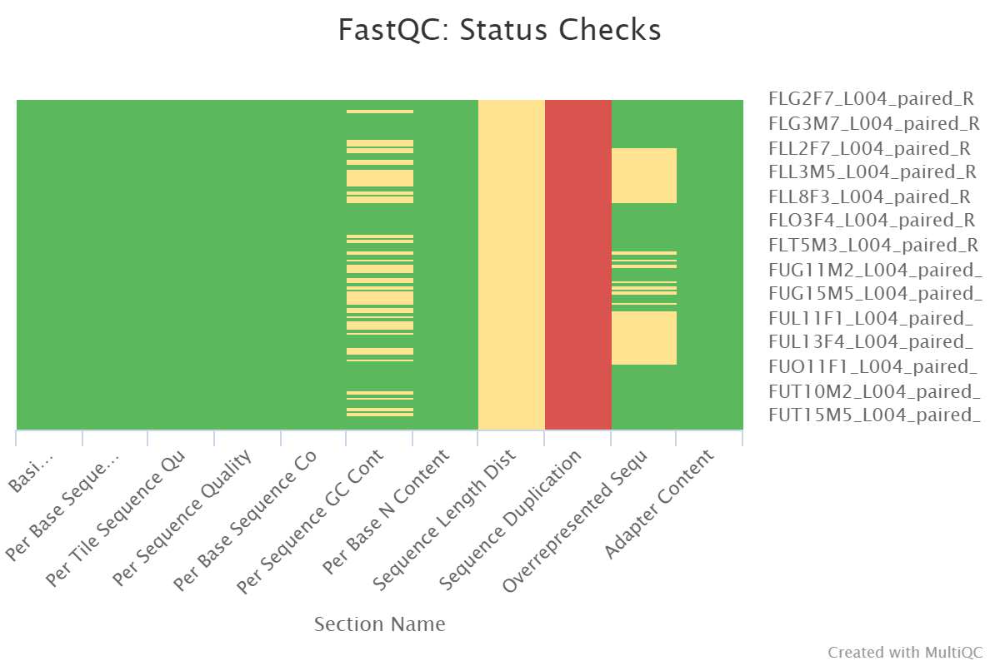

<center> 


#### Comparisson of UNTRIMMED vs TRIMMED read 
On the left hand side are images of what modules from untrimmed reads look like vs trimmed in cases where the modules differed.

<p float="left">

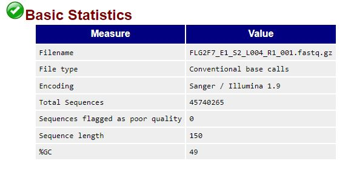 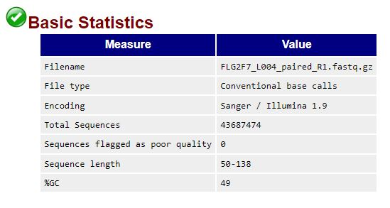

</p>

<p float="left">

 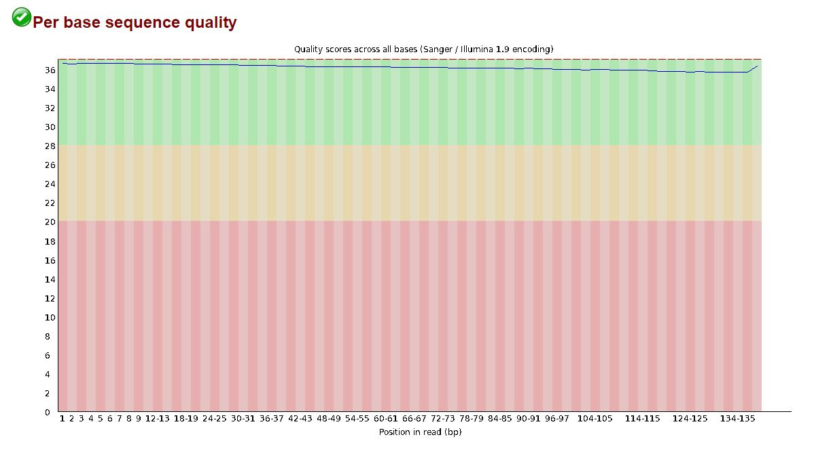

</p>

<p float="left">

 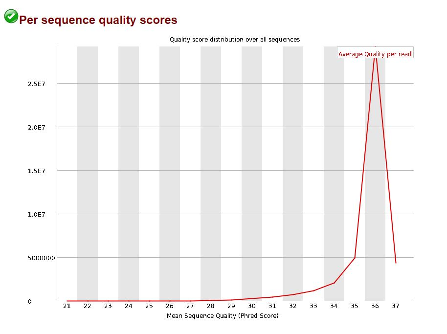

</p>

<p float="left">

 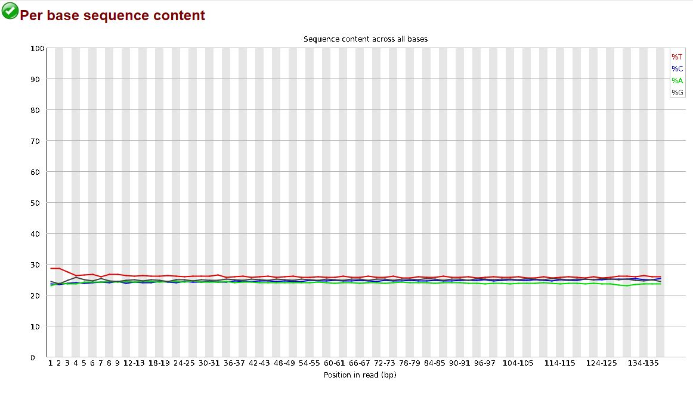

</p>

<p float="left">

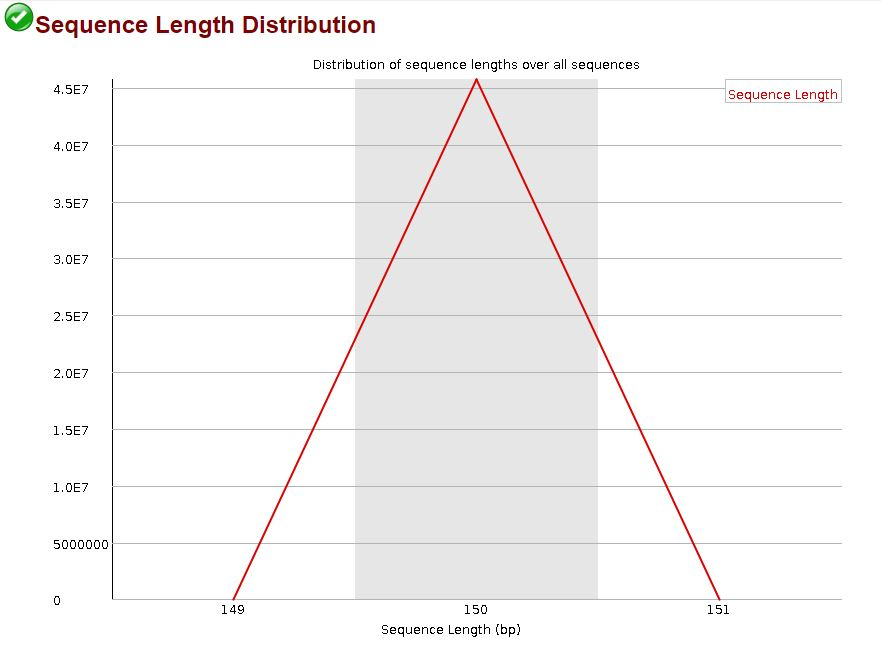 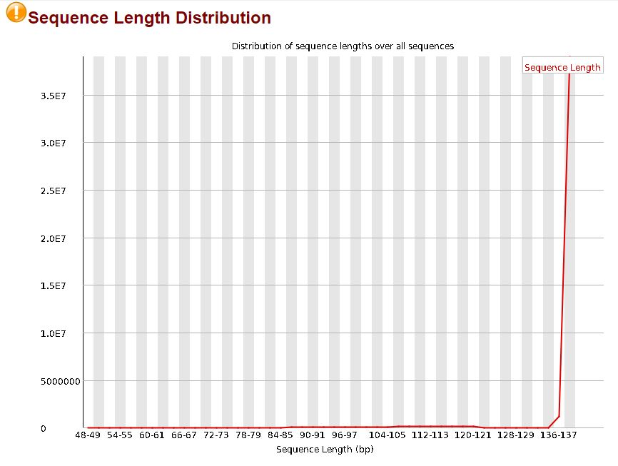

</p>

<p float="left">

 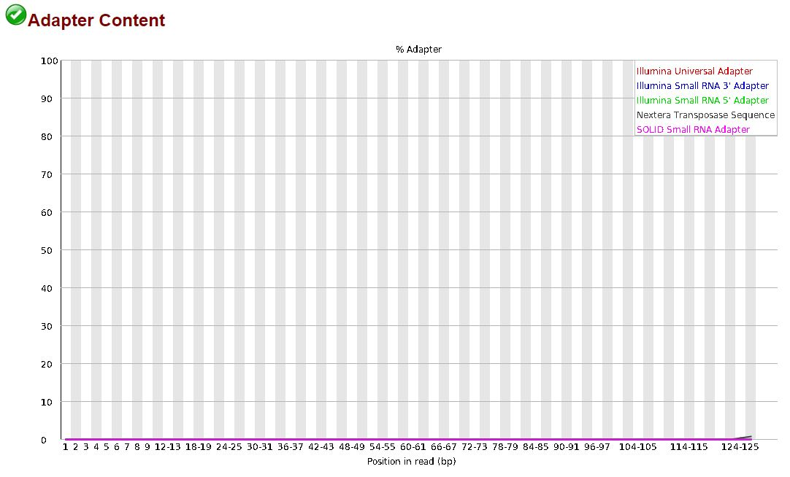

</p>

# De novo Transcriptome Assembly using Trinity
Trinity is a commonly used method for de novo reconstruction of transcriptomes from RNA-seq data when there is no genome to map back to. Within Trinity there are three independent software modules that are applied and used sequentially: **Inchworm**, **Chrysalis**, and **Butterfly**.

## Installing Trinity
Trinity requires the installation of several programs, to get around this Trinity was installed via a Docker in the RCC and must be used within one. **The first time that you use Trinity you must pull the latest Docker image for Trinity** like so:
```{bash, eval=FALSE}
docker pull trinityrnaseq/trinityrnaseq

```

## Running Trinity 
Once started, a successful Trinity run will take days to complete. There are a lot of extra components you can add onto a Trinity run (View the [Trinity User Manual](https://github.com/trinityrnaseq/trinityrnaseq/wiki/Running-Trinity) for more information) but here are the main components you should specify:

1.  **SeqType**: Signifies the type of reads (fa or fq).
    `--seqType <string>`

2.  **Max Memory**: Suggested max memory to use by Trinity where limiting can be enabled.
    `--max_memory <string>`
    -   This should be based on the available memory for your computer. For example `--max_memory 20G`
    
3.  **Read Locations**: Provide exact file locations for the left and right reads. One or more file names separated by commas, NOT spaces.
    `--left <string>`
    `--right <string>` 
    -   The left and right reads must be paired up sequentially, if XXX32_R1 is mentioned first for the left, XXX32_R2 must also be first for the right.
    -   If running across multiple samples `--samples_file <string>` can be used rather than typing out the location for each individual. See tab about running multiple reads for more details.

4.  **CPU**: Tell Trinity the number of CPUs to use, default is 2.
    `--CPU <int>`
    -   This should be based on the number of cores the computer has and it must be an even number.
    
5.  **Output Directory**: Name of the directory for output.This will be created if it doesn't already exist.
    `--output <string>`
    -   Good to include trinity in the name as a safety precaution! Don't forget to include the full file path.

### One Pair of Reads
```{bash, eval=FALSE}
#!/bin/bash

data=/home/rccuser/20220902_mRNASeq_PE150/trimmed_paired/ ##This is the location of the paired trimmed reads

sudo docker run --rm -v`pwd`:`pwd` trinityrnaseq/trinityrnaseq Trinity \
    --seqType fq --max_memory 50G \
    --left ${data}reads_1.fq.gz \
    --right ${data}reads_2.fq.gz \
    --max_memory 20G --CPU 6 --output ${data}trinity_out_dir
    
```

### Multiple Pairs of Reads
```{bash, eval=FALSE}
#!/bin/bash

data=/home/rccuser/20220902_mRNASeq_PE150/ ##This is the location of our data

sudo docker run --rm -v`pwd`:`pwd` trinityrnaseq/trinityrnaseq Trinity --seqType fq --max_memory 188G \
    --samples_file ${data}trimmed_paired/FU_trinity_samples.txt \
    --CPU 12 \
    --output `pwd`/trinity_out_dir_fuscs
```

## Troubleshooting Trinity
The overarching issues I ran into with Trinity surrounded not having enough memory/RAM and space on the RCC. A total of **4.1 TB** of space was added to the disk paired with **192 GB** of RAM in order to get Trinity to work. 

Below is an example of what an error related to RAM might look like:
<p float="left">

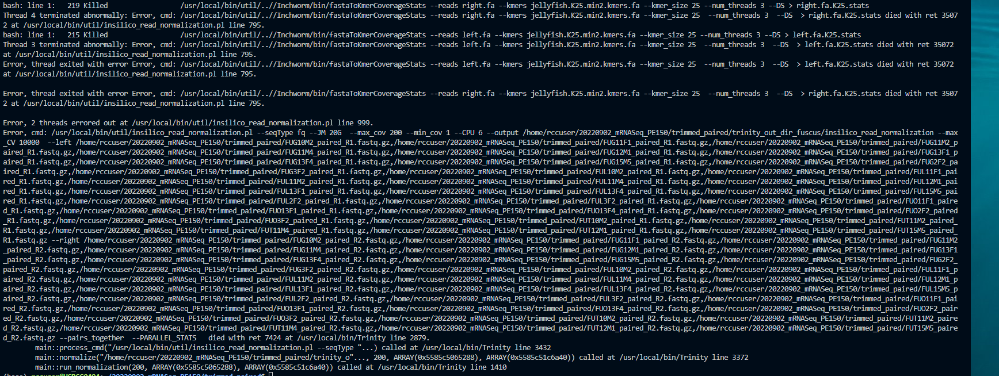


</p>

An identifying feature when trying to determine whether or not an error with Trinity is related to memory/RAM is the line `bash: line 1:    219 Killed` along with errors starting with `Thread X terminated abnormally`. 

### Using screen as a substitute for nohup
Because Trinity must be run in the docker, we are unable to use the `nohup` command in order to send the process into the background. Because of this and the nature of the RCC, you may end up with errors such as `error client_loop: send disconnect: Broken pipe.` meaning our RCC session has automatically timed out. To overcome this issue we can use [screen](https://www.gnu.org/software/screen/manual/html_node/index.html), which acts as a sort of RDC for the terminal. Some of the basics for using screen are outlined below:

1. Log in to the RCC and begin a screen session by entering `screen` and then start your process/commands.

2. If you become disconnected at any point from the RCC, the screen session will still go on. **To reconnect to the session** use the command `screen -r`.

3. To disconnect from your screen session (WITHOUT STOPPING IT) use **Crtl+a d**. All commands to screen are started with "Ctrl+a" followed by a letter.
