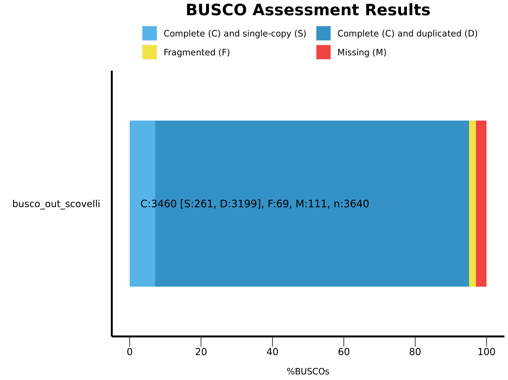
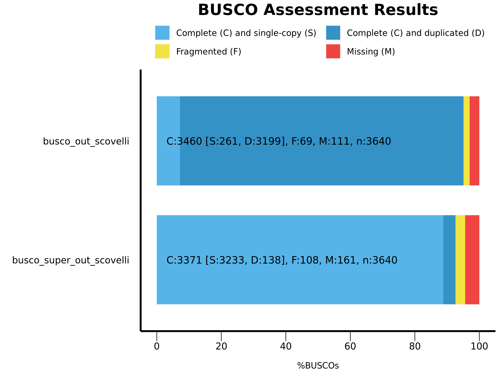

```{r knitsetup, include=FALSE}
knitr::opts_knit$set(root.dir='../',fig_path="../figs/")
```


```{r chunksetup, include=FALSE}
knitr::opts_chunk$set(echo = TRUE,out.extra='',fig.pos="H",
                      fig.path = "../figs/",
                      dpi = 300,dev='png')
```

``` {r library, include = FALSE}

```

``` {r functions}
```

``` {r read-data}
#This file contains the Sra run info for the various s. scovelli projects and was used to rename the samples
scov_sra <- read.csv("data/SraRunInfo_Sscov.csv")
```

# Gathering Publically Acessible RNA Seq. Data
## Installing sra-toolkit
```
##Install sra-toolkit
sudo apt install sra-toolkit

##Configure it
vdb-config -i

##Check that it installed properly
fastq-dump --version
    "fastq-dump" version 2.11.3
    
```

**Steps for configuring sra-toolkit**
You will see a screen where you operate the buttons by pressing the letter highlighted in red, or by pressing the tab-key until the wanted button is reached and then pressing the space- or the enter-key.

1. You want to enable the "Remote Access" option on the Main screen.

2. If you would like the toolkit to default to using the smaller SRA Lite format with simplified quality scores, set the "Prefer SRA Lite files with simplified base quality scores" option on the Main screen.

3. Proceed to the "Cache" tab where you will want to enable "local file-caching" and you want to set the "Location of user-repository".
     - The repository directory needs to be set to an **empty folder**. This is the folder where prefetch will deposit the files.

4. Go to your cloud provider tab and accept to "report cloud instance identity".

The cloud instance identity only reports back in what cloud (AWS v GCP) you are working so you can access data for free.

## Obtain accessions
Run accessions are used to dowload SRA data.

1. Navigate to the [NIH SRA website](https://www.ncbi.nlm.nih.gov/sra) and enter the query for whatever you are interested in (i.e. `"syngnathus scovelli" AND "rna seq"[Strategy]`). 

2. Click the checkboxes next to records (experiments) to select data of interest.

3. Click **Send to** on the top of the page, check **File**, select **Accession List** and save this file in the location from which you are running the SRA ToolKit.

`SraAccList.txt` should be formatted as so:
```
SRR10158924
SRR10158925
SRR10158926
SRR10158932
SRR10158933
SRR10158934
SRR10158935
SRR10158936
SRR10158937
SRR10158938
...
```

## Using sra-toolkit to gather public raw sequencing reads
**Prefetch** is a part of the SRA toolkit and is used to download runs.

```
##One Run
prefetch SRR10158924

##A list of runs
prefetch --option-file SraAccList.txt
```

- These files will be located in the the folder that you set as the **cache location** (see above steps) in a sub folder called `/sra`.

**fasterq-dump** and **sam-dump** are also part of the tool kit and are used to convert the prefetched Runs from the compressed SRA format to either fastq or sam format. They are run as: `fasterq-dump --split-files SRR10158924.sra`. Once converted, all files were gzipped using `gzip`.

```{r rename_sra, eval=FALSE}
#Pulling out the information we need from the SraRunInfo
scov_sra_summarized <- data.frame(scov_sra[c('Run', 'Experiment', 'Submission', 'Sex', 'Subject_ID', 'SampleName')])

##Adding in subject names that follow the format I have previously used
scov_sra_summarized$Subject_ID <- c('SSBF1', 'SSBM1', 'SSBM2', 'SSBF2', 'SSBF3', 'SSBM3', 'SSBM4', 'SSSF1', 'SSSF2', 'SSSM1', 'SSSM2', 'SSSM3', 'SSSM4', 'SSSM5', 'SSSF3', 'SSSF4', 'SSSF5', 'SSPTM1', 'SSPTM2', 'SSOF1', 'SSOF2', 'SSPTM3', 'SSPTM4', 'SSPTM5', 'SSNPTM1', 'SSNPTM2', 'SSOF3', 'SSOF4', 'SSOF5', 'NA','NA','NA','NA','NA','NA','NA','NA','NA','NA','NA','NA','NA','NA','NA','NA','NA','NA','NA','NA','SSNPBPM1', 'SSPBPM1', 'SSNPBPM2', 'SSPBPM2', 'SSPBPM3', 'SSNPBPM3', 'SSPBPM4', 'SSNPBPM4')

##Exporting to a .txt file
write.table(scov_sra_summarized, file = "scov_rename.txt", quote = FALSE, sep = "\t", col.names = TRUE)
```

scov_rename.txt was moved into the RCC and used to change the file names from the **Run Number** to the **Subject_ID**. This makes it easier for downstream analysis as the subject_ID is more descriptive to what the file actually is. 
```
##Rename the Raw reads

while read -r line
> do
> old=$(echo $line | awk '{print $2}')
> new=$(echo $line | awk '{print $6}')
> echo $new $old
> rename "s/$old/$new/g" *.gz
> done < scov_rename.txt

```

## Description of the different sources of RNA_seq Data

1. **Submission Number**: SRA582537
   - RNA-seq brain of _Syngnathus scovelli_ including 4 pregnant males and 3 sexually mature females. 
   - **Associated paper**: @BEAL2018120
   - Fish euthanized with MS-222 and dissected immediately.
   - **Whole brain was used** and extractions were done with the Maxwell16 simplyRNA kit (Promega).
   - Samples sequences at UT Southwestern center in Dallas, TX on an Illumina HiSeq 2000. All samples had RIN > 8 and the pool was sequenced on one lane using paired-end 100 bp Illumina sequencing.
   
2. **Submission Number**: SRA966117 
   - RNA-seq skin and muscle of _Syngnathus scovelli_ including 5 non-pregnant males and 5 sexually mature females. 
   - **Associated paper**: @10.1093/jhered/esaa008
   - Took a cross-section that was wide enough to include 2 of the ornamental bands on each side. The cross-section included **muscle, skin, and bone tissue** all taken together.
   - Samples sequenced at MSU RTSF Genomics Core with the Illumina HiSeq 2500. No pooling across specimens.
   
3. **Submission Number**: SRA1439291 
   - RNA-seq ovaries and testis of _Syngnathus scovelli_ including 5 pregnant males, 2 non-pregnant males and 5 sexually mature females. 
   - **Associated paper**: @10.1111/evo.14579
   - Samples sequenced across two lanes of Illumina HiSeq 2500 and are 150bp paired end reads.
   
4. **Submission Number**: SRA1651277 
   - RNA-seq brood pouch of _Syngnathus scovelli_ including 4 pregnant males, and 4 non-pregnant males. 
   - **Associated paper**:  

# Pre-assembly Quality Control and Filtering {.tabset}
The trimming and filtering for these reads will follow the pipeline that was laid out for _Syngnathus floridae_. Any changes to scripts or steps will be highlighted in this document.

## Initial FastQC on raw reads {-}
I wanted to check the quality of all of the reads to begin with as they were obtained from many different studies and were sequenced in various ways.

```{bash run_fastqc_raw, file='bash/fastqc_script.sh', eval=FALSE}

```

This script was run as `nohup bash bash_scripts/fastqc_script.sh scovelli_raw scovelli_FastQC > fastqc.log 2>&1 &`. Once finished MultiQC was run: `multiqc scovelli_FastQC`. 

### FastQC results {-}
From the General stats reported in the MultiQC report we can see that prior to the filtering/trimming process we end up with an average of 22 &pm; 8.5 million reads  per sample, for a total of 1.63 billion reads.

However, there were clear differences between the samples depending on which project they came from:

| SUBMISSION |  READ LENGTH  | AVERAGE M. SEQS |
|:----------:|:-------------:|:---------------:|
|  SRA582537 |     100bp     |  22.9 &pm; 2.9  |
|  SRA966117 |150bp(F)/125(M)|  32.2 &pm; 7.1  |
| SRA1439291 |     150bp     |  18.1 &pm; 2.2  |
| SRA1651277 |     150bp     |  14.2 &pm; 6.5  |

Quality scores overall look good. All reads will need the chop at the front to fix the per base sequence content. 6 samples failed the Per sequence GC content, all of them are skin samples. Will need to go back and look at the paper to see if there is anything mentioned about this. Sequence duplication levels failed for most samples, but this was to be expected as we are working with RNAseq data. Adapter content is present and will need to be removed. 

## Trimming reads with Trimmomatic {-}
```{bash trim_script, eval=FALSE}
#!/bin/bash

#Create the arguments
input_dir=$1 #This should be the location of the RAW reads to be trimmed
adapter_ref=$2 #Whichever .fa file is being used to remove adapters

for fq in $1*_R1.fastq.gz
        do
        base=$(basename $fq _R1.fastq.gz)
        echo "Running trimmomatic for ${base}..."
        time trimmomatic PE -threads 16 $fq $1${base}_R2.fastq.gz \
                $1trimmed/${base}_paired_R1.fastq.gz $1trimmed/${base}_unpaired_R1.fastq.gz \
                $1trimmed/${base}_paired_R2.fastq.gz $1trimmed/${base}_unpaired_R2.fastq.gz \
                ILLUMINACLIP:$2:2:30:10 HEADCROP:12 LEADING:3 TRAILING:10 SLIDINGWINDOW:4:15 MINLEN:50
done
```

-   Before running the script, change the `trimmomatic` line to `echo "..."` to make sure all of the variables are working correctly.

-   Then remove the `echo ""` and run the script as `nohup bash bash_scripts/trim_script.sh scovelli_raw/ ../TruSeq3-PE.fa > trim.log 2>&1 &`

--   The **TruSeq3-PE-2.fa** file was used as it ws the Illumina Universal adapter sequence that I was trying to get rid of. This was pulled from the [trimmomatic github](https://github.com/usadellab/Trimmomatic/tree/main/adapters) using `wget https://github.com/usadellab/Trimmomatic/blob/main/adapters/TruSeq3-PE-2.fa`


## Using SortMeRNA to remove rRNA contamination {-}
SortmeRNA was installed via a conda environment `sortmerna` on the RCC.`sortmerna v4.3.6` was used

```{bash run_sortmeRNA, file='bash/sortmeRNA.sh', eval = FALSE}

```

This script was run as ` nohup bash bash_scripts/sortmeRNA.sh scovelli_trimmed ../rRNA_databases_v4.3.4/smr_v4.3_fast_db.fasta scovelli_rrna scovelli_norrna > sortmerna.log 2>&1 &`.

The chosen reference FASTA file contains **a subset of sequences** from the default SortMeRNA database. Here, the number of sequences in each database is reduced to improve the speed of the analysis.


## Using Kraken2 to remove biological contamination {-}
Kraken2 was installed in the conda environment `kraken2` on the RCC. `kraken2 v2.1.2` was used.

```{bash run_kraken2, file='bash/kraken2.sh', eval = FALSE}

```

This script was run as `nohup bash bash_scripts/kraken2.sh ../kraken2_pluspfp/ scovelli_norrna scovelli_nobio/ > kraken2.log 2>&1 &`. The kraken2 database used for this analysis included the standard database (archea, bacteria, viral) plus plant, fungi, and protozoan databases. Only reads that did not map back to these databases were retained.

## Doing a k-mer based correction with RCorrector {-}

The Rcorrector github repo was cloned and Rcorrector was installed in the /shared folder on the RCC.

```{bash run_Rcorrector, file='bash/rcor.sh', eval = FALSE}

```

This script was run as `nohup bash bash_scripts/rcor.sh ../../rcorrector scovelli_nobio scovelli_kmer_corrected/ > rcor.log 2>&1 &`. After this step the fasta files were g-zipped.

# Checking quality of trimmed and filtered reads
After each step of the filtering/trimming step above the quality of the reads was assessed with FastQC and the results were compiled using MultiQC.

```{bash run_fastqc, file='bash/fastqc_script.sh', eval=FALSE}

```

This script was run as `nohup bash bash_scripts/fastqc_script.sh input_reads output_FastQC > fastqc.log 2>&1 &`. Once finished MultiQC was run: `multiqc output_FastQC`.

From the General stats reported in the MultiQC report we can see that at the very end of the filtering/trimming process we end up with an average of  &pm;  million reads per sample for a total of billion reads.

# De novo transcriptome assembly
To generate comparative results across the three _Syngnathus_ species Trinity was used once again for the _de novo_ assembly.

The `samples file` needed to run trinity across multiple paired reads was created as:
```
#Gather the names for the samples that started with C*
ls scovelli_kmer_corrected/*L*R1.fq.gz | perl -pe 's/^(.*\/)(C\d)(\w+)L_(.*)_(L\d+)_R1.fq.gz$/\3L\t\2\3L_\5\t\1\2\3L_\4_\5_R1.fq.gz\t\1\2\3L_\4_\5_R2.fq.gz/g' > ss_trinity_samples.txt

#Gather the names for the rest of the samples that start with SS* and attach them at the end of the previous file
ls scovelli_kmer_corrected/*SS*R1.fq.gz | perl -pe 's/^(.*\/)(SS)(\w+)(\d)_R1.fq.gz$/\3\4\t\2\3\4\t\1\2\3\4_R1.fq.gz\t\1\2\3\4_R2.fq.gz/g' >> ss_trinity_samples.txt
```

```{bash trinity_script, file='bash/trinity.sh', eval = FALSE}

```

This script was run in a screen session as `bash bash_scripts trinity.sh ss_trinity_samples.txt trinity_out_dir_scovelli_Oct2023`.

# Post-assembly Quality Control {.tabset}
## Using BUSCO to assess composition or 'completeness' of assembly {-}
`BUSCO` was installed in the `busco` conda environment on the RCC. `BUSCO v 5.2.2` was used.

```{bash run_busco, file='bash/busco_tran.sh', eval = FALSE}

```

The lineage chosen for _S. scovelli_ was `actinopterygii_odb10` since it is the closest clade provided with BUSCO. This script was run as `nohup bash bash_scripts/busco_tran.sh trinity_out_dir_scovelli_Oct2023.Trinity.fasta actinopterygii_odb10 busco_out_scovelli > busco.log 2>&1 &`.

#### Short Summary {-}
```
# BUSCO version is: 5.2.2
# The lineage dataset is: actinopterygii_odb10 (Creation date: 2021-02-19, number of genomes: 26, number of BUSCOs: 3640)
# Summarized benchmarking in BUSCO notation for file /home/rccuser/shared/coley_files/trinity_out_dir_scovelli_Oct2023.Trinity.fasta
# BUSCO was run in mode: transcriptome

        ***** Results: *****

        C:95.1%[S:7.2%,D:87.9%],F:1.9%,M:3.0%,n:3640
        3460    Complete BUSCOs (C)
        261     Complete and single-copy BUSCOs (S)
        3199    Complete and duplicated BUSCOs (D)
        69      Fragmented BUSCOs (F)
        111     Missing BUSCOs (M)
        3640    Total BUSCO groups searched

Dependencies and versions:
        hmmsearch: 3.1
        metaeuk: 6.a5d39d9

```
Very similar result to the other two _Syngnathus_ assemblies prior to any thinning, good completeness but lots of duplication.

#### Plot {-}
<p float="center">

 

</p>


## Trinity transcriptome contig Nx Statistics {-}
```{bash N50_script, file='bash/trinity_N50.sh', eval = FALSE}

```

This script was run as `bash bash_scripts/trinity_N50.sh `pwd`/trinity_out_dir_scovelli_Oct2023.Trinity.fasta ss_Trinity_stats.txt`.

#### Results {-}
```
################################
## Counts of transcripts, etc.
################################
Total trinity 'genes':  304903
Total trinity transcripts:      505799
Percent GC: 45.80

########################################
Stats based on ALL transcript contigs:
########################################

        Contig N10: 7715
        Contig N20: 5525
        Contig N30: 4241
        Contig N40: 3277
        Contig N50: 2523

        Median contig length: 506
        Average contig: 1172.24
        Total assembled bases: 592916647


#####################################################
## Stats based on ONLY LONGEST ISOFORM per 'GENE':
#####################################################

        Contig N10: 6107
        Contig N20: 3958
        Contig N30: 2634
        Contig N40: 1725
        Contig N50: 1154

        Median contig length: 372
        Average contig: 720.79
        Total assembled bases: 219772198

```

Based on the longest isoform we can see that 50% of the assembled bases are found in transcript contigs that are at least 1154 bases in length. This is high than the 979 N50 from _Syngnathus fuscus_ but lower than the 1307 N50 from _Syngnathus floridae_.

## Trinity transcriptome contig Ex90N50 Statistic and gene count {-}

#### Create an Abundance Matrix {-}
```
#Get a list of the salmon quant.sf files so you don't have to list them individually
find . -maxdepth 2 -name "*quant.sf" | tee SSsalmon.quant_files.txt
```

```{bash trinity_matrix, file='bash/trinity_abund_est.sh', eval=FALSE}

```

This script was run as `nohup bash bash_scripts/trinity_abund_est.sh `pwd`/trinity_out_dir_scovelli_Oct2023.Trinity.fasta.gene_trans_map `pwd`/scovelli_salmon_quant/SSsalmon.quant_files.txt scovelli_salmon > trin_abund.log 2>&1 &`. The shell wrapper (`/bin/sh -c`) was added to the script to ensure the output files were sent to the right place.

#### Calculate the Ex90N50 stat {-}
```{bash ex90, file='bash/exn50.sh', eval=FALSE}

```
This script was run as ` bash bash_scripts/exn50.sh `pwd`/scovelli_salmon.isoform.TMM.EXPR.matrix `pwd`/trinity_out_dir_scovelli_Oct2023.Trinity.fasta scovelli_exN50.stats`

| Ex      | ExN50   | num_genes |
|:--------|:--------|:----------|
|    3    |   227   |     1     |
|    5    |  3418   |     2     |
|    7    |  3418   |     3     |
|    8    |  3418   |     4     |
|   ...   |   ...   |    ...    |
|   90    |  2703   |  29389    |
|   99    |  2562   |  464874   |
|   100   |  2523   |  505799   |

We can then plot the Ex value (first column) against the ExN50 values:

`sudo docker run -v`pwd`:`pwd` trinityrnaseq/trinityrnaseq /bin/sh -c "cd /home/rccuser/shared/coley_files/ && /usr/local/bin/util/misc/plot_ExN50_statistic.Rscript /home/rccuser/shared/coley_files/scovelli_exN50.stats"`

the Ex90N50 for _S. scovelli_ (2703) is slightly lower than both _S. fuscus_ (2981) and _S. floridae_ (2918).

# Alignment and abundance estimations {.tabset}
Salmon was installed locally on the RCC. It must be run as `/usr/local/bin/salmon`. `Salmon v 1.10.1` was used.

## Generate the index {-}
`salmon index` was used for this step. The index is built only **once** per transcriptome.

```{bash salmon-build-index, file='bash/salmon_txome_indicies.sh', eval = FALSE}

```

The script was run as ` nohup bash bash_scripts/salmon_txome_indicies.sh trinity_out_dir_scovelli_Oct2023.Trinity.fasta scovelli_salmon_index 31 > salmon_index.log 2>&1 &`. A kmer length of 31 was used upon recommendation from the Salmon website.

## Quantify the samples {-}
After building the index this is run on every individual read pair.

```{bash salmon-quant, file='bash/salmon_scov_quant.sh', eval=FALSE}

```

This script was run as `nohup bash bash_scripts/salmon_scov_quant.sh scovelli_kmer_corrected/ scovelli_salmon_index/ scovelli_salmon_quant/ > salmon_quant.log 2>&1 &`.

The `quant.sf` and `.log` files were moved out of their nested location to a shared folder and renamed to include the sample name.
```{bash rename-salmon-files, file='bash/rename_salmon.sh', eval = FALSE}

```

The mapping rate was pulled from all of the log files with `grep "Mapping rate" *log > SSmap.txt` and the results are below. Generally, we want to see a mapping rate of at least 80% for our samples.

```
C4FL_GATCAG_salmon_quant.log:[2023-10-18 16:18:54.069] [jointLog] [info] Mapping rate = 99.9134%
C4PL_TAGCTT_salmon_quant.log:[2023-10-18 16:20:51.509] [jointLog] [info] Mapping rate = 99.9117%
C6FL_GAGTGG_salmon_quant.log:[2023-10-18 16:23:41.392] [jointLog] [info] Mapping rate = 99.9135%
C6PL_ACTGAT_salmon_quant.log:[2023-10-18 16:26:01.542] [jointLog] [info] Mapping rate = 99.9156%
C7FL_GCCAAT_salmon_quant.log:[2023-10-18 16:27:07.486] [jointLog] [info] Mapping rate = 99.9156%
C7PL_CAGATC_salmon_quant.log:[2023-10-18 16:29:12.668] [jointLog] [info] Mapping rate = 99.9188%
C8FL_AGTCAA_salmon_quant.log:[2023-10-18 16:31:28.805] [jointLog] [info] Mapping rate = 99.8997%
C8PL_AGTTCC_salmon_quant.log:[2023-10-18 16:35:03.440] [jointLog] [info] Mapping rate = 99.916%
C9FL_ATCACG_salmon_quant.log:[2023-10-18 16:37:55.484] [jointLog] [info] Mapping rate = 99.9062%
C9PL_TTAGGC_salmon_quant.log:[2023-10-18 16:40:18.148] [jointLog] [info] Mapping rate = 99.9015%
SSBF1_salmon_quant.log:[2023-10-18 16:43:57.972] [jointLog] [info] Mapping rate = 99.2225%
SSBF2_salmon_quant.log:[2023-10-18 16:56:36.491] [jointLog] [info] Mapping rate = 99.3306%
SSBF3_salmon_quant.log:[2023-10-18 17:07:14.785] [jointLog] [info] Mapping rate = 99.3432%
SSBM1_salmon_quant.log:[2023-10-18 17:22:10.198] [jointLog] [info] Mapping rate = 99.3029%
SSBM2_salmon_quant.log:[2023-10-18 17:31:35.348] [jointLog] [info] Mapping rate = 99.2411%
SSBM3_salmon_quant.log:[2023-10-18 17:41:56.319] [jointLog] [info] Mapping rate = 99.2806%
SSBM4_salmon_quant.log:[2023-10-18 17:51:43.652] [jointLog] [info] Mapping rate = 99.2519%
SSOF1_salmon_quant.log:[2023-10-18 18:03:29.059] [jointLog] [info] Mapping rate = 99.9255%
SSOF2_salmon_quant.log:[2023-10-18 18:09:42.000] [jointLog] [info] Mapping rate = 99.9147%
SSOF3_salmon_quant.log:[2023-10-18 18:14:41.880] [jointLog] [info] Mapping rate = 99.9348%
SSOF4_salmon_quant.log:[2023-10-18 18:20:08.100] [jointLog] [info] Mapping rate = 99.9232%
SSOF5_salmon_quant.log:[2023-10-18 18:26:34.296] [jointLog] [info] Mapping rate = 99.93%
SSPBPM1_salmon_quant.log:[2023-10-18 18:30:23.961] [jointLog] [info] Mapping rate = 99.8718%
SSPBPM2_salmon_quant.log:[2023-10-18 18:35:27.277] [jointLog] [info] Mapping rate = 99.872%
SSPBPM3_salmon_quant.log:[2023-10-18 18:42:24.715] [jointLog] [info] Mapping rate = 99.8636%
SSPBPM4_salmon_quant.log:[2023-10-18 18:45:04.671] [jointLog] [info] Mapping rate = 99.858%
SSPTM1_salmon_quant.log:[2023-10-18 18:48:44.746] [jointLog] [info] Mapping rate = 81.4678%
SSPTM2_salmon_quant.log:[2023-10-18 18:53:51.755] [jointLog] [info] Mapping rate = 99.8504%
SSPTM3_salmon_quant.log:[2023-10-18 18:58:48.570] [jointLog] [info] Mapping rate = 99.8804%
SSPTM4_salmon_quant.log:[2023-10-18 19:03:57.758] [jointLog] [info] Mapping rate = 89.9412%
SSPTM5_salmon_quant.log:[2023-10-18 19:08:56.100] [jointLog] [info] Mapping rate = 99.8759%
SSSF1_salmon_quant.log:[2023-10-18 19:16:17.015] [jointLog] [info] Mapping rate = 99.8614%
SSSF2_salmon_quant.log:[2023-10-18 19:25:11.912] [jointLog] [info] Mapping rate = 99.8924%
SSSF3_salmon_quant.log:[2023-10-18 19:32:29.264] [jointLog] [info] Mapping rate = 99.8766%
SSSF4_salmon_quant.log:[2023-10-18 19:39:20.557] [jointLog] [info] Mapping rate = 99.8943%
SSSF5_salmon_quant.log:[2023-10-18 19:46:45.300] [jointLog] [info] Mapping rate = 99.8955%
SSSM1_salmon_quant.log:[2023-10-18 19:56:13.838] [jointLog] [info] Mapping rate = 99.9429%
SSSM2_salmon_quant.log:[2023-10-18 20:02:44.146] [jointLog] [info] Mapping rate = 99.9475%
SSSM3_salmon_quant.log:[2023-10-18 20:08:24.682] [jointLog] [info] Mapping rate = 99.9332%
SSSM4_salmon_quant.log:[2023-10-18 20:15:16.221] [jointLog] [info] Mapping rate = 99.9463%
SSSM5_salmon_quant.log:[2023-10-18 20:22:56.106] [jointLog] [info] Mapping rate = 99.945%
```
A very high mapping rate can be seen for all of the samples, overall very happy with this.

# Assembly thinning and redundancy reduction - SuperTranscripts
SuperTranscripts were generated to reduce redundancy while still retaining all of the sequence information. These were generated with the tool installed with Trinity.

```{bash super-transcript, file='bash/trin_super_transcripts.sh', eval=FALSE}

```

This script was run in a screen session as `bash bash_scripts/trin_super_transcripts.sh trinity_out_dir_scovelli_Oct2023.Trinity.fasta`.

## Re-evaluating the quality of the assembly {.tabset}
### BUSCO {-}
#### Short summary {-}
```
# BUSCO version is: 5.2.2
# The lineage dataset is: actinopterygii_odb10 (Creation date: 2021-02-19, number of genomes: 26, number of BUSCOs: 3640)
# Summarized benchmarking in BUSCO notation for file /home/rccuser/shared/coley_files/trinity_supertran_scovelli.fasta
# BUSCO was run in mode: transcriptome

        ***** Results: *****

        C:92.6%[S:88.8%,D:3.8%],F:3.0%,M:4.4%,n:3640
        3371    Complete BUSCOs (C)
        3233    Complete and single-copy BUSCOs (S)
        138     Complete and duplicated BUSCOs (D)
        108     Fragmented BUSCOs (F)
        161     Missing BUSCOs (M)
        3640    Total BUSCO groups searched

Dependencies and versions:
        hmmsearch: 3.1
        metaeuk: 6.a5d39d9

```

#### Graphing results {-}

<p float="center">

 

</p>

### Nx Statistics {-}
```
################################
## Counts of transcripts, etc.
################################
Total trinity 'genes':  304903
Total trinity transcripts:      304903
Percent GC: 43.42

########################################
Stats based on ALL transcript contigs:
########################################

        Contig N10: 8243
        Contig N20: 5383
        Contig N30: 3532
        Contig N40: 2269
        Contig N50: 1440

        Median contig length: 379
        Average contig: 799.07
        Total assembled bases: 243639268


#####################################################
## Stats based on ONLY LONGEST ISOFORM per 'GENE':
#####################################################

        Contig N10: 8243
        Contig N20: 5383
        Contig N30: 3532
        Contig N40: 2269
        Contig N50: 1440

        Median contig length: 379
        Average contig: 799.07
        Total assembled bases: 243639268
```
After assembly thinning the N50 changed from 1154 to 1440, but still quite similar.

### Examining RNA-Seq read representation (via Salmon) {-}
#### Mapping Rate {-}
|   Sample   |  Trinity Assembly  | SuperTranscript Assembly |
|:----------:|:------------------:|:------------------------:|
|    C4FL    |       99.9134%     |         92.0042%         |
|    C4PL    |       99.9117%     |         91.9309%         |
|    C6FL    |       99.9135%     |         88.6251%         |
|    C6PL    |       99.9156%     |         92.6808%         |
|    C7FL    |       99.9156%     |         91.9981%         |
|    C7PL    |       99.9188%     |         93.3568%         |
|    C8FL    |       99.8997%     |         90.5525%         |
|    C8PL    |       99.916%      |         92.9497%         |
|    C9FL    |       99.9062%     |         91.1898%         |
|    C9PL    |       99.9015%     |         93.0269%         |
|    SSBF1   |       99.2225%     |         97.7904%         |
|    SSBF2   |       99.3306%     |         97.9157%         |
|    SSBF3   |       99.3432%     |         97.9281%         |
|    SSBM1   |       99.3029%     |         97.8685%         |
|    SSBM2   |       99.2411%     |         97.7767%         |
|    SSBM3   |       99.2806%     |         97.8398%         |
|    SSBM4   |       99.2519%     |         97.858%          |
|    SSOF1   |       99.9255%     |         96.7713%         |
|    SSOF2   |       99.9147%     |         96.6299%         |
|    SSOF3   |       99.9348%     |         97.0684%         |
|    SSOF4   |       99.9232%     |         96.4791%         |
|    SSOF5   |        99.93%      |         96.8494%         |
|   SSPBPM1  |       99.8718%     |         94.6105%         |
|   SSPBPM2  |       99.872%      |         94.9595%         |
|   SSPBPM3  |       99.8636%     |         95.2792%         |
|   SSPBPM4  |       99.858%      |         95.0526%         |
|   SSPTM1   |       81.4678%     |         97.3118%         |
|   SSPTM2   |       99.8504%     |         96.0057%         |
|   SSPTM3   |       99.8804%     |         96.4046%         |
|   SSPTM4   |       89.9412%     |         96.9876%         |
|   SSPTM5   |       99.8759%     |         96.5152%         |
|    SSSF1   |       99.8614%     |         95.4004%         |
|    SSSF2   |       99.8924%     |         95.7075%         |
|    SSSF3   |       99.8766%     |         95.4898%         |
|    SSSF4   |       99.8943%     |         95.6005%         |
|    SSSF5   |       99.8955%     |         95.9521%         |
|    SSSM1   |       99.9429%     |         96.0868%         |
|    SSSM2   |       99.9475%     |         96.0976%         |
|    SSSM3   |       99.9332%     |         95.8301%         |
|    SSSM4   |       99.9463%     |         96.2143%         |
|    SSSM5   |       99.945%      |         97.7344%         |

The mapping rate decreased overall across the samples after the aseembly thinning, but still is well above the 80% benchmark so I am happy with it

# Prepping for differential expression analysis
## Importing transcript abundance with tximport
```{r create-sample-file}
##Create a file containing information about the samples
ID <- c("SSLF4", "SSLM4", "SSLF6", "SSLM6", "SSLF7", "SSLM7", "SSLF8", "SSLM8", "SSLF9", "SSLM9",
        "SSBF1", "SSBF2", "SSBF3", "SSBM1", "SSBM2", "SSBM3", "SSBM4",
        "SSOF1", "SSOF2", "SSOF3", "SSOF4", "SSOF5",
        "SSPBPM1", "SSPBPM2", "SSPBPM3", "SSPBPM4", 
        "SSPTM1", "SSPTM2", "SSPTM3", "SSPTM4", "SSPTM5",
        "SSSF1", "SSSF2", "SSSF3", "SSSF4", "SSSF5", "SSSM1", "SSSM2", "SSSM3", "SSSM4", "SSSM5")
Sex <- c("F", "M", "F", "M", "F", "M", "F", "M", "F", "M",
         rep(c("F", "M", "F", "M", "F", "M"), 
             times = c(3, 4, 5, 9, 5, 5)))
Organ <- rep(c("Liver", "Brain", "Gonad", "BP", "Gonad", "Skin"), 
             times = c(10, 7, 5, 4, 5, 10))
samples <- cbind(ID, Sex, Organ)
samples <- as.data.frame(samples)
write.table(samples, file = "SS_samples.txt", quote = FALSE, sep = "\t", col.names = TRUE, row.names = FALSE)

```

Generating the transcript abundance was done on the RCC via R command line:
```{r tximport, eval=FALSE}
#Enter R
conda activate R
R

#Load required package
library(tximport)

#Read in sample file
samples <- read.table("SS_samples.txt", header=TRUE)

#Create list of quant.sf files from salmon
files <- list.files("/home/rccuser/shared/coley_files/scovelli_super_salmon_quant/expression_files", full.names = TRUE)
names(files) <- paste0(samples$ID)
all(file.exists(files))
  ## [1] TRUE
  
#Pull the transcript-gene relationship from the .gtf file generated during the SuperTranscripts step
gtf <- read.table("trinity_supertran_scovelli.gtf", header = FALSE)
tx2gene <- gtf[,c(10, 10)] #Using the gene_id twice since there are no longer isoforms in the SuperTranscript assembly
tx2gene <- unique(tx2gene)
colnames(tx2gene) <- c("gene_id", "transcript_id")

#Building the matrix
txi.salmon.SS <- tximport(files, type = "salmon", tx2gene = tx2gene)
head(txi.salmon.SS$counts)
saveRDS(txi.salmon.SS, "txi.salmon_SS.RDS") #Move the file off the RCC to continue the Differential expression analysis in R

```

# References