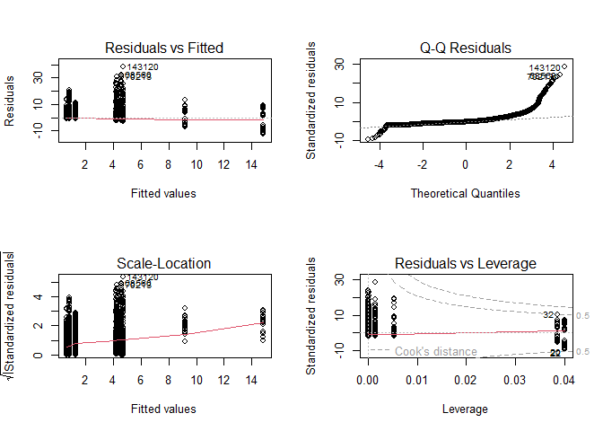
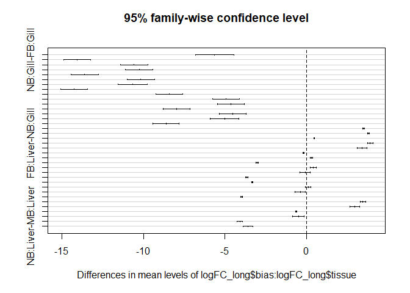

Differential Expression Analysis in *Syngnathus floridae*
================

- <a href="#single-factor-analysis---comparing-males-v-females"
  id="toc-single-factor-analysis---comparing-males-v-females">Single
  factor analysis - Comparing Males v Females</a>
  - <a href="#visualizing-the-results"
    id="toc-visualizing-the-results">Visualizing the results</a>
    - <a href="#ma-plot---mvf-diff" id="toc-ma-plot---mvf-diff">MA-plot - MvF
      Diff.</a>
    - <a href="#heatmap---overall-expression"
      id="toc-heatmap---overall-expression">Heatmap - overall expression</a>
    - <a href="#sample-dist-heatmap" id="toc-sample-dist-heatmap">Sample-dist
      Heatmap</a>
    - <a href="#pca-plots" id="toc-pca-plots">PCA plots</a>
- <a
  href="#multifactor-design---comparing-m-v-f-across-the-diff-tissue-types"
  id="toc-multifactor-design---comparing-m-v-f-across-the-diff-tissue-types">Multifactor
  design - Comparing M v F across the diff tissue types</a>
  - <a href="#invesitgate-the-results-of-the-differential-expression"
    id="toc-invesitgate-the-results-of-the-differential-expression">Invesitgate
    the results of the differential expression</a>
    - <a href="#m-f-liver-comparisson" id="toc-m-f-liver-comparisson">M-F
      Liver Comparisson</a>
    - <a href="#m-f-gill-comparisson" id="toc-m-f-gill-comparisson">M-F Gill
      Comparisson</a>
    - <a href="#m-f-gonad-comparisson" id="toc-m-f-gonad-comparisson">M-F
      Gonad Comparisson</a>
    - <a href="#ma-plots" id="toc-ma-plots">MA Plots</a>
  - <a href="#creating-an-upset-plot"
    id="toc-creating-an-upset-plot">Creating an Upset Plot</a>
  - <a href="#variation-in-fc-across-sex-bias-and-tissue-type"
    id="toc-variation-in-fc-across-sex-bias-and-tissue-type">Variation in FC
    across sex-bias and tissue type</a>
  - <a href="#categorizing-sex-specific-genes"
    id="toc-categorizing-sex-specific-genes">Categorizing sex-specific
    genes</a>
    - <a href="#investigating-the-results-of-the-sex-specific-subsetting"
      id="toc-investigating-the-results-of-the-sex-specific-subsetting">Investigating
      the results of the sex-specific subsetting</a>
    - <a href="#pulling-out-the-gene-ids-for-all-of-the-sex-specific-genes"
      id="toc-pulling-out-the-gene-ids-for-all-of-the-sex-specific-genes">Pulling
      out the gene IDs for all of the sex-specific genes</a>
  - <a
    href="#creating-categories-and-binning-the-sex-biased-genes-based-on-degree-of-logfc"
    id="toc-creating-categories-and-binning-the-sex-biased-genes-based-on-degree-of-logfc">Creating
    categories and binning the sex-biased genes based on degree of logFC</a>
  - <a href="#gene-ontology-analysis" id="toc-gene-ontology-analysis">Gene
    Ontology Analysis</a>
    - <a href="#using-blast-in-command-line"
      id="toc-using-blast-in-command-line">Using BLAST in command line</a>
    - <a href="#filtering-blast-results"
      id="toc-filtering-blast-results">Filtering Blast results</a>
    - <a
      href="#merging-the-blast-filtered-data-frames-with-the-sex-biased-information"
      id="toc-merging-the-blast-filtered-data-frames-with-the-sex-biased-information">Merging
      the BLAST filtered Data frames with the sex-biased information</a>
    - <a href="#blasting-the-sex-specific-genes-against-the-s-scovelli-genome"
      id="toc-blasting-the-sex-specific-genes-against-the-s-scovelli-genome">Blasting
      the sex-specific genes against the <em>S. scovelli</em> genome</a>
    - <a href="#blasting-against-the-zebrafish-genome"
      id="toc-blasting-against-the-zebrafish-genome">Blasting against the
      Zebrafish genome</a>

``` r
#The abundance matrix generated via salmon and tximport to be used for the DE analysis
txi.salmon <- readRDS("data/txi.salmon.floride.RDS")

#The samples file generated for tximport
samples <- read.table("FL_samples.txt", header = TRUE)

#Make sure the conditions are in the samples file as a factor
samples$Sex <- as.factor(samples$Sex)
samples$Organ <- as.factor(samples$Organ)

#Adding in Mating success and Rep fitness(total number of eggs transferred)
samples$mate_success <- c("1", "1", "3", "1", "2", "2", "1", "2", "0",
                          "1", "1", "3", "3", "1", "2", "2", "1", "2", "0",
                          "1", "1", "3", "3", "0",
                          "1", "1", "2", "1", "1")

samples$rep_fittness <- c(169, 88, 762, 285, 467, 500, 427, 156, 0, 
                          169, 88, 762, 916, 285, 467, 500, 427, 156, 0, 
                          169, 88, 762, 916, 0,
                          159, 285, 156, 372, 166)
```

The package `DESeq2` was used for the differential expression analysis
outlined below.

# Single factor analysis - Comparing Males v Females

To analyze your data with DESeq2 you must first generate the
DESeqDataSet. In order to do this we need the abundance matrix generated
with `tximport` and a `samples` file that lays out all of the
conditions. The model for this single factor analysis was run as counts
\~ Sex.

``` r
#Create the DESeq dataset
dds_FL <- DESeqDataSetFromTximport(txi.salmon, 
                                   colData = samples,
                                   design = ~ Sex)
```

The data is then pre-filtered to remove low gene counts before running
further DESeq2 functions. By doing this we remove rows in which there
are very few reads thus reducing the memory size of the `dds` object and
increasing the speed at which we can use the transformation and testing
functions in DESeq2.

The cutoff here was to remove rows that had counts fewer than 10 across
all samples.

``` r
#only keeping rows that have at lead 10 reads total
keep <- rowSums(counts(dds_FL)) >= 10
dds_FL <- dds_FL[keep, ]
```

After filtering we can now perform the standard differential expression
analysis that is wrapped into DESeq2.

``` r
#Generate the expression values
dds_FL_exp <- DESeq(dds_FL)

#Compile the results
res <- results(dds_FL_exp)
res
```

    ## log2 fold change (MLE): Sex M vs F 
    ## Wald test p-value: Sex M vs F 
    ## DataFrame with 175095 rows and 6 columns
    ##                        baseMean log2FoldChange     lfcSE       stat    pvalue
    ##                       <numeric>      <numeric> <numeric>  <numeric> <numeric>
    ## TRINITY_DN0_c0_g1     1801.1920      0.2673823  0.197183   1.356008  0.175097
    ## TRINITY_DN0_c0_g2     2573.3828      0.7634647  0.581650   1.312585  0.189323
    ## TRINITY_DN0_c1_g1        9.1754      0.9097093  0.530020   1.716367  0.086095
    ## TRINITY_DN1_c0_g1     1292.0108     -0.1941494  0.158366  -1.225957  0.220215
    ## TRINITY_DN1_c0_g2      114.9169     -0.0871335  0.419554  -0.207681  0.835478
    ## ...                         ...            ...       ...        ...       ...
    ## TRINITY_DN99992_c0_g1  1.308178      1.4606597  1.082334  1.3495467  0.177161
    ## TRINITY_DN99993_c0_g2  0.772193     -0.6254412  1.154951 -0.5415307  0.588142
    ## TRINITY_DN99995_c0_g1  1.277924     -0.0108875  0.780664 -0.0139464  0.988873
    ## TRINITY_DN99997_c0_g1  2.179808     -0.0575813  1.686240 -0.0341478  0.972759
    ## TRINITY_DN99999_c0_g1  0.251955      1.6312941  2.971355  0.5490068  0.583001
    ##                            padj
    ##                       <numeric>
    ## TRINITY_DN0_c0_g1      0.532694
    ## TRINITY_DN0_c0_g2      0.555717
    ## TRINITY_DN0_c1_g1      0.353179
    ## TRINITY_DN1_c0_g1      0.603156
    ## TRINITY_DN1_c0_g2      0.969274
    ## ...                         ...
    ## TRINITY_DN99992_c0_g1        NA
    ## TRINITY_DN99993_c0_g2        NA
    ## TRINITY_DN99995_c0_g1        NA
    ## TRINITY_DN99997_c0_g1  0.995694
    ## TRINITY_DN99999_c0_g1        NA

Once that has finished we can now start exploring some of the
single-factor analysis results

``` r
##Ordering our results based on p-value
resOrdered <- res[order(res$pvalue),]
resOrdered
```

    ## log2 fold change (MLE): Sex M vs F 
    ## Wald test p-value: Sex M vs F 
    ## DataFrame with 175095 rows and 6 columns
    ##                        baseMean log2FoldChange     lfcSE      stat      pvalue
    ##                       <numeric>      <numeric> <numeric> <numeric>   <numeric>
    ## TRINITY_DN3756_c0_g1   918.7630        28.7244   2.07255   13.8595 1.11511e-43
    ## TRINITY_DN21727_c0_g2   68.6867        25.1027   1.91953   13.0775 4.42515e-39
    ## TRINITY_DN7854_c0_g1   138.4769        26.0705   2.01975   12.9078 4.06857e-38
    ## TRINITY_DN31591_c0_g1   47.3757       -25.3123   2.08364  -12.1481 5.86888e-34
    ## TRINITY_DN25251_c0_g2   83.2229        23.9277   1.97962   12.0870 1.23683e-33
    ## ...                         ...            ...       ...       ...         ...
    ## TRINITY_DN99802_c0_g1         0              0         0         0           1
    ## TRINITY_DN99802_c0_g2         0              0         0         0           1
    ## TRINITY_DN99826_c0_g1         0              0         0         0           1
    ## TRINITY_DN99826_c0_g2         0              0         0         0           1
    ## TRINITY_DN99888_c0_g3         0              0         0         0           1
    ##                              padj
    ##                         <numeric>
    ## TRINITY_DN3756_c0_g1  7.46547e-39
    ## TRINITY_DN21727_c0_g2 1.48128e-34
    ## TRINITY_DN7854_c0_g1  9.07942e-34
    ## TRINITY_DN31591_c0_g1 9.82275e-30
    ## TRINITY_DN25251_c0_g2 1.65607e-29
    ## ...                           ...
    ## TRINITY_DN99802_c0_g1          NA
    ## TRINITY_DN99802_c0_g2          NA
    ## TRINITY_DN99826_c0_g1          NA
    ## TRINITY_DN99826_c0_g2          NA
    ## TRINITY_DN99888_c0_g3          NA

``` r
summary(res)
```

    ## 
    ## out of 167170 with nonzero total read count
    ## adjusted p-value < 0.1
    ## LFC > 0 (up)       : 4406, 2.6%
    ## LFC < 0 (down)     : 3698, 2.2%
    ## outliers [1]       : 0, 0%
    ## low counts [2]     : 108147, 65%
    ## (mean count < 2)
    ## [1] see 'cooksCutoff' argument of ?results
    ## [2] see 'independentFiltering' argument of ?results

``` r
#How many ADJUSTED p-values were less than 0.1?
sum(res$padj < 0.1, na.rm = TRUE)
```

    ## [1] 8104

``` r
#Looking at  an alpha=0.05, the default is 0.1
res05 <- results(dds_FL_exp, alpha = 0.05)
summary(res05)
```

    ## 
    ## out of 167170 with nonzero total read count
    ## adjusted p-value < 0.05
    ## LFC > 0 (up)       : 3196, 1.9%
    ## LFC < 0 (down)     : 2729, 1.6%
    ## outliers [1]       : 0, 0%
    ## low counts [2]     : 111380, 67%
    ## (mean count < 2)
    ## [1] see 'cooksCutoff' argument of ?results
    ## [2] see 'independentFiltering' argument of ?results

``` r
sum(res05$padj < 0.05, na.rm = TRUE)
```

    ## [1] 5925

## Visualizing the results

### MA-plot - MvF Diff.

Generate an MA-plot to show the log2 fold changes attributable to sex
over the mean of normalized counts for all of the samples in the `dds`.
Points will be colored if the adjusted p-value is less that 0.1.


### Heatmap - overall expression

We can also generate a heat map to look ar overall expression levels
across our samples. Note, this is not differentially expressed genes.


From the heatmap we can see that for all of these top 20 expressed genes
the highest expression in found in the liver. There are also a few genes
that appear to be highly expressed across all of the tissue types. With
this heatmap we can also pull out the names of the Trinity genes that
are showing this high expression and BLAST the corresponding sequences
to see what the genes are.

``` r
#Pull out the corresponding trinity_geneIDS that are plotted in the heatmap
heatmap_TG <- cbind(row.names(assay(vsd)[select,]))

#Run once to create the file and then commented out
#write.table(heatmap_TG,
  #          'heatmap_trinitygenes.txt',
  #          sep = "",
  #          quote=FALSE,
  #          row.names = FALSE,
  #          col.names = FALSE)
```

### Sample-dist Heatmap

We can then generate a sample-to-sample distances heatmap that will give
an overview of the similarities and differences between our samples


We can see that the highest similarities (aside from same samples
comparisons) is between samples from the same organ. After that, the
next highest similarities can be seen between the male and female
gonads. There is one gill sample that appears to be quite different from
the rest, sample FLG4M4, definitely a sample to be paying attention to
as we move through with the rest of the analysis.

### PCA plots

Next we can look at PCA plots for our samples to see how our different
samples are grouping. The size of the points for these plots will be
scaled by the mating success of the individual to see if that may be at
all correlated with the sample grouping.

![Principal components analysis reflects that most variation corresponds
to differences in expression between organs (green: gill; yellow: gonad;
pink: liver), rather than variation due to sex (circle = female;
triangle = male) or mating status (the size of points reflects an
individual’s mating success). The first axis explains 32% of variation
in the dataset, with gills and liver, two types of somatic tissues,
sitting on opposite ends of that axis. The second axis explains 23% of
the variation in gene expression, with somatic tissues on the opposite
side of the axis from the
gonads.](floridae_diff_expr_analysis_files/figure-gfm/pca-scaled-organ-1.png)

    ## Warning: Using size for a discrete variable is not advised.


    ## Warning: Using size for a discrete variable is not advised.


# Multifactor design - Comparing M v F across the diff tissue types

If we investigate the column data of our DESeq dataset we can see that
each sample has both a sex and organ type attached to it, we will be
using these two factors in our multi-factor analysis. In this
multi-factor analysis the model was run as counts \~ group, where group
included both the sex and the organ type (i.e. MLiver, FLiver, etc.).
The sample “FLG4M4” appeared to a bit of an outlier in the above
analysis, particularly clear in the sample-dist heatmap and the PCA, so
it will be removed from the analysis going forward.

``` r
#Create an additional column the has the two conditions combined(sex and organ type)
samples$group <- factor(paste0(samples$Sex, samples$Organ))

##Create a copy of the DESeq dataset
ddsMF_FL <- DESeqDataSetFromTximport(txi.salmon,
                                     colData = samples,
                                     design = ~ group)

##Remove FLG4M4 from the dataset
ddsMF_FL <- ddsMF_FL[, ddsMF_FL$ID != "FLG4M4"]

##Filter the dataset, only keeping rows that have at least 10 reads total, but less than 1,000,000
keep <- rowSums(counts(ddsMF_FL)) >= 10 & rowSums(counts(ddsMF_FL)) < 1e6
ddsMF_FL <- ddsMF_FL[keep, ]

#Run the differential expression analysis
ddsMF_FL_exp <- DESeq(ddsMF_FL)
resultsNames(ddsMF_FL_exp)
```

    ## [1] "Intercept"             "group_FGonad_vs_FGill" "group_FLiver_vs_FGill"
    ## [4] "group_MGill_vs_FGill"  "group_MGonad_vs_FGill" "group_MLiver_vs_FGill"

## Invesitgate the results of the differential expression

Thanks to the multi-factor analysis we can now explore differential
expression between all of the different combinations:  

- Male Liver v. Female Liver  
- Male Gill v. Female Gill  
- Male Gonad v. Female Gonad  
- All of the within sex tissue comparisons (e.g. Male Liver v. Male
  Gill, etc.)  

### M-F Liver Comparisson

``` r
##Pulling out the liver M-F results with an alpha of 0.05
liver_con_res <- results(ddsMF_FL_exp, contrast = c("group", "MLiver", "FLiver"), 
                         alpha = 0.05)
liver_con_res$trin_geneid <- rownames(liver_con_res)
head(liver_con_res)
```

    ## log2 fold change (MLE): group MLiver vs FLiver 
    ## Wald test p-value: group MLiver vs FLiver 
    ## DataFrame with 6 rows and 7 columns
    ##                    baseMean log2FoldChange     lfcSE       stat    pvalue
    ##                   <numeric>      <numeric> <numeric>  <numeric> <numeric>
    ## TRINITY_DN0_c0_g1 1757.0246      0.2039673  0.204457  0.9976049 0.3184710
    ## TRINITY_DN0_c0_g2 2623.1489     -0.8773171  0.400056 -2.1929856 0.0283084
    ## TRINITY_DN0_c1_g1    9.1364      0.6473510  0.961533  0.6732490 0.5007889
    ## TRINITY_DN1_c0_g1 1277.1872     -0.2297307  0.154826 -1.4837963 0.1378630
    ## TRINITY_DN1_c0_g2  109.0334     -0.8138095  0.387888 -2.0980519 0.0359006
    ## TRINITY_DN1_c1_g1  579.7570     -0.0184714  0.233718 -0.0790326 0.9370067
    ##                        padj       trin_geneid
    ##                   <numeric>       <character>
    ## TRINITY_DN0_c0_g1  0.739850 TRINITY_DN0_c0_g1
    ## TRINITY_DN0_c0_g2  0.206583 TRINITY_DN0_c0_g2
    ## TRINITY_DN0_c1_g1        NA TRINITY_DN0_c1_g1
    ## TRINITY_DN1_c0_g1  0.495320 TRINITY_DN1_c0_g1
    ## TRINITY_DN1_c0_g2  0.237201 TRINITY_DN1_c0_g2
    ## TRINITY_DN1_c1_g1  1.000000 TRINITY_DN1_c1_g1

``` r
summary(liver_con_res)
```

    ## 
    ## out of 164271 with nonzero total read count
    ## adjusted p-value < 0.05
    ## LFC > 0 (up)       : 574, 0.35%
    ## LFC < 0 (down)     : 1281, 0.78%
    ## outliers [1]       : 3043, 1.9%
    ## low counts [2]     : 127908, 78%
    ## (mean count < 10)
    ## [1] see 'cooksCutoff' argument of ?results
    ## [2] see 'independentFiltering' argument of ?results

There are many criteria that have been employed previously to denote sex
bias. For this study we are classifying sex-biased genes as **genes with
a p-value \< 0.05 AND a logFC $\ge$ \|2\|**. With that criteria in the
liver there are 184 male-biased genes and 634 female-biased genes.

I have then pulled out all of the male-biased, female-biased, and
non-biased genes based on the criteria outlined above. I determined
non-biased genes as a p-vaule \> 0.05.

``` r
#Removing the rows where padj. is NA in results
liver_con_res_noNA <- liver_con_res[!is.na(liver_con_res$padj),]
summary(liver_con_res_noNA) #We can now see that there are no outliers or low counts since the NAs have been removed
```

    ## 
    ## out of 33320 with nonzero total read count
    ## adjusted p-value < 0.05
    ## LFC > 0 (up)       : 574, 1.7%
    ## LFC < 0 (down)     : 1281, 3.8%
    ## outliers [1]       : 0, 0%
    ## low counts [2]     : 0, 0%
    ## (mean count < 10)
    ## [1] see 'cooksCutoff' argument of ?results
    ## [2] see 'independentFiltering' argument of ?results

``` r
#Creating a vector that contains all of the male-biased and female-biased genes in the liver
liver_mal_biased <- liver_con_res_noNA[which(liver_con_res_noNA$log2FoldChange >= 2 & liver_con_res_noNA$padj <= 0.05),]
liver_fem_biased <- liver_con_res_noNA[which(liver_con_res_noNA$log2FoldChange <= -2 & liver_con_res_noNA$padj <= 0.05),]

#Creating an object that contains all of the non-biased genes in the liver
liver_non_biased <- liver_con_res_noNA[which(liver_con_res_noNA$padj > 0.05),]
```

I will be generating a table that outlines the genes that are the most
male or female biased in each organ type. To do this I need to pull the
top 50 differentially expressed genes in males or females, get the
Trinity gene IDs and then BLAST the corresponding sequences. Here I am
pulling out the Trinity gene IDs for those genes.

``` r
#Creating a subset of the results where the p-value is less than 0.05
liver_con_res_p05 <- liver_con_res_noNA[liver_con_res_noNA$padj <= 0.05, ]


#Pulling the top 50 diff expressed genes in Males
top50_MLiver_trin_genes <- cbind(rownames(head(liver_con_res_p05[order(liver_con_res_p05$log2FoldChange, decreasing = TRUE),], n=50)))
#Run once to create the file and then commented out
#write.table(top50_MLiver_trin_genes,
 #           'FL_maleL_top50TRgenes.txt', 
 #            sep = "", 
 #            quote=FALSE, 
 #            row.names = FALSE, 
 #            col.names = FALSE)

#Pulling the top 50 diff expressed genes in Females
top50_Fliver_trin_genes <- cbind(rownames(head(liver_con_res_p05[order(liver_con_res_p05$log2FoldChange, decreasing = FALSE),], n=50)))
#Run once to create the file and then commented out
#write.table(top50_Fliver_trin_genes,
 #           'FL_femL_top50TRgenes.txt', 
 #           sep = "", 
 #           quote=FALSE, 
 #           row.names = FALSE, 
 #           col.names = FALSE)
```

### M-F Gill Comparisson

``` r
##Pulling out the gill M-F results
gill_con_res <- results(ddsMF_FL_exp, contrast = c("group", "MGill", "FGill"), alpha = 0.5)
gill_con_res$trin_geneid <- rownames(gill_con_res)
head(gill_con_res)
```

    ## log2 fold change (MLE): group MGill vs FGill 
    ## Wald test p-value: group MGill vs FGill 
    ## DataFrame with 6 rows and 7 columns
    ##                    baseMean log2FoldChange     lfcSE      stat    pvalue
    ##                   <numeric>      <numeric> <numeric> <numeric> <numeric>
    ## TRINITY_DN0_c0_g1 1757.0246     -0.0790394  0.225500 -0.350507  0.725958
    ## TRINITY_DN0_c0_g2 2623.1489     -0.0751805  0.442279 -0.169984  0.865023
    ## TRINITY_DN0_c1_g1    9.1364      0.5096636  0.822073  0.619973  0.535275
    ## TRINITY_DN1_c0_g1 1277.1872     -0.0185547  0.170405 -0.108886  0.913293
    ## TRINITY_DN1_c0_g2  109.0334     -0.0838502  0.405915 -0.206571  0.836345
    ## TRINITY_DN1_c1_g1  579.7570      0.1656159  0.246303  0.672406  0.501325
    ##                        padj       trin_geneid
    ##                   <numeric>       <character>
    ## TRINITY_DN0_c0_g1         1 TRINITY_DN0_c0_g1
    ## TRINITY_DN0_c0_g2         1 TRINITY_DN0_c0_g2
    ## TRINITY_DN0_c1_g1         1 TRINITY_DN0_c1_g1
    ## TRINITY_DN1_c0_g1         1 TRINITY_DN1_c0_g1
    ## TRINITY_DN1_c0_g2         1 TRINITY_DN1_c0_g2
    ## TRINITY_DN1_c1_g1         1 TRINITY_DN1_c1_g1

``` r
summary(gill_con_res)
```

    ## 
    ## out of 164271 with nonzero total read count
    ## adjusted p-value < 0.5
    ## LFC > 0 (up)       : 84, 0.051%
    ## LFC < 0 (down)     : 73, 0.044%
    ## outliers [1]       : 3043, 1.9%
    ## low counts [2]     : 100156, 61%
    ## (mean count < 3)
    ## [1] see 'cooksCutoff' argument of ?results
    ## [2] see 'independentFiltering' argument of ?results

In the gills there were 26 genes that we can consider male-biased and 25
female-biased genes based on our criteria for sex-bias.

I have then pulled out all of the male-biased, female-biased, and
non-biased genes to save them into their own objects.

``` r
#Removing the rows where padj. is NA in results
gill_con_res_noNA <- gill_con_res[!is.na(gill_con_res$padj), ]
summary(gill_con_res_noNA) #We can now see that there are no outliers or low counts since the NAs have been removed
```

    ## 
    ## out of 61072 with nonzero total read count
    ## adjusted p-value < 0.5
    ## LFC > 0 (up)       : 84, 0.14%
    ## LFC < 0 (down)     : 73, 0.12%
    ## outliers [1]       : 0, 0%
    ## low counts [2]     : 0, 0%
    ## (mean count < 3)
    ## [1] see 'cooksCutoff' argument of ?results
    ## [2] see 'independentFiltering' argument of ?results

``` r
#Creating a vector that contains all of the male-biased and female-biased genes in the gills
gill_mal_biased <- gill_con_res_noNA[which(gill_con_res_noNA$log2FoldChange >= 2 & gill_con_res_noNA$padj <= 0.05),]
gill_fem_biased <- gill_con_res_noNA[which(gill_con_res_noNA$log2FoldChange <= -2 & gill_con_res_noNA$padj <= 0.05),]

#Creating an object that contains all of the non-biased genes in the gills, p>0.05
gill_non_biased <- gill_con_res_noNA[which(gill_con_res_noNA$padj > 0.05),]
```

Here I am getting the trinity gene IDs that correspond to the top 50
differentially expressed genes for males and females. Because there are
only 21 female-biased genes I will only use those.

``` r
#Creating a subset of results where p-value is less than 0.05
gill_con_res_p05 <- gill_con_res_noNA[gill_con_res_noNA$padj <= 0.05,]

#Pulling the top 50 diff expressed genes in Males
top50_MGill_trin_genes <- cbind(rownames(head(gill_con_res_p05[order(gill_con_res_p05$log2FoldChange, decreasing = TRUE),], n=50)))
#Run once to create the file and then commented out
#write.table(top50_MGill_trin_genes,
 #           'FL_maleG_top50TRgenes.txt', 
 #           sep = "", 
 #           quote=FALSE, 
 #           row.names = FALSE, 
 #           col.names = FALSE)

#Pulling the top 21 diff expressed genes in Females - Only 21 female-biased genes in the gills
top21_FGill_trin_genes <- cbind(rownames(head(gill_con_res_p05[order(gill_con_res_p05$log2FoldChange, decreasing = FALSE),], n=21)))
#Run once to create the file and then commented out
#write.table(top21_FGill_trin_genes,
 #           'FL_femG_top21TRgenes.txt', 
 #           sep = "", 
 #           quote=FALSE, 
 #           row.names = FALSE, 
 #           col.names = FALSE)
```

### M-F Gonad Comparisson

``` r
##Pulling out the gonad M-F results
gonad_con_res <- results(ddsMF_FL_exp, contrast = c("group", "MGonad", "FGonad"), alpha = 0.05)
gonad_con_res$trin_geneid <- rownames(gonad_con_res)
head(gonad_con_res)
```

    ## log2 fold change (MLE): group MGonad vs FGonad 
    ## Wald test p-value: group MGonad vs FGonad 
    ## DataFrame with 6 rows and 7 columns
    ##                    baseMean log2FoldChange     lfcSE      stat      pvalue
    ##                   <numeric>      <numeric> <numeric> <numeric>   <numeric>
    ## TRINITY_DN0_c0_g1 1757.0246       0.702425  0.202248   3.47309 0.000514502
    ## TRINITY_DN0_c0_g2 2623.1489       1.150096  0.395187   2.91026 0.003611310
    ## TRINITY_DN0_c1_g1    9.1364       2.001238  0.780784   2.56311 0.010373818
    ## TRINITY_DN1_c0_g1 1277.1872      -0.343917  0.152619  -2.25343 0.024231994
    ## TRINITY_DN1_c0_g2  109.0334       0.612352  0.378112   1.61950 0.105339691
    ## TRINITY_DN1_c1_g1  579.7570      -0.792100  0.222490  -3.56016 0.000370624
    ##                         padj       trin_geneid
    ##                    <numeric>       <character>
    ## TRINITY_DN0_c0_g1 0.00346760 TRINITY_DN0_c0_g1
    ## TRINITY_DN0_c0_g2 0.01897199 TRINITY_DN0_c0_g2
    ## TRINITY_DN0_c1_g1 0.04630751 TRINITY_DN0_c1_g1
    ## TRINITY_DN1_c0_g1 0.09219274 TRINITY_DN1_c0_g1
    ## TRINITY_DN1_c0_g2 0.28262088 TRINITY_DN1_c0_g2
    ## TRINITY_DN1_c1_g1 0.00259384 TRINITY_DN1_c1_g1

``` r
summary(gonad_con_res)
```

    ## 
    ## out of 164271 with nonzero total read count
    ## adjusted p-value < 0.05
    ## LFC > 0 (up)       : 12437, 7.6%
    ## LFC < 0 (down)     : 7774, 4.7%
    ## outliers [1]       : 3043, 1.9%
    ## low counts [2]     : 72486, 44%
    ## (mean count < 1)
    ## [1] see 'cooksCutoff' argument of ?results
    ## [2] see 'independentFiltering' argument of ?results

Between the ovaries and testis (gonads) there were 9161 genes that we
can consider male-biased and 4097 female-biased genes based on our
criteria for sex-bias.

From the gonad M-F results I have then pulled out all of the
male-biased, female-biased, and non-biased genes and saved them to their
own objects.

``` r
#Removing the rows where padj. is NA in results
gonad_con_res_noNA <- gonad_con_res[!is.na(gonad_con_res$padj), ]
summary(gonad_con_res_noNA) #We can now see that there are no outliers or low counts since the NAs have been removed
```

    ## 
    ## out of 88742 with nonzero total read count
    ## adjusted p-value < 0.05
    ## LFC > 0 (up)       : 12437, 14%
    ## LFC < 0 (down)     : 7774, 8.8%
    ## outliers [1]       : 0, 0%
    ## low counts [2]     : 0, 0%
    ## (mean count < 1)
    ## [1] see 'cooksCutoff' argument of ?results
    ## [2] see 'independentFiltering' argument of ?results

``` r
#Creating an object that contains all of the male-biased and female-biased genes in the gonads
gonad_mal_biased <- gonad_con_res_noNA[which(gonad_con_res_noNA$log2FoldChange >= 2 & gonad_con_res_noNA$padj <= 0.05),]
gonad_fem_biased <- gonad_con_res_noNA[which(gonad_con_res_noNA$log2FoldChange <= -2 & gonad_con_res_noNA$padj <= 0.05),]

#Creating an object that contains all of the non-biased genes in the gonads, p>0.05
gonad_non_biased <- gonad_con_res_noNA[which(gonad_con_res_noNA$padj > 0.05),]
```

I then pulled out the trinity gene IDs that corresponded to the top 50
differentially expressed genes in males and females so that I could
BLAST the sequences.

``` r
#Creating a subset of the results where the p-value is less than 0.05
gonad_con_res_p05 <- gonad_con_res_noNA[gonad_con_res_noNA$padj <= 0.05,]

#Pulling the top 50 diff expressed genes in Males
top50_MGonad_trin_genes <- cbind(rownames(head(gonad_con_res_p05[order(gonad_con_res_p05$log2FoldChange, decreasing = TRUE),], n=50)))
#Run once to create the file and then commented out
#write.table(top50_MGonad_trin_genes,
 #           'FL_maleGon_top50TRgenes.txt', 
 #           sep = "", 
 #           quote=FALSE, 
 #           row.names = FALSE, 
 #           col.names = FALSE)

#Pulling the top 50 diff expressed genes in Females
top50_FGonad_trin_genes <- cbind(rownames(head(gonad_con_res_p05[order(gonad_con_res_p05$log2FoldChange, decreasing = FALSE),], n=50)))
#Run once to create the file and then commented out
#write.table(top50_FGonad_trin_genes,
 #           'FL_femGon_top50TRgenes.txt', 
 #           sep = "", 
 #           quote=FALSE, 
 #           row.names = FALSE, 
 #           col.names = FALSE)
```

### MA Plots


From the MA plots we can see the highest number of biased genes are
found in the gonads and then the liver and lastly the gills. The liver
appears to be the only organ where there are more female-biased genes
than male-biased genes, which is initially surprising due to the
sex-role-reversed nature of these fish.

## Creating an Upset Plot


In both males and females the highest number of shared sex-biased genes
is found between the gonads and the liver. There are no genes that are
shared across the same organ between males and females (i.e. biased in
males and females in the liver) which is good. Two sex-biased genes are
female-biased in all organs and three genes are male-biased in all three
organs.

## Variation in FC across sex-bias and tissue type

I want to create a plot the highlights the variation we see in
fold-change both across the different biases groups (male-biased,
female-biased, and non-biased) within one tissue type and across all of
the tissue types. To do this I first need to create a “long” dataset in
the following format:

| Tissue_type |   Bias    | Fold-Change |
|:-----------:|:---------:|:-----------:|
|    Gill     | male_bias |    XXXXX    |
|    Gill     | male_bias |    XXXXX    |
|    Gill     | fem_bias  |    XXXXX    |
|    Gill     |  no_bias  |    XXXXX    |
|      …      |    ….     |      …      |
|    Liver    | male_bias |    XXXXX    |
|    Liver    | male_bias |    XXXXX    |
|    Liver    | fem_bias  |    XXXXX    |
|    Liver    |  no_bias  |    XXXXX    |
|      …      |    ….     |      …      |
|    Gonad    | male_bias |    XXXXX    |
|    Gonad    | male_bias |    XXXXX    |
|    Gonad    | fem_bias  |    XXXXX    |
|    Gonad    |  no_bias  |    XXXXX    |
|      …      |    ….     |      …      |

That dataset is created here, with the Trinity gene IDs included as
well:

``` r
logFC_long<- data.frame(
  tissue=c(rep("Gill",nrow(gill_fem_biased)),
           rep("Gill", nrow(gill_mal_biased)),
           rep("Gill", nrow(gill_non_biased)),
           rep("Gonad", nrow(gonad_fem_biased)),
           rep("Gonad", nrow(gonad_mal_biased)),
           rep("Gonad", nrow(gonad_non_biased)),
           rep("Liver", nrow(liver_fem_biased)),
           rep("Liver", nrow(liver_mal_biased)),
           rep("Liver", nrow(liver_non_biased))
         ),
  bias=c(rep("FB",nrow(gill_fem_biased)),
         rep("MB",nrow(gill_mal_biased)),
         rep("NB", nrow(gill_non_biased)),
         rep("FB", nrow(gonad_fem_biased)),
         rep("MB", nrow(gonad_mal_biased)),
         rep("NB", nrow(gonad_non_biased)),
         rep("FB", nrow(liver_fem_biased)),
         rep("MB", nrow(liver_mal_biased)),
         rep("NB", nrow(liver_non_biased))
         ),
  logFC=c(gill_fem_biased$log2FoldChange,
          gill_mal_biased$log2FoldChange,
          gill_non_biased$log2FoldChange,
          gonad_fem_biased$log2FoldChange,
          gonad_mal_biased$log2FoldChange,
          gonad_non_biased$log2FoldChange,
          liver_fem_biased$log2FoldChange,
          liver_mal_biased$log2FoldChange,
          liver_non_biased$log2FoldChange
          ),
  geneID=c(rownames(gill_fem_biased),
           rownames(gill_mal_biased),
           rownames(gill_non_biased),
           rownames(gonad_fem_biased),
           rownames(gonad_mal_biased),
           rownames(gonad_non_biased),
           rownames(liver_fem_biased),
           rownames(liver_mal_biased),
           rownames(liver_non_biased)
           )
  
)
```

With the dataset in the proper format now, we can generate the plot


There appears to be differences in the logFC across both the organs and
the sex-bias groups (male-biased, fem-biased, and non-biased). Let’s
explore some analyses to see if we can put some statistical power behind
those differences.

``` r
#Looking at some summary statistics for logFC between the different groups
tapply(abs(logFC_long$logFC), list(logFC_long$bias, logFC_long$tissue), mean)
```

    ##          Gill    Gonad     Liver
    ## FB 14.8387724 4.270561 4.6797827
    ## MB  9.2086113 4.574899 4.1798810
    ## NB  0.7851771 1.239521 0.5915606

``` r
tapply(abs(logFC_long$logFC), list(logFC_long$bias, logFC_long$tissue), sd)
```

    ##        Gill    Gonad     Liver
    ## FB 8.046450 2.620606 3.8078443
    ## MB 6.428323 2.371041 4.0775662
    ## NB 1.022652 1.430086 0.7336214

``` r
par(mfrow=c(1,1))
interaction.plot(logFC_long$tissue, logFC_long$bias, logFC_long$logFC)
```

<!-- -->

``` r
logFC_long$tissue <- as.factor(logFC_long$tissue)
logFC_long$bias <- as.factor(logFC_long$bias)

fc_var_aov <- aov(abs(logFC_long$logFC) ~ logFC_long$bias*logFC_long$tissue)
anova(fc_var_aov)
```

    ## Analysis of Variance Table
    ## 
    ## Response: abs(logFC_long$logFC)
    ##                                       Df Sum Sq Mean Sq  F value    Pr(>F)    
    ## logFC_long$bias                        2 165851   82926 46055.71 < 2.2e-16 ***
    ## logFC_long$tissue                      2  10646    5323  2956.31 < 2.2e-16 ***
    ## logFC_long$bias:logFC_long$tissue      4   4212    1053   584.86 < 2.2e-16 ***
    ## Residuals                         175132 315334       2                       
    ## ---
    ## Signif. codes:  0 '***' 0.001 '**' 0.01 '*' 0.05 '.' 0.1 ' ' 1

``` r
par(mfrow = c(2,2))
plot(fc_var_aov)
```

<!-- -->

``` r
library(car)
```

    ## Loading required package: carData

    ## 
    ## Attaching package: 'car'

    ## The following object is masked from 'package:dplyr':
    ## 
    ##     recode

    ## The following object is masked from 'package:purrr':
    ## 
    ##     some

``` r
leveneTest(fc_var_aov)
```

    ## Levene's Test for Homogeneity of Variance (center = median)
    ##           Df F value    Pr(>F)    
    ## group      8  2077.2 < 2.2e-16 ***
    ##       175132                      
    ## ---
    ## Signif. codes:  0 '***' 0.001 '**' 0.01 '*' 0.05 '.' 0.1 ' ' 1

``` r
par(mfrow=c(1,1))
hist(resid(fc_var_aov))
```

<!-- -->

``` r
#shapiro.test(resid(fc_var_aov)) 

plot(TukeyHSD(fc_var_aov))
```

<!-- --><!-- --><!-- -->

``` r
library(multcompView)
multcompLetters4(fc_var_aov, TukeyHSD(fc_var_aov))
```

    ## $`logFC_long$bias`
    ##  MB  FB  NB 
    ## "a" "b" "c" 
    ## 
    ## $`logFC_long$tissue`
    ## Gonad  Gill Liver 
    ##   "a"   "b"   "c" 
    ## 
    ## $`logFC_long$bias:logFC_long$tissue`
    ##  FB:Gill  MB:Gill FB:Liver MB:Gonad FB:Gonad MB:Liver NB:Gonad  NB:Gill 
    ##      "a"      "b"      "c"      "c"      "d"      "d"      "e"      "f" 
    ## NB:Liver 
    ##      "g"

## Categorizing sex-specific genes

Now that we have investigated what the sex-bias is like across the
different tissue types I want to dive further into genes with
**sex-specific expression**. These are genes expressed only in one sex
or the other. I am classifying a sex-specific genes within each tissue
as ones where the expression of that gene is less than 10 for all of one
sex and there is a median of $\ge 20$ in the other sex.

Prior to running the for loop, any “outliers” that were determined by
DESeq were removed from the pool of genes. Additionally, normalized
counts were used for the classification of sex-specific genes as DESeq2
uses the moralized counts for all of the logFC/sexbias calculations.

``` r
#Pulling out the geneIDs for genes that were categorized as "outliers" by DESeq2
#Calculating the Cooks threshold that would have been used
np <- length(resultsNames(ddsMF_FL_exp))
nsamp <- ncol(ddsMF_FL_exp)
cooks_thresh <- qf(0.99, df1 = np, df2 = 29-np)

out_ids <- names(mcols(ddsMF_FL_exp)$maxCooks[mcols(ddsMF_FL_exp)$maxCooks >
                                                cooks_thresh])

#Filtering out the dds dataset to remove the outliers determined by DESeq
ddsMF_FL_exp_filtered <- ddsMF_FL_exp[!(rownames(ddsMF_FL_exp) %in% out_ids), ]

#Create a vector with the different organ types
organs <- levels(colData(ddsMF_FL_exp_filtered)$Organ)

#Create an empty list to store my datasets in
FL_sex_specific_genes <- list()

#Generate the for loop to identify MSpecific and FSpecific genes in each 
#organ based on Medians
for(organ in organs){
  
  #Male-Specific Genes
  ##Pull out all of the rows where fem count <=10 in every female sample
  fem0_organ_names <- which(rowSums(t(apply(counts(ddsMF_FL_exp_filtered, 
                                                   normalized = TRUE)[, ddsMF_FL_exp_filtered$Sex == "F" 
                                                                      & 
                                                                        ddsMF_FL_exp_filtered$Organ == organ], 
                                            1, 
                                            function(x) x <= 10)
                                      )
                                ) == ncol(counts(ddsMF_FL_exp_filtered, 
                                                 normalized = TRUE)[, ddsMF_FL_exp_filtered$Sex == "F" &
                                                                      ddsMF_FL_exp_filtered$Organ == organ])
                      )
  
  fem0_organ <- counts(ddsMF_FL_exp_filtered, 
                       normalized = TRUE)[rownames(counts(ddsMF_FL_exp_filtered, 
                                                          normalized = TRUE)) %in% 
                                            names(fem0_organ_names), 
                                          ddsMF_FL_exp_filtered$Organ == organ]
                                                         
  
  ##Pull out rows where median of male count >=20 for that organ
  mal10_organ <- apply(counts(ddsMF_FL_exp_filtered, 
                              normalized = TRUE)[, ddsMF_FL_exp_filtered$Sex == "M" 
                                                 & ddsMF_FL_exp_filtered$Organ == organ], 
                       1,
                       function(x) median(x) >=20)
  
  ##Keep only the rows where all fem samples <=10 and the Male median>=20
  fem0_mal10_organ <- fem0_organ[rownames(fem0_organ) %in% 
                                   names(mal10_organ[mal10_organ == TRUE]),
                                 ]
  
  ##Create a new object with a name based on the organ type
  organ_malsp <- sub("$", "_male_specific", organ)
  FL_sex_specific_genes[[organ_malsp]] <- fem0_mal10_organ
  
  
  
  #Female-Specific Genes
  ##Pull out all of the rows where male count <=10 in every male sample
  mal0_organ_names <- which(rowSums(t(apply(counts(ddsMF_FL_exp_filtered, 
                                                   normalized = TRUE)[, ddsMF_FL_exp_filtered$Sex == "M" 
                                                                      & 
                                                                        ddsMF_FL_exp_filtered$Organ == organ],
                                            1, 
                                            function(x) x <= 10)
                                      )
                                    ) == ncol(counts(ddsMF_FL_exp_filtered, 
                                                     normalized = TRUE)[, ddsMF_FL_exp_filtered$Sex == "M" & 
                                                                          ddsMF_FL_exp_filtered$Organ == organ])
                            )
  
  mal0_organ <- counts(ddsMF_FL_exp_filtered, 
                       normalized = TRUE)[rownames(counts(ddsMF_FL_exp_filtered, 
                                                          normalized = TRUE)) %in% 
                                            names(mal0_organ_names), 
                                          ddsMF_FL_exp_filtered$Organ == organ]
  
  ##Pull out rows where median of female count >=10 for that organ
  fem10_organ <- apply(counts(ddsMF_FL_exp_filtered, 
                              normalized = TRUE)[, ddsMF_FL_exp_filtered$Sex == "F" &
                                                   ddsMF_FL_exp_filtered$Organ == organ],
                       1,
                       function(x) median(x) >=20)
  
  #Keep only the rows where male=0 and the fem median>=10
  mal0_fem10_organ <- mal0_organ[rownames(mal0_organ) %in% 
                                   names(fem10_organ[fem10_organ == TRUE]),
                                 ]
  
  # Create a new object with a name based on the organ type
  organ_femsp <- sub("$", "_female_specific", organ)
  FL_sex_specific_genes[[organ_femsp]] <- mal0_fem10_organ
  
} 
```

### Investigating the results of the sex-specific subsetting

Let’s now take a look at how many sex-specific genes we have in each
tissue type:

To get a better idea what is going on between the sex-specific genes vs
the sex-biased genes I first determined how many overlaps there were
between our sex-biased and sex-specific genes and then used plotCounts
to plot the counts for each gene separately.

In the **Male Gills** there are 3 genes that overlap between sex-biased
and sex-specific, there are 1907 overlapping in the **gonads** and 12
overlapping in the **liver**. For females we have 6 overlapping
sex-specific and sex-biased genes in the **gills**, 690 genes in the
**gonads**, and 53 genes in the **liver**.

``` r
## Female sex-specific
fem_sp_geneIDs <- rownames(FL_sex_specific_genes$Gill_female_specific)

##Set the plotting window
par(mfrow=c(1,1))

for(gene in fem_sp_geneIDs){
  
  plotCounts(ddsMF_FL[,ddsMF_FL$Organ == 'Gill'], gene=gene, intgroup="Sex")
  
}

## Female sex-biased
gill_fem_biased_geneIDS <- rownames(gill_fem_biased)

##Set the plotting window
par(mfrow=c(1,1))

for(gene in gill_fem_biased_geneIDS){
  
  plotCounts(ddsMF_FL[,ddsMF_FL$Organ == 'Gill'], gene=gene, intgroup="Sex", col= 'salmon', pch = 19)
  
}
```

### Pulling out the gene IDs for all of the sex-specific genes

``` r
#Run once to create the file and then commented out
#write.table(cbind(rownames(FL_sex_specific_genes$Gill_male_specific)),
 #           'FL_malG_specific_TRgenes.txt', 
 #           sep = "", 
 #           quote=FALSE, 
 #           row.names = FALSE, 
 #           col.names = FALSE)
#write.table(cbind(rownames(FL_sex_specific_genes$Gill_female_specific)),
 #           'FL_femG_specific_TRgenes.txt', 
 #           sep = "", 
 #           quote=FALSE, 
 #           row.names = FALSE, 
 #           col.names = FALSE)
#write.table(cbind(rownames(FL_sex_specific_genes$Gonad_male_specific)),
 #           'FL_malGon_specific_TRgenes.txt', 
 #           sep = "", 
 #           quote=FALSE, 
 #           row.names = FALSE, 
 #           col.names = FALSE)
#write.table(cbind(rownames(FL_sex_specific_genes$Gonad_female_specific)),
 #           'FL_femGon_specific_TRgenes.txt', 
 #           sep = "", 
 #           quote=FALSE, 
 #           row.names = FALSE, 
 #           col.names = FALSE)
#write.table(cbind(rownames(FL_sex_specific_genes$Liver_male_specific)),
 #           'FL_malL_specific_TRgenes.txt', 
 #           sep = "", 
 #           quote=FALSE, 
 #           row.names = FALSE, 
 #           col.names = FALSE)
#write.table(cbind(rownames(FL_sex_specific_genes$Liver_female_specific)),
 #           'FL_femL_specific_TRgenes.txt', 
 #           sep = "", 
 #           quote=FALSE, 
 #           row.names = FALSE, 
 #           col.names = FALSE)
```

## Creating categories and binning the sex-biased genes based on degree of logFC

This binned was only done on the sex-biased genes, will not have a
category for the unbiased genes. The cutoffs for the different groups
are as follows:  

    1. Low - biased = LFC 2 - 3
    2. Medium - biased = LFC 3 - 5
    3. High - biased = LFC 5 - 10
    4. Extreme sex bias = LFC > 10

Counts of the sex-specific genes will be added on separately as they
were not classified based on fold-change but rather a presence in one
sex and an absence in the other sex.

``` r
#Make a vector that contains all of the groupings
biased_bins <- c("Unbiased", "Low", "Med", "High", "Extreme", "Sex-specific")

#Create a new column in the dataset and use ifelse statements to set the category limits
#abs(logFC) was used to account for the fem-biased genes possessing negative values
logFC_long$bias_cat <- ifelse(logFC_long$bias == "UB",
                              biased_bins[1],
                              ifelse(abs(logFC_long$logFC) >= 2 & abs(logFC_long$logFC) < 3,
                                     biased_bins[2],
                                     ifelse(abs(logFC_long$logFC) >= 3 & abs(logFC_long$logFC) < 5,
                                            biased_bins[3],
                                            ifelse(abs(logFC_long$logFC) >= 5 & abs(logFC_long$logFC) < 10,
                                                   biased_bins[4],
                                                   biased_bins[5])
                                            )
                                     )
                              )

#Making sure the genes we categorized as sex-specific are labeled as sex-specific for their 
#bias cat. in the dataset
organs <- c("Gill", "Gill", "Gonad", "Gonad", "Liver", "Liver")
bias <- c("MB", "FB", "MB", "FB", "MB", "FB")

for(i in 1:length(FL_sex_specific_genes)){

  tmp <- FL_sex_specific_genes[[i]]
  tmp <- as.data.frame(tmp)
  tmp$geneID <- rownames(tmp)
  
  for(j in 1:nrow(tmp)){
    
    one_gene <- tmp[j, ]
    
    if(one_gene[["geneID"]] %in%
       logFC_long[logFC_long$tissue == organs[[i]] &
                  logFC_long$bias == bias[[i]],"geneID"]){
       
      logFC_long[logFC_long$geneID == one_gene[["geneID"]] &
                   logFC_long$tissue == organs[[i]] &
                   logFC_long$bias == bias[[i]],
                 "bias_cat"] <- "Sex-specific"
    }else{
      
      one_gene_dat <- data.frame(matrix(ncol= ncol(logFC_long),
                                        nrow=1))
      colnames(one_gene_dat) <- colnames(logFC_long)
      
      one_gene_dat$tissue <- organs[[i]]
      one_gene_dat$geneID <- one_gene[["geneID"]]
      one_gene_dat$bias <- bias[[i]]
      one_gene_dat$bias_cat <- "Sex-specific"
      rownames(one_gene_dat) <- NULL
      
      logFC_long <- rbind(one_gene_dat, logFC_long)
      
      rownames(logFC_long) <- NULL
    }
  }
 }

#Create  subset of our long dataset that does not include the non-biased genes
logFC_long_noNB <- logFC_long[logFC_long$bias_cat != "Unbiased",]

#Make a table to count the number of genes in each category for each organ
bias_cat_table <- table(logFC_long_noNB$bias, logFC_long_noNB$bias_cat, logFC_long_noNB$tissue)

#Add the counts of sex-specific genes to the table
bias_cat_gill <- bias_cat_table[,, "Gill"]
#write.table(bias_cat_gill, "data/bias_cat_gills.txt", row.names = TRUE)

bias_cat_gonad <- bias_cat_table[,, "Gonad"]
#write.table(bias_cat_gonad, "data/bias_cat_gonad.txt", row.names = TRUE)

bias_cat_liver <- bias_cat_table[,, "Liver"]
write.table(bias_cat_liver, "data/bias_cat_liver.txt", row.names = TRUE)

#Plot the counts for each tissue type
par(mfrow=c(1, 3))
barplot(bias_cat_gill[,biased_bins[biased_bins!="Unbiased"]], beside = TRUE, ylim = c(0, max(bias_cat_table) + 1), col = c("#7fc97f", "#beaed4"),
        main = "Gill", ylab = "Number of Genes", xlab = "Bias Category")
barplot(bias_cat_gonad[,biased_bins[biased_bins!="Unbiased"]], beside = TRUE, ylim = c(0, max(bias_cat_table) + 1), col = c("#7fc97f", "#beaed4"),
        main = "Gonad")
barplot(bias_cat_liver[,biased_bins[biased_bins!="Unbiased"]], beside = TRUE, ylim = c(0, max(bias_cat_table) + 1), col = c("#7fc97f", "#beaed4"),
        main = "Liver")
legend("topright", legend = c("Female-biased", "Male-biased"), fill = c("#7fc97f", "#beaed4"))
```

<!-- -->

## Gene Ontology Analysis

We wanted to figure out two things:  

1)  What are the genes that are sex-biased within each tissue type  
2)  What are the GO terms for those genes.  

To accomplish this I first had to pull out the sequences that
corresponded to the Trinity gene IDS pulled out above. Once those
sequences were fetched they were blasted against the *Syngnathus
scovelli* genome. This was completed with the following bash script on
the RCC.

### Using BLAST in command line

``` bash
#Create a BLAST database - Used Syngnathus scovelli for our BLAST database
makeblastdb -in ../ncbi_dataset/data/GCF_024217435.1/GCF_024217435.1_RoL_Ssco_1.1_genomic.fna -out s_scov_genome -dbtype nucl
```

``` bash
#!/bin/bash

#Create the arguements
input_dir_TR=$1 #Location of the .txt files that contain the trinity gene IDs
subset_fasta=$2 #Path to the subset_fasta_file script
assembly_file=$3 #Name/location of the de novo assembly
blast_database=$4
output_dir=$5 #Desired output directory for .fasta and BLAST files

## Loop through all the Trinity gene ID .txt files
for file in $input_dir_TR/*TRgenes.txt
    do

    #Extract the sample name from the file name
    sample=$(basename $file .txt)

    #Get the corresponding sequences for the Trinity Gene IDs
    echo "Running subset_fasta_file for ${sample}..."
    $subset_fasta -c -f $assembly_file -l $input_dir_TR/${sample}.txt

    #Rename the automated output from the subset_fasta_file script
    fasta_out=$(basename $assembly_file fasta)
    mv $fasta_out.subset.fasta ${sample}.fasta

    #Blast the sequences
    echo "Running BLAST for ${sample}..."
    blastn -db $blast_database -query ${sample}.fasta -out ${sample}_blast.txt \
        -evalue 0.001 \
        -num_threads 12 \
        -outfmt "6 qseqid qstart qend stitle sstart send evalue bitscore length pident gaps"

    #Move the outputs into desired output directory
    mv ${sample}* $output_dir

done
```

This script was run as
`bash bash_scripts/blast_pipeline.sh floridae_high_exp_genes/high_expTG_names other_scripts/subset_fasta_file trinity_supertran_floridae.fasta ../genomes/s_scov/s_scov_genome floridae_high_exp_genes/high_exp_results/`

Once the BLAST results were obtained in the RCC I read them into R for
further filtering (keeping only one hit per gene)

``` r
#Specify the directory where BLAST results are located
blast_path <- "data/floridae_BLAST/"

#Create a list of the files I want
FL_blast_files <- list.files(blast_path, pattern = "top")

#Create an empty list to store my datasets in
FL_blast_list <- list()

#Create a loop to read in all of the blast results
for(file_name in FL_blast_files){
  # Read the file and store it in a new object
  file_data <- read.delim(file.path(blast_path, file_name), stringsAsFactors = FALSE, quote = "", sep = "\t", header = FALSE)
  
  #Add column names to the dataset
  colnames(file_data) <- c("trin_geneid", "trin_gene_start", "trin_gene_end", "scov_gene_info", "scov_gene_start", "scov_gene_end", "evalue", "bit_score", "length", "pident", "gaps")
  
  # Create a new object with a name based on the file name
  blast_name <- sub(".txt$", "", file_name) #Removes the file extension
  FL_blast_list[[blast_name]] <- file_data
}
```

### Filtering Blast results

Because of the way BLAST was run in the RCC, we can have multiple hits
for one gene, I want to filter that out so that there is only one hit
kept for each gene.

``` r
#Use lapply to apply the function to each dataset stored in the list created above
blast_output_filtered <- lapply(FL_blast_list, function(data_frame){
 
  #Pull out the Unique Trinity gene IDs
  uniqueID <- unique(data_frame[1])
  
  #Create an empty dataframe to store intermediate results in
  output <- data.frame(matrix(data = NA, ncol = ncol(data_frame), nrow = 0))
  colnames(output) <- c("trin_geneid", "trin_gene_start", "trin_gene_end", "scov_gene_info", "scov_gene_start", "scov_gene_end", "evalue", "bit_score", "length", "pident", "gaps")
  
  #Generate a for loop that pulls out the lowest e-value + highest % identity for each gene
  for(gene in uniqueID$trin_geneid){
    
    #Subset the dataset for each Trinity gene
    this_trin_gene<- subset(data_frame, trin_geneid==gene)
    #Pull out gene with smallest e-value
    uni_gene_subset_lowe <- this_trin_gene[which(this_trin_gene$evalue == min(this_trin_gene$evalue)),]
    #In case mult. genes have same e-value, pull out gene with highest % identity
    uni_gene_subset_lowe_highpid <- uni_gene_subset_lowe[which(uni_gene_subset_lowe$pident == max(uni_gene_subset_lowe$pident)),]
    
    # keep only one of multiple identical rows
    uni_gene_subset_lowe_highpid <- unique(uni_gene_subset_lowe_highpid)

    # check that there is a single gene ID in scovelli, if not, only first row is kept
    if(length(gsub("^.*(GeneID:\\d+)\\].*$","\\1",uni_gene_subset_lowe_highpid$scov_gene_info))>1){
    #   browser()
    # } else{
      uni_gene_subset_lowe_highpid<-uni_gene_subset_lowe_highpid[1,]
    }
    
    #Add the final gene into the empty dataframe from above
    output <- rbind(output, uni_gene_subset_lowe_highpid)
  }
  
  return(output)
})
```

### Merging the BLAST filtered Data frames with the sex-biased information

Not all of the trinity genes had a BLAST hit come back, but I still want
to include what those genes are in the dataset. To do this I am merging
all of the top 50 genes with the filtered BLAST dataset and if there are
genes that did not have any hits (i.e. are not in the filtered BLAST
database) then they will receive an “NA”.

All genes that had an “NA” come back from blasting against the *S.
scovelli* database will be blasted against the non-redundant BLAST
database as well.

``` r
#Getting the top 50 diff. expressed genes in Males
top50_MGonad <- head(gonad_con_res_p05[order(gonad_con_res_p05$log2FoldChange, decreasing = TRUE),], 
                     n=50)
top50_MGill <- head(gill_con_res_p05[order(gill_con_res_p05$log2FoldChange, decreasing = TRUE),], 
                     n=50)
top50_MLiver <- head(liver_con_res_p05[order(liver_con_res_p05$log2FoldChange, decreasing = TRUE),], 
                     n=50)

#Pulling the top 50 diff expressed genes in Females
top50_FGonad <- head(gonad_con_res_p05[order(gonad_con_res_p05$log2FoldChange, decreasing = FALSE),],
                     n=50)
top21_FGill <- head(gill_con_res_p05[order(gill_con_res_p05$log2FoldChange, decreasing = FALSE),],
                     n=21)
top50_FLiver <- head(liver_con_res_p05[order(liver_con_res_p05$log2FoldChange, decreasing = FALSE),],
                     n=50)
#Create dataframes for all of the above that contains the trinity gene ID and the logFoldChange
top50_MGonad_df <- as.data.frame(cbind(trin_geneid = top50_MGonad$trin_geneid,
                                       LogFC = top50_MGonad$log2FoldChange))
top50_MGill_df <- as.data.frame(cbind(trin_geneid = top50_MGill$trin_geneid,
                                       LogFC = top50_MGill$log2FoldChange))
top50_MLiver_df <- as.data.frame(cbind(trin_geneid = top50_MLiver$trin_geneid,
                                       LogFC = top50_MLiver$log2FoldChange))
top50_FGonad_df <- as.data.frame(cbind(trin_geneid = top50_FGonad$trin_geneid, 
                                      LogFC = top50_FGonad$log2FoldChange))
top21_FGill_df <- as.data.frame(cbind(trin_geneid = top21_FGill$trin_geneid, 
                                      LogFC = top21_FGill$log2FoldChange))
top50_FLiver_df <- as.data.frame(cbind(trin_geneid = top50_FLiver$trin_geneid, 
                                      LogFC = top50_FLiver$log2FoldChange))

#Merge the above dataframes with the corresponding blast_output_filtered dataframe
blast_output_filtered$FL_femG_top21TRgenes_blast <- merge(top21_FGill_df, blast_output_filtered$FL_femG_top21TRgenes_blast, by = "trin_geneid", all.x = TRUE, all.y = TRUE)
blast_output_filtered$FL_femGon_top50TRgenes_blast <- merge(top50_FGonad_df, blast_output_filtered$FL_femGon_top50TRgenes_blast, by = "trin_geneid", all.x = TRUE, all.y = TRUE)
blast_output_filtered$FL_femL_top50TRgenes_blast <- merge(top50_FLiver_df, blast_output_filtered$FL_femL_top50TRgenes_blast, by = "trin_geneid", all.x = TRUE, all.y = TRUE)
blast_output_filtered$FL_maleG_top50TRgenes_blast <- merge(top50_MGill_df, blast_output_filtered$FL_maleG_top50TRgenes_blast, by = "trin_geneid", all.x = TRUE, all.y = TRUE)
blast_output_filtered$FL_maleGon_top50TRgenes_blast <- merge(top50_MGonad_df, blast_output_filtered$FL_maleGon_top50TRgenes_blast, by = "trin_geneid", all.x = TRUE, all.y = TRUE)
blast_output_filtered$FL_maleL_top50TRgenes_blast <- merge(top50_MLiver_df, blast_output_filtered$FL_maleL_top50TRgenes_blast, by = "trin_geneid", all.x = TRUE, all.y = TRUE)
```

### Blasting the sex-specific genes against the *S. scovelli* genome

The trinity genes that were pulled out for the sex-specific genes above
were blasted with `blastn` against the *Syngnathus scovelli* genome in
the RCC. I then need to load those BLAST results into R, filter them,
and pull out what the *S.scovelli* gene names are that correspond to
them.

First, I read in all of the BLAST results for the sex-specific genes in
each organ.

``` r
#Specify the directory where BLAST results are located
blast_path <- "data/floridae_BLAST/"

#Create a list of the files I want
FL_blast_files <- list.files(blast_path, pattern = "specific")

#Create an empty list to store my datasets in
FL_blast_list_sex_specific <- list()

#Create a loop to read in all of the blast results
for(file_name in FL_blast_files){
  # Read the file and store it in a new object
  file_data <- read.delim(file.path(blast_path, file_name), 
                          stringsAsFactors = FALSE, 
                          quote = "", 
                          sep = "\t",
                          header = FALSE)
  
  file_data <- file_data[, c(1:4, 10:16)]
  
  #Add column names to the dataset
  colnames(file_data) <- c("trin_geneid", 
                           "trin_gene_start", "trin_gene_end", 
                           "scov_gene_info",
                           "scov_gene_start", "scov_gene_end", 
                           "evalue", "bit_score", "length", "pident", 
                           "gaps")

  # Create a new object with a name based on the file name
  blast_name <- sub(".txt$", "", file_name) #Removes the file extension
  FL_blast_list_sex_specific[[blast_name]] <- file_data
}
```

I then need to filter to make sure each trinity gene only has one hit in
the same way I did above.

``` r
#Use lapply to apply the function to each dataset stored in the list created above
blast_output_filtered_SS <- lapply(FL_blast_list_sex_specific, function(data_frame){
 
  #Pull out the Unique Trinity gene IDs
  uniqueID <- unique(data_frame[1])
  
  #Create an empty dataframe to store intermediate results in
  output <- data.frame(matrix(data = NA, ncol = ncol(data_frame), nrow = 0))
  colnames(output) <- c("trin_geneid", "trin_gene_start", "trin_gene_end",
                        "scov_gene_info", "scov_gene_start", "scov_gene_end", 
                        "evalue", "bit_score", "length", "pident", "gaps")
  
  #Generate a for loop that pulls out the lowest e-value + highest % identity for each gene
  for(gene in uniqueID$trin_geneid){
    
    #Subset the dataset for each Trinity gene
    this_trin_gene<- subset(data_frame, trin_geneid==gene)
    #Pull out gene with smallest e-value
    uni_gene_subset_lowe <- this_trin_gene[which(this_trin_gene$evalue ==
                                                   min(this_trin_gene$evalue)),]
    #In case mult. genes have same e-value, pull out gene with highest % identity
    uni_gene_subset_lowe_highpid <- 
      uni_gene_subset_lowe[which(uni_gene_subset_lowe$pident ==
                                   max(uni_gene_subset_lowe$pident)),]
    
    # keep only one of multiple identical rows
    uni_gene_subset_lowe_highpid <- unique(uni_gene_subset_lowe_highpid)

    # check that there is a single gene ID in scovelli, if not, only first row is kept
    if(length(gsub("^.*(GeneID:\\d+)\\].*$",
                   "\\1",
                   uni_gene_subset_lowe_highpid$scov_gene_info))>1){
      
      uni_gene_subset_lowe_highpid <- uni_gene_subset_lowe_highpid[1,]
    }
    
    #Add the final gene into the empty dataframe from above
    output <- rbind(output, uni_gene_subset_lowe_highpid)
  }
  
  return(output)
})
```

Now I am going to pull out the gene name and protein ID from the
“scov_gene_info” column.

``` r
for (i in 1:length(blast_output_filtered_SS)) {
  
  #Pulling out the gene name and adding it to a new column
  blast_output_filtered_SS[[i]]$gene <- gsub("^(.*)(gene=)(\\w+\\d*)(.*$)",
                                             "\\3",
                                             blast_output_filtered_SS[[i]]$scov_gene_info)
  
  #Pulling out the protein name and adding it to a new column
  blast_output_filtered_SS[[i]]$protein <- gsub("^(.*)(protein=)(.*)([[:graph:]]\\s[[:graph:]])(protein_id=)(.*$)",
                                                "\\3",
                                                blast_output_filtered_SS[[i]]$scov_gene_info)
  
  
}
```

``` r
#Create a long format dataset that has the tissue information, BLAST gene and protein, 
#geneID, and sex 
blast_long_SS <- data.frame(
  tissue=c(rep("Gill", 
               sum(nrow(blast_output_filtered_SS$FL_femG_specific_TRgenes_blast),
                   nrow(blast_output_filtered_SS$FL_malG_specific_TRgenes_blast))),
           rep("Gonad", 
               sum(nrow(blast_output_filtered_SS$FL_femGon_specific_TRgenes_blast),
                   nrow(blast_output_filtered_SS$FL_malGon_specific_TRgenes_blast))),
           rep("Liver",
               sum(nrow(blast_output_filtered_SS$FL_femL_specific_TRgenes_blast),
                   nrow(blast_output_filtered_SS$FL_malL_specific_TRgenes_blast)))
         ),
  sex=c(rep("Female",
            nrow(blast_output_filtered_SS$FL_femG_specific_TRgenes_blast)),
        rep("Male",
            nrow(blast_output_filtered_SS$FL_malG_specific_TRgenes_blast)),
        rep("Female",
            nrow(blast_output_filtered_SS$FL_femGon_specific_TRgenes_blast)),
        rep("Male",
            nrow(blast_output_filtered_SS$FL_malGon_specific_TRgenes_blast)),
        rep("Female",
            nrow(blast_output_filtered_SS$FL_femL_specific_TRgenes_blast)),
        rep("Male",
            nrow(blast_output_filtered_SS$FL_malL_specific_TRgenes_blast))
        ),
  gene=c(blast_output_filtered_SS$FL_femG_specific_TRgenes_blast$gene,
         blast_output_filtered_SS$FL_malG_specific_TRgenes_blast$gene,
         blast_output_filtered_SS$FL_femGon_specific_TRgenes_blast$gene,
         blast_output_filtered_SS$FL_malGon_specific_TRgenes_blast$gene,
         blast_output_filtered_SS$FL_femL_specific_TRgenes_blast$gene,
         blast_output_filtered_SS$FL_malL_specific_TRgenes_blast$gene
         ),
  protein=c(blast_output_filtered_SS$FL_femG_specific_TRgenes_blast$protein,
            blast_output_filtered_SS$FL_malG_specific_TRgenes_blast$protein,
            blast_output_filtered_SS$FL_femGon_specific_TRgenes_blast$protein,
            blast_output_filtered_SS$FL_malGon_specific_TRgenes_blast$protein,
            blast_output_filtered_SS$FL_femL_specific_TRgenes_blast$protein,
            blast_output_filtered_SS$FL_malL_specific_TRgenes_blast$protein
            ),
  trinityID=c(blast_output_filtered_SS$FL_femG_specific_TRgenes_blast$trin_geneid,
              blast_output_filtered_SS$FL_malG_specific_TRgenes_blast$trin_geneid,
              blast_output_filtered_SS$FL_femGon_specific_TRgenes_blast$trin_geneid,
              blast_output_filtered_SS$FL_malGon_specific_TRgenes_blast$trin_geneid,
              blast_output_filtered_SS$FL_femL_specific_TRgenes_blast$trin_geneid,
              blast_output_filtered_SS$FL_malL_specific_TRgenes_blast$trin_geneid)
  )

#write.csv(blast_long_SS, "FL_BLAST_results_sex_specific.csv", row.names = FALSE)
```

### Blasting against the Zebrafish genome

In order for us to be able to do the GO analysis, we need to BLAST the
sequences against one of the PANTHER organisms. The zebrafish, *Danio
reiro* was the only fish in that list.

A BLAST database was generated with the *D. reiro* proteome as:
`makeblastdb -in ../ncbi_dataset/data/GCF_000002035.6/protein.faa -out d_rerio_prot -dbtyp prot`

The trinity gene IDs that correspond to ALL of the female- or
male-biased genes were pulled out and saved to `.txt` files.

``` r
write.table(cbind(rownames(gill_fem_biased)),
            'FL_femG_biased_TRgenes.txt', 
            sep = "", 
            quote=FALSE, 
            row.names = FALSE, 
            col.names = FALSE)
write.table(cbind(rownames(gill_mal_biased)),
            'FL_malG_biased_TRgenes.txt', 
            sep = "", 
            quote=FALSE, 
            row.names = FALSE, 
            col.names = FALSE)
write.table(cbind(rownames(gonad_fem_biased)),
            'FL_femGon_biased_TRgenes.txt', 
            sep = "", 
            quote=FALSE, 
            row.names = FALSE, 
            col.names = FALSE)
write.table(cbind(rownames(gonad_mal_biased)),
            'FL_malGon_biased_TRgenes.txt', 
            sep = "", 
            quote=FALSE, 
            row.names = FALSE, 
            col.names = FALSE)
write.table(cbind(rownames(liver_fem_biased)),
            'FL_femL_biased_TRgenes.txt', 
            sep = "", 
            quote=FALSE, 
            row.names = FALSE, 
            col.names = FALSE)
write.table(cbind(rownames(liver_mal_biased)),
            'FL_malL_biased_TRgenes.txt', 
            sep = "", 
            quote=FALSE, 
            row.names = FALSE, 
            col.names = FALSE)
```

The `blast_pipeline.sh` script was then used like above to pull out all
of the corresponding sequences for each Trinity gene and then to get the
BLAST results. The big difference here was that `blastx` was used
instead of `blastn` because we are searching nucleotides against a
protein database. Once we have the BLAST results we can read and filter
them into R as we did before.

In order to run PANTHER we need IDs that follow one of their supported
formats. From NCBI, the gene name works (e.g. rpl27). That information
is not automatically supplied with the BLAST output, but we can use the
.gff file from NCBI to pull out the gene names that correspond to the
proteinID (e.g. NP_956018.1).

``` r
#Read in the GFF file for zebrafish that has info about the geneID
reiro_gff <- read.delim("data/d_reiro_genomic.gff",
                        header = FALSE,
                        comment.char = "#")

#Keep only the columns I want and rename them
reiro_gff <- reiro_gff[,c(1:5,9)]
colnames(reiro_gff) <- c("seqname", "source", "feature", "start", "end", "gene_info")

#Subset the dataset to only include the rows we're interested in
genes <- reiro_gff[reiro_gff$feature == "CDS",]

#Pull out the gene name that corresponds to each protein ID
genes$gene_name <- gsub("^(.*;)(gene=)(\\w+\\d*);(.*$)", "\\3", genes$gene_info)
genes$prot_id <- gsub("^(.*;)(protein_id=)(.*)$", "\\3", genes$gene_info)

#Merge the gene names pulled out above with the rest of the BLAST datasets based on the proteinID
blast_output_merged <- lapply(blast_output_filtered, function(dataframe){
  
   output <- merge(dataframe, unique(genes[,7:8]), by = "prot_id")
  
   return(output)
})
```

I am now going to make sure the sex bias information is included with
the BLAST results so we can perform statistical overrepresentation and
enrichment tests with PANTHER.

``` r
blast_output_merged$FL_femG_biased_TRgenes_blast <- merge(as.data.frame(gill_fem_biased), blast_output_merged$FL_femG_biased_TRgenes_blast, by = "trin_geneid", all.y = TRUE)

blast_output_merged$FL_femGon_biased_TRgenes_blast <- merge(as.data.frame(gonad_fem_biased), blast_output_merged$FL_femGon_biased_TRgenes_blast, by = "trin_geneid", all.y = TRUE)

blast_output_merged$FL_femL_biased_TRgenes_blast <- merge(as.data.frame(liver_fem_biased), blast_output_merged$FL_femL_biased_TRgenes_blast, by = "trin_geneid", all.y = TRUE)

blast_output_merged$FL_malG_biased_TRgenes_blast <- merge(as.data.frame(gill_mal_biased), blast_output_merged$FL_malG_biased_TRgenes_blast, by = "trin_geneid", all.y = TRUE)

blast_output_merged$FL_malGon_biased_TRgenes_blast <- merge(as.data.frame(gonad_mal_biased), blast_output_merged$FL_malGon_biased_TRgenes_blast, by = "trin_geneid", all.y = TRUE)

blast_output_merged$FL_malL_biased_TRgenes_blast <- merge(as.data.frame(liver_mal_biased), blast_output_merged$FL_malL_biased_TRgenes_blast, by = "trin_geneid", all.y = TRUE)
```

``` r
write.table(c(blast_output_merged$FL_femG_biased_TRgenes_blast$gene_name, blast_output_merged$FL_femGon_biased_TRgenes_blast$gene_name, blast_output_merged$FL_femL_biased_TRgenes_blast$gene_name, blast_output_merged$FL_malG_biased_TRgenes_blast$gene_name, blast_output_merged$FL_malGon_biased_TRgenes_blast$gene_name, blast_output_merged$FL_malL_biased_TRgenes_blast$gene_name),
           'FL_GOnames.txt', 
            sep = " ", 
            quote=FALSE, 
            row.names = FALSE, 
            col.names = FALSE)

write.table(rbind(blast_output_merged$FL_femG_biased_TRgenes_blast[,c("gene_name", "log2FoldChange")],
              blast_output_merged$FL_femGon_biased_TRgenes_blast[,c("gene_name", "log2FoldChange")],
              blast_output_merged$FL_femL_biased_TRgenes_blast[,c("gene_name", "log2FoldChange")],
              blast_output_merged$FL_malG_biased_TRgenes_blast[,c("gene_name", "log2FoldChange")],
              blast_output_merged$FL_malGon_biased_TRgenes_blast[,c("gene_name", "log2FoldChange")],
              blast_output_merged$FL_malL_biased_TRgenes_blast[,c("gene_name", "log2FoldChange")]),
            'FL_GOnames_FC.txt',
            sep = "\t",
            quote = FALSE,
            row.names = FALSE,
            col.names = FALSE)
```

``` r
panther <- read.delim("data/pantherGeneList.txt", header = FALSE)
colnames(panther) <- c("GeneID", "MappedID", "GeneName", "pantherFAM", 
                       "panther_prot_class", "species")

blast_output_merged$FL_femG_biased_TRgenes_blast <-
  merge(blast_output_merged$FL_femG_biased_TRgenes_blast, 
        panther[, c(2,5)], 
        by.x = "gene_name", 
        by.y = "MappedID", 
        all.x = TRUE)
blast_output_merged$FL_femGon_biased_TRgenes_blast <-
  merge(blast_output_merged$FL_femGon_biased_TRgenes_blast, 
        panther[, c(2,5)], 
        by.x = "gene_name", 
        by.y = "MappedID", 
        all.x = TRUE)
blast_output_merged$FL_femL_biased_TRgenes_blast <-
  merge(blast_output_merged$FL_femL_biased_TRgenes_blast, 
        panther[, c(2,5)], 
        by.x = "gene_name", 
        by.y = "MappedID", 
        all.x = TRUE)
blast_output_merged$FL_malG_biased_TRgenes_blast <-
  merge(blast_output_merged$FL_malG_biased_TRgenes_blast, 
        panther[, c(2,5)], 
        by.x = "gene_name", 
        by.y = "MappedID", 
        all.x = TRUE)
blast_output_merged$FL_malGon_biased_TRgenes_blast <-
  merge(blast_output_merged$FL_malGon_biased_TRgenes_blast, 
        panther[, c(2,5)], 
        by.x = "gene_name", 
        by.y = "MappedID", 
        all.x = TRUE)
blast_output_merged$FL_malL_biased_TRgenes_blast <-
  merge(blast_output_merged$FL_malL_biased_TRgenes_blast, 
        panther[, c(2,5)], 
        by.x = "gene_name", 
        by.y = "MappedID", 
        all.x = TRUE)
```

``` r
go_tabs <- lapply(blast_output_merged, function(dat){

  tab <- data.frame(table(dat$panther_prot_class) )
  tab$Var1 <- as.character(tab$Var1)
  tab$Var1[tab$Var1==""] <- "Unclassified"
  #tab$prop <- tab$Freq/sum(tab$Freq)

  return(tab)
  })


all_go_dat <- data.frame(matrix(ncol=4,nrow=0))
colnames(all_go_dat) <- c(
  colnames(go_tabs$FL_femG_biased_TRgenes_blast),
  "bias_cat", "tissue"
)
tissues <- c("Gill", "Gonad", "Liver", "Gill", "Gonad", "Liver")

for(i in 1:length(go_tabs)){
  tmp<-go_tabs[[i]]
  tmp$cat<-names(go_tabs)[i]
  tmp$tissue <- tissues[[i]]
  all_go_dat<-rbind(all_go_dat, tmp)
}

all_go_sums <- data.frame(matrix(ncol = 4,
                                 nrow = 0))
colnames(all_go_sums) <- c("Freq", "prot_class", "tissue", "prop")

for(organ in unique(all_go_dat$tissue)){
  
  tmp <- all_go_dat[all_go_dat$tissue == organ, ]
  go_sums <- as.data.frame(tapply(tmp$Freq, tmp$Var1, sum))
  go_sums$prot_class <- rownames(go_sums)
  colnames(go_sums)[1] <- "Freq"
  go_sums$tissue <- organ
  rownames(go_sums) <- NULL
  
  go_sums$prop <- go_sums$Freq/sum(go_sums$Freq)
  
  all_go_sums <- rbind(all_go_sums, go_sums)

}

all_go_sums$prot_class_final <- ifelse(all_go_sums$prop < 0.02,
                                       paste0("Other Protien Class"),
                                       paste0(all_go_sums$prot_class))

# make a barplot somehow
my_colors <- c("Gonad" = "#EEB422", "Liver" = "#EE8262", "Gill" = "#20B2AA")
ggplot(all_go_sums, 
       aes(prot_class, prop, fill = tissue)) +   
  geom_bar(position = "dodge", stat="identity") +
  scale_fill_manual(values = my_colors) +
  theme(panel.grid.major = element_blank(), 
        panel.grid.minor = element_blank(), 
        panel.background = element_blank(), 
        axis.line = element_line(colour = "black"),
        axis.text.x = element_text(angle = 90, vjust = 0.5, hjust=1))
```

#### Blasting sex-specific genes against the Zebrafish proteome

In order to run PANTHER we need IDs that follow one of their supported
formats. From NCBI, the gene name works (e.g. rpl27). That information
is not automatically supplied with the BLAST output, but we can use the
.gff file from NCBI to pull out the gene names that correspond to the
proteinID (e.g. NP_956018.1).

``` r
#Merge the gene names pulled out above with the rest of the BLAST datasets based on the proteinID
blast_output_merged <- lapply(blast_output_filtered, function(dataframe){
  
   output <- merge(dataframe, unique(genes[,7:8]), by = "prot_id")
  
   return(output)
})
```

``` r
write.table(c(blast_output_merged$FL_femG_specific_TRgenes_danio_blast$gene_name,
              blast_output_merged$FL_femGon_specific_TRgenes_danio_blast$gene_name,
              blast_output_merged$FL_femL_specific_TRgenes_danio_blast$gene_name,
              blast_output_merged$FL_malG_specific_TRgenes_danio_blast$gene_name,
              blast_output_merged$FL_malGon_specific_TRgenes_danio_blast$gene_name,
              blast_output_merged$FL_malL_specific_TRgenes_danio_blast$gene_name),
           'FL_GOnames_SS.txt', 
            sep = " ", 
            quote=FALSE, 
            row.names = FALSE, 
            col.names = FALSE)
```

``` r
panther_SS <- read.delim("data/pantherGeneList_SS.txt", header = FALSE)
colnames(panther_SS) <- c("GeneID", "MappedID", "GeneName", "pantherFAM", 
                       "panther_prot_class", "species")

for (i in 1:length(blast_output_merged)) {
  
  blast_output_merged[[i]] <- merge(blast_output_merged[[i]],
                                    panther_SS[, c(2, 5)],
                                    by.x = "gene_name",
                                    by.y = "MappedID",
                                    all.x = TRUE)
  
}
```

``` r
go_tabs <- lapply(blast_output_merged, function(dat){

  tab <- data.frame(table(dat$panther_prot_class) )
  tab$Var1 <- as.character(tab$Var1)
  tab$Var1[tab$Var1==""] <- "Unclassified"
  #tab$prop <- tab$Freq/sum(tab$Freq)

  return(tab)
  })


all_go_dat <- data.frame(matrix(ncol=4,nrow=0))
colnames(all_go_dat) <- c(
  colnames(go_tabs$FL_femG_biased_TRgenes_blast),
  "bias_cat", "tissue"
)
tissues <- c("Gill", "Gonad", "Liver", "Gill", "Gonad", "Liver")

for(i in 1:length(go_tabs)){
  tmp<-go_tabs[[i]]
  tmp$cat<-names(go_tabs)[i]
  tmp$tissue <- tissues[[i]]
  all_go_dat<-rbind(all_go_dat, tmp)
}

all_go_sums <- data.frame(matrix(ncol = 4,
                                 nrow = 0))
colnames(all_go_sums) <- c("Freq", "prot_class", "tissue", "prop")

for(organ in unique(all_go_dat$tissue)){
  
  tmp <- all_go_dat[all_go_dat$tissue == organ, ]
  go_sums <- as.data.frame(tapply(tmp$Freq, tmp$Var1, sum))
  go_sums$prot_class <- rownames(go_sums)
  colnames(go_sums)[1] <- "Freq"
  go_sums$tissue <- organ
  rownames(go_sums) <- NULL
  
  go_sums$prop <- go_sums$Freq/sum(go_sums$Freq)
  
  all_go_sums <- rbind(all_go_sums, go_sums)

}

for(class in unique(all_go_sums$prot_class)){
  match_rows<-which(all_go_sums$prot_class==class)
  if(any(all_go_sums$prop[match_rows]>0.02)==FALSE){
    
    all_go_sums$prot_class[match_rows]<-"Other"
  }
}

# make a barplot somehow
my_colors <- c("Gonad" = "#EEB422", "Liver" = "#EE8262", "Gill" = "#20B2AA")
ggplot(all_go_sums, 
       aes(prot_class, prop, fill = tissue)) +   
  geom_bar(position = "dodge", stat="identity") +
  scale_fill_manual(values = my_colors) +
  theme(panel.grid.major = element_blank(), 
        panel.grid.minor = element_blank(), 
        panel.background = element_blank(), 
        axis.line = element_line(colour = "black"),
        axis.text.x = element_text(angle = 90, vjust = 0.5, hjust=1))
```
