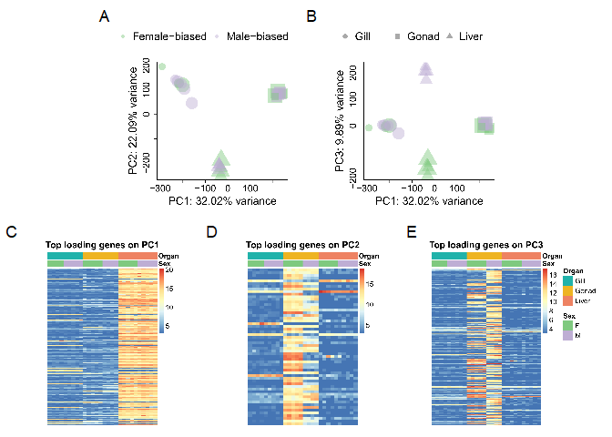
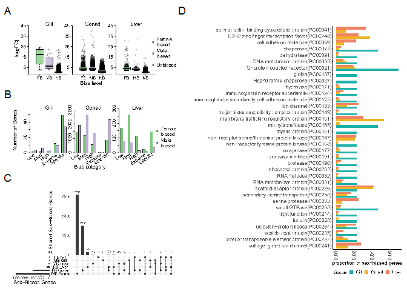

Differential Expression Analysis in *Syngnathus floridae*
================

- [Single factor analysis - Comparing Males v
  Females](#single-factor-analysis---comparing-males-v-females)
  - [Generating the PCA plots](#generating-the-pca-plots)
    - [Creating heatmaps based on the PCA
      axes](#creating-heatmaps-based-on-the-pca-axes)
    - [Making the combined figure](#making-the-combined-figure)
- [Multifactor design - Comparing M v F across the diff tissue
  types](#multifactor-design---comparing-m-v-f-across-the-diff-tissue-types)
  - [Invesitgate the results of the differential
    expression](#invesitgate-the-results-of-the-differential-expression)
    - [M-F Liver Comparisson](#m-f-liver-comparisson)
    - [M-F Gill Comparisson](#m-f-gill-comparisson)
    - [M-F Gonad Comparisson](#m-f-gonad-comparisson)
  - [Creating an Upset Plot](#creating-an-upset-plot)
  - [Variation in FC across sex-bias and tissue
    type](#variation-in-fc-across-sex-bias-and-tissue-type)
  - [Categorizing sex-specific genes](#categorizing-sex-specific-genes)
    - [Investigating the results of the sex-specific
      subsetting](#investigating-the-results-of-the-sex-specific-subsetting)
  - [Creating categories and binning the sex-biased genes based on
    degree of
    logFC](#creating-categories-and-binning-the-sex-biased-genes-based-on-degree-of-logfc)
  - [Gene Ontology Analysis](#gene-ontology-analysis)
    - [Using BLAST in command line](#using-blast-in-command-line)
    - [Blasting against the Zebrafish
      genome](#blasting-against-the-zebrafish-genome)
  - [Combination Figure Assembly](#combination-figure-assembly)

``` r
#The abundance matrix generated via salmon and tximport to be used for the DE analysis
txi.salmon <- readRDS("data/txi.salmon.floride.RDS")

#The samples file generated for tximport
samples <- read.table("FL_samples.txt", header = TRUE)

#Make sure the conditions are in the samples file as a factor
samples$Sex <- as.factor(samples$Sex)
samples$Organ <- as.factor(samples$Organ)

#Adding in Mating success and Rep fitness(total number of eggs transferred)
samples$mate_success <- c("1", "1", "3", "1", "2", "2", "1", "2", "0",
                          "1", "1", "3", "3", "1", "2", "2", "1", "2", "0",
                          "1", "1", "3", "3", "0",
                          "1", "1", "2", "1", "1")

samples$rep_fittness <- c(169, 88, 762, 285, 467, 500, 427, 156, 0, 
                          169, 88, 762, 916, 285, 467, 500, 427, 156, 0, 
                          169, 88, 762, 916, 0,
                          159, 285, 156, 372, 166)
```

In this document I am re-doing the analysis conducted in
“floridae_diff_expr_analysis.Rmd” but without sample FLT8M7. We are
unable to determine whether that individual was pregnant and therefore
want to remove it and see if there are any differences in the results
that we found. There will be less detail in this document as that is all
present in “floridae_diff_expr_analysis.Rmd”.

# Single factor analysis - Comparing Males v Females

``` r
#Create the DESeq dataset
dds_FL <- DESeqDataSetFromTximport(txi.salmon, 
                                   colData = samples,
                                   design = ~ Sex)

##Remove FLT8M7 from the dataset and sample sheet
dds_FL <- dds_FL[, dds_FL$ID != "FLT8M7"]
samples <- samples[samples$ID != "FLT8M7",]

#only keeping rows that have at lead 10 reads total
keep <- rowSums(counts(dds_FL)) >= 10 & rowSums(counts(dds_FL)) < 1e6
dds_FL <- dds_FL[keep, ]

#Generate the expression values
dds_FL_exp <- DESeq(dds_FL)

#Compile the results
res05 <- results(dds_FL_exp, alpha = 0.05)
summary(res05)
```

    ## 
    ## out of 163208 with nonzero total read count
    ## adjusted p-value < 0.05
    ## LFC > 0 (up)       : 2420, 1.5%
    ## LFC < 0 (down)     : 2438, 1.5%
    ## outliers [1]       : 0, 0%
    ## low counts [2]     : 105822, 65%
    ## (mean count < 2)
    ## [1] see 'cooksCutoff' argument of ?results
    ## [2] see 'independentFiltering' argument of ?results

``` r
sum(res05$padj < 0.05, na.rm = TRUE)
```

    ## [1] 4858

## Generating the PCA plots

``` r
#Generate the PCA dataframe
vsd <- vst(dds_FL_exp, blind=FALSE)
pca <- prcomp(t(assay(vsd)))
p <- pca(assay(vsd), 
         metadata = colData(dds_FL))
pca_plotting_data<-as.data.frame(pca$x)

#Add the metadata to the PCA dataset
pca_plotting_data$mate_success <- as.numeric(samples$mate_success)
pca_plotting_data$repo_fit <- samples$rep_fittness
pca_plotting_data$Organ <- samples$Organ
pca_plotting_data$Sex <- samples$Sex

#Calculate the percent variation attributed to each axis 
percentVar <- round(p$variance, digits = 2)

#Setting the shapes I want to show up for the different organs
organ_shapes <- c(Gill = 16, Liver = 17, Gonad = 15)

#Setting the colors I want for each sex
sex_cols <- c("F" = "#7fc97f", "M" = "#beaed4")
```

``` r
#Create the blank pdf to store the plot in
pdf("imgs/Fig_PCA1v2.pdf",height = 6,width=6)

#Set the plotting parameters
par(mar=c(4,5,4,1), oma=c(2,2,2,2))

#Create the plot for PC1 v PC2
plot(pca_plotting_data$PC1,
     pca_plotting_data$PC2,
     col = paste0(sex_cols[pca_plotting_data$Sex],"75"),
     pch = organ_shapes[pca_plotting_data$Organ],
     cex = pca_plotting_data$mate_success + 3,
     cex.lab = 2,
     cex.axis = 1.75,
     xlab = paste0("PC1: ",percentVar[1], "% variance"),
     ylab = paste0("PC2: ",percentVar[2], "% variance"),
     bty = 'l',
     xpd = TRUE)

#Add a legend describing the sex
outer_legend("top",
             c("Female-biased","Male-biased"),
             pch = 18,
             bty = 'n',
             col=paste0(sex_cols,"75"),
             cex = 2,
             ncol = 2,
             pt.cex = 2)


dev.off()
```

``` r
#Create the blank pdf to store the plot in
pdf("imgs/Fig_PCA1v3.pdf",height = 6,width=6)

#Set the plotting parameters
par(mar=c(4,5,4,1), oma=c(2,2,2,2))

#Create the plot for PC1 v PC3
plot(pca_plotting_data$PC1,
     pca_plotting_data$PC3,
     col = paste0(sex_cols[pca_plotting_data$Sex],"75"),
     pch = organ_shapes[pca_plotting_data$Organ],
     cex = pca_plotting_data$mate_success + 3,
     cex.lab = 2,
     cex.axis = 1.75,
     xlab = paste0("PC1: ",percentVar[1], "% variance"),
     ylab = paste0("PC3: ",percentVar[3], "% variance"),
     bty = 'l')

#Add  legend describing the organs
outer_legend("top",
             c("Gill","Gonad","Liver"),
             pch = c(16,15,17),
             bty = 'n',
             col = 'darkgrey',
             cex = 2,
             ncol = 3,
             pt.cex = 2)

dev.off()
```

### Creating heatmaps based on the PCA axes

``` r
df <- as.data.frame(samples[,c("Sex", "Organ")])
rownames(df) <- samples$ID
df$Organ <- as.character(df$Organ)

organ_cols<-c("Gill" = "#20B2AA",
              "Gonad" = "#EEB422", 
              "Liver" = "#EE8262")

ann_colors = list(Sex=sex_cols,
                  Organ=organ_cols)

col_order <- c(rownames(df[df$Sex=="F" & df$Organ=="Gill",]),
               rownames(df[df$Sex=="M" & df$Organ=="Gill",]),
               rownames(df[df$Sex=="F" & df$Organ=="Gonad",]),
               rownames(df[df$Sex=="M" & df$Organ=="Gonad",]),
               rownames(df[df$Sex=="F" & df$Organ=="Liver",]),
               rownames(df[df$Sex=="M" & df$Organ=="Liver",]))

pca_rotation <- pca$rotation[, 1:3]
```

``` r
#Function to use to export the heatmaps to pdfs
# from https://stackoverflow.com/questions/43051525/how-to-draw-pheatmap-plot-to-screen-and-also-save-to-file
save_pheatmap_pdf <- function(x, filename, width=7, height=7) {
  stopifnot(!missing(x))
  stopifnot(!missing(filename))
  pdf(filename, width=width, height=height)
  grid::grid.newpage()
  grid::grid.draw(x$gtable)
  dev.off()
}
```

``` r
pc1 <- pheatmap(assay(vsd)[which(abs(pca_rotation[,1]) >= 0.02), col_order], 
                cluster_rows = FALSE, 
                show_rownames = FALSE, 
                cluster_cols = FALSE, 
                show_colnames = FALSE,
                annotation_col = df,
                annotation_colors = ann_colors,
                cellwidth = 9,
                fontsize = 16,
                annotation_legend = FALSE,
                main = "Top loading genes on PC1")

save_pheatmap_pdf(pc1, "imgs/Fig_pc1_heatmap.pdf",
                  width=6,
                  height=6)
```

``` r
pc2 <- pheatmap(assay(vsd)[which(abs(pca_rotation[,2]) >= 0.02), col_order], 
                cluster_rows = FALSE, 
                show_rownames = FALSE, 
                cluster_cols = FALSE, 
                show_colnames = FALSE,
                annotation_col = df,
                annotation_colors=ann_colors,
                cellwidth = 9,
                fontsize = 16,
                annotation_legend = FALSE,
                border_color = NA,
                main = "Top loading genes on PC2")

save_pheatmap_pdf(pc2, "imgs/Fig_pc2_heatmap.pdf",
                  width=6,
                  height=6)
```

``` r
pc3 <- pheatmap(assay(vsd)[which(abs(pca_rotation[,3]) >= 0.02), col_order], 
                cluster_rows = FALSE, 
                show_rownames = FALSE, 
                cluster_cols = FALSE, 
                show_colnames = FALSE,
                annotation_col = df,
                annotation_colors=ann_colors,
                cellwidth = 9,
                fontsize = 16,
                border_color = NA,
                main = "Top loading genes on PC3")

save_pheatmap_pdf(pc3, "imgs/Fig_pc3_heatmap.pdf",
                  width=6,
                  height=6)
```

### Making the combined figure

``` r
figPCAa <- image_ggplot(image_read_pdf('imgs/Fig_PCA1v2.pdf'),
                        interpolate = TRUE)
figPCAb <- image_ggplot(image_read_pdf('imgs/Fig_PCA1v3.pdf'),
                        interpolate = TRUE)
figPCAc <- image_ggplot(image_read_pdf('imgs/Fig_pc1_heatmap.pdf'),
                        interpolate = TRUE)
figPCAd <- image_ggplot(image_read_pdf('imgs/Fig_pc2_heatmap.pdf'),
                        interpolate = TRUE)
figPCAe <- image_ggplot(image_read_pdf('imgs/Fig_pc3_heatmap.pdf'),
                        interpolate = TRUE)

# make two patchworks
pcas <- figPCAa + figPCAb
hms <- figPCAc + figPCAd + figPCAe

# put the patchworks together
figPCA <-  wrap_plots(pcas,
                      hms,
                      ncol=1) + 
  plot_annotation(tag_levels = 'A') 

ggsave("imgs/FigPCA.pdf", figPCA, height=4, width=5)
ggsave("imgs/FigPCA.png", figPCA, height=4, width=5) # also save as a png
```

``` r
figPCA
```

<!-- -->

# Multifactor design - Comparing M v F across the diff tissue types

``` r
##Create a copy of the DESeq dataset
ddsMF_FL <- dds_FL

#Create an additional column the has the two conditions combined(sex and organ type)
ddsMF_FL$group <- factor(paste0(samples$Sex, samples$Organ))

design(ddsMF_FL) <- ~ group

##Remove FLG4M4 from the dataset
ddsMF_FL <- ddsMF_FL[, ddsMF_FL$ID != "FLG4M4"]

##Filter the dataset, only keeping rows that have at least 10 reads total, but less than 1,000,000
keep <- rowSums(counts(ddsMF_FL)) >= 10 & rowSums(counts(ddsMF_FL)) < 1e6
ddsMF_FL <- ddsMF_FL[keep, ]

#Run the differential expression analysis
ddsMF_FL_exp <- DESeq(ddsMF_FL)
resultsNames(ddsMF_FL_exp)
```

    ## [1] "Intercept"             "group_FGonad_vs_FGill" "group_FLiver_vs_FGill"
    ## [4] "group_MGill_vs_FGill"  "group_MGonad_vs_FGill" "group_MLiver_vs_FGill"

## Invesitgate the results of the differential expression

### M-F Liver Comparisson

``` r
##Pulling out the liver M-F results with an alpha of 0.05
liver_con_res <- results(ddsMF_FL_exp, contrast = c("group", "MLiver", "FLiver"), 
                         alpha = 0.05)
liver_con_res$trin_geneid <- rownames(liver_con_res)
head(liver_con_res)
```

    ## log2 fold change (MLE): group MLiver vs FLiver 
    ## Wald test p-value: group MLiver vs FLiver 
    ## DataFrame with 6 rows and 7 columns
    ##                     baseMean log2FoldChange     lfcSE       stat    pvalue
    ##                    <numeric>      <numeric> <numeric>  <numeric> <numeric>
    ## TRINITY_DN0_c0_g1 1728.92535      0.2053589  0.209129  0.9819720 0.3261137
    ## TRINITY_DN0_c0_g2 2350.07145     -0.8761813  0.407696 -2.1491056 0.0316260
    ## TRINITY_DN0_c1_g1    8.69338      0.6559900  0.984683  0.6661939 0.5052872
    ## TRINITY_DN1_c0_g1 1263.12606     -0.2283173  0.157605 -1.4486661 0.1474308
    ## TRINITY_DN1_c0_g2  108.70931     -0.8121522  0.391436 -2.0748038 0.0380047
    ## TRINITY_DN1_c1_g1  577.28277     -0.0171069  0.237398 -0.0720601 0.9425541
    ##                        padj       trin_geneid
    ##                   <numeric>       <character>
    ## TRINITY_DN0_c0_g1  0.744457 TRINITY_DN0_c0_g1
    ## TRINITY_DN0_c0_g2  0.220903 TRINITY_DN0_c0_g2
    ## TRINITY_DN0_c1_g1        NA TRINITY_DN0_c1_g1
    ## TRINITY_DN1_c0_g1  0.512813 TRINITY_DN1_c0_g1
    ## TRINITY_DN1_c0_g2  0.244816 TRINITY_DN1_c0_g2
    ## TRINITY_DN1_c1_g1  1.000000 TRINITY_DN1_c1_g1

``` r
summary(liver_con_res)
```

    ## 
    ## out of 160318 with nonzero total read count
    ## adjusted p-value < 0.05
    ## LFC > 0 (up)       : 550, 0.34%
    ## LFC < 0 (down)     : 1242, 0.77%
    ## outliers [1]       : 3082, 1.9%
    ## low counts [2]     : 124731, 78%
    ## (mean count < 10)
    ## [1] see 'cooksCutoff' argument of ?results
    ## [2] see 'independentFiltering' argument of ?results

There are many criteria that have been employed previously to denote sex
bias. For this study we are classifying sex-biased genes as **genes with
a p-value \< 0.05 AND a logFC $\ge$ \|2\|**. With that criteria in the
liver there are 176 male-biased genes and 615 female-biased genes.

``` r
#Removing the rows where padj. is NA in results
liver_con_res_noNA <- liver_con_res[!is.na(liver_con_res$padj),]
summary(liver_con_res_noNA) #We can now see that there are no outliers or low counts since the NAs have been removed
```

    ## 
    ## out of 32505 with nonzero total read count
    ## adjusted p-value < 0.05
    ## LFC > 0 (up)       : 550, 1.7%
    ## LFC < 0 (down)     : 1242, 3.8%
    ## outliers [1]       : 0, 0%
    ## low counts [2]     : 0, 0%
    ## (mean count < 10)
    ## [1] see 'cooksCutoff' argument of ?results
    ## [2] see 'independentFiltering' argument of ?results

``` r
#Creating a vector that contains all of the male-biased and female-biased genes in the liver
liver_mal_biased <- liver_con_res_noNA[which(liver_con_res_noNA$log2FoldChange >= 2 & liver_con_res_noNA$padj <= 0.05),]
liver_fem_biased <- liver_con_res_noNA[which(liver_con_res_noNA$log2FoldChange <= -2 & liver_con_res_noNA$padj <= 0.05),]

#Creating an object that contains all of the non-biased genes in the liver
liver_non_biased <- liver_con_res_noNA[which(liver_con_res_noNA$padj > 0.05),]
```

### M-F Gill Comparisson

``` r
##Pulling out the gill M-F results
gill_con_res <- results(ddsMF_FL_exp, contrast = c("group", "MGill", "FGill"), alpha = 0.5)
gill_con_res$trin_geneid <- rownames(gill_con_res)
head(gill_con_res)
```

    ## log2 fold change (MLE): group MGill vs FGill 
    ## Wald test p-value: group MGill vs FGill 
    ## DataFrame with 6 rows and 7 columns
    ##                     baseMean log2FoldChange     lfcSE       stat    pvalue
    ##                    <numeric>      <numeric> <numeric>  <numeric> <numeric>
    ## TRINITY_DN0_c0_g1 1728.92535     -0.0774711  0.230794 -0.3356724  0.737118
    ## TRINITY_DN0_c0_g2 2350.07145     -0.0736525  0.450916 -0.1633397  0.870251
    ## TRINITY_DN0_c1_g1    8.69338      0.5114914  0.854935  0.5982808  0.549653
    ## TRINITY_DN1_c0_g1 1263.12606     -0.0170765  0.173560 -0.0983894  0.921623
    ## TRINITY_DN1_c0_g2  108.70931     -0.0824826  0.410145 -0.2011058  0.840616
    ## TRINITY_DN1_c1_g1  577.28277      0.1670693  0.250659  0.6665193  0.505079
    ##                        padj       trin_geneid
    ##                   <numeric>       <character>
    ## TRINITY_DN0_c0_g1         1 TRINITY_DN0_c0_g1
    ## TRINITY_DN0_c0_g2         1 TRINITY_DN0_c0_g2
    ## TRINITY_DN0_c1_g1         1 TRINITY_DN0_c1_g1
    ## TRINITY_DN1_c0_g1         1 TRINITY_DN1_c0_g1
    ## TRINITY_DN1_c0_g2         1 TRINITY_DN1_c0_g2
    ## TRINITY_DN1_c1_g1         1 TRINITY_DN1_c1_g1

``` r
summary(gill_con_res)
```

    ## 
    ## out of 160318 with nonzero total read count
    ## adjusted p-value < 0.5
    ## LFC > 0 (up)       : 79, 0.049%
    ## LFC < 0 (down)     : 73, 0.046%
    ## outliers [1]       : 3082, 1.9%
    ## low counts [2]     : 97697, 61%
    ## (mean count < 3)
    ## [1] see 'cooksCutoff' argument of ?results
    ## [2] see 'independentFiltering' argument of ?results

In the gills there were 24 genes that we can consider male-biased and 21
female-biased genes based on our criteria for sex-bias.

``` r
#Removing the rows where padj. is NA in results
gill_con_res_noNA <- gill_con_res[!is.na(gill_con_res$padj), ]
summary(gill_con_res_noNA) #We can now see that there are no outliers or low counts since the NAs have been removed
```

    ## 
    ## out of 59539 with nonzero total read count
    ## adjusted p-value < 0.5
    ## LFC > 0 (up)       : 79, 0.13%
    ## LFC < 0 (down)     : 73, 0.12%
    ## outliers [1]       : 0, 0%
    ## low counts [2]     : 0, 0%
    ## (mean count < 3)
    ## [1] see 'cooksCutoff' argument of ?results
    ## [2] see 'independentFiltering' argument of ?results

``` r
#Creating a vector that contains all of the male-biased and female-biased genes in the gills
gill_mal_biased <- gill_con_res_noNA[which(gill_con_res_noNA$log2FoldChange >= 2 & gill_con_res_noNA$padj <= 0.05),]
gill_fem_biased <- gill_con_res_noNA[which(gill_con_res_noNA$log2FoldChange <= -2 & gill_con_res_noNA$padj <= 0.05),]

#Creating an object that contains all of the non-biased genes in the gills, p>0.05
gill_non_biased <- gill_con_res_noNA[which(gill_con_res_noNA$padj > 0.05),]
```

### M-F Gonad Comparisson

``` r
##Pulling out the gonad M-F results
gonad_con_res <- results(ddsMF_FL_exp, contrast = c("group", "MGonad", "FGonad"), alpha = 0.05)
gonad_con_res$trin_geneid <- rownames(gonad_con_res)
head(gonad_con_res)
```

    ## log2 fold change (MLE): group MGonad vs FGonad 
    ## Wald test p-value: group MGonad vs FGonad 
    ## DataFrame with 6 rows and 7 columns
    ##                     baseMean log2FoldChange     lfcSE      stat      pvalue
    ##                    <numeric>      <numeric> <numeric> <numeric>   <numeric>
    ## TRINITY_DN0_c0_g1 1728.92535       0.723590  0.219519   3.29626 0.000979830
    ## TRINITY_DN0_c0_g2 2350.07145       1.115981  0.427360   2.61134 0.009018828
    ## TRINITY_DN0_c1_g1    8.69338       1.892514  0.855819   2.21135 0.027011748
    ## TRINITY_DN1_c0_g1 1263.12606      -0.368135  0.164979  -2.23141 0.025653771
    ## TRINITY_DN1_c0_g2  108.70931       0.506726  0.405836   1.24860 0.211812593
    ## TRINITY_DN1_c1_g1  577.28277      -0.825451  0.240370  -3.43409 0.000594551
    ##                         padj       trin_geneid
    ##                    <numeric>       <character>
    ## TRINITY_DN0_c0_g1 0.00742330 TRINITY_DN0_c0_g1
    ## TRINITY_DN0_c0_g2 0.04951817 TRINITY_DN0_c0_g2
    ## TRINITY_DN0_c1_g1 0.12033593 TRINITY_DN0_c1_g1
    ## TRINITY_DN1_c0_g1 0.11561847 TRINITY_DN1_c0_g1
    ## TRINITY_DN1_c0_g2 0.52306139 TRINITY_DN1_c0_g2
    ## TRINITY_DN1_c1_g1 0.00478886 TRINITY_DN1_c1_g1

``` r
summary(gonad_con_res)
```

    ## 
    ## out of 160318 with nonzero total read count
    ## adjusted p-value < 0.05
    ## LFC > 0 (up)       : 10759, 6.7%
    ## LFC < 0 (down)     : 7237, 4.5%
    ## outliers [1]       : 3082, 1.9%
    ## low counts [2]     : 58648, 37%
    ## (mean count < 1)
    ## [1] see 'cooksCutoff' argument of ?results
    ## [2] see 'independentFiltering' argument of ?results

Between the ovaries and testis (gonads) there were 7946 genes that we
can consider male-biased and 3954 female-biased genes based on our
criteria for sex-bias.

``` r
#Removing the rows where padj. is NA in results
gonad_con_res_noNA <- gonad_con_res[!is.na(gonad_con_res$padj), ]
summary(gonad_con_res_noNA) #We can now see that there are no outliers or low counts since the NAs have been removed
```

    ## 
    ## out of 98588 with nonzero total read count
    ## adjusted p-value < 0.05
    ## LFC > 0 (up)       : 10759, 11%
    ## LFC < 0 (down)     : 7237, 7.3%
    ## outliers [1]       : 0, 0%
    ## low counts [2]     : 0, 0%
    ## (mean count < 1)
    ## [1] see 'cooksCutoff' argument of ?results
    ## [2] see 'independentFiltering' argument of ?results

``` r
#Creating an object that contains all of the male-biased and female-biased genes in the gonads
gonad_mal_biased <- gonad_con_res_noNA[which(gonad_con_res_noNA$log2FoldChange >= 2 & gonad_con_res_noNA$padj <= 0.05),]
gonad_fem_biased <- gonad_con_res_noNA[which(gonad_con_res_noNA$log2FoldChange <= -2 & gonad_con_res_noNA$padj <= 0.05),]

#Creating an object that contains all of the non-biased genes in the gonads, p>0.05
gonad_non_biased <- gonad_con_res_noNA[which(gonad_con_res_noNA$padj > 0.05),]
```

## Creating an Upset Plot

``` r
#Checking there is no overlap between the two sexes
listInputall <- list("MB Gonad" = rownames(gonad_mal_biased),
                  "MB Gill"=rownames(gill_mal_biased), 
                  "MB Liver"=rownames(liver_mal_biased),
                  "FB Gonad" = rownames(gonad_fem_biased),
                  "FB Gill"=rownames(gill_fem_biased), 
                  "FB Liver"=rownames(liver_fem_biased))

pdf("imgs/Fig3C_sexbias_upset.pdf",
    width = 8, height=5)

upset(fromList(listInputall),
      mainbar.y.label = "# Shared Sex-Biased Genes",
      sets.x.label = "# Sex-Biased Genes",
      point.size = 3,
      nsets = 6,
      nintersects = NA,
      text.scale = c(2, 2, 2, 1.5, 2, 1.5))

dev.off()
```

## Variation in FC across sex-bias and tissue type

``` r
logFC_long <- data.frame(
  tissue=c(rep("Gill",nrow(gill_fem_biased)),
           rep("Gill", nrow(gill_mal_biased)),
           rep("Gill", nrow(gill_non_biased)),
           rep("Gonad", nrow(gonad_fem_biased)),
           rep("Gonad", nrow(gonad_mal_biased)),
           rep("Gonad", nrow(gonad_non_biased)),
           rep("Liver", nrow(liver_fem_biased)),
           rep("Liver", nrow(liver_mal_biased)),
           rep("Liver", nrow(liver_non_biased))
         ),
  bias=c(rep("FB",nrow(gill_fem_biased)),
         rep("MB",nrow(gill_mal_biased)),
         rep("NB", nrow(gill_non_biased)),
         rep("FB", nrow(gonad_fem_biased)),
         rep("MB", nrow(gonad_mal_biased)),
         rep("NB", nrow(gonad_non_biased)),
         rep("FB", nrow(liver_fem_biased)),
         rep("MB", nrow(liver_mal_biased)),
         rep("NB", nrow(liver_non_biased))
         ),
  logFC=c(gill_fem_biased$log2FoldChange,
          gill_mal_biased$log2FoldChange,
          gill_non_biased$log2FoldChange,
          gonad_fem_biased$log2FoldChange,
          gonad_mal_biased$log2FoldChange,
          gonad_non_biased$log2FoldChange,
          liver_fem_biased$log2FoldChange,
          liver_mal_biased$log2FoldChange,
          liver_non_biased$log2FoldChange
          ),
  geneID=c(rownames(gill_fem_biased),
           rownames(gill_mal_biased),
           rownames(gill_non_biased),
           rownames(gonad_fem_biased),
           rownames(gonad_mal_biased),
           rownames(gonad_non_biased),
           rownames(liver_fem_biased),
           rownames(liver_mal_biased),
           rownames(liver_non_biased)
           )
  
)
```

With the dataset in the proper format now, we can generate the plot

``` r
pdf("imgs/Fig3A_logFC_boxplots.pdf", width = 8, height= 3.5)

ymax <- max(abs(logFC_long$logFC),
            na.rm = TRUE) + 5
sex_bias_colors <- c("FB" = "#7fc97f", 
                     "MB" = "#beaed4", 
                     "UB" = "darkgray")
organs <- levels(as.factor(logFC_long$tissue))

par(mfrow=c(1,3), 
    oma=c(4,5,2,8), 
    mar=c(1,1,1,0))

for(organ in organs){
   
   # add jittered points
   plot(abs(logFC_long$logFC[logFC_long$tissue==organ]) ~ 
            jitter(as.numeric(as.factor(logFC_long$bias[logFC_long$tissue==organ]))),
        col="#00000075", 
        axes=FALSE,
        cex.main=2,
        xlim=c(0,4),
        ylim=c(0,ymax)
        )
   
   # make the boxplot
   boxplot(abs(logFC_long$logFC[logFC_long$tissue==organ]) ~  
             logFC_long$bias[logFC_long$tissue==organ],
           col=scales::alpha(sex_bias_colors,0.75),
           add = TRUE,
           yaxt='n',
           las=1,
           cex.axis=1.75,
           frame=FALSE,
           lwd=1.5,
           outline=FALSE# do not plot outliers
           )
   
   # make the axis lines longer and thicker
   axis(1, labels=NA,
        at=-1:4,
        lwd=2, 
        lwd.ticks=0, 
        las = 3, 
        cex.axis = 1.5)
   axis(2, labels=seq(-5,ymax,10),
        line=NA, 
        at=seq(-5,ymax,10), 
        lwd=2,
        ylim=c(0,ymax),
        cex.axis=2,
        las=2)
   
   mtext(organ, cex=1.5,outer=FALSE, line=-1)
   
}

# add x axis label
mtext("Bias level",side = 1,cex=1.5, outer=TRUE, line=2)

# add y axis label
mtext(expression("|log"[2]*"FC|"),side = 2,cex=1.5, outer=TRUE, line=2.25)

# add legend
spfTools::outer_legend("right",
                       legend=c("Female\nbiased",
                                "Male\nbiased",
                                "Unbiased"),
                       pt.bg=sex_bias_colors,
                       pch=22,
                       bty='n',
                       ncol=1,
                       cex=2,
                       y.intersp = 1.5,
                       pt.cex=2)

dev.off()
```

``` r
#Looking at some summary statistics for logFC between the different groups
tapply(abs(logFC_long$logFC), list(logFC_long$bias, logFC_long$tissue), mean)
```

    ##          Gill    Gonad    Liver
    ## FB 15.1639412 4.307787 4.666793
    ## MB  9.0296164 4.625456 3.844788
    ## NB  0.7755019 1.349332 0.586131

``` r
tapply(abs(logFC_long$logFC), list(logFC_long$bias, logFC_long$tissue), sd)
```

    ##        Gill    Gonad     Liver
    ## FB 8.128077 2.646644 3.5967761
    ## MB 6.454319 2.369209 3.1998706
    ## NB 1.011407 1.541600 0.7241402

``` r
model <- lm(abs(logFC_long$logFC)~ logFC_long$tissue * logFC_long$bias)
summary(model)
```

    ## 
    ## Call:
    ## lm(formula = abs(logFC_long$logFC) ~ logFC_long$tissue * logFC_long$bias)
    ## 
    ## Residuals:
    ##     Min      1Q  Median      3Q     Max 
    ## -12.621  -0.744  -0.354   0.419  35.489 
    ## 
    ## Coefficients:
    ##                                          Estimate Std. Error t value Pr(>|t|)
    ## (Intercept)                               15.1639     0.3026   50.12   <2e-16
    ## logFC_long$tissueGonad                   -10.8562     0.3034  -35.79   <2e-16
    ## logFC_long$tissueLiver                   -10.4971     0.3077  -34.12   <2e-16
    ## logFC_long$biasMB                         -6.1343     0.4143  -14.81   <2e-16
    ## logFC_long$biasNB                        -14.3884     0.3026  -47.55   <2e-16
    ## logFC_long$tissueGonad:logFC_long$biasMB   6.4520     0.4152   15.54   <2e-16
    ## logFC_long$tissueLiver:logFC_long$biasMB   5.3123     0.4309   12.33   <2e-16
    ## logFC_long$tissueGonad:logFC_long$biasNB  11.4300     0.3034   37.67   <2e-16
    ## logFC_long$tissueLiver:logFC_long$biasNB  10.3078     0.3078   33.48   <2e-16
    ##                                             
    ## (Intercept)                              ***
    ## logFC_long$tissueGonad                   ***
    ## logFC_long$tissueLiver                   ***
    ## logFC_long$biasMB                        ***
    ## logFC_long$biasNB                        ***
    ## logFC_long$tissueGonad:logFC_long$biasMB ***
    ## logFC_long$tissueLiver:logFC_long$biasMB ***
    ## logFC_long$tissueGonad:logFC_long$biasNB ***
    ## logFC_long$tissueLiver:logFC_long$biasNB ***
    ## ---
    ## Signif. codes:  0 '***' 0.001 '**' 0.01 '*' 0.05 '.' 0.1 ' ' 1
    ## 
    ## Residual standard error: 1.386 on 183523 degrees of freedom
    ## Multiple R-squared:  0.324,  Adjusted R-squared:  0.324 
    ## F-statistic: 1.1e+04 on 8 and 183523 DF,  p-value: < 2.2e-16

## Categorizing sex-specific genes

``` r
#Pulling out the geneIDs for genes that were categorized as "outliers" by DESeq2
#Calculating the Cooks threshold that would have been used
np <- length(resultsNames(ddsMF_FL_exp))
nsamp <- ncol(ddsMF_FL_exp)
cooks_thresh <- qf(0.99, df1 = np, df2 = 29-np)

out_ids <- names(mcols(ddsMF_FL_exp)$maxCooks[mcols(ddsMF_FL_exp)$maxCooks >
                                                cooks_thresh])

#Filtering out the dds dataset to remove the outliers determined by DESeq
ddsMF_FL_exp_filtered <- ddsMF_FL_exp[!(rownames(ddsMF_FL_exp) %in% out_ids), ]

#Create a vector with the different organ types
organs <- levels(colData(ddsMF_FL_exp_filtered)$Organ)

#Create an empty list to store my datasets in
FL_sex_specific_genes <- list()

#Generate the for loop to identify MSpecific and FSpecific genes in each 
#organ based on Medians
for(organ in organs){
  
  #Male-Specific Genes
  ##Pull out all of the rows where fem count <=10 in every female sample
  fem0_organ_names <- which(rowSums(t(apply(counts(ddsMF_FL_exp_filtered, 
                                                   normalized = TRUE)[, ddsMF_FL_exp_filtered$Sex == "F" 
                                                                      & 
                                                                        ddsMF_FL_exp_filtered$Organ == organ], 
                                            1, 
                                            function(x) x <= 10)
                                      )
                                ) == ncol(counts(ddsMF_FL_exp_filtered, 
                                                 normalized = TRUE)[, ddsMF_FL_exp_filtered$Sex == "F" &
                                                                      ddsMF_FL_exp_filtered$Organ == organ])
                      )
  
  fem0_organ <- counts(ddsMF_FL_exp_filtered, 
                       normalized = TRUE)[rownames(counts(ddsMF_FL_exp_filtered, 
                                                          normalized = TRUE)) %in% 
                                            names(fem0_organ_names), 
                                          ddsMF_FL_exp_filtered$Organ == organ]
                                                         
  
  ##Pull out rows where median of male count >=20 for that organ
  mal10_organ <- apply(counts(ddsMF_FL_exp_filtered, 
                              normalized = TRUE)[, ddsMF_FL_exp_filtered$Sex == "M" 
                                                 & ddsMF_FL_exp_filtered$Organ == organ], 
                       1,
                       function(x) median(x) >=20)
  
  ##Keep only the rows where all fem samples <=10 and the Male median>=20
  fem0_mal10_organ <- fem0_organ[rownames(fem0_organ) %in% 
                                   names(mal10_organ[mal10_organ == TRUE]),
                                 ]
  
  ##Create a new object with a name based on the organ type
  organ_malsp <- sub("$", "_male_specific", organ)
  FL_sex_specific_genes[[organ_malsp]] <- fem0_mal10_organ
  
  
  
  #Female-Specific Genes
  ##Pull out all of the rows where male count <=10 in every male sample
  mal0_organ_names <- which(rowSums(t(apply(counts(ddsMF_FL_exp_filtered, 
                                                   normalized = TRUE)[, ddsMF_FL_exp_filtered$Sex == "M" 
                                                                      & 
                                                                        ddsMF_FL_exp_filtered$Organ == organ],
                                            1, 
                                            function(x) x <= 10)
                                      )
                                    ) == ncol(counts(ddsMF_FL_exp_filtered, 
                                                     normalized = TRUE)[, ddsMF_FL_exp_filtered$Sex == "M" & 
                                                                          ddsMF_FL_exp_filtered$Organ == organ])
                            )
  
  mal0_organ <- counts(ddsMF_FL_exp_filtered, 
                       normalized = TRUE)[rownames(counts(ddsMF_FL_exp_filtered, 
                                                          normalized = TRUE)) %in% 
                                            names(mal0_organ_names), 
                                          ddsMF_FL_exp_filtered$Organ == organ]
  
  ##Pull out rows where median of female count >=10 for that organ
  fem10_organ <- apply(counts(ddsMF_FL_exp_filtered, 
                              normalized = TRUE)[, ddsMF_FL_exp_filtered$Sex == "F" &
                                                   ddsMF_FL_exp_filtered$Organ == organ],
                       1,
                       function(x) median(x) >=20)
  
  #Keep only the rows where male=0 and the fem median>=10
  mal0_fem10_organ <- mal0_organ[rownames(mal0_organ) %in% 
                                   names(fem10_organ[fem10_organ == TRUE]),
                                 ]
  
  # Create a new object with a name based on the organ type
  organ_femsp <- sub("$", "_female_specific", organ)
  FL_sex_specific_genes[[organ_femsp]] <- mal0_fem10_organ
  
} 
```

### Investigating the results of the sex-specific subsetting

## Creating categories and binning the sex-biased genes based on degree of logFC

``` r
#Make a vector that contains all of the groupings
biased_bins <- c("Unbiased", "Low", "Med", "High", "Extreme", "Sex-specific")

#Create a new column in the dataset and use ifelse statements to set the category limits
#abs(logFC) was used to account for the fem-biased genes possessing negative values
logFC_long$bias_cat <- ifelse(logFC_long$bias == "NB",
                              biased_bins[1],
                              ifelse(abs(logFC_long$logFC) >= 2 & abs(logFC_long$logFC) < 3,
                                     biased_bins[2],
                                     ifelse(abs(logFC_long$logFC) >= 3 & abs(logFC_long$logFC) < 5,
                                            biased_bins[3],
                                            ifelse(abs(logFC_long$logFC) >= 5 & abs(logFC_long$logFC) < 10,
                                                   biased_bins[4],
                                                   biased_bins[5])
                                            )
                                     )
                              )

#Making sure the genes we categorized as sex-specific are labeled as sex-specific for their 
#bias cat. in the dataset
organs <- c("Gill", "Gill", "Gonad", "Gonad", "Liver", "Liver")
bias <- c("MB", "FB", "MB", "FB", "MB", "FB")

for(i in 1:length(FL_sex_specific_genes)){

  tmp <- FL_sex_specific_genes[[i]]
  tmp <- as.data.frame(tmp)
  tmp$geneID <- rownames(tmp)
  
  for(j in 1:nrow(tmp)){
    
    one_gene <- tmp[j, ]
    
    if(one_gene[["geneID"]] %in%
       logFC_long[logFC_long$tissue == organs[[i]] &
                  logFC_long$bias == bias[[i]],"geneID"]){
       
      logFC_long[logFC_long$geneID == one_gene[["geneID"]] &
                   logFC_long$tissue == organs[[i]] &
                   logFC_long$bias == bias[[i]],
                 "bias_cat"] <- "Sex-specific"
    }else{
      
      one_gene_dat <- data.frame(matrix(ncol= ncol(logFC_long),
                                        nrow=1))
      colnames(one_gene_dat) <- colnames(logFC_long)
      
      one_gene_dat$tissue <- organs[[i]]
      one_gene_dat$geneID <- one_gene[["geneID"]]
      one_gene_dat$bias <- bias[[i]]
      one_gene_dat$bias_cat <- "Sex-specific"
      rownames(one_gene_dat) <- NULL
      
      logFC_long <- rbind(one_gene_dat, logFC_long)
      
      rownames(logFC_long) <- NULL
    }
  }
 }

#Create  subset of our long dataset that does not include the non-biased genes
logFC_long_noNB <- logFC_long[logFC_long$bias_cat != "Unbiased",]

#Make a table to count the number of genes in each category for each organ
bias_cat_table <- table(logFC_long_noNB$bias, logFC_long_noNB$bias_cat, logFC_long_noNB$tissue)

#Add the counts of sex-specific genes to the table
bias_cat_gill <- bias_cat_table[,, "Gill"]
bias_cat_gonad <- bias_cat_table[,, "Gonad"]
bias_cat_liver <- bias_cat_table[,, "Liver"]

#Plot the counts for each tissue type
pdf("imgs/Fig3B_biasCat_counts.pdf",width = 8, height=3.5)

ymax <- max(c(unlist(bias_cat_gill),
              unlist(bias_cat_gonad),
              unlist(bias_cat_liver))) + 500

labs <- c("Low", "Med", "High", "Extreme", "Specific")

par(mfrow=c(1, 3), 
    oma=c(6,4,2,8), mar=c(1,2.5,1,0), 
    cex.main=2,
    cex.axis=2)

# gills
bp <- barplot(bias_cat_gill[, biased_bins[2:6]], 
              beside = TRUE,
        xaxt='n',
        ylim = c(0, max(bias_cat_gill)+10), 
        col = sex_cols,
        main = "")
mtext("Gill",3,outer = FALSE,cex=1.5,line=-1)
axis(2,lwd=2)
text(cex=2, x=colMeans(bp), y=-2.5, labs, xpd=NA, srt=35, adj = 1)

# gonads
bp <- barplot(bias_cat_gonad[,biased_bins[2:6]], 
              beside = TRUE, 
              ylim = c(0, ymax), 
              xaxt = 'n',
              col = sex_cols,
              main = "",
              cex.main = 2,
              cex.axis = 2)

mtext("Gonad",
      3,
      outer = FALSE,
      cex=1.5,
      line=-1)

axis(2,lwd=2,labels = NA)
text(cex=2, x=colMeans(bp), y=-100, labs, xpd=NA, srt=35, adj=1)

# liver
barplot(bias_cat_liver[,biased_bins[2:6]], 
        beside = TRUE, 
        ylim = c(0, max(bias_cat_liver)+50), 
        xaxt='n',
        col = sex_cols,
        main = "",
        cex.main=2,
        cex.axis=2)

axis(2,lwd=2, labels = NA)
text(cex=2, x=colMeans(bp), y=-10, labs, xpd=NA, srt=35,adj=1)
mtext("Liver",3,outer = FALSE,cex=1.5,line=-1)

mtext("Number of Genes",2,outer=TRUE, cex=1.5, line=2.25)
mtext("Bias category",1, outer=TRUE, cex=1.5, line=4)

outer_legend("right", 
       legend = c("Female\nbiased", "Male\nbiased"), 
       pt.bg = sex_cols,
       pch=22,
       bty='n',
       ncol=1,
       cex=2,
       y.intersp = 1.5,
       pt.cex=2)

dev.off()
```

    ## png 
    ##   2

## Gene Ontology Analysis

### Using BLAST in command line

``` bash
#!/bin/bash

#Create the arguements
input_dir_TR=$1 #Location of the .txt files that contain the trinity gene IDs
subset_fasta=$2 #Path to the subset_fasta_file script
assembly_file=$3 #Name/location of the de novo assembly
blast_database=$4
output_dir=$5 #Desired output directory for .fasta and BLAST files

## Loop through all the Trinity gene ID .txt files
for file in $input_dir_TR/*TRgenes.txt
    do

    #Extract the sample name from the file name
    sample=$(basename $file .txt)

    #Get the corresponding sequences for the Trinity Gene IDs
    echo "Running subset_fasta_file for ${sample}..."
    $subset_fasta -c -f $assembly_file -l $input_dir_TR/${sample}.txt

    #Rename the automated output from the subset_fasta_file script
    fasta_out=$(basename $assembly_file fasta)
    mv $fasta_out.subset.fasta ${sample}.fasta

    #Blast the sequences
    echo "Running BLAST for ${sample}..."
    blastn -db $blast_database -query ${sample}.fasta -out ${sample}_blast.txt \
        -evalue 0.001 \
        -num_threads 12 \
        -outfmt "6 qseqid qstart qend stitle sstart send evalue bitscore length pident gaps"

    #Move the outputs into desired output directory
    mv ${sample}* $output_dir

done
```

### Blasting against the Zebrafish genome

A BLAST database was generated with the *D. reiro* proteome as:
`makeblastdb -in ../ncbi_dataset/data/GCF_000002035.6/protein.faa -out d_rerio_prot -dbtyp prot`

``` r
write.table(cbind(rownames(gill_fem_biased)),
            'FL_femG_biased_TRgenes.txt', 
            sep = "", 
            quote=FALSE, 
            row.names = FALSE, 
            col.names = FALSE)
write.table(cbind(rownames(gill_mal_biased)),
            'FL_malG_biased_TRgenes.txt', 
            sep = "", 
            quote=FALSE, 
            row.names = FALSE, 
            col.names = FALSE)
write.table(cbind(rownames(gonad_fem_biased)),
            'FL_femGon_biased_TRgenes.txt', 
            sep = "", 
            quote=FALSE, 
            row.names = FALSE, 
            col.names = FALSE)
write.table(cbind(rownames(gonad_mal_biased)),
            'FL_malGon_biased_TRgenes.txt', 
            sep = "", 
            quote=FALSE, 
            row.names = FALSE, 
            col.names = FALSE)
write.table(cbind(rownames(liver_fem_biased)),
            'FL_femL_biased_TRgenes.txt', 
            sep = "", 
            quote=FALSE, 
            row.names = FALSE, 
            col.names = FALSE)
write.table(cbind(rownames(liver_mal_biased)),
            'FL_malL_biased_TRgenes.txt', 
            sep = "", 
            quote=FALSE, 
            row.names = FALSE, 
            col.names = FALSE)
```

The `blast_pipeline.sh` script was then used.

``` r
#Specify the directory where BLAST results are located
blast_path <- "data/floridae_BLAST/"

#Create a list of the files I want
FL_blast_files <- list.files(blast_path, pattern = "_TRgenes")

#Create an empty list to store my datasets in
FL_blast_list <- list()

#Create a loop to read in all of the blast results
for(file_name in FL_blast_files){
  # Read the file and store it in a new object
  file_data <- read.delim(file.path(blast_path, file_name), stringsAsFactors = FALSE, quote = "", sep = "\t", header = FALSE)

  #Get rid of the columns we don't need
  file_data <- file_data[,c(1:4,8,10:16)]
  
  #Add column names to the dataset
  colnames(file_data) <- c("trin_geneid", "trin_gene_start", "trin_gene_end", "reiro_prot_info", "prot_id", "reiro_prot_start", "reiro_prot_end", "evalue", "bit_score", "length", "pident", "gaps")
  
  # Create a new object with a name based on the file name
  blast_name <- sub(".txt$", "", file_name) #Removes the file extension
  FL_blast_list[[blast_name]] <- file_data
}
```

``` r
#Use lapply to apply the function to each dataset stored in the list created above
blast_output_filtered <- lapply(FL_blast_list, function(data_frame){
 
  #Pull out the Unique Trinity gene IDs
  uniqueID <- unique(data_frame[1])
  
  #Create an empty dataframe to store intermediate results in
  output <- data.frame(matrix(data = NA, ncol = ncol(data_frame), nrow = 0))
  colnames(output) <- c("trin_geneid", "trin_gene_start", "trin_gene_end", "reiro_prot_info", "prot_id", "reiro_prot_start", "reiro_prot_end", "evalue", "bit_score", "length", "pident", "gaps")
  
  #Generate a for loop that pulls out the lowest e-value + highest % identity for each gene
  for(gene in uniqueID$trin_geneid){
    
    #Subset the dataset for each Trinity gene
    this_trin_gene<- subset(data_frame, trin_geneid==gene)
    #Pull out gene with smallest e-value
    uni_gene_subset_lowe <- this_trin_gene[which(this_trin_gene$evalue == min(this_trin_gene$evalue)),]
    #In case mult. genes have same e-value, pull out gene with highest % identity
    uni_gene_subset_lowe_highpid <- uni_gene_subset_lowe[which(uni_gene_subset_lowe$pident == max(uni_gene_subset_lowe$pident)),]
    
    # keep only one of multiple identical rows
    uni_gene_subset_lowe_highpid <- unique(uni_gene_subset_lowe_highpid)

    # check that there is a single gene ID in scovelli, if not, only first row is kept
    if(length(gsub("^.*(GeneID:\\d+)\\].*$","\\1",uni_gene_subset_lowe_highpid$reiro_prot_info))>1){
    #   browser()
    # } else{
      uni_gene_subset_lowe_highpid<-uni_gene_subset_lowe_highpid[1,]
    }
    
    #Add the final gene into the empty dataframe from above
    output <- rbind(output, uni_gene_subset_lowe_highpid)
  }
  
  return(output)
})
```

``` r
#Read in the GFF file for zebrafish that has info about the geneID
reiro_gff <- read.delim("data/d_reiro_genomic.gff",
                        header = FALSE,
                        comment.char = "#")

#Keep only the columns I want and rename them
reiro_gff <- reiro_gff[,c(1:5,9)]
colnames(reiro_gff) <- c("seqname", "source", "feature", "start", "end", "gene_info")

#Subset the dataset to only include the rows we're interested in
genes <- reiro_gff[reiro_gff$feature == "CDS",]

#Pull out the gene name that corresponds to each protein ID
genes$gene_name <- gsub("^(.*;)(gene=)(\\w+\\d*);(.*$)", "\\3", genes$gene_info)
genes$prot_id <- gsub("^(.*;)(protein_id=)(.*)$", "\\3", genes$gene_info)

#Merge the gene names pulled out above with the rest of the BLAST datasets based on the proteinID
blast_output_merged <- lapply(blast_output_filtered, function(dataframe){
  
   output <- merge(dataframe, unique(genes[,7:8]), by = "prot_id")
  
   return(output)
})
```

``` r
write.table(c(blast_output_merged$FL_femG_biased_TRgenes_blast$gene_name, blast_output_merged$FL_femGon_biased_TRgenes_blast$gene_name, blast_output_merged$FL_femL_biased_TRgenes_blast$gene_name, blast_output_merged$FL_malG_biased_TRgenes_blast$gene_name, blast_output_merged$FL_malGon_biased_TRgenes_blast$gene_name, blast_output_merged$FL_malL_biased_TRgenes_blast$gene_name),
           'FL_GOnames.txt', 
            sep = " ", 
            quote=FALSE, 
            row.names = FALSE, 
            col.names = FALSE)

write.table(rbind(blast_output_merged$FL_femG_biased_TRgenes_blast[,c("gene_name", "log2FoldChange")],
              blast_output_merged$FL_femGon_biased_TRgenes_blast[,c("gene_name", "log2FoldChange")],
              blast_output_merged$FL_femL_biased_TRgenes_blast[,c("gene_name", "log2FoldChange")],
              blast_output_merged$FL_malG_biased_TRgenes_blast[,c("gene_name", "log2FoldChange")],
              blast_output_merged$FL_malGon_biased_TRgenes_blast[,c("gene_name", "log2FoldChange")],
              blast_output_merged$FL_malL_biased_TRgenes_blast[,c("gene_name", "log2FoldChange")]),
            'FL_GOnames_FC.txt',
            sep = "\t",
            quote = FALSE,
            row.names = FALSE,
            col.names = FALSE)
```

``` r
panther <- read.delim("data/pantherGeneList.txt", header = FALSE)
colnames(panther) <- c("GeneID", "MappedID", "GeneName", "pantherFAM", 
                       "panther_prot_class", "species")

blast_output_merged$FL_femG_biased_TRgenes_blast <-
  merge(blast_output_merged$FL_femG_biased_TRgenes_blast, 
        panther[, c(2,5)], 
        by.x = "gene_name", 
        by.y = "MappedID", 
        all.x = TRUE)
blast_output_merged$FL_femGon_biased_TRgenes_blast <-
  merge(blast_output_merged$FL_femGon_biased_TRgenes_blast, 
        panther[, c(2,5)], 
        by.x = "gene_name", 
        by.y = "MappedID", 
        all.x = TRUE)
blast_output_merged$FL_femL_biased_TRgenes_blast <-
  merge(blast_output_merged$FL_femL_biased_TRgenes_blast, 
        panther[, c(2,5)], 
        by.x = "gene_name", 
        by.y = "MappedID", 
        all.x = TRUE)
blast_output_merged$FL_malG_biased_TRgenes_blast <-
  merge(blast_output_merged$FL_malG_biased_TRgenes_blast, 
        panther[, c(2,5)], 
        by.x = "gene_name", 
        by.y = "MappedID", 
        all.x = TRUE)
blast_output_merged$FL_malGon_biased_TRgenes_blast <-
  merge(blast_output_merged$FL_malGon_biased_TRgenes_blast, 
        panther[, c(2,5)], 
        by.x = "gene_name", 
        by.y = "MappedID", 
        all.x = TRUE)
blast_output_merged$FL_malL_biased_TRgenes_blast <-
  merge(blast_output_merged$FL_malL_biased_TRgenes_blast, 
        panther[, c(2,5)], 
        by.x = "gene_name", 
        by.y = "MappedID", 
        all.x = TRUE)
```

``` r
go_tabs <- lapply(blast_output_merged, function(dat){

  tab <- data.frame(table(dat$panther_prot_class) )
  tab$Var1 <- as.character(tab$Var1)
  tab$Var1[tab$Var1==""] <- "Unclassified"
  #tab$prop <- tab$Freq/sum(tab$Freq)

  return(tab)
  })


all_go_dat <- data.frame(matrix(ncol=4,nrow=0))
colnames(all_go_dat) <- c(
  colnames(go_tabs$FL_femG_biased_TRgenes_blast),
  "bias_cat", "tissue"
)
tissues <- c("Gill", "Gonad", "Liver", "Gill", "Gonad", "Liver")

for(i in 1:length(go_tabs)){
  tmp<-go_tabs[[i]]
  tmp$cat<-names(go_tabs)[i]
  tmp$tissue <- tissues[[i]]
  all_go_dat<-rbind(all_go_dat, tmp)
}

all_go_sums <- data.frame(matrix(ncol = 4,
                                 nrow = 0))
colnames(all_go_sums) <- c("Freq", "prot_class", "tissue", "prop")

for(organ in unique(all_go_dat$tissue)){
  
  tmp <- all_go_dat[all_go_dat$tissue == organ, ]
  go_sums <- as.data.frame(tapply(tmp$Freq, tmp$Var1, sum))
  go_sums$prot_class <- rownames(go_sums)
  colnames(go_sums)[1] <- "Freq"
  go_sums$tissue <- organ
  rownames(go_sums) <- NULL
  
  go_sums$prop <- go_sums$Freq/sum(go_sums$Freq)
  
  all_go_sums <- rbind(all_go_sums, go_sums)

}

all_go_sums$prot_class_final <- ifelse(all_go_sums$prop < 0.02,
                                       paste0("Other Protien Class"),
                                       paste0(all_go_sums$prot_class))

# make a barplot somehow
my_colors <- c("Gonad" = "#EEB422", "Liver" = "#EE8262", "Gill" = "#20B2AA")
ggplot(all_go_sums, 
       aes(prot_class, prop, fill = tissue)) +   
  geom_bar(position = "dodge", stat="identity") +
  scale_fill_manual(values = my_colors) +
  theme(panel.grid.major = element_blank(), 
        panel.grid.minor = element_blank(), 
        panel.background = element_blank(), 
        axis.line = element_line(colour = "black"),
        axis.text.x = element_text(angle = 90, vjust = 0.5, hjust=1))
```

## Combination Figure Assembly

``` r
fig3a <- image_ggplot(image_read_pdf('imgs/Fig3A_logFC_boxplots.pdf'),
                      interpolate = TRUE)
fig3b <- image_ggplot(image_read_pdf('imgs/Fig3B_biasCat_counts.pdf'),
                      interpolate = TRUE)
fig3c <- image_ggplot(image_read_pdf('imgs/Fig3C_sexbias_upset.pdf'),
                      interpolate = TRUE)
fig3d <- image_ggplot(image_read_pdf('imgs/Fig3D_GO_barplot.pdf'),
                      interpolate = TRUE)

design = "AD
          BD
          CD"

fig3 <- wrap_plots(fig3a,
                   fig3b,
                   fig3c,
                   fig3d,
                   design=design)

fig3 <- fig3 + plot_annotation(tag_levels = 'A')

ggsave("imgs/Fig3.pdf",fig3, height=6, width=8)
ggsave("imgs/Fig3.png",fig3, height=6, width=8)
```

``` r
fig3
```

<!-- -->
