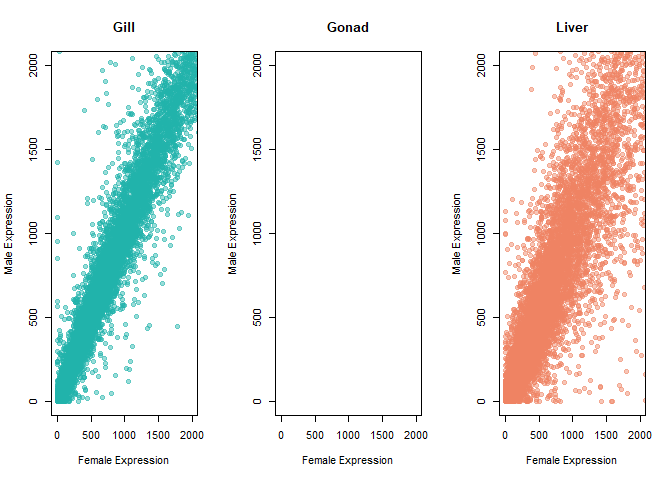

Tissue Specificity in *Syngnathus floridae*
================
Coley Tosto
2024-05-08


- <a href="#differential-expression-analysis"
  id="toc-differential-expression-analysis">Differential Expression
  Analysis</a>
- <a href="#calculating-tissue-specificity"
  id="toc-calculating-tissue-specificity">Calculating Tissue
  Specificity</a>
  - <a href="#pulling-out-tpm-values"
    id="toc-pulling-out-tpm-values">Pulling out TPM values</a>
  - <a href="#filtering-the-tpm-dataset"
    id="toc-filtering-the-tpm-dataset">Filtering the TPM dataset</a>
  - <a href="#generating-tau" id="toc-generating-tau">Generating <span
    class="math inline"><em>τ</em></span></a>
  - <a href="#validating-the-tau-calculations"
    id="toc-validating-the-tau-calculations">Validating the <span
    class="math inline"><em>τ</em></span> calculations</a>
- <a href="#sex-bias-and-tissue-specificity"
  id="toc-sex-bias-and-tissue-specificity">Sex Bias and Tissue
  Specificity</a>
  - <a href="#tau-and-logfc-in-sex-biased-genes-for-each-organ"
    id="toc-tau-and-logfc-in-sex-biased-genes-for-each-organ"><span
    class="math inline"><em>τ</em></span> and logFC in sex-biased genes for
    each organ</a>
  - <a
    href="#tau-and-logfc-for-all-the-signficantly-expressed-genes-in-each-organ"
    id="toc-tau-and-logfc-for-all-the-signficantly-expressed-genes-in-each-organ"><span
    class="math inline"><em>τ</em></span> and logFC for all the signficantly
    expressed genes in each organ</a>
  - <a href="#categories-of-sex-bias-vs-tau"
    id="toc-categories-of-sex-bias-vs-tau">Categories of sex bias vs <span
    class="math inline"><em>τ</em></span></a>
  - <a
    href="#exploring-the-relationship-between-tau-and-sex-bias-in-a-single-factor-analysis"
    id="toc-exploring-the-relationship-between-tau-and-sex-bias-in-a-single-factor-analysis">Exploring
    the relationship between <span class="math inline"><em>τ</em></span> and
    sex bias in a single-factor analysis</a>

``` r
#This is a cohesive list of all the libraries used in this document
library(DESeq2)
library(ggplot2)
library(EnvStats)
library(dplyr)
```

``` r
#The abundance matrix generated via salmon and tximport to be used for the DE analysis
txi.salmon <- readRDS("data/txi.salmon.floride.RDS")

#The samples file generated for tximport
samples <- read.table("FL_samples.txt", header = TRUE)

samples$group <- factor(paste0(samples$Sex, samples$Organ))

#Changing "Gonad" to be more specific to testis or ovaries
samples$Organ <- ifelse(samples$Sex == "F" & samples$Organ =="Gonad",
                        paste0("Ovaries"),
                        ifelse(samples$Sex == "M" & samples$Organ == "Gonad",
                               paste0("Testis"),
                               paste0(samples$Organ))
                        )

#Make sure the conditions are in the samples file as a factor
samples$Sex <- as.factor(samples$Sex)
samples$Organ <- as.factor(samples$Organ)

#Format colData to be used in the tau function
colData <- as.data.frame(samples)
rownames(colData) <- samples$ID

#Removing FLG4M4 from the metadata file
colData <- colData[colData$ID != "FLG4M4", ]
```

# Differential Expression Analysis

One of the goals for this analysis is to compare tissue specificity to
sex-biased gene expression. In order to do that I began the differential
expression analysis here using the package DESeq2. This was done using
the abundance matrix generated from salmon and the model was run as
counts \~ group, where group included both the sex and the organ type
(i.e. MLiver, FLiver, etc.).

Additionally, because $\tau$ is calculated based on expression levels, I
wanted to apply the same filtering used by DESeq2 for the sex-biased
expression analysis to the dataset that will be used to calculate
$\tau$.

``` r
#Create the DESeq dataset
dds_FL <- DESeqDataSetFromTximport(txi.salmon, 
                                   colData = samples,
                                   design = ~ group)
##Remove FLG4M4 from the dataset
dds_FL <- dds_FL[, dds_FL$ID != "FLG4M4"]

##Filter the dataset, only keeping rows that have at least 10 reads total, but less than 1,000,000
keep <- rowSums(counts(dds_FL)) >= 10 & rowSums(counts(dds_FL)) < 1e6
dds_FL <- dds_FL[keep, ]

#Generate the expression values
dds_FL_exp <- DESeq(dds_FL)
```

# Calculating Tissue Specificity

To estimate tissue specificity, the TPM estimates are needed which is
the number of transcripts from a particular gene normalized first by
gene length, and then by sequencing depth (in millions) in the sample.
The output quant.sf files from salmon have the following format:

    Name | Length | EffectiveLength | TPM | NumReads

## Pulling out TPM values

From the salmon outputs I pulled out the TPM values for each sample.

``` r
#Get the list of file names/paths for all of the quant.sf files
files <- list.files(pattern = ".sf", path = "data/floridae_expression_files", 
                    full.names = TRUE)

#For each quant.sf file pull out the TPM column
tpms <- do.call(cbind, lapply(files, function(file){

  dat <- read.delim(file, row.names = "Name")
  tpm <- dat["TPM"]
  colnames(tpm) <- gsub("data/floridae_expression_files/(.*)_quant.sf","\\1",file)
  
  return(tpm)
}))

#Remove FLG4M4 from the dataset
tpms <- tpms[, colnames(tpms) != "FLG4M4"]
```

## Filtering the TPM dataset

Once all the TPMs were gathered for the different samples I filtered
some of the rows out based on results of the differential expression
analysis done by DESeq2. The two filtering steps applied to the TPM
dataset included:

1.  Keeping only the rows that weren’t filtered out in the DESeq2
    dataset due to low counts (rowSum $\le$ 10) or really high
    expression (rowSum $>$ 1,000,000).

2.  Removing the rows that corresponded to genes that were “outliers” in
    the DESeq2 analysis.

It should be noted that the DESeq2 filtering was done based off of the
count data and not the TPMs, but as TPMs are just normalized counts they
should be correlated and something that was had low gene counts should
also have a low TPM and anything that was considered an outlier in the
counts could also be an outlier in terms of TPM, but it may not be
perfect. The sample FLG4M4 was also removed from this dataset the same
way it was removed in the differential expression analysis.

``` r
#Only keeping the rows that weren't filtered out due to low counts
tpms <- tpms[rownames(tpms) %in% rownames(dds_FL), ]

#Pulling out the geneIDs for genes that were categorized as "outliers" by DESeq2
#Calculating the Cooks threshold that would have been used
np <- length(resultsNames(dds_FL_exp))
nsamp <- ncol(dds_FL_exp)
cooks_thresh <- qf(0.99, df1 = np, df2 = 29-np)

out_ids <- names(mcols(dds_FL_exp)$maxCooks[mcols(dds_FL_exp)$maxCooks > cooks_thresh])

#Removing the rows in the tpm dataset that were deemed "outliers" by DESeq2
tpms <- tpms[!(rownames(tpms) %in% out_ids), ]
```

## Generating $\tau$

These filtered TPM estimates can then be used to estimate $\tau$, a
tissue specificity estimator that can range from 0 to 1. $\tau$ is
calculated for each tissue, $i$, as follows:

$$
\tau=\frac{\sum_i{[1-ln(TPM_i)/ln(TPM_{max})]}}{N-1}
$$

where $TPM_{max}$ is the maximum **average** TPM for a given tissue
type, and $TPM_i$ is the **average** TPM for tissue $i$. If $\tau = 0$,
that gene is evenly expressed across tissues; if $\tau=1$, the gene is
expressed in an entirely tissue-specific fashion. Because TPM values
approach 0 are impacted by sampling stochasticity, any genes that had an
expression approaching 0 were set to $TPM=2$.

``` r
#Function for estimating tau given the TPM matrix and metadata file
est_tau<-function(geneDat,colDat){
  
  #For each row in the TPM matrix cbind it with the metadata file,
  #this attaches organ type information to the TPM values
  tissue_dat<-data.frame(cbind(colDat,
                               geneDat))
  
  #For the TPM values approaching 0, set them to 2
  tissue_dat$geneDat[tissue_dat$geneDat < 1] <- 2
  
  
  #Get the average TPM for each tissue type (TPMi)
  tissue_avgs<-tapply(tissue_dat$geneDat,tissue_dat$Organ,mean)
  
  #Get the maximum value from the average TPMS (TPMmax)
  tpmMax <- max(tissue_avgs, na.rm=TRUE)
    
  #IF running tau on JUST males of JUST females, this accounts for the
  #fact that ovary or testis will return an NA in the averaging
  if(length(unique(tissue_dat$Organ)) == 3){
    tau <- sum(1-(log(tissue_avgs[unique(tissue_dat$Organ)])/log(tpmMax)))/
      (length(unique(tissue_dat$Organ))-1)
    
    return(tau)
  }
  
  #IF using the WHOLE dataset, calculate tau
  tau<-sum(1-(log(tissue_avgs)/log(tpmMax)))/(length(unique(tissue_dat$Organ))-1)
  
  return(tau)
}
```

I then applied that function across each row in the TPMs matrix with my
metadata stored in the object `colData`. The metadata file includes the
sample ID, Sex, and Organ type for every column present in the TPM
matrix.

I ran the $\tau$ function with the whole dataset, and then for just
males and just females.

``` r
tau <- apply(tpms, 1, est_tau, colDat=colData)


tau_fem<-apply(tpms[,which(colData$Sex=="F")], 1, est_tau,
               colData[which(colData$Sex=="F"),])

tau_mal<-apply(tpms[,which(colData$Sex=="M")], 1, est_tau,
               colData[which(colData$Sex=="M"),])
```


We can see that the distribution of $\tau$ doesn’t vary drastically when
looking at only male/female samples versus when we included all of the
samples in the calculation (Fig. @ref(fig:tauHist)). Because of this, I
can be confident in using the $\tau$ with all the samples moving
forward.

## Validating the $\tau$ calculations

To make sure $\tau$ is being calculated in a way that makes sense, I
checked some of the TPM values and plotted the counts for the genes with
a high tissue specificity index and a low tissue specificity index.

    ##                        FLG2F7   FLG3F1   FLG3F2   FLG3M5   FLG3M7   FLG3M8
    ## TRINITY_DN3390_c5_g1 1.915322 1.191699 1.374606 1.283282 0.648988 0.293973
    ##                        FLG4M3 FLG8F3 FLL2F7   FLL3F1   FLL3F2 FLL3F4   FLL3M5
    ## TRINITY_DN3390_c5_g1 0.086935      0      0 0.752944 0.166046      0 0.648803
    ##                      FLL3M7   FLL3M8  FLL4M3 FLL4M4 FLL8F3   FLO2F7   FLO3F1
    ## TRINITY_DN3390_c5_g1      0 0.167483 0.07965      0      0 1.339849 1.243675
    ##                        FLO3F2   FLO3F4   FLO8F3   FLT2M3 FLT3M5   FLT4M4
    ## TRINITY_DN3390_c5_g1 1.719132 1.212814 0.894546 797.6304 1766.4 5728.606
    ##                        FLT5M3   FLT8M7
    ## TRINITY_DN3390_c5_g1 9424.542 1389.621

    ##                        FLG2F7   FLG3F1   FLG3F2   FLG3M5   FLG3M7   FLG3M8
    ## TRINITY_DN168500_c0_g1      0 0.942199 1.553451 0.288835 1.454043 2.409941
    ##                        FLG4M3   FLG8F3   FLL2F7  FLL3F1   FLL3F2   FLL3F4
    ## TRINITY_DN168500_c0_g1      0 0.234851 7007.593 6960.66 8191.516 7611.868
    ##                         FLL3M5   FLL3M7  FLL3M8   FLL4M3   FLL4M4   FLL8F3
    ## TRINITY_DN168500_c0_g1 8648.97 10103.08 6255.89 10745.12 14742.49 16709.12
    ##                          FLO2F7 FLO3F1   FLO3F2   FLO3F4 FLO8F3 FLT2M3  FLT3M5
    ## TRINITY_DN168500_c0_g1 1.533473      0 1.228352 2.847534      0      0 1.11452
    ##                        FLT4M4   FLT5M3   FLT8M7
    ## TRINITY_DN168500_c0_g1      0 0.398892 0.356016

    ##                       FLG2F7 FLG3F1   FLG3F2 FLG3M5  FLG3M7   FLG3M8 FLG4M3
    ## TRINITY_DN2737_c10_g1      0      0 1.253771      0 2.89316 1.865081      0
    ##                       FLG8F3   FLL2F7   FLL3F1   FLL3F2   FLL3F4   FLL3M5
    ## TRINITY_DN2737_c10_g1      0 12006.16 17338.61 14526.94 17942.09 9629.504
    ##                         FLL3M7   FLL3M8   FLL4M3   FLL4M4   FLL8F3 FLO2F7
    ## TRINITY_DN2737_c10_g1 13219.28 15319.45 23167.47 9311.478 15759.04      0
    ##                       FLO3F1 FLO3F2 FLO3F4  FLO8F3 FLT2M3 FLT3M5 FLT4M4 FLT5M3
    ## TRINITY_DN2737_c10_g1      0 2.6697      0 0.59965      0      0      0      0
    ##                       FLT8M7
    ## TRINITY_DN2737_c10_g1      0

    ##                        FLG2F7 FLG3F1 FLG3F2 FLG3M5 FLG3M7 FLG3M8 FLG4M3 FLG8F3
    ## TRINITY_DN150289_c0_g1      0      0      0      0      0      0      0      0
    ##                        FLL2F7 FLL3F1 FLL3F2 FLL3F4 FLL3M5 FLL3M7 FLL3M8 FLL4M3
    ## TRINITY_DN150289_c0_g1      0      0      0      0      0      0      0      0
    ##                        FLL4M4 FLL8F3   FLO2F7   FLO3F1   FLO3F2   FLO3F4
    ## TRINITY_DN150289_c0_g1      0      0 14452.83 7087.196 7599.357 12631.54
    ##                          FLO8F3   FLT2M3   FLT3M5 FLT4M4 FLT5M3   FLT8M7
    ## TRINITY_DN150289_c0_g1 13082.83 0.286077 0.346457      0      0 0.569997

    ##                        FLG2F7   FLG3F1   FLG3F2   FLG3M5   FLG3M7   FLG3M8
    ## TRINITY_DN4118_c0_g1 1.018434 0.415196 0.393271 0.460824 0.396192 0.522953
    ##                        FLG4M3   FLG8F3   FLL2F7 FLL3F1 FLL3F2 FLL3F4   FLL3M5
    ## TRINITY_DN4118_c0_g1 0.117799 0.100116 0.258946      0      0      0 0.131037
    ##                        FLL3M7 FLL3M8 FLL4M3 FLL4M4 FLL8F3   FLO2F7   FLO3F1
    ## TRINITY_DN4118_c0_g1 0.050625      0      0      0      0 6575.653 5286.625
    ##                        FLO3F2   FLO3F4   FLO8F3   FLT2M3   FLT3M5   FLT4M4
    ## TRINITY_DN4118_c0_g1 3850.215 5341.746 5670.273 1.159471 0.067649 0.466054
    ##                        FLT5M3   FLT8M7
    ## TRINITY_DN4118_c0_g1 0.711823 0.607293

    ##                         FLG2F7   FLG3F1   FLG3F2   FLG3M5   FLG3M7   FLG3M8
    ## TRINITY_DN36626_c2_g1 0.137716 0.644405 0.577516 0.669314 0.803712 0.453008
    ##                         FLG4M3   FLG8F3   FLL2F7  FLL3F1   FLL3F2   FLL3F4
    ## TRINITY_DN36626_c2_g1 0.172313 0.401118 1984.034 2509.73 2386.297 2559.883
    ##                         FLL3M5  FLL3M7   FLL3M8   FLL4M3   FLL4M4   FLL8F3
    ## TRINITY_DN36626_c2_g1 1760.157 2389.69 2453.298 3844.468 2154.149 1960.861
    ##                         FLO2F7   FLO3F1   FLO3F2   FLO3F4   FLO8F3   FLT2M3
    ## TRINITY_DN36626_c2_g1 1.441514 0.976192 1.152931 0.475941 0.727857 2.329301
    ##                         FLT3M5   FLT4M4 FLT5M3   FLT8M7
    ## TRINITY_DN36626_c2_g1 1.460053 1.218899 0.5908 1.510612

    ##                          FLG2F7   FLG3F1   FLG3F2   FLG3M5   FLG3M7   FLG3M8
    ## TRINITY_DN120094_c0_g1 0.104644 0.912119 0.250095 0.858576 0.866683 0.098408
    ##                          FLG4M3   FLG8F3   FLL2F7   FLL3F1  FLL3F2   FLL3F4
    ## TRINITY_DN120094_c0_g1 0.442835 0.641357 4758.128 4710.713 3656.29 5127.604
    ##                          FLL3M5   FLL3M7   FLL3M8   FLL4M3   FLL4M4   FLL8F3
    ## TRINITY_DN120094_c0_g1 2005.663 4409.332 4541.134 6958.736 4633.907 4610.074
    ##                          FLO2F7   FLO3F1   FLO3F2   FLO3F4   FLO8F3   FLT2M3
    ## TRINITY_DN120094_c0_g1 0.116397 0.918267 0.134523 0.938311 1.723858 0.684805
    ##                          FLT3M5   FLT4M4 FLT5M3   FLT8M7
    ## TRINITY_DN120094_c0_g1 1.289851 0.805168      0 1.473786

    ##                         FLG2F7 FLG3F1 FLG3F2 FLG3M5 FLG3M7 FLG3M8 FLG4M3 FLG8F3
    ## TRINITY_DN35502_c0_g1 0.503082      0      0      0      0      0      0      0
    ##                       FLL2F7 FLL3F1 FLL3F2 FLL3F4 FLL3M5 FLL3M7 FLL3M8 FLL4M3
    ## TRINITY_DN35502_c0_g1      0      0      0      0      0      0      0      0
    ##                       FLL4M4 FLL8F3   FLO2F7   FLO3F1   FLO3F2   FLO3F4
    ## TRINITY_DN35502_c0_g1      0      0 2366.951 17668.14 4803.736 7009.854
    ##                         FLO8F3   FLT2M3  FLT3M5 FLT4M4 FLT5M3 FLT8M7
    ## TRINITY_DN35502_c0_g1 12002.31 1.909171 0.73005      0      0      0

    ##                       FLG2F7 FLG3F1 FLG3F2 FLG3M5 FLG3M7 FLG3M8 FLG4M3 FLG8F3
    ## TRINITY_DN68721_c1_g2      0      0      0      0      0 1.9217      0      0
    ##                         FLL2F7   FLL3F1   FLL3F2   FLL3F4  FLL3M5   FLL3M7
    ## TRINITY_DN68721_c1_g2 2411.674 1982.052 3128.004 10641.68 4595.93 9217.625
    ##                         FLL3M8 FLL4M3   FLL4M4   FLL8F3   FLO2F7 FLO3F1
    ## TRINITY_DN68721_c1_g2 12414.34 80.584 54.66033 10324.91 0.987047      0
    ##                         FLO3F2 FLO3F4 FLO8F3 FLT2M3 FLT3M5 FLT4M4 FLT5M3 FLT8M7
    ## TRINITY_DN68721_c1_g2 1.159376      0      0      0      0      0      0      0


    ##                       FLG2F7 FLG3F1   FLG3F2  FLG3M5 FLG3M7   FLG3M8   FLG4M3
    ## TRINITY_DN71486_c0_g1      0      0 0.085883 0.07018      0 0.131026 0.239628
    ##                       FLG8F3 FLL2F7  FLL3F1 FLL3F2 FLL3F4 FLL3M5 FLL3M7 FLL3M8
    ## TRINITY_DN71486_c0_g1      0      0 0.06596      0      0      0      0      0
    ##                       FLL4M3 FLL4M4 FLL8F3   FLO2F7   FLO3F1 FLO3F2 FLO3F4
    ## TRINITY_DN71486_c0_g1      0      0      0 0.149949 0.288523      0 0.2378
    ##                         FLO8F3  FLT2M3   FLT3M5   FLT4M4 FLT5M3 FLT8M7
    ## TRINITY_DN71486_c0_g1 0.337535 0.19314 0.110294 0.089569      0      0

    ##                         FLG2F7   FLG3F1   FLG3F2   FLG3M5   FLG3M7   FLG3M8
    ## TRINITY_DN71498_c0_g1 0.227275 0.366442 0.051798 0.217246 0.103738 0.160764
    ##                       FLG4M3 FLG8F3 FLL2F7  FLL3F1   FLL3F2   FLL3F4   FLL3M5
    ## TRINITY_DN71498_c0_g1      0      0      0 0.11999 0.102006 0.062511 0.162175
    ##                         FLL3M7   FLL3M8   FLL4M3   FLL4M4 FLL8F3   FLO2F7
    ## TRINITY_DN71498_c0_g1 0.022511 0.109007 0.157707 0.153899      0 0.324693
    ##                       FLO3F1   FLO3F2   FLO3F4   FLO8F3   FLT2M3 FLT3M5 FLT4M4
    ## TRINITY_DN71498_c0_g1      0 0.053428 0.352425 0.107476 0.109646      0      0
    ##                       FLT5M3   FLT8M7
    ## TRINITY_DN71498_c0_g1      0 0.577951

    ##                       FLG2F7 FLG3F1 FLG3F2   FLG3M5   FLG3M7   FLG3M8 FLG4M3
    ## TRINITY_DN71450_c0_g1      0      0      0 0.081205 0.100748 0.075079 0.3043
    ##                         FLG8F3 FLL2F7 FLL3F1 FLL3F2 FLL3F4 FLL3M5  FLL3M7
    ## TRINITY_DN71450_c0_g1 0.409171      0      0      0      0      0 0.30649
    ##                       FLL3M8 FLL4M3   FLL4M4 FLL8F3 FLO2F7 FLO3F1 FLO3F2 FLO3F4
    ## TRINITY_DN71450_c0_g1      0      0 0.098729      0      0      0      0      0
    ##                       FLO8F3 FLT2M3 FLT3M5 FLT4M4   FLT5M3 FLT8M7
    ## TRINITY_DN71450_c0_g1      0      0      0      0 0.234913      0

    ##                       FLG2F7 FLG3F1 FLG3F2 FLG3M5   FLG3M7 FLG3M8 FLG4M3
    ## TRINITY_DN71476_c0_g1      0      0      0      0 0.456774      0      0
    ##                         FLG8F3 FLL2F7 FLL3F1 FLL3F2 FLL3F4 FLL3M5 FLL3M7 FLL3M8
    ## TRINITY_DN71476_c0_g1 0.824832      0      0      0      0      0      0      0
    ##                       FLL4M3 FLL4M4 FLL8F3 FLO2F7 FLO3F1 FLO3F2 FLO3F4 FLO8F3
    ## TRINITY_DN71476_c0_g1      0      0      0      0      0      0      0      0
    ##                         FLT2M3 FLT3M5 FLT4M4 FLT5M3   FLT8M7
    ## TRINITY_DN71476_c0_g1 0.233391      0      0      0 0.682116

    ##                       FLG2F7   FLG3F1   FLG3F2 FLG3M5 FLG3M7 FLG3M8   FLG4M3
    ## TRINITY_DN71468_c0_g2      0 0.558011 0.380325      0      0      0 0.088076
    ##                       FLG8F3 FLL2F7   FLL3F1 FLL3F2   FLL3F4 FLL3M5 FLL3M7
    ## TRINITY_DN71468_c0_g2      0      0 0.196848 0.0405 0.190177      0      0
    ##                       FLL3M8 FLL4M3   FLL4M4   FLL8F3   FLO2F7 FLO3F1 FLO3F2
    ## TRINITY_DN71468_c0_g2      0      0 0.310894 0.126419 0.224238      0      0
    ##                       FLO3F4 FLO8F3 FLT2M3 FLT3M5 FLT4M4 FLT5M3 FLT8M7
    ## TRINITY_DN71468_c0_g2      0      0      0      0      0      0      0

    ##                       FLG2F7 FLG3F1 FLG3F2 FLG3M5 FLG3M7 FLG3M8 FLG4M3 FLG8F3
    ## TRINITY_DN71448_c0_g1      0      0      0      0      0      0      0      0
    ##                         FLL2F7 FLL3F1 FLL3F2   FLL3F4 FLL3M5 FLL3M7 FLL3M8
    ## TRINITY_DN71448_c0_g1 0.285036      0      0 0.141401      0      0      0
    ##                       FLL4M3 FLL4M4 FLL8F3   FLO2F7   FLO3F1   FLO3F2   FLO3F4
    ## TRINITY_DN71448_c0_g1      0      0      0 0.199517 0.297735 0.460893 0.080923
    ##                         FLO8F3 FLT2M3 FLT3M5 FLT4M4 FLT5M3 FLT8M7
    ## TRINITY_DN71448_c0_g1 0.112897      0      0      0      0      0

    ##                       FLG2F7 FLG3F1 FLG3F2   FLG3M5 FLG3M7   FLG3M8 FLG4M3
    ## TRINITY_DN71495_c0_g2      0      0      0 0.337037      0 0.628267      0
    ##                       FLG8F3 FLL2F7 FLL3F1 FLL3F2 FLL3F4 FLL3M5 FLL3M7 FLL3M8
    ## TRINITY_DN71495_c0_g2      0      0      0      0      0      0      0      0
    ##                       FLL4M3 FLL4M4 FLL8F3 FLO2F7 FLO3F1   FLO3F2 FLO3F4 FLO8F3
    ## TRINITY_DN71495_c0_g2      0      0      0      0      0 0.260933      0      0
    ##                         FLT2M3   FLT3M5 FLT4M4 FLT5M3 FLT8M7
    ## TRINITY_DN71495_c0_g2 0.202033 0.745426      0      0      0

    ##                         FLG2F7 FLG3F1  FLG3F2   FLG3M5 FLG3M7   FLG3M8   FLG4M3
    ## TRINITY_DN71464_c0_g1 0.045213      0 0.03757 0.031756      0 0.014828 0.026398
    ##                       FLG8F3 FLL2F7 FLL3F1   FLL3F2 FLL3F4 FLL3M5   FLL3M7
    ## TRINITY_DN71464_c0_g1      0      0      0 0.024403      0      0 0.016383
    ##                       FLL3M8   FLL4M3 FLL4M4 FLL8F3   FLO2F7 FLO3F1   FLO3F2
    ## TRINITY_DN71464_c0_g1      0 0.011668      0      0 0.251977 0.4145 0.274812
    ##                         FLO3F4   FLO8F3   FLT2M3   FLT3M5   FLT4M4   FLT5M3
    ## TRINITY_DN71464_c0_g1 0.815299 0.777864 0.056865 0.473958 0.037989 0.109468
    ##                         FLT8M7
    ## TRINITY_DN71464_c0_g1 0.345727

    ##                         FLG2F7 FLG3F1   FLG3F2   FLG3M5 FLG3M7 FLG3M8   FLG4M3
    ## TRINITY_DN25449_c0_g1 0.029503      0 0.145605 0.054048      0      0 0.076102
    ##                         FLG8F3 FLL2F7   FLL3F1 FLL3F2   FLL3F4 FLL3M5   FLL3M7
    ## TRINITY_DN25449_c0_g1 0.182235      0 0.028205      0 0.022048      0 0.072642
    ##                        FLL3M8 FLL4M3 FLL4M4   FLL8F3   FLO2F7   FLO3F1   FLO3F2
    ## TRINITY_DN25449_c0_g1 0.03036      0      0 0.024616 0.331299 0.065847 0.115036
    ##                         FLO3F4 FLO8F3   FLT2M3   FLT3M5   FLT4M4   FLT5M3
    ## TRINITY_DN25449_c0_g1 0.949184      0 0.037668 0.296338 0.074177 0.290882
    ##                         FLT8M7
    ## TRINITY_DN25449_c0_g1 0.174849


# Sex Bias and Tissue Specificity

From the DESeq2 analysis I started earlier I can pull out the FC
information for all of the sex biased genes and plot that against the
$\tau$ calculations.

## $\tau$ and logFC in sex-biased genes for each organ

A gene was determined to be sex-biased if it had a log-fold change
$\ge |2|$ AND an adjusted p-value of $< 0.05$. I first investigated the
relationship between $\tau$ and sex bias (fold-change) for only the
genes that were deemed as sex-biased.


The absolute value of the log2 fold change was square root transformed.
There appears to only be a relationship between sex bias and tissue
specificity in the gonads and not as much in the gills and the liver
(Fig. @ref(fig:tau-v-bias)). We can look further into this relationship
with a Spearman’s rank correlation test. This was done between $\tau$
and the $|log2FoldChange|$ for each organ separately.

    ## 
    ##  Spearman's rank correlation rho
    ## 
    ## data:  gonad_bias_tau$tau and abs(gonad_bias_tau$log2FoldChange)
    ## S = 3.0738e+11, p-value < 2.2e-16
    ## alternative hypothesis: true rho is not equal to 0
    ## sample estimates:
    ##       rho 
    ## 0.2084369

    ## 
    ##  Spearman's rank correlation rho
    ## 
    ## data:  liver_bias_tau$tau and abs(liver_bias_tau$log2FoldChange)
    ## S = 74095541, p-value = 6.3e-08
    ## alternative hypothesis: true rho is not equal to 0
    ## sample estimates:
    ##       rho 
    ## 0.1877606

    ## 
    ##  Spearman's rank correlation rho
    ## 
    ## data:  gill_bias_tau$tau and abs(gill_bias_tau$log2FoldChange)
    ## S = 30596, p-value = 0.2289
    ## alternative hypothesis: true rho is not equal to 0
    ## sample estimates:
    ##        rho 
    ## -0.1662283

Both the liver and the gonads show a significant correlation between sex
bias and tissue specificity with rho values similar to what has been
found in other studies. The lack of a correlation in the gills may be
due to the low samples size.

## $\tau$ and logFC for all the signficantly expressed genes in each organ

Only looking at the logFC for the sex-biased genes may be affecting the
relationship that I am seeing between sex bias and $\tau$, especially in
the gill where the samples size is very small if I am only including
sex-biased genes.

I used the same steps as above to see how the relationship changes when
I add in ALL of the genes that are significantly expressed for each
organ. In this datasets I have removed all rows where the adjusted
p-value is NA (outliers and low-counts).


The absolute value of the log2 fold change was square root transformed.
We can see similar patterns as when we only plotted the sex biased genes
(Fig. @ref(fig:tau-v-bias)) with the strongest relationship showing up
in the gonads. When we add in all of the points, however, it seems that
the best fit line for the gills now slightly points downward (Fig.
@ref(fig:tau-v-FC)). Let’s see how the Spearman’s rank correlation test
have changed. This was done between $\tau$ and the $|log2FoldChange|$
for each organ separately.

    ## 
    ##  Spearman's rank correlation rho
    ## 
    ## data:  gonad_bias_tau_all$tau and abs(gonad_bias_tau_all$log2FoldChange)
    ## S = 9.6572e+13, p-value < 2.2e-16
    ## alternative hypothesis: true rho is not equal to 0
    ## sample estimates:
    ##       rho 
    ## 0.1704059

    ## 
    ##  Spearman's rank correlation rho
    ## 
    ## data:  liver_bias_tau_all$tau and abs(liver_bias_tau_all$log2FoldChange)
    ## S = 5.827e+12, p-value < 2.2e-16
    ## alternative hypothesis: true rho is not equal to 0
    ## sample estimates:
    ##        rho 
    ## 0.05480711

    ## 
    ##  Spearman's rank correlation rho
    ## 
    ## data:  gill_bias_tau_all$tau and abs(gill_bias_tau_all$log2FoldChange)
    ## S = 2.5449e+13, p-value < 2.2e-16
    ## alternative hypothesis: true rho is not equal to 0
    ## sample estimates:
    ##         rho 
    ## -0.09459098

We can see the rho values going down for both the gonads and the liver,
but the correlations are still significant. We can also see that in the
gills we now have a significant negative correlation between sex bias
and $\tau$.

``` r
##Looking at genes that have a high bias and tau in the gonads
#Getting list of genes with the greatest Tau
top_gonad <- gonad_bias_tau_all[sqrt(abs(gonad_bias_tau_all$log2FoldChange)) > 4 & gonad_bias_tau_all$tau > 0.85, ]

#Looking at the TPMS
tpms[rownames(tpms)== top_gonad$Row.names[1],] #Testis-specific MB
tpms[rownames(tpms)== top_gonad$Row.names[2],] #Liver-specific FB
tpms[rownames(tpms)== top_gonad$Row.names[3],] #Testis-specific MB
tpms[rownames(tpms)== top_gonad$Row.names[4],] #Testis-specific MB
tpms[rownames(tpms)== top_gonad$Row.names[5],] #Ovary-specific FB
tpms[rownames(tpms)== top_gonad$Row.names[6],] #Testis-specific MB
tpms[rownames(tpms)== top_gonad$Row.names[7],] #Ovary-specific FB
tpms[rownames(tpms)== top_gonad$Row.names[8],] #Ovary-specific FB
tpms[rownames(tpms)== top_gonad$Row.names[9],] #Liver-specific FB
tpms[rownames(tpms)== top_gonad$Row.names[10],] #Testis-specific MB
tpms[rownames(tpms)== top_gonad$Row.names[11],] #Ovary-specific FB
tpms[rownames(tpms)== top_gonad$Row.names[12],] #Liver-specific FB

#Liver
top_liver <- liver_bias_tau_all[sqrt(abs(liver_bias_tau_all$log2FoldChange)) > 4 & liver_bias_tau_all$tau > 0.7, ]

#Looking at the TPMS
tpms[rownames(tpms)== top_liver$Row.names[1],] #Testis-specific MB

tpms[rownames(tpms)== top_liver$Row.names[2],] #Testis-specific FB??
tpms[rownames(tpms)== top_liver$Row.names[3],] #Liver-specific FB 

tpms[rownames(tpms)== top_liver$Row.names[4],] #Gill-specific FB

tpms[rownames(tpms)== top_liver$Row.names[5],] #Ovary-specific FB
tpms[rownames(tpms)== top_liver$Row.names[6],] #Gill-specific FB 
tpms[rownames(tpms)== top_liver$Row.names[7],] #Testis-specific FB?
tpms[rownames(tpms)== top_liver$Row.names[8],] #Gill-specific FB

tpms[rownames(tpms)== top_liver$Row.names[9],]

#GILLS
top_gills <- gill_bias_tau_all[sqrt(abs(gill_bias_tau_all$log2FoldChange)) > 4 & gill_bias_tau_all$tau > 0.75, ]

#Looking at the TPMS
tpms[rownames(tpms)== top_gills$Row.names[1],] #Liver-specific FB
tpms[rownames(tpms)== top_gills$Row.names[2],] #Testis-specific MB
tpms[rownames(tpms)== top_gills$Row.names[3],] #Liver-specific FB
tpms[rownames(tpms)== top_gills$Row.names[4],] #Testis-specific FB
tpms[rownames(tpms)== top_gills$Row.names[5],] #Gill-specific FB
tpms[rownames(tpms)== top_gills$Row.names[6],] #Ovary-specific FB
tpms[rownames(tpms)== top_gills$Row.names[7],] #Testis-specific FB
```

## Categories of sex bias vs $\tau$

To further investigate the relationship between $\tau$ and sex biased
and possibly get a cleaner idea of what may be going on I categorized
the sex biased genes based on a series of logFC thresholds. After that I
can plot $\tau$ against the bias level.


I want to see how $\tau$ in unbiased genes compares to these categories
as well. To do that I recreated the long-style dataset to include all of
the sig. expressed genes rather than just the sex-biased genes.

``` r
#Filtering out the dds dataset to remove the outliers determined by DESeq
dds_FL_exp_filtered <- dds_FL_exp[!(rownames(dds_FL_exp) %in% out_ids), ]

#Changing the organ from testis or ovaries back to gonad
dds_FL_exp_filtered$Organ <- ifelse(dds_FL_exp_filtered$Organ =="Ovaries",
                        paste0("Gonad"),
                        ifelse(dds_FL_exp_filtered$Organ == "Testis",
                               paste0("Gonad"),
                               paste0(dds_FL_exp_filtered$Organ))
                        )
dds_FL_exp_filtered$Organ <- as.factor(dds_FL_exp_filtered$Organ)

#Create a vector with the different organ types
organs <- levels(colData(dds_FL_exp_filtered)$Organ)

#Create an empty list to store my datasets in
FL_sex_specific_genes <- list()

#Generate the for loop to identify MSpecific and FSpecific genes in each organ based on Medians
for(organ in organs){
  
  #Male-Specific Genes
  ##Pull out all of the rows where fem count <=10 in every female sample
  fem0_organ_names <- which(rowSums(t(apply(counts(dds_FL_exp_filtered, 
                                                   normalized = TRUE)[, dds_FL_exp_filtered$Sex == "F" & 
                                                                        dds_FL_exp_filtered$Organ == organ],
                                            1,
                                            function(x) x <= 10)
                                      )
                                    ) == ncol(counts(dds_FL_exp_filtered,
                                                     normalized = TRUE)[, dds_FL_exp_filtered$Sex == "F" & 
                                                                          dds_FL_exp_filtered$Organ == organ])
                            )
  
  fem0_organ <- counts(dds_FL_exp_filtered, 
                       normalized = TRUE)[rownames(counts(dds_FL_exp_filtered,
                                                          normalized = TRUE)) %in% 
                                            names(fem0_organ_names), 
                                          dds_FL_exp_filtered$Organ == organ]
  
  ##Pull out rows where median of male count >=20 for that organ
  mal10_organ <- apply(counts(dds_FL_exp_filtered, 
                              normalized = TRUE)[, dds_FL_exp_filtered$Sex == "M" 
                                                 & dds_FL_exp_filtered$Organ == organ],
                       1,
                       function(x) median(x) >=20)
  
  ##Keep only the rows where all fem samples <=10 and the Male median>=20
  fem0_mal10_organ <- fem0_organ[rownames(fem0_organ) %in% 
                                   names(mal10_organ[mal10_organ == TRUE]),]
  
  ##Create a new object with a name based on the organ type
  organ_malsp <- sub("$", "_male_specific", organ)
  FL_sex_specific_genes[[organ_malsp]] <- fem0_mal10_organ
  
  
  
  #Female-Specific Genes
  ##Pull out all of the rows where male count <=10 in every male sample
  mal0_organ_names <- which(rowSums(t(apply(counts(dds_FL_exp_filtered, 
                                                   normalized = TRUE)[, dds_FL_exp_filtered$Sex == "M" & 
                                                                        dds_FL_exp_filtered$Organ == organ],
                                            1,
                                            function(x) x <= 10)
                                      )
                                    ) == ncol(counts(dds_FL_exp_filtered, 
                                                     normalized = TRUE)[, dds_FL_exp_filtered$Sex == "M" & 
                                                                          dds_FL_exp_filtered$Organ == organ])
                            )
  
  mal0_organ <- counts(dds_FL_exp_filtered, 
                       normalized = TRUE)[rownames(counts(dds_FL_exp_filtered, 
                                                          normalized = TRUE)) %in% 
                                            names(mal0_organ_names), 
                                          dds_FL_exp_filtered$Organ == organ]
  
  ##Pull out rows where median of female count >=10 for that organ
  fem10_organ <- apply(counts(dds_FL_exp_filtered, 
                              normalized = TRUE)[, dds_FL_exp_filtered$Sex == "F" &
                                                   dds_FL_exp_filtered$Organ == organ],
                       1,
                       function(x) median(x) >=20)
  
  #Keep only the rows where male=0 and the fem median>=10
  mal0_fem10_organ <- mal0_organ[rownames(mal0_organ) %in%
                                   names(fem10_organ[fem10_organ == TRUE]),]
  
  # Create a new object with a name based on the organ type
  organ_femsp <- sub("$", "_female_specific", organ)
  FL_sex_specific_genes[[organ_femsp]] <- mal0_fem10_organ
} 
```

``` r
#Looking at the relationship between male expression and female expression
my_colors <- c("Gonad" = "#EEB42275", "Liver" = "#EE826275", "Gill" = "#20B2AA75")
par(mfrow=c(1,3))
for (organ in organs) {
  
  tmp <- as.data.frame(counts(dds_FL_exp, normalized = TRUE)[, dds_FL_exp$Organ == organ])
  #tmp_M <- assay(dds_FL_filtered)[, dds_FL_filtered$Sex == "M" & dds_FL_filtered$Organ == organ]
  #tmp_F <- assay(dds_FL_filtered)[, dds_FL_filtered$Sex == "F" & dds_FL_filtered$Organ == organ]
  
  tmp$Fmedian <- apply(tmp[, grep("F\\d", colnames(tmp))], 1, median)
  tmp$Mmedian <- apply(tmp[, grep("M", colnames(tmp))], 1, median)
  
  plot(tmp$Fmedian, tmp$Mmedian,
       ylab = "Male Expression",
       xlab = "Female Expression",
       main = organ,
       col = my_colors[organ],
       pch = 19,
       ylim = c(0, 2000),
       xlim = c(0, 2000))
  
}
```

<!-- -->

``` r
#Changing the bias category for the genes we just labeled as sex-specific
organs <- c("Gill", "Gill", "Gonad", "Gonad", "Liver", "Liver")
bias <- c("MB", "FB", "MB", "FB", "MB", "FB")

for(i in 1:length(FL_sex_specific_genes)){#

  tmp <- FL_sex_specific_genes[[i]]
  tmp <- as.data.frame(tmp)
  tmp$geneID <- rownames(tmp)
  
  for(j in 1:nrow(tmp)){
    
    one_gene <- tmp[j, ]
    
    if(one_gene[["geneID"]] %in%
       logFC_long_all[logFC_long_all$tissue == organs[[i]] &
                      logFC_long_all$bias == bias[[i]],"geneID"]){
       
       logFC_long_all[logFC_long_all$geneID == one_gene[["geneID"]] &
                      logFC_long_all$tissue == organs[[i]] &
                      logFC_long_all$bias == bias[[i]],"bias_cat"
                      ] <- "Sex-specific"
    }else{
      
      one_gene_dat <- data.frame(matrix(ncol= ncol(logFC_long_all),
                                        nrow=1))
      colnames(one_gene_dat) <- colnames(logFC_long_all)
      
      one_gene_dat$tissue <- organs[[i]]
      one_gene_dat$geneID <- one_gene[["geneID"]]
      one_gene_dat$tau <- tau[names(tau) == one_gene[["geneID"]]]
      one_gene_dat$bias <- bias[[i]]
      one_gene_dat$bias_cat <- "Sex-specific"
      rownames(one_gene_dat) <- NULL
      
      logFC_long_all <- rbind(one_gene_dat, logFC_long_all)
      
      rownames(logFC_long_all) <- NULL
    }
  }
}

#Making sure the ordering stays correct
logFC_long_all$bias_cat <- factor(logFC_long_all$bias_cat,
    levels = biased_bins, ordered = TRUE)

logFC_long_all$tissue <- factor(logFC_long_all$tissue, levels = c("Gonad", "Liver", "Gill"), ordered = TRUE)

#write.csv(logFC_long_all, "data/logFC_long_taubias_SS.csv", row.names = FALSE)
```


    ## Warning: Groups with fewer than two data points have been dropped.


    ## Warning: Groups with fewer than two data points have been dropped.


## Exploring the relationship between $\tau$ and sex bias in a single-factor analysis

Other papers have looked at the relationship between $\tau$ and sex bias
across all tissue types together, without partitioning it out. To do
this we need to get $log_2$ male/female expression levels across ALL of
the tissues. I will be doing this by running a single-factor model with
DESeq2 so instead of counts \~ group it will be counts \~ Sex.

Once we have the results from the new DESeq2 model, $\tau$ can once
again be plotted against sex bias ($log_2$ fold change).


After plotting the relationship (Fig. @ref(fig:tau-v-FC-MFbias)) we can
once again look at the Spearman’s rank correlation.

    ## 
    ##  Spearman's rank correlation rho
    ## 
    ## data:  MFbias_tau_all$tau and abs(MFbias_tau_all$log2FoldChange)
    ## S = 3.2967e+13, p-value < 2.2e-16
    ## alternative hypothesis: true rho is not equal to 0
    ## sample estimates:
    ##       rho 
    ## 0.1286412

There is a significant correlation between $\tau$ and
abs(log2FoldChange). From the previous plots (Fig. @ref(fig:tau-v-FC)
and Fig. @ref(fig:tau-v-bias)) we can presume that this significant
correlation and rho is likely driven by the gonads.

To get a better idea of what is going on I first grouped each gene into
female-biased, male-biased, or unbiased based on the logFC and adjusted
p-value. After creating the groups I can plot $\tau$ against the
different biases.


The jitter points added on top represent the raw $\tau$ value. There is
a large spread of $\tau$ for all of the bias groups, but from looking at
the boxplot it does appear that the unbiased genes have lower $\tau$
than both the male-biased and the female-biased (Fig. @ref(fig:MF-long))
