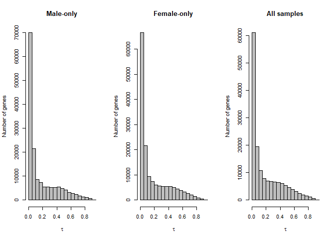
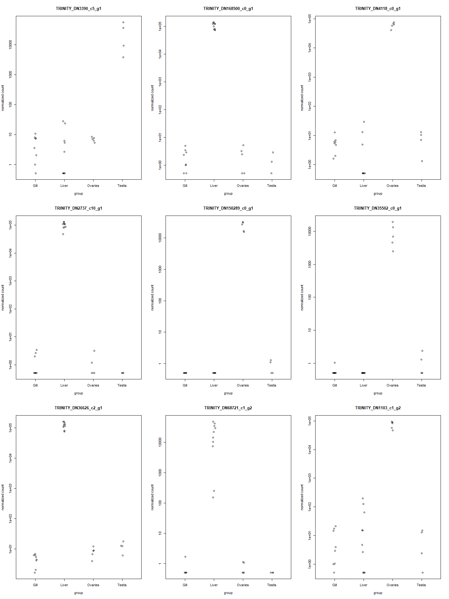
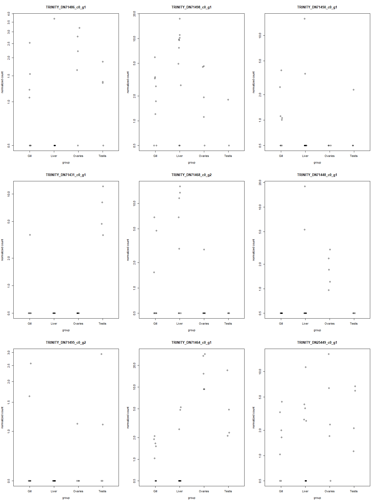
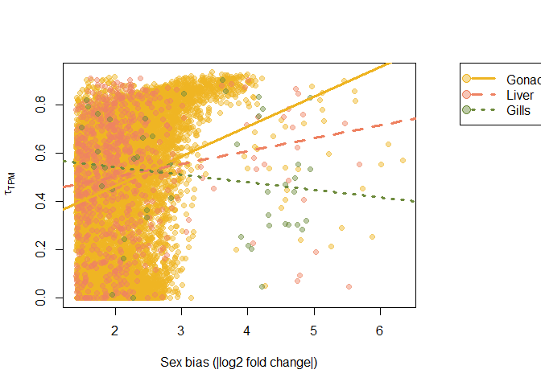
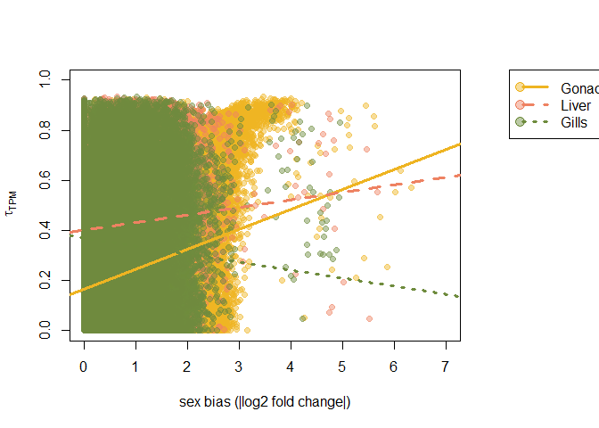
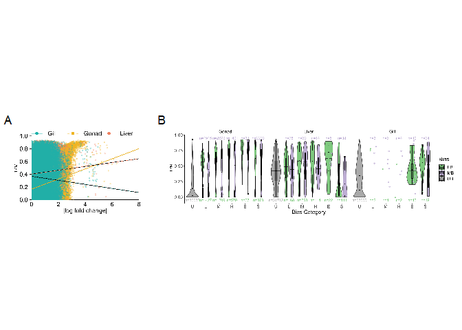

Tissue Specificity in *Syngnathus floridae*
================
Coley Tosto
2024-06-08


- [Differential Expression Analysis](#differential-expression-analysis)
- [Calculating Tissue Specificity](#calculating-tissue-specificity)
  - [Pulling out TPM values](#pulling-out-tpm-values)
  - [Filtering the TPM dataset](#filtering-the-tpm-dataset)
  - [Generating $\tau$](#generating-tau)
  - [Validating the $\tau$
    calculations](#validating-the-tau-calculations)
- [Sex Bias and Tissue Specificity](#sex-bias-and-tissue-specificity)
  - [$\tau$ and logFC in sex-biased genes for each
    organ](#tau-and-logfc-in-sex-biased-genes-for-each-organ)
  - [$\tau$ and logFC for all the signficantly expressed genes in each
    organ](#tau-and-logfc-for-all-the-signficantly-expressed-genes-in-each-organ)
  - [Categories of sex bias vs $\tau$](#categories-of-sex-bias-vs-tau)
  - [Generating the Figures](#generating-the-figures)
    - [Fig. 4 Assembly](#fig-4-assembly)

``` r
#This is a cohesive list of all the libraries used in this document
library(DESeq2)
library(ggplot2)
library(EnvStats)
library(dplyr)
library(spfTools)
library(magick)
library(patchwork)
library(tidyverse)
library(knitr)
```

``` r
#The abundance matrix generated via salmon and tximport to be used for the DE analysis
txi.salmon <- readRDS("data/txi.salmon.floride.RDS")

#The samples file generated for tximport
samples <- read.table("FL_samples.txt", header = TRUE)

samples$group <- factor(paste0(samples$Sex, samples$Organ))

#Changing "Gonad" to be more specific to testis or ovaries
samples$Organ <- ifelse(samples$Sex == "F" & samples$Organ =="Gonad",
                        paste0("Ovaries"),
                        ifelse(samples$Sex == "M" & samples$Organ == "Gonad",
                               paste0("Testis"),
                               paste0(samples$Organ))
                        )

#Make sure the conditions are in the samples file as a factor
samples$Sex <- as.factor(samples$Sex)
samples$Organ <- as.factor(samples$Organ)

#Format colData to be used in the tau function
colData <- as.data.frame(samples)
rownames(colData) <- samples$ID

#Removing FLG4M4 and FLT8M7 from the metadata file
colData <- colData[!(colData$ID %in% c("FLG4M4", "FLT8M7")), ]
```

In this document I am re-doing the analysis conducted in
“floridae_tissue_specificity.Rmd” but without sample FLT8M7. We are
unable to determine whether that individual was pregnant and therefore
want to remove it and see if there are any differences in the results
that we found. There will be less detail in this document as that is all
present in “floridae_tissue_specificity.Rmd”.

# Differential Expression Analysis

``` r
#Create the DESeq dataset
dds_FL <- DESeqDataSetFromTximport(txi.salmon, 
                                   colData = samples,
                                   design = ~ group)
##Remove FLG4M4 from the dataset
dds_FL <- dds_FL[, !(dds_FL$ID %in% c("FLT8M7", "FLG4M4"))]

##Filter the dataset, only keeping rows that have at least 10 reads total, but less than 1,000,000
keep <- rowSums(counts(dds_FL)) >= 10 & rowSums(counts(dds_FL)) < 1e6
dds_FL <- dds_FL[keep, ]

#Generate the expression values
dds_FL_exp <- DESeq(dds_FL)
```

# Calculating Tissue Specificity

## Pulling out TPM values

From the salmon outputs I pulled out the TPM values for each sample.

``` r
#Get the list of file names/paths for all of the quant.sf files
files <- list.files(pattern = ".sf", path = "data/floridae_expression_files", 
                    full.names = TRUE)

#For each quant.sf file pull out the TPM column
tpms <- do.call(cbind, lapply(files, function(file){

  dat <- read.delim(file, row.names = "Name")
  tpm <- dat["TPM"]
  colnames(tpm) <- gsub("data/floridae_expression_files/(.*)_quant.sf","\\1",file)
  
  return(tpm)
}))

#Remove FLG4M4 and FLT8M7 from the dataset
tpms <- tpms[, !(colnames(tpms) %in% c("FLG4M4", "FLT8M7"))]
```

## Filtering the TPM dataset

``` r
#Only keeping the rows that weren't filtered out due to low counts
tpms <- tpms[rownames(tpms) %in% rownames(dds_FL), ]

#Pulling out the geneIDs for genes that were categorized as "outliers" by DESeq2
#Calculating the Cooks threshold that would have been used
np <- length(resultsNames(dds_FL_exp))
nsamp <- ncol(dds_FL_exp)
cooks_thresh <- qf(0.99, df1 = np, df2 = 29-np)

out_ids <- names(mcols(dds_FL_exp)$maxCooks[mcols(dds_FL_exp)$maxCooks > cooks_thresh])

#Removing the rows in the tpm dataset that were deemed "outliers" by DESeq2
tpms <- tpms[!(rownames(tpms) %in% out_ids), ]
```

## Generating $\tau$

``` r
#Function for estimating tau given the TPM matrix and metadata file
est_tau<-function(geneDat,colDat){
  
  #For each row in the TPM matrix cbind it with the metadata file,
  #this attaches organ type information to the TPM values
  tissue_dat<-data.frame(cbind(colDat,
                               geneDat))
  
  #For the TPM values approaching 0, set them to 2
  tissue_dat$geneDat[tissue_dat$geneDat < 1] <- 2
  
  
  #Get the average TPM for each tissue type (TPMi)
  tissue_avgs<-tapply(tissue_dat$geneDat,tissue_dat$Organ,mean)
  
  #Get the maximum value from the average TPMS (TPMmax)
  tpmMax <- max(tissue_avgs, na.rm=TRUE)
    
  #IF running tau on JUST males of JUST females, this accounts for the
  #fact that ovary or testis will return an NA in the averaging
  if(length(unique(tissue_dat$Organ)) == 3){
    tau <- sum(1-(log(tissue_avgs[unique(tissue_dat$Organ)])/log(tpmMax)))/
      (length(unique(tissue_dat$Organ))-1)
    
    return(tau)
  }
  
  #IF using the WHOLE dataset, calculate tau
  tau<-sum(1-(log(tissue_avgs)/log(tpmMax)))/(length(unique(tissue_dat$Organ))-1)
  
  return(tau)
}
```

``` r
tau <- apply(tpms, 1, est_tau, colDat=colData)


tau_fem<-apply(tpms[,which(colData$Sex=="F")], 1, est_tau,
               colData[which(colData$Sex=="F"),])

tau_mal<-apply(tpms[,which(colData$Sex=="M")], 1, est_tau,
               colData[which(colData$Sex=="M"),])
```

<figure>

<figcaption aria-hidden="true">Distribution of tissue specificity
estimates for only the male samples (left) versus only the female
samples (middle) versus the male samples and the female samples
(right).</figcaption>
</figure>

## Validating the $\tau$ calculations

To make sure $\tau$ is being calculated in a way that makes sense, I
checked some of the TPM values and plotted the counts for the genes with
a high tissue specificity index and a low tissue specificity index.

    ##                        FLG2F7   FLG3F1   FLG3F2   FLG3M5   FLG3M7   FLG3M8
    ## TRINITY_DN3390_c5_g1 1.915322 1.191699 1.374606 1.283282 0.648988 0.293973
    ##                        FLG4M3 FLG8F3 FLL2F7   FLL3F1   FLL3F2 FLL3F4   FLL3M5
    ## TRINITY_DN3390_c5_g1 0.086935      0      0 0.752944 0.166046      0 0.648803
    ##                      FLL3M7   FLL3M8  FLL4M3 FLL4M4 FLL8F3   FLO2F7   FLO3F1
    ## TRINITY_DN3390_c5_g1      0 0.167483 0.07965      0      0 1.339849 1.243675
    ##                        FLO3F2   FLO3F4   FLO8F3   FLT2M3 FLT3M5   FLT4M4
    ## TRINITY_DN3390_c5_g1 1.719132 1.212814 0.894546 797.6304 1766.4 5728.606
    ##                        FLT5M3
    ## TRINITY_DN3390_c5_g1 9424.542

    ##                        FLG2F7   FLG3F1   FLG3F2   FLG3M5   FLG3M7   FLG3M8
    ## TRINITY_DN168500_c0_g1      0 0.942199 1.553451 0.288835 1.454043 2.409941
    ##                        FLG4M3   FLG8F3   FLL2F7  FLL3F1   FLL3F2   FLL3F4
    ## TRINITY_DN168500_c0_g1      0 0.234851 7007.593 6960.66 8191.516 7611.868
    ##                         FLL3M5   FLL3M7  FLL3M8   FLL4M3   FLL4M4   FLL8F3
    ## TRINITY_DN168500_c0_g1 8648.97 10103.08 6255.89 10745.12 14742.49 16709.12
    ##                          FLO2F7 FLO3F1   FLO3F2   FLO3F4 FLO8F3 FLT2M3  FLT3M5
    ## TRINITY_DN168500_c0_g1 1.533473      0 1.228352 2.847534      0      0 1.11452
    ##                        FLT4M4   FLT5M3
    ## TRINITY_DN168500_c0_g1      0 0.398892

    ##                        FLG2F7   FLG3F1   FLG3F2   FLG3M5   FLG3M7   FLG3M8
    ## TRINITY_DN4118_c0_g1 1.018434 0.415196 0.393271 0.460824 0.396192 0.522953
    ##                        FLG4M3   FLG8F3   FLL2F7 FLL3F1 FLL3F2 FLL3F4   FLL3M5
    ## TRINITY_DN4118_c0_g1 0.117799 0.100116 0.258946      0      0      0 0.131037
    ##                        FLL3M7 FLL3M8 FLL4M3 FLL4M4 FLL8F3   FLO2F7   FLO3F1
    ## TRINITY_DN4118_c0_g1 0.050625      0      0      0      0 6575.653 5286.625
    ##                        FLO3F2   FLO3F4   FLO8F3   FLT2M3   FLT3M5   FLT4M4
    ## TRINITY_DN4118_c0_g1 3850.215 5341.746 5670.273 1.159471 0.067649 0.466054
    ##                        FLT5M3
    ## TRINITY_DN4118_c0_g1 0.711823

    ##                       FLG2F7 FLG3F1   FLG3F2 FLG3M5  FLG3M7   FLG3M8 FLG4M3
    ## TRINITY_DN2737_c10_g1      0      0 1.253771      0 2.89316 1.865081      0
    ##                       FLG8F3   FLL2F7   FLL3F1   FLL3F2   FLL3F4   FLL3M5
    ## TRINITY_DN2737_c10_g1      0 12006.16 17338.61 14526.94 17942.09 9629.504
    ##                         FLL3M7   FLL3M8   FLL4M3   FLL4M4   FLL8F3 FLO2F7
    ## TRINITY_DN2737_c10_g1 13219.28 15319.45 23167.47 9311.478 15759.04      0
    ##                       FLO3F1 FLO3F2 FLO3F4  FLO8F3 FLT2M3 FLT3M5 FLT4M4 FLT5M3
    ## TRINITY_DN2737_c10_g1      0 2.6697      0 0.59965      0      0      0      0

    ##                        FLG2F7 FLG3F1 FLG3F2 FLG3M5 FLG3M7 FLG3M8 FLG4M3 FLG8F3
    ## TRINITY_DN150289_c0_g1      0      0      0      0      0      0      0      0
    ##                        FLL2F7 FLL3F1 FLL3F2 FLL3F4 FLL3M5 FLL3M7 FLL3M8 FLL4M3
    ## TRINITY_DN150289_c0_g1      0      0      0      0      0      0      0      0
    ##                        FLL4M4 FLL8F3   FLO2F7   FLO3F1   FLO3F2   FLO3F4
    ## TRINITY_DN150289_c0_g1      0      0 14452.83 7087.196 7599.357 12631.54
    ##                          FLO8F3   FLT2M3   FLT3M5 FLT4M4 FLT5M3
    ## TRINITY_DN150289_c0_g1 13082.83 0.286077 0.346457      0      0

    ##                         FLG2F7 FLG3F1 FLG3F2 FLG3M5 FLG3M7 FLG3M8 FLG4M3 FLG8F3
    ## TRINITY_DN35502_c0_g1 0.503082      0      0      0      0      0      0      0
    ##                       FLL2F7 FLL3F1 FLL3F2 FLL3F4 FLL3M5 FLL3M7 FLL3M8 FLL4M3
    ## TRINITY_DN35502_c0_g1      0      0      0      0      0      0      0      0
    ##                       FLL4M4 FLL8F3   FLO2F7   FLO3F1   FLO3F2   FLO3F4
    ## TRINITY_DN35502_c0_g1      0      0 2366.951 17668.14 4803.736 7009.854
    ##                         FLO8F3   FLT2M3  FLT3M5 FLT4M4 FLT5M3
    ## TRINITY_DN35502_c0_g1 12002.31 1.909171 0.73005      0      0

    ##                         FLG2F7   FLG3F1   FLG3F2   FLG3M5   FLG3M7   FLG3M8
    ## TRINITY_DN36626_c2_g1 0.137716 0.644405 0.577516 0.669314 0.803712 0.453008
    ##                         FLG4M3   FLG8F3   FLL2F7  FLL3F1   FLL3F2   FLL3F4
    ## TRINITY_DN36626_c2_g1 0.172313 0.401118 1984.034 2509.73 2386.297 2559.883
    ##                         FLL3M5  FLL3M7   FLL3M8   FLL4M3   FLL4M4   FLL8F3
    ## TRINITY_DN36626_c2_g1 1760.157 2389.69 2453.298 3844.468 2154.149 1960.861
    ##                         FLO2F7   FLO3F1   FLO3F2   FLO3F4   FLO8F3   FLT2M3
    ## TRINITY_DN36626_c2_g1 1.441514 0.976192 1.152931 0.475941 0.727857 2.329301
    ##                         FLT3M5   FLT4M4 FLT5M3
    ## TRINITY_DN36626_c2_g1 1.460053 1.218899 0.5908

    ##                       FLG2F7 FLG3F1 FLG3F2 FLG3M5 FLG3M7 FLG3M8 FLG4M3 FLG8F3
    ## TRINITY_DN68721_c1_g2      0      0      0      0      0 1.9217      0      0
    ##                         FLL2F7   FLL3F1   FLL3F2   FLL3F4  FLL3M5   FLL3M7
    ## TRINITY_DN68721_c1_g2 2411.674 1982.052 3128.004 10641.68 4595.93 9217.625
    ##                         FLL3M8 FLL4M3   FLL4M4   FLL8F3   FLO2F7 FLO3F1
    ## TRINITY_DN68721_c1_g2 12414.34 80.584 54.66033 10324.91 0.987047      0
    ##                         FLO3F2 FLO3F4 FLO8F3 FLT2M3 FLT3M5 FLT4M4 FLT5M3
    ## TRINITY_DN68721_c1_g2 1.159376      0      0      0      0      0      0

    ##                       FLG2F7 FLG3F1   FLG3F2   FLG3M5   FLG3M7   FLG3M8
    ## TRINITY_DN1103_c1_g2 0.86841      0 0.207824 1.245068 0.145896 1.042044
    ##                        FLG4M3   FLG8F3   FLL2F7 FLL3F1   FLL3F2 FLL3F4   FLL3M5
    ## TRINITY_DN1103_c1_g2 0.029062 0.030136 0.398639      0 0.160765      0 0.033093
    ##                        FLL3M7   FLL3M8 FLL4M3   FLL4M4   FLL8F3   FLO2F7
    ## TRINITY_DN1103_c1_g2 0.018066 1.205126      0 2.634966 0.196038 5310.622
    ##                        FLO3F1  FLO3F2   FLO3F4   FLO8F3   FLT2M3 FLT3M5  FLT4M4
    ## TRINITY_DN1103_c1_g2 2859.323 4014.06 6118.099 5768.096 0.116818      0 0.63992
    ##                        FLT5M3
    ## TRINITY_DN1103_c1_g2 0.797538

<figure>

<figcaption aria-hidden="true">Plots of the counts from the DESeq2
Dataset for genes with the highest tau</figcaption>
</figure>

    ##                       FLG2F7 FLG3F1   FLG3F2  FLG3M5 FLG3M7   FLG3M8   FLG4M3
    ## TRINITY_DN71486_c0_g1      0      0 0.085883 0.07018      0 0.131026 0.239628
    ##                       FLG8F3 FLL2F7  FLL3F1 FLL3F2 FLL3F4 FLL3M5 FLL3M7 FLL3M8
    ## TRINITY_DN71486_c0_g1      0      0 0.06596      0      0      0      0      0
    ##                       FLL4M3 FLL4M4 FLL8F3   FLO2F7   FLO3F1 FLO3F2 FLO3F4
    ## TRINITY_DN71486_c0_g1      0      0      0 0.149949 0.288523      0 0.2378
    ##                         FLO8F3  FLT2M3   FLT3M5   FLT4M4 FLT5M3
    ## TRINITY_DN71486_c0_g1 0.337535 0.19314 0.110294 0.089569      0

    ##                         FLG2F7   FLG3F1   FLG3F2   FLG3M5   FLG3M7   FLG3M8
    ## TRINITY_DN71498_c0_g1 0.227275 0.366442 0.051798 0.217246 0.103738 0.160764
    ##                       FLG4M3 FLG8F3 FLL2F7  FLL3F1   FLL3F2   FLL3F4   FLL3M5
    ## TRINITY_DN71498_c0_g1      0      0      0 0.11999 0.102006 0.062511 0.162175
    ##                         FLL3M7   FLL3M8   FLL4M3   FLL4M4 FLL8F3   FLO2F7
    ## TRINITY_DN71498_c0_g1 0.022511 0.109007 0.157707 0.153899      0 0.324693
    ##                       FLO3F1   FLO3F2   FLO3F4   FLO8F3   FLT2M3 FLT3M5 FLT4M4
    ## TRINITY_DN71498_c0_g1      0 0.053428 0.352425 0.107476 0.109646      0      0
    ##                       FLT5M3
    ## TRINITY_DN71498_c0_g1      0

    ##                       FLG2F7 FLG3F1 FLG3F2   FLG3M5   FLG3M7   FLG3M8 FLG4M3
    ## TRINITY_DN71450_c0_g1      0      0      0 0.081205 0.100748 0.075079 0.3043
    ##                         FLG8F3 FLL2F7 FLL3F1 FLL3F2 FLL3F4 FLL3M5  FLL3M7
    ## TRINITY_DN71450_c0_g1 0.409171      0      0      0      0      0 0.30649
    ##                       FLL3M8 FLL4M3   FLL4M4 FLL8F3 FLO2F7 FLO3F1 FLO3F2 FLO3F4
    ## TRINITY_DN71450_c0_g1      0      0 0.098729      0      0      0      0      0
    ##                       FLO8F3 FLT2M3 FLT3M5 FLT4M4   FLT5M3
    ## TRINITY_DN71450_c0_g1      0      0      0      0 0.234913

    ##                         FLG2F7 FLG3F1 FLG3F2 FLG3M5 FLG3M7 FLG3M8 FLG4M3 FLG8F3
    ## TRINITY_DN71431_c0_g1 0.289366      0      0      0      0      0      0      0
    ##                       FLL2F7 FLL3F1 FLL3F2 FLL3F4 FLL3M5 FLL3M7 FLL3M8 FLL4M3
    ## TRINITY_DN71431_c0_g1      0      0      0      0      0      0      0      0
    ##                       FLL4M4 FLL8F3 FLO2F7 FLO3F1 FLO3F2 FLO3F4 FLO8F3   FLT2M3
    ## TRINITY_DN71431_c0_g1      0      0      0      0      0      0      0 0.293297
    ##                         FLT3M5   FLT4M4   FLT5M3
    ## TRINITY_DN71431_c0_g1 0.651656 0.862791 0.303184

    ##                       FLG2F7   FLG3F1   FLG3F2 FLG3M5 FLG3M7 FLG3M8   FLG4M3
    ## TRINITY_DN71468_c0_g2      0 0.558011 0.380325      0      0      0 0.088076
    ##                       FLG8F3 FLL2F7   FLL3F1 FLL3F2   FLL3F4 FLL3M5 FLL3M7
    ## TRINITY_DN71468_c0_g2      0      0 0.196848 0.0405 0.190177      0      0
    ##                       FLL3M8 FLL4M3   FLL4M4   FLL8F3   FLO2F7 FLO3F1 FLO3F2
    ## TRINITY_DN71468_c0_g2      0      0 0.310894 0.126419 0.224238      0      0
    ##                       FLO3F4 FLO8F3 FLT2M3 FLT3M5 FLT4M4 FLT5M3
    ## TRINITY_DN71468_c0_g2      0      0      0      0      0      0

    ##                       FLG2F7 FLG3F1 FLG3F2 FLG3M5 FLG3M7 FLG3M8 FLG4M3 FLG8F3
    ## TRINITY_DN71448_c0_g1      0      0      0      0      0      0      0      0
    ##                         FLL2F7 FLL3F1 FLL3F2   FLL3F4 FLL3M5 FLL3M7 FLL3M8
    ## TRINITY_DN71448_c0_g1 0.285036      0      0 0.141401      0      0      0
    ##                       FLL4M3 FLL4M4 FLL8F3   FLO2F7   FLO3F1   FLO3F2   FLO3F4
    ## TRINITY_DN71448_c0_g1      0      0      0 0.199517 0.297735 0.460893 0.080923
    ##                         FLO8F3 FLT2M3 FLT3M5 FLT4M4 FLT5M3
    ## TRINITY_DN71448_c0_g1 0.112897      0      0      0      0

    ##                       FLG2F7 FLG3F1 FLG3F2   FLG3M5 FLG3M7   FLG3M8 FLG4M3
    ## TRINITY_DN71495_c0_g2      0      0      0 0.337037      0 0.628267      0
    ##                       FLG8F3 FLL2F7 FLL3F1 FLL3F2 FLL3F4 FLL3M5 FLL3M7 FLL3M8
    ## TRINITY_DN71495_c0_g2      0      0      0      0      0      0      0      0
    ##                       FLL4M3 FLL4M4 FLL8F3 FLO2F7 FLO3F1   FLO3F2 FLO3F4 FLO8F3
    ## TRINITY_DN71495_c0_g2      0      0      0      0      0 0.260933      0      0
    ##                         FLT2M3   FLT3M5 FLT4M4 FLT5M3
    ## TRINITY_DN71495_c0_g2 0.202033 0.745426      0      0

    ##                         FLG2F7 FLG3F1  FLG3F2   FLG3M5 FLG3M7   FLG3M8   FLG4M3
    ## TRINITY_DN71464_c0_g1 0.045213      0 0.03757 0.031756      0 0.014828 0.026398
    ##                       FLG8F3 FLL2F7 FLL3F1   FLL3F2 FLL3F4 FLL3M5   FLL3M7
    ## TRINITY_DN71464_c0_g1      0      0      0 0.024403      0      0 0.016383
    ##                       FLL3M8   FLL4M3 FLL4M4 FLL8F3   FLO2F7 FLO3F1   FLO3F2
    ## TRINITY_DN71464_c0_g1      0 0.011668      0      0 0.251977 0.4145 0.274812
    ##                         FLO3F4   FLO8F3   FLT2M3   FLT3M5   FLT4M4   FLT5M3
    ## TRINITY_DN71464_c0_g1 0.815299 0.777864 0.056865 0.473958 0.037989 0.109468

    ##                         FLG2F7 FLG3F1   FLG3F2   FLG3M5 FLG3M7 FLG3M8   FLG4M3
    ## TRINITY_DN25449_c0_g1 0.029503      0 0.145605 0.054048      0      0 0.076102
    ##                         FLG8F3 FLL2F7   FLL3F1 FLL3F2   FLL3F4 FLL3M5   FLL3M7
    ## TRINITY_DN25449_c0_g1 0.182235      0 0.028205      0 0.022048      0 0.072642
    ##                        FLL3M8 FLL4M3 FLL4M4   FLL8F3   FLO2F7   FLO3F1   FLO3F2
    ## TRINITY_DN25449_c0_g1 0.03036      0      0 0.024616 0.331299 0.065847 0.115036
    ##                         FLO3F4 FLO8F3   FLT2M3   FLT3M5   FLT4M4   FLT5M3
    ## TRINITY_DN25449_c0_g1 0.949184      0 0.037668 0.296338 0.074177 0.290882

<figure>

<figcaption aria-hidden="true">Plots of the counts from the DESeq2
Dataset for genes with the lowest tau</figcaption>
</figure>

# Sex Bias and Tissue Specificity

From the DESeq2 analysis I started earlier I can pull out the FC
information for all of the sex biased genes and plot that against the
$\tau$ calculations.

## $\tau$ and logFC in sex-biased genes for each organ

A gene was determined to be sex-biased if it had a log-fold change
$\ge |2|$ AND an adjusted p-value of $< 0.05$.

<figure>

<figcaption aria-hidden="true">Sex bias (in terms of the absolute value
of the log2FoldChange) versus tissue specificity (tau) for all genes
that are sex biased in the gonads, liver, and gills.</figcaption>
</figure>

    ## 
    ##  Spearman's rank correlation rho
    ## 
    ## data:  gonad_bias_tau$tau and abs(gonad_bias_tau$log2FoldChange)
    ## S = 2.1858e+11, p-value < 2.2e-16
    ## alternative hypothesis: true rho is not equal to 0
    ## sample estimates:
    ##       rho 
    ## 0.2215637

    ## 
    ##  Spearman's rank correlation rho
    ## 
    ## data:  liver_bias_tau$tau and abs(liver_bias_tau$log2FoldChange)
    ## S = 66592200, p-value = 1.31e-07
    ## alternative hypothesis: true rho is not equal to 0
    ## sample estimates:
    ##       rho 
    ## 0.1865248

    ## 
    ##  Spearman's rank correlation rho
    ## 
    ## data:  gill_bias_tau$tau and abs(gill_bias_tau$log2FoldChange)
    ## S = 25160, p-value = 0.1466
    ## alternative hypothesis: true rho is not equal to 0
    ## sample estimates:
    ##        rho 
    ## -0.2081633

## $\tau$ and logFC for all the signficantly expressed genes in each organ

<figure>

<figcaption aria-hidden="true">Sex bias (in terms of the absolute value
of the log2FoldChange) versus tissue specificity (tau) for all genes
that are signifcantly expressed in the gonads, liver, and
gills.</figcaption>
</figure>

The absolute value of the log2 fold change was square root transformed.
We can see similar patterns as when we only plotted the sex biased genes
(Fig. @ref(fig:tau-v-bias)) with the strongest relationship showing up
in the gonads. When we add in all of the points, however, it seems that
the best fit line for the gills now slightly points downward (Fig.
@ref(fig:tau-v-FC)). Let’s see how the Spearman’s rank correlation test
have changed. This was done between $\tau$ and the $|log2FoldChange|$
for each organ separately.

    ## 
    ##  Spearman's rank correlation rho
    ## 
    ## data:  gonad_bias_tau_all$tau and abs(gonad_bias_tau_all$log2FoldChange)
    ## S = 1.3202e+14, p-value < 2.2e-16
    ## alternative hypothesis: true rho is not equal to 0
    ## sample estimates:
    ##       rho 
    ## 0.1719288

    ## 
    ##  Spearman's rank correlation rho
    ## 
    ## data:  liver_bias_tau_all$tau and abs(liver_bias_tau_all$log2FoldChange)
    ## S = 5.387e+12, p-value < 2.2e-16
    ## alternative hypothesis: true rho is not equal to 0
    ## sample estimates:
    ##        rho 
    ## 0.05852255

    ## 
    ##  Spearman's rank correlation rho
    ## 
    ## data:  gill_bias_tau_all$tau and abs(gill_bias_tau_all$log2FoldChange)
    ## S = 2.8211e+13, p-value < 2.2e-16
    ## alternative hypothesis: true rho is not equal to 0
    ## sample estimates:
    ##        rho 
    ## -0.1022701

We can see the rho values going down for both the gonads and the liver,
but the correlations are still significant. We can also see that in the
gills we now have a significant negative correlation between sex bias
and $\tau$.

## Categories of sex bias vs $\tau$

``` r
#Filtering out the dds dataset to remove the outliers determined by DESeq
dds_FL_exp_filtered <- dds_FL_exp[!(rownames(dds_FL_exp) %in% out_ids), ]

#Changing the organ from testis or ovaries back to gonad
dds_FL_exp_filtered$Organ <- ifelse(dds_FL_exp_filtered$Organ =="Ovaries",
                        paste0("Gonad"),
                        ifelse(dds_FL_exp_filtered$Organ == "Testis",
                               paste0("Gonad"),
                               paste0(dds_FL_exp_filtered$Organ))
                        )
dds_FL_exp_filtered$Organ <- as.factor(dds_FL_exp_filtered$Organ)

#Create a vector with the different organ types
organs <- levels(colData(dds_FL_exp_filtered)$Organ)

#Create an empty list to store my datasets in
FL_sex_specific_genes <- list()

#Generate the for loop to identify MSpecific and FSpecific genes in each organ based on Medians
for(organ in organs){
  
  #Male-Specific Genes
  ##Pull out all of the rows where fem count <=10 in every female sample
  fem0_organ_names <- which(rowSums(t(apply(counts(dds_FL_exp_filtered, 
                                                   normalized = TRUE)[, dds_FL_exp_filtered$Sex == "F" & 
                                                                        dds_FL_exp_filtered$Organ == organ],
                                            1,
                                            function(x) x <= 10)
                                      )
                                    ) == ncol(counts(dds_FL_exp_filtered,
                                                     normalized = TRUE)[, dds_FL_exp_filtered$Sex == "F" & 
                                                                          dds_FL_exp_filtered$Organ == organ])
                            )
  
  fem0_organ <- counts(dds_FL_exp_filtered, 
                       normalized = TRUE)[rownames(counts(dds_FL_exp_filtered,
                                                          normalized = TRUE)) %in% 
                                            names(fem0_organ_names), 
                                          dds_FL_exp_filtered$Organ == organ]
  
  ##Pull out rows where median of male count >=20 for that organ
  mal10_organ <- apply(counts(dds_FL_exp_filtered, 
                              normalized = TRUE)[, dds_FL_exp_filtered$Sex == "M" 
                                                 & dds_FL_exp_filtered$Organ == organ],
                       1,
                       function(x) median(x) >=20)
  
  ##Keep only the rows where all fem samples <=10 and the Male median>=20
  fem0_mal10_organ <- fem0_organ[rownames(fem0_organ) %in% 
                                   names(mal10_organ[mal10_organ == TRUE]),]
  
  ##Create a new object with a name based on the organ type
  organ_malsp <- sub("$", "_male_specific", organ)
  FL_sex_specific_genes[[organ_malsp]] <- fem0_mal10_organ
  
  
  
  #Female-Specific Genes
  ##Pull out all of the rows where male count <=10 in every male sample
  mal0_organ_names <- which(rowSums(t(apply(counts(dds_FL_exp_filtered, 
                                                   normalized = TRUE)[, dds_FL_exp_filtered$Sex == "M" & 
                                                                        dds_FL_exp_filtered$Organ == organ],
                                            1,
                                            function(x) x <= 10)
                                      )
                                    ) == ncol(counts(dds_FL_exp_filtered, 
                                                     normalized = TRUE)[, dds_FL_exp_filtered$Sex == "M" & 
                                                                          dds_FL_exp_filtered$Organ == organ])
                            )
  
  mal0_organ <- counts(dds_FL_exp_filtered, 
                       normalized = TRUE)[rownames(counts(dds_FL_exp_filtered, 
                                                          normalized = TRUE)) %in% 
                                            names(mal0_organ_names), 
                                          dds_FL_exp_filtered$Organ == organ]
  
  ##Pull out rows where median of female count >=10 for that organ
  fem10_organ <- apply(counts(dds_FL_exp_filtered, 
                              normalized = TRUE)[, dds_FL_exp_filtered$Sex == "F" &
                                                   dds_FL_exp_filtered$Organ == organ],
                       1,
                       function(x) median(x) >=20)
  
  #Keep only the rows where male=0 and the fem median>=10
  mal0_fem10_organ <- mal0_organ[rownames(mal0_organ) %in%
                                   names(fem10_organ[fem10_organ == TRUE]),]
  
  # Create a new object with a name based on the organ type
  organ_femsp <- sub("$", "_female_specific", organ)
  FL_sex_specific_genes[[organ_femsp]] <- mal0_fem10_organ
} 
```

``` r
#Changing the bias category for the genes we just labeled as sex-specific
organs <- c("Gill", "Gill", "Gonad", "Gonad", "Liver", "Liver")
bias <- c("MB", "FB", "MB", "FB", "MB", "FB")

for(i in 1:length(FL_sex_specific_genes)){#

  tmp <- FL_sex_specific_genes[[i]]
  tmp <- as.data.frame(tmp)
  tmp$geneID <- rownames(tmp)
  
  for(j in 1:nrow(tmp)){
    
    one_gene <- tmp[j, ]
    
    if(one_gene[["geneID"]] %in%
       logFC_long_all[logFC_long_all$tissue == organs[[i]] &
                      logFC_long_all$bias == bias[[i]],"geneID"]){
       
       logFC_long_all[logFC_long_all$geneID == one_gene[["geneID"]] &
                      logFC_long_all$tissue == organs[[i]] &
                      logFC_long_all$bias == bias[[i]],"bias_cat"
                      ] <- "Sex-specific"
    }else{
      
      one_gene_dat <- data.frame(matrix(ncol= ncol(logFC_long_all),
                                        nrow=1))
      colnames(one_gene_dat) <- colnames(logFC_long_all)
      
      one_gene_dat$tissue <- organs[[i]]
      one_gene_dat$geneID <- one_gene[["geneID"]]
      one_gene_dat$tau <- tau[names(tau) == one_gene[["geneID"]]]
      one_gene_dat$bias <- bias[[i]]
      one_gene_dat$bias_cat <- "Sex-specific"
      rownames(one_gene_dat) <- NULL
      
      logFC_long_all <- rbind(one_gene_dat, logFC_long_all)
      
      rownames(logFC_long_all) <- NULL
    }
  }
}

#Making sure the ordering stays correct
logFC_long_all$bias_cat <- factor(logFC_long_all$bias_cat,
    levels = biased_bins, ordered = TRUE)

#write.csv(logFC_long_all, "data/logFC_long_taubias_SS.csv", row.names = FALSE)
```

## Generating the Figures

``` r
logFC_long_all$tissue <- factor(logFC_long_all$tissue, 
                                levels = c("Gonad", "Liver", "Gill"), 
                                ordered = TRUE)

organs <- levels(logFC_long_all$tissue)

organ_cols <- c("Gill" = "#20B2AA",
                "Gonad" = "#EEB422", 
                "Liver" = "#EE8262")

sex_bias_colors <- c("FB" = "#7fc97f", 
                     "MB" = "#beaed4", 
                     "UB" = "darkgray")


bias_labs <- c("U","L", "M", "H", "E", "S")
biased_bins <- c("Low", "Med", "High", "Extreme", "Sex-specific")
bias_bins <- c("Unbiased", biased_bins)
```

``` r
pdf("imgs/Fig4A_tau_sexbias_v2.pdf", width = 8, height=5)

#Set the graphical parameters
par(oma=c(2,2,1,2),
    mar=c(2,2,1,2),
    xpd=FALSE)

#Generate the base plot to be added on to
plot(logFC_long_all$tau[logFC_long_all$tissue=="Gonad"]~
       sqrt(abs(logFC_long_all$logFC[logFC_long_all$tissue=="Gonad"])),
     xlim=c(0,8),
     ylim=c(0,1),
     xlab="",
     ylab="",
     bty="n",
     type='n',
     axes=FALSE)

axis(1,pos=0,lwd=2,cex=2, cex.axis=2, las=1)
axis(2,pos=0,lwd=2,cex=2, cex.axis=2, las=1)
clip(0,8,0,1)

#Loop through the organs to add the points and best-fit line
for(organ in organs){
  
  points(logFC_long_all$tau[logFC_long_all$tissue==organ]~
           sqrt(abs(logFC_long_all$logFC[logFC_long_all$tissue==organ])),
         col = paste0(organ_cols[organ],"50"),
         pch = 19)

  }

for(organ in organs){
  
  abline(lm(logFC_long_all$tau[logFC_long_all$tissue==organ]~
              sqrt(abs(logFC_long_all$logFC[logFC_long_all$tissue==organ]))),
         col = "black",
         lwd = 3,
         lty = 1,
         xpd = FALSE)
  
  abline(lm(logFC_long_all$tau[logFC_long_all$tissue==organ]~
              sqrt(abs(logFC_long_all$logFC[logFC_long_all$tissue==organ]))),
         col = organ_cols[organ],
         lwd = 3,
         lty = which(organs %in% organ),
         xpd = FALSE)

  }

#Add a legend
outer_legend("top",
             names(organ_cols[order(names(organ_cols))]),
             col = organ_cols[order(names(organ_cols))],
             pch = 19,
             lwd = 3,
             bty = 'n',
             cex = 2,
             lty = 1:3,
             ncol = 3)

#Add the axes labels
mtext("|log fold change|",1,cex=2, line=2)
mtext(expression(tau["TPM"]),2,cex=2, line=2.5)

dev.off()
```

``` r
pdf("imgs/Fig4B_tau_biascat_violin_jitter2.pdf", width = 12, height=3.75)

# Preprocessing to create a new variable indicating sample size greater than 10
logFC_long_all <- logFC_long_all %>%
  group_by(bias_cat, tissue, bias) %>%
  mutate(sample_size = n()) %>%
  ungroup() %>%
  mutate(plot_type = ifelse(sample_size > 10, "box_violin", "jitter"))

# Plotting
ggplot(logFC_long_all, aes(x = bias_cat, y = tau, fill = bias)) +
  geom_violin(data = filter(logFC_long_all, plot_type == "box_violin"), 
              position = position_dodge(), draw_quantiles = c(0.5)) +
  geom_boxplot(data = filter(logFC_long_all, plot_type == "box_violin"), 
               width = 0.1, color = "black", position = position_dodge(width = 0.9)) +
  geom_point(data = filter(logFC_long_all[logFC_long_all$bias == "MB",],
                           plot_type == "jitter"),
             aes(x = as.numeric(bias_cat) + 0.185, y = tau),
             size=1.5, 
             position = position_jitter(width = 0.10),
             bg=paste0(sex_bias_colors["MB"],"75"),
             col=sex_bias_colors["MB"], pch = 21) +
  geom_point(data = filter(logFC_long_all[logFC_long_all$bias == "FB",],
                           plot_type == "jitter"), 
             aes(x=as.numeric(bias_cat)-0.185, y=tau),
             size=1.5, 
             position = position_jitter(width = 0.10),
             bg=paste0(sex_bias_colors["FB"], "75"),
             col=sex_bias_colors["FB"],pch=21) +
  scale_x_discrete(labels= bias_labs) +
  scale_fill_manual(values = sex_bias_colors) +
  facet_grid(. ~ tissue) +
  theme(panel.grid.major = element_blank(), 
        panel.grid.minor = element_blank(), 
        panel.background = element_blank(), 
        strip.background = element_blank(),
        axis.line = element_line(colour = "black"),
        text=element_text(size=16)) +
  labs(x = "Bias Category", y = expression(tau["TPM"]))  +
  guides(fill = guide_legend(title = "Bias", order = 3)) +
  guides(color = guide_legend(title = "Bias", order = 3)) +
  stat_n_text(data = logFC_long_all[logFC_long_all$bias == "FB",], 
              aes(x = bias_cat, y = tau),
              y.pos = -0.05,
              color = sex_bias_colors["FB"]
  ) +
  stat_n_text(data = logFC_long_all[logFC_long_all$bias == "MB",], 
              aes(x = bias_cat, y = tau),
              y.pos = 0.95,
              color = sex_bias_colors["MB"]
  ) +
  stat_n_text(data = logFC_long_all[logFC_long_all$bias == "UB",], 
              aes(x = bias_cat, y = tau),
              y.pos = -0.05,
              color = sex_bias_colors["UB"]
  )

dev.off()
```

### Fig. 4 Assembly

``` r
fig4a <- image_ggplot(image_read_pdf('imgs/Fig4A_tau_sexbias_v2.pdf'),
                      interpolate = TRUE)
fig4b <- image_ggplot(image_read_pdf('imgs/Fig4B_tau_biascat_violin_jitter2.pdf'),
                      interpolate = TRUE)


fig4 <- wrap_plots(fig4a,
                   fig4b,
                   ncol=2)

fig4 <- fig4 + plot_annotation(tag_levels = 'A')

ggsave("imgs/Fig4.pdf",fig4,height = 4, width=16)
ggsave("imgs/Fig4.png",fig4,height = 4, width=16)
```

``` r
fig4
```

<!-- -->
