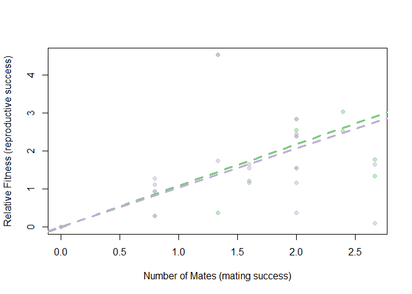

Selection pressures in *Syngnathus floridae*
================
Coley Tosto
2024-05-15


- <a href="#calculating-the-degree-of-sexual-dimorphism"
  id="toc-calculating-the-degree-of-sexual-dimorphism">Calculating the
  degree of sexual dimorphism</a>
- <a
  href="#calculating-mating-and-reproductive-success-for-individuals-who-mated"
  id="toc-calculating-mating-and-reproductive-success-for-individuals-who-mated">Calculating
  mating and reproductive success for individuals who mated</a>
- <a href="#summary-statistics-for-successfully-mated-individuals"
  id="toc-summary-statistics-for-successfully-mated-individuals">Summary
  statistics for successfully mated individuals</a>
  - <a href="#males" id="toc-males">Males</a>
  - <a href="#females" id="toc-females">Females</a>
- <a href="#differences-between-mated-individuals-and-unmated-individuals"
  id="toc-differences-between-mated-individuals-and-unmated-individuals">Differences
  between mated individuals and unmated individuals</a>
  - <a href="#males-1" id="toc-males-1">Males</a>
  - <a href="#females-1" id="toc-females-1">Females</a>
- <a href="#episode-of-sexual-selection"
  id="toc-episode-of-sexual-selection">Episode of Sexual Selection</a>
  - <a href="#partitioning-the-total-opportunity-for-selection-i"
    id="toc-partitioning-the-total-opportunity-for-selection-i">Partitioning
    the Total Opportunity for Selection (I)</a>
  - <a href="#decomposition-of-selection-differentials-s"
    id="toc-decomposition-of-selection-differentials-s">Decomposition of
    selection differentials (s)</a>
- <a href="#mate-success-versus-reproductive-success-bateman-gradient"
  id="toc-mate-success-versus-reproductive-success-bateman-gradient">Mate
  success versus Reproductive success (Bateman Gradient)</a>
  - <a href="#omitting-females-with-high-mating"
    id="toc-omitting-females-with-high-mating">Omitting females with high
    mating</a>
- <a href="#visualizing-post-copulatory-selection"
  id="toc-visualizing-post-copulatory-selection">Visualizing
  post-copulatory selection</a>

``` r
#This is a cohesive list of all the libraries used in this document
library(ggplot2)
library(cowplot)
library(fBasics)
```

``` r
#MomIDs and embryo counts for each section of the male's brood pouch
em_dat <- read.csv("data/EmbryoParentage.csv")

#Metadata for males and females from the mesocosm experiments
fem_meso <- read.csv("data/all_fem_meso_floridae.csv")
mal_meso <- read.csv("data/all_mal_meso_floridae.csv")
```

# Calculating the degree of sexual dimorphism

Other papers have reported varying levels of significant or
non-significant size differences between males and females in this
species. I want to compare the sizes that I have to see what sexual size
dimorphism is like for this population. I am doing this across all fish
that were used, including those trials that had no successful matings.

``` r
library(vegan)
traits<-dplyr::bind_rows(
  cbind(fem_meso,sex="Female"), 
  cbind(mal_meso[,1:9],sex="Male")
              )

vegan::cca(traits[,c("weight","length","depth","svl")]~traits$sex)
```

``` r
#Testing to see if the variances are equal
var.test(fem_meso$length, mal_meso$length)
```

    ## 
    ##  F test to compare two variances
    ## 
    ## data:  fem_meso$length and mal_meso$length
    ## F = 1.4609, num df = 85, denom df = 85, p-value = 0.08239
    ## alternative hypothesis: true ratio of variances is not equal to 1
    ## 95 percent confidence interval:
    ##  0.9521741 2.2413401
    ## sample estimates:
    ## ratio of variances 
    ##           1.460872

``` r
var.test(fem_meso$depth, mal_meso$depth)
```

    ## 
    ##  F test to compare two variances
    ## 
    ## data:  fem_meso$depth and mal_meso$depth
    ## F = 1.71, num df = 84, denom df = 85, p-value = 0.01446
    ## alternative hypothesis: true ratio of variances is not equal to 1
    ## 95 percent confidence interval:
    ##  1.113419 2.627663
    ## sample estimates:
    ## ratio of variances 
    ##           1.709993

``` r
var.test(fem_meso$svl, mal_meso$svl)
```

    ## 
    ##  F test to compare two variances
    ## 
    ## data:  fem_meso$svl and mal_meso$svl
    ## F = 2.1705, num df = 85, denom df = 85, p-value = 0.0004335
    ## alternative hypothesis: true ratio of variances is not equal to 1
    ## 95 percent confidence interval:
    ##  1.414675 3.330029
    ## sample estimates:
    ## ratio of variances 
    ##           2.170463

``` r
#Testing for normal distribution
normalTest(fem_meso$length, method = "da") #not normal
```

    ## 
    ## Title:
    ##  D'Agostino Normality Test
    ## 
    ## Test Results:
    ##   STATISTIC:
    ##     Chi2 | Omnibus: 6.0342
    ##     Z3  | Skewness: 0.5032
    ##     Z4  | Kurtosis: -2.4044
    ##   P VALUE:
    ##     Omnibus  Test: 0.04894 
    ##     Skewness Test: 0.6148 
    ##     Kurtosis Test: 0.0162

``` r
normalTest(fem_meso$depth, method = "da") #not normal
```

    ## 
    ## Title:
    ##  D'Agostino Normality Test
    ## 
    ## Test Results:
    ##   STATISTIC:
    ##     Chi2 | Omnibus: 7.8714
    ##     Z3  | Skewness: 0.7761
    ##     Z4  | Kurtosis: -2.6961
    ##   P VALUE:
    ##     Omnibus  Test: 0.01953 
    ##     Skewness Test: 0.4377 
    ##     Kurtosis Test: 0.007015

``` r
normalTest(fem_meso$svl, method = "da") #normal
```

    ## 
    ## Title:
    ##  D'Agostino Normality Test
    ## 
    ## Test Results:
    ##   STATISTIC:
    ##     Chi2 | Omnibus: 3.0383
    ##     Z3  | Skewness: 0.7065
    ##     Z4  | Kurtosis: -1.5935
    ##   P VALUE:
    ##     Omnibus  Test: 0.2189 
    ##     Skewness Test: 0.4799 
    ##     Kurtosis Test: 0.1111

``` r
normalTest(mal_meso$length, method = "da") #normal
```

    ## 
    ## Title:
    ##  D'Agostino Normality Test
    ## 
    ## Test Results:
    ##   STATISTIC:
    ##     Chi2 | Omnibus: 0.0501
    ##     Z3  | Skewness: -0.1257
    ##     Z4  | Kurtosis: 0.1851
    ##   P VALUE:
    ##     Omnibus  Test: 0.9753 
    ##     Skewness Test: 0.9 
    ##     Kurtosis Test: 0.8531

``` r
normalTest(mal_meso$depth, method = "da") #normal
```

    ## 
    ## Title:
    ##  D'Agostino Normality Test
    ## 
    ## Test Results:
    ##   STATISTIC:
    ##     Chi2 | Omnibus: 2.4281
    ##     Z3  | Skewness: 1.538
    ##     Z4  | Kurtosis: -0.2502
    ##   P VALUE:
    ##     Omnibus  Test: 0.297 
    ##     Skewness Test: 0.124 
    ##     Kurtosis Test: 0.8024

``` r
normalTest(mal_meso$svl, method = "da") #normal
```

    ## 
    ## Title:
    ##  D'Agostino Normality Test
    ## 
    ## Test Results:
    ##   STATISTIC:
    ##     Chi2 | Omnibus: 3.4451
    ##     Z3  | Skewness: 0.5003
    ##     Z4  | Kurtosis: -1.7874
    ##   P VALUE:
    ##     Omnibus  Test: 0.1786 
    ##     Skewness Test: 0.6168 
    ##     Kurtosis Test: 0.07387

``` r
wilcox.test(fem_meso$length, mal_meso$length)
```

    ## 
    ##  Wilcoxon rank sum test with continuity correction
    ## 
    ## data:  fem_meso$length and mal_meso$length
    ## W = 3930, p-value = 0.4784
    ## alternative hypothesis: true location shift is not equal to 0

``` r
wilcox.test(fem_meso$depth, mal_meso$depth)
```

    ## 
    ##  Wilcoxon rank sum test with continuity correction
    ## 
    ## data:  fem_meso$depth and mal_meso$depth
    ## W = 4572.5, p-value = 0.004612
    ## alternative hypothesis: true location shift is not equal to 0

``` r
t.test(fem_meso$svl, mal_meso$svl, var.equal = FALSE)
```

    ## 
    ##  Welch Two Sample t-test
    ## 
    ## data:  fem_meso$svl and mal_meso$svl
    ## t = 3.86, df = 149.61, p-value = 0.0001682
    ## alternative hypothesis: true difference in means is not equal to 0
    ## 95 percent confidence interval:
    ##  2.949949 9.137632
    ## sample estimates:
    ## mean of x mean of y 
    ##  80.01955  73.97576

``` r
#Checking the power
d_mean <- abs(mean(fem_meso$depth, na.rm = TRUE) - mean(mal_meso$depth, na.rm = TRUE))
pool_sd <- sqrt((var(fem_meso$depth, na.rm = TRUE) + var(mal_meso$depth, na.rm = TRUE))/ 2)
d <- d_mean/pool_sd
library(pwr)
```

    ## Warning: package 'pwr' was built under R version 4.2.3

``` r
pwr.t.test(n = nrow(fem_meso), 
           d = d,
           sig.level = 0.05,
           type = 'two.sample',
           alternative = 'two.sided')
```

    ## 
    ##      Two-sample t test power calculation 
    ## 
    ##               n = 86
    ##               d = 0.4837787
    ##       sig.level = 0.05
    ##           power = 0.8838421
    ##     alternative = two.sided
    ## 
    ## NOTE: n is number in *each* group

``` r
fem_depth_adj <- fem_meso$depth/fem_meso$length
mal_depth_adj <- mal_meso$depth/mal_meso$length
var.test(fem_depth_adj, mal_depth_adj)
```

    ## 
    ##  F test to compare two variances
    ## 
    ## data:  fem_depth_adj and mal_depth_adj
    ## F = 1.3686, num df = 84, denom df = 85, p-value = 0.151
    ## alternative hypothesis: true ratio of variances is not equal to 1
    ## 95 percent confidence interval:
    ##  0.8911382 2.1030826
    ## sample estimates:
    ## ratio of variances 
    ##           1.368614

``` r
normalTest(fem_depth_adj, method = "da") #normal
```

    ## 
    ## Title:
    ##  D'Agostino Normality Test
    ## 
    ## Test Results:
    ##   STATISTIC:
    ##     Chi2 | Omnibus: 0.6513
    ##     Z3  | Skewness: 0.7106
    ##     Z4  | Kurtosis: -0.3825
    ##   P VALUE:
    ##     Omnibus  Test: 0.7221 
    ##     Skewness Test: 0.4773 
    ##     Kurtosis Test: 0.7021

``` r
normalTest(mal_depth_adj, method = "da") #normal
```

    ## 
    ## Title:
    ##  D'Agostino Normality Test
    ## 
    ## Test Results:
    ##   STATISTIC:
    ##     Chi2 | Omnibus: 1.9819
    ##     Z3  | Skewness: 0.5381
    ##     Z4  | Kurtosis: 1.3009
    ##   P VALUE:
    ##     Omnibus  Test: 0.3712 
    ##     Skewness Test: 0.5905 
    ##     Kurtosis Test: 0.1933

``` r
t.test(fem_depth_adj, mal_depth_adj, var.equal = TRUE)
```

    ## 
    ##  Two Sample t-test
    ## 
    ## data:  fem_depth_adj and mal_depth_adj
    ## t = 4.1064, df = 169, p-value = 6.248e-05
    ## alternative hypothesis: true difference in means is not equal to 0
    ## 95 percent confidence interval:
    ##  0.001494861 0.004262830
    ## sample estimates:
    ##  mean of x  mean of y 
    ## 0.03537844 0.03249959

``` r
d_mean <- abs(mean(fem_depth_adj, na.rm = TRUE) - mean(mal_depth_adj))
pool_sd <- sqrt((var(fem_depth_adj, na.rm = TRUE) + var(mal_depth_adj))/ 2)
d <- d_mean/pool_sd
library(pwr)
pwr.t.test(n = length(mal_depth_adj), 
           d = d,
           sig.level = 0.05,
           type = 'two.sample',
           alternative = 'two.sided')
```

    ## 
    ##      Two-sample t test power calculation 
    ## 
    ##               n = 86
    ##               d = 0.627763
    ##       sig.level = 0.05
    ##           power = 0.9835455
    ##     alternative = two.sided
    ## 
    ## NOTE: n is number in *each* group

# Calculating mating and reproductive success for individuals who mated

*Syngnathus floridae* (dusky pipefish) were sampled from three distinct
seagrass beds around Tampa Bay in Tampa, Florida. Sexually mature
females (standard length $\ge$ 120mm) and pregnant males were collected
and brought back to the University of Tampa for mesocosm experiments. In
these mesocosms, 8 males and 8 females were housed together in a 140L
tank for a period of 14-days and allowed to mate freely. Parentage
analysis was done with all of the pregnant males from the trials to
figure out how many times each male and female mated, and the number of
eggs that were transferred. The results of that are here.

First I had to calculate the mating and reproductive success for each
male and female who mated based on the assigned mom for each genotyped
embryo.

``` r
#Row-by-Row analysis of parentage data by male brood pouch section

#Read in the data
#em_dat <- read.csv("~/EmbryoParentage.csv")

#For each row in the dataset(each section of the pouch) apply this function
mom_counts <- do.call(rbind,apply(em_dat, 1, function(one_section){
  
  #Save all of the momIDs into an object
  mom_ids<-c(one_section[grep("momID",names(one_section))])  
  
  #Calculate the number of eggs that belongs to each potential mom based on
  #the proportions and total number of developed and undeveloped embryos
  mom_props<-c(as.numeric(one_section[grep("prop",names(one_section))]))
  mom_counts_dev<-mom_props*as.numeric(one_section["num_embryos_dev"])
  mom_counts_und<-mom_props*as.numeric(one_section["num_embryos_non_dev"])
  
  #Create a dataframe that contains the maleID, pouch section number and the
  #number of eggs that belongs to each momID
  this_section<-data.frame(
    maleID=one_section["maleID"],
    section_num=one_section["section_num"],
    mom_ids[which((mom_counts_dev + mom_counts_und) > 0)],
    mom_counts_dev[which((mom_counts_dev + mom_counts_und)>0)],
    mom_counts_und[which((mom_counts_dev + mom_counts_und)>0)]
  )
  
  #Rename the columns
  colnames(this_section)[3:5]<-c("momID","num_dev","num_und")
  
  return(this_section)
  
}))

#Calculate female fitness
fem_fitness<-do.call(rbind,by(mom_counts, mom_counts$momID,function(dat){
  
  mom_fitness<-data.frame(
    momID=unique(dat$momID),
    MatingSuccess=length(unique(dat$maleID)),
    NumDeveloped=round(sum(dat$num_dev)),
    NumUndeveloped=round(sum(dat$num_und))
  )
  return(mom_fitness)
}))

fem_fitness$totalEggs <- fem_fitness$NumDeveloped + fem_fitness$NumUndeveloped

#Calculate Male Fitness 
mal_fitness<-do.call(rbind,by(mom_counts, mom_counts$maleID,function(dat){
 
  dad_fitness<-data.frame(
    maleID=unique(dat$maleID),
    MatingSuccess=length(unique(dat$momID)),
    NumDeveloped_Calc=round(sum(dat$num_dev)),
    NumUndeveloped_Calc=round(sum(dat$num_und))
  )
  return(dad_fitness)
}))

mal_fitness$totalEggs <- mal_fitness$NumDeveloped_Calc + mal_fitness$NumUndeveloped_Calc
```

After running the above R script we have two datasets, `mal_fitness` and
`fem_fitness`. These datasets include information about the mating
success (number of mates) and reproductive success (Number of embryos
transferred). We can split reproductive success up further later if we
want to from the total number of embryos transferred to the number of
embryos developed and the number that were undeveloped.

I want to include all of the other metadata that I have for these
individuals (traits, collection location, latency to pregnancy, etc.) as
well as tack on all of the information for the individuals who did not
mate. To do that I am going to need to merge the fitness datasets with
`fem_meso` and `mal_meso`.

``` r
#Make a column in *_meso that contains the full fishID (i.e. FL1M3) to match the 
#formatting in the fitness datasets (make sure they have the same name for merging purposes)
fem_meso$momID <- paste0("FL", fem_meso$trial_num, "F", fem_meso$fishID)
mal_meso$maleID <- paste0("FL", mal_meso$trial_num, "M", mal_meso$fishID)

#Merge the datasets based on the columns created above
fem_all <- merge(fem_meso, fem_fitness, by = "momID", all.x = TRUE, all.y = TRUE)
mal_all <- merge(mal_meso, mal_fitness, by = "maleID", all.x = TRUE, all.y = TRUE)
```

There are a few trials that I want to remove from the analysis:

1.  All trials where there were no successful matings (7, 9, 10, 11).

2.  Trial 1, a male gave birth and the babies were immediately eaten by
    the adults so the trial was ended early and therefore I was unable
    to get any parentage information for that trial.

I also want to replace the NAs that were automatically added to the
columns from the fitness dataset (MatingSuccess, NumDeveloped,
NumUndeveloped, totalEggs) with 0s and add a column to the female
dataset that tells me whether or not the female mated (with 1 or 0).

``` r
#Subset the merged datasets to remove trials without successful matings and Trial 1
fem_succ <- subset(fem_all, !(trial_num %in% c(7, 9, 10, 11, 1)))
mal_succ <- subset(mal_all, !(trial_num %in% c(7, 9, 10, 11, 1)))

#Replace NAs with 0s in the columns related to fitness
mal_succ[,15:18] <- sapply(mal_succ[,15:18],
                           function(x)
                             ifelse(is.na(x), 0, x))

fem_succ[,11:14] <- sapply(fem_succ[,11:14],
                           function(x)
                             ifelse(is.na(x), 0, x))

#Add a column for females to denote mated or unmated
fem_succ$mated <- ifelse(fem_succ$MatingSuccess > 0, 1, 0)
```

# Summary statistics for successfully mated individuals

## Males

Across all 7 trials and 56 total males, there were 24 males that mated
at least one time and 6 of those males had two mates.

Looking across all males, including the ones that did not mate, this is
what we find as the mean, sd, and se for the number of embryos
transferred and how many of those developed versus didn’t:

|                     |       mean |          SD |         SE | max | min |
|:--------------------|-----------:|------------:|-----------:|----:|----:|
| Number of Embryos   |      108.5 | 155.1902059 | 20.7381636 | 500 |   0 |
| Developed Embryos   | 94.1964286 | 139.7347383 | 18.6728398 | 463 |   0 |
| Undeveloped Embryos | 14.3035714 |  27.7907242 |  3.7136917 | 131 |   0 |

These values will be influenced by the number of 0s coming from males
who did not mate. So let’s look at the same thing, but this time for
only males who had at least one successful mating:

|                     |        mean |          SD |         SE | max | min |
|:--------------------|------------:|------------:|-----------:|----:|----:|
| Number of Embryos   | 253.1666667 | 139.1941611 | 28.4128892 | 500 |   9 |
| Developed Embryos   | 219.7916667 | 133.7427704 | 27.3001287 | 463 |   7 |
| Undeveloped Embryos |      33.375 |  34.3901054 |  7.0198509 | 131 |   0 |

We can see from the bottom table that even when we only include males
who mated there is still a wide range in the brood size. I want to see
what relationship there is between brood pouch size (in terms of both
total area and length) and brood size (total number of embryos).


There may be some correlation happening here, but it doesn’t look
particularly strong (Fig. @ref(fig:em-v-bp)). Let’s run some
correlations tests to see what they say.

    ## 
    ##  Pearson's product-moment correlation
    ## 
    ## data:  as.numeric(mated_mal$bp_area) and mated_mal$totalEggs
    ## t = 0.90485, df = 22, p-value = 0.3753
    ## alternative hypothesis: true correlation is not equal to 0
    ## 95 percent confidence interval:
    ##  -0.2316769  0.5507364
    ## sample estimates:
    ##       cor 
    ## 0.1894228

    ## 
    ##  Pearson's product-moment correlation
    ## 
    ## data:  as.numeric(mated_mal$bp_length) and mated_mal$totalEggs
    ## t = 0.51929, df = 22, p-value = 0.6087
    ## alternative hypothesis: true correlation is not equal to 0
    ## 95 percent confidence interval:
    ##  -0.3069838  0.4916139
    ## sample estimates:
    ##       cor 
    ## 0.1100398

There is not a significant correlation between the number of eggs and
size of the brood pouch when we look at brood pouch area OR brood pouch
length.

Multiple of the wild study papers looked at correlations between body
size in terms of standard length and the number of embryos and found
significant positive correlations.


    ## 
    ##  Pearson's product-moment correlation
    ## 
    ## data:  as.numeric(mated_mal$length) and mated_mal$totalEggs
    ## t = -0.35647, df = 22, p-value = 0.7249
    ## alternative hypothesis: true correlation is not equal to 0
    ## 95 percent confidence interval:
    ##  -0.4649642  0.3379463
    ## sample estimates:
    ##         cor 
    ## -0.07578142

There appears to be no significant correlation between standard length
and the number of eggs in males, unlike what has been found in the
species previously (Fig. @ref(fig:em-v-sl)). This is unsurprising as we
didn’t find any hint of a relationship in the brood pouch size metrics
and there was a considerable number of males that did not have a full
brood pouch.

## Females

Across all 7 trials and 56 total females, there were 21 females that
mated at least one time, 5 females that mated twice, and 2 that mated 3
times.

Looking across all females, including the ones that did not mate, this
is what we find as the mean, sd, and se for the total number of embryos
transferred from each female (across all of her mates if applicable) and
how many of those developed versus didn’t:

|                     |        mean |          SD |         SE | max | min |
|:--------------------|------------:|------------:|-----------:|----:|----:|
| Number of Embryos   | 108.4821429 | 195.2328206 |  26.089083 | 916 |   0 |
| Developed Embryos   |  94.1785714 | 177.0691808 | 23.6618646 | 785 |   0 |
| Undeveloped Embryos |  14.3035714 |  29.7033329 |  3.9692748 | 131 |   0 |

These values will be influenced by the number of 0s coming from females
who did not mate. So let’s look at the same thing, but this time for
only females who had at least one successful mating:

|                     |        mean |          SD |         SE | max | min |
|:--------------------|------------:|------------:|-----------:|----:|----:|
| Number of Embryos   | 289.2857143 | 223.3819919 |  48.745947 | 916 |  35 |
| Developed Embryos   | 251.1428571 | 211.7324457 | 46.2038076 | 785 |   7 |
| Undeveloped Embryos |  38.1428571 |   38.360508 |  8.3709491 | 131 |   0 |

We can see from the bottom table that even when we only include females
who mated there is still a wide range in the number of eggs transferred.
I want to see what relationship there may be between female body size
(in terms of standard length, depth, and SVL) and the number of eggs she
transferred. I also want to see on average how many eggs were
transferred per mating. I’m going to calculate this by taking the total
number of eggs and dividing it by the number of mates.

    ## [1] 202.3254

    ## [1] 14.68782


There may be some correlation happening here, but it doesn’t look
particularly strong (Fig. @ref(fig:em-v-fem-size)). Let’s run some
correlations tests to see what they say.

    ## 
    ##  Pearson's product-moment correlation
    ## 
    ## data:  mated_fem$length and as.numeric(mated_fem$totalEggs)
    ## t = -0.92304, df = 19, p-value = 0.3676
    ## alternative hypothesis: true correlation is not equal to 0
    ## 95 percent confidence interval:
    ##  -0.5864091  0.2465727
    ## sample estimates:
    ##        cor 
    ## -0.2071652

    ## 
    ##  Pearson's product-moment correlation
    ## 
    ## data:  mated_fem$depth_adj and as.numeric(mated_fem$totalEggs)
    ## t = 2.0729, df = 19, p-value = 0.05202
    ## alternative hypothesis: true correlation is not equal to 0
    ## 95 percent confidence interval:
    ##  -0.002716801  0.726473616
    ## sample estimates:
    ##       cor 
    ## 0.4294737

    ## 
    ##  Pearson's product-moment correlation
    ## 
    ## data:  mated_fem$svl and as.numeric(mated_fem$totalEggs)
    ## t = -0.5112, df = 19, p-value = 0.6151
    ## alternative hypothesis: true correlation is not equal to 0
    ## 95 percent confidence interval:
    ##  -0.5219227  0.3318958
    ## sample estimates:
    ##        cor 
    ## -0.1164796

There is not a significant correlation between the number of eggs and
size of the female in terms of standard length, depth, or snout-vent
length. Interestingly, however, there is a negative correlation for
length and SVL and a positive correlation for depth (but they are all
overall weak).

# Differences between mated individuals and unmated individuals

I want to now see if there are any significant differences in the sizes
of individuals who mated vs individuals that didn’t mate in males and
females.

## Males


    ## 
    ##  F test to compare two variances
    ## 
    ## data:  mal_succ$length by mal_succ$preg_status
    ## F = 1.227, num df = 31, denom df = 23, p-value = 0.6183
    ## alternative hypothesis: true ratio of variances is not equal to 1
    ## 95 percent confidence interval:
    ##  0.549967 2.616083
    ## sample estimates:
    ## ratio of variances 
    ##           1.226976

    ## 
    ##  F test to compare two variances
    ## 
    ## data:  mal_succ$depth_adj by mal_succ$preg_status
    ## F = 1.1946, num df = 31, denom df = 23, p-value = 0.6665
    ## alternative hypothesis: true ratio of variances is not equal to 1
    ## 95 percent confidence interval:
    ##  0.5354334 2.5469498
    ## sample estimates:
    ## ratio of variances 
    ##           1.194551

    ## 
    ##  F test to compare two variances
    ## 
    ## data:  mal_succ$svl by mal_succ$preg_status
    ## F = 1.5716, num df = 31, denom df = 23, p-value = 0.2651
    ## alternative hypothesis: true ratio of variances is not equal to 1
    ## 95 percent confidence interval:
    ##  0.704435 3.350857
    ## sample estimates:
    ## ratio of variances 
    ##           1.571594

    ## 
    ##  F test to compare two variances
    ## 
    ## data:  as.numeric(mal_succ$bp_area) by mal_succ$preg_status
    ## F = 2.1704, num df = 28, denom df = 23, p-value = 0.06161
    ## alternative hypothesis: true ratio of variances is not equal to 1
    ## 95 percent confidence interval:
    ##  0.9619177 4.7455975
    ## sample estimates:
    ## ratio of variances 
    ##           2.170381

    ## 
    ##  F test to compare two variances
    ## 
    ## data:  mal_succ$bp_length by mal_succ$preg_status
    ## F = 1.1712, num df = 28, denom df = 23, p-value = 0.7047
    ## alternative hypothesis: true ratio of variances is not equal to 1
    ## 95 percent confidence interval:
    ##  0.5190955 2.5609447
    ## sample estimates:
    ## ratio of variances 
    ##           1.171238

    ## 
    ##  F test to compare two variances
    ## 
    ## data:  mal_succ$weight by mal_succ$preg_status
    ## F = 1.6153, num df = 31, denom df = 23, p-value = 0.2373
    ## alternative hypothesis: true ratio of variances is not equal to 1
    ## 95 percent confidence interval:
    ##  0.7240159 3.4439992
    ## sample estimates:
    ## ratio of variances 
    ##           1.615279

    ## 
    ## Title:
    ##  D'Agostino Normality Test
    ## 
    ## Test Results:
    ##   STATISTIC:
    ##     Chi2 | Omnibus: 1.3942
    ##     Z3  | Skewness: -1.0089
    ##     Z4  | Kurtosis: 0.6135
    ##   P VALUE:
    ##     Omnibus  Test: 0.498 
    ##     Skewness Test: 0.313 
    ##     Kurtosis Test: 0.5396

    ## 
    ## Title:
    ##  D'Agostino Normality Test
    ## 
    ## Test Results:
    ##   STATISTIC:
    ##     Chi2 | Omnibus: 2.7815
    ##     Z3  | Skewness: -0.6756
    ##     Z4  | Kurtosis: 1.5248
    ##   P VALUE:
    ##     Omnibus  Test: 0.2489 
    ##     Skewness Test: 0.4993 
    ##     Kurtosis Test: 0.1273

    ## 
    ## Title:
    ##  D'Agostino Normality Test
    ## 
    ## Test Results:
    ##   STATISTIC:
    ##     Chi2 | Omnibus: 2.8353
    ##     Z3  | Skewness: -0.1915
    ##     Z4  | Kurtosis: -1.6729
    ##   P VALUE:
    ##     Omnibus  Test: 0.2423 
    ##     Skewness Test: 0.8482 
    ##     Kurtosis Test: 0.09434

    ## 
    ## Title:
    ##  D'Agostino Normality Test
    ## 
    ## Test Results:
    ##   STATISTIC:
    ##     Chi2 | Omnibus: 5.3414
    ##     Z3  | Skewness: 1.9695
    ##     Z4  | Kurtosis: 1.2093
    ##   P VALUE:
    ##     Omnibus  Test: 0.0692 
    ##     Skewness Test: 0.04889 
    ##     Kurtosis Test: 0.2266

    ## 
    ## Title:
    ##  D'Agostino Normality Test
    ## 
    ## Test Results:
    ##   STATISTIC:
    ##     Chi2 | Omnibus: 0.1537
    ##     Z3  | Skewness: -0.1976
    ##     Z4  | Kurtosis: -0.3386
    ##   P VALUE:
    ##     Omnibus  Test: 0.926 
    ##     Skewness Test: 0.8433 
    ##     Kurtosis Test: 0.7349

    ## 
    ## Title:
    ##  D'Agostino Normality Test
    ## 
    ## Test Results:
    ##   STATISTIC:
    ##     Chi2 | Omnibus: 4.4842
    ##     Z3  | Skewness: 0.9969
    ##     Z4  | Kurtosis: -1.8682
    ##   P VALUE:
    ##     Omnibus  Test: 0.1062 
    ##     Skewness Test: 0.3188 
    ##     Kurtosis Test: 0.06173

    ## 
    ##  Two Sample t-test
    ## 
    ## data:  mal_succ$length by mal_succ$preg_status
    ## t = 2.189, df = 54, p-value = 0.03294
    ## alternative hypothesis: true difference in means between group 0 and group 1 is not equal to 0
    ## 95 percent confidence interval:
    ##   0.8753587 19.9376622
    ## sample estimates:
    ## mean in group 0 mean in group 1 
    ##        180.7827        170.3762

    ## 
    ##  Two Sample t-test
    ## 
    ## data:  mal_succ$depth_adj by mal_succ$preg_status
    ## t = -1.1162, df = 54, p-value = 0.2693
    ## alternative hypothesis: true difference in means between group 0 and group 1 is not equal to 0
    ## 95 percent confidence interval:
    ##  -0.003774190  0.001074713
    ## sample estimates:
    ## mean in group 0 mean in group 1 
    ##      0.03252334      0.03387308

    ## 
    ##  Two Sample t-test
    ## 
    ## data:  mal_succ$svl by mal_succ$preg_status
    ## t = 2.2934, df = 54, p-value = 0.02574
    ## alternative hypothesis: true difference in means between group 0 and group 1 is not equal to 0
    ## 95 percent confidence interval:
    ##  0.5626831 8.3831502
    ## sample estimates:
    ## mean in group 0 mean in group 1 
    ##        76.32887        71.85596

    ## 
    ##  Two Sample t-test
    ## 
    ## data:  as.numeric(mal_succ$bp_area) by mal_succ$preg_status
    ## t = 0.76167, df = 51, p-value = 0.4498
    ## alternative hypothesis: true difference in means between group 0 and group 1 is not equal to 0
    ## 95 percent confidence interval:
    ##  -24.10295  53.57274
    ## sample estimates:
    ## mean in group 0 mean in group 1 
    ##        264.5283        249.7934

    ## 
    ##  Two Sample t-test
    ## 
    ## data:  mal_succ$bp_length by mal_succ$preg_status
    ## t = 0.53608, df = 51, p-value = 0.5942
    ## alternative hypothesis: true difference in means between group 0 and group 1 is not equal to 0
    ## 95 percent confidence interval:
    ##  -2.527712  4.369421
    ## sample estimates:
    ## mean in group 0 mean in group 1 
    ##        48.12590        47.20504

    ## 
    ##  Two Sample t-test
    ## 
    ## data:  mal_succ$weight by mal_succ$preg_status
    ## t = 1.2283, df = 54, p-value = 0.2247
    ## alternative hypothesis: true difference in means between group 0 and group 1 is not equal to 0
    ## 95 percent confidence interval:
    ##  -0.2601657  1.0830824
    ## sample estimates:
    ## mean in group 0 mean in group 1 
    ##        3.503125        3.091667

## Females


    ## 
    ##  F test to compare two variances
    ## 
    ## data:  fem_succ$length by fem_succ$mated
    ## F = 1.633, num df = 34, denom df = 20, p-value = 0.2486
    ## alternative hypothesis: true ratio of variances is not equal to 1
    ## 95 percent confidence interval:
    ##  0.7038378 3.4857593
    ## sample estimates:
    ## ratio of variances 
    ##           1.632956

    ## 
    ##  F test to compare two variances
    ## 
    ## data:  fem_succ$depth_adj by fem_succ$mated
    ## F = 0.81243, num df = 34, denom df = 20, p-value = 0.5788
    ## alternative hypothesis: true ratio of variances is not equal to 1
    ## 95 percent confidence interval:
    ##  0.3501734 1.7342349
    ## sample estimates:
    ## ratio of variances 
    ##           0.812428

    ## 
    ##  F test to compare two variances
    ## 
    ## data:  fem_succ$svl by fem_succ$mated
    ## F = 1.5349, num df = 34, denom df = 20, p-value = 0.3137
    ## alternative hypothesis: true ratio of variances is not equal to 1
    ## 95 percent confidence interval:
    ##  0.6615829 3.2764914
    ## sample estimates:
    ## ratio of variances 
    ##           1.534921

    ## 
    ##  F test to compare two variances
    ## 
    ## data:  fem_succ$weight by fem_succ$mated
    ## F = 1.8753, num df = 34, denom df = 20, p-value = 0.1398
    ## alternative hypothesis: true ratio of variances is not equal to 1
    ## 95 percent confidence interval:
    ##  0.8082719 4.0029692
    ## sample estimates:
    ## ratio of variances 
    ##            1.87525

    ## 
    ## Title:
    ##  D'Agostino Normality Test
    ## 
    ## Test Results:
    ##   STATISTIC:
    ##     Chi2 | Omnibus: 5.6455
    ##     Z3  | Skewness: 0.1955
    ##     Z4  | Kurtosis: -2.368
    ##   P VALUE:
    ##     Omnibus  Test: 0.05944 
    ##     Skewness Test: 0.845 
    ##     Kurtosis Test: 0.01789

    ## 
    ## Title:
    ##  D'Agostino Normality Test
    ## 
    ## Test Results:
    ##   STATISTIC:
    ##     Chi2 | Omnibus: 1.5954
    ##     Z3  | Skewness: 1.199
    ##     Z4  | Kurtosis: -0.3971
    ##   P VALUE:
    ##     Omnibus  Test: 0.4504 
    ##     Skewness Test: 0.2305 
    ##     Kurtosis Test: 0.6913

    ## 
    ## Title:
    ##  D'Agostino Normality Test
    ## 
    ## Test Results:
    ##   STATISTIC:
    ##     Chi2 | Omnibus: 2.1451
    ##     Z3  | Skewness: 0.1292
    ##     Z4  | Kurtosis: -1.4589
    ##   P VALUE:
    ##     Omnibus  Test: 0.3421 
    ##     Skewness Test: 0.8972 
    ##     Kurtosis Test: 0.1446

    ## 
    ## Title:
    ##  D'Agostino Normality Test
    ## 
    ## Test Results:
    ##   STATISTIC:
    ##     Chi2 | Omnibus: 3.6932
    ##     Z3  | Skewness: 1.5783
    ##     Z4  | Kurtosis: -1.0965
    ##   P VALUE:
    ##     Omnibus  Test: 0.1578 
    ##     Skewness Test: 0.1145 
    ##     Kurtosis Test: 0.2729

    ## 
    ##  Two Sample t-test
    ## 
    ## data:  fem_succ$length by fem_succ$mated
    ## t = -0.24976, df = 54, p-value = 0.8037
    ## alternative hypothesis: true difference in means between group 0 and group 1 is not equal to 0
    ## 95 percent confidence interval:
    ##  -13.91399  10.83128
    ## sample estimates:
    ## mean in group 0 mean in group 1 
    ##        177.3453        178.8867

    ## 
    ##  Two Sample t-test
    ## 
    ## data:  fem_succ$depth_adj by fem_succ$mated
    ## t = -2.9714, df = 54, p-value = 0.004418
    ## alternative hypothesis: true difference in means between group 0 and group 1 is not equal to 0
    ## 95 percent confidence interval:
    ##  -0.005900311 -0.001146035
    ## sample estimates:
    ## mean in group 0 mean in group 1 
    ##      0.03501778      0.03854095

    ## 
    ##  Two Sample t-test
    ## 
    ## data:  fem_succ$svl by fem_succ$mated
    ## t = -0.72594, df = 54, p-value = 0.471
    ## alternative hypothesis: true difference in means between group 0 and group 1 is not equal to 0
    ## 95 percent confidence interval:
    ##  -8.570778  4.013997
    ## sample estimates:
    ## mean in group 0 mean in group 1 
    ##        79.01194        81.29033

    ## 
    ##  Two Sample t-test
    ## 
    ## data:  fem_succ$weight by fem_succ$mated
    ## t = -0.41333, df = 54, p-value = 0.681
    ## alternative hypothesis: true difference in means between group 0 and group 1 is not equal to 0
    ## 95 percent confidence interval:
    ##  -0.9973865  0.6564341
    ## sample estimates:
    ## mean in group 0 mean in group 1 
    ##        3.234286        3.404762

# Episode of Sexual Selection

## Partitioning the Total Opportunity for Selection (I)

``` r
#Create a dataframe to store all of the intermediate values of fitness in
fem_succ_fitness <- data.frame(matrix(ncol = ncol(fem_succ) + 9,
                                      nrow = 0))
colnames(fem_succ_fitness) <- c(colnames(fem_succ),
                                "w1", "w1_squared",
                                "W2", "W2_bar", "w2",
                                "W3", "W3_bar", "w3", "i3")

#Create a dataframe to store the final calculations of I in
opp_selection_episodes_fem <- data.frame(matrix(ncol = 12,
                                            nrow = 0))
colnames(opp_selection_episodes_fem) <- c("trial_num", "I_1", "I_1per", "I_2", "I_2per", 
                                          "I_3", "I_3per", "I_12", "I_12per",
                                          "I", "Iper", "I_s")

for (trial in unique(fem_succ$trial_num)) {
  
  #Subset the overall dataframe to work with an individual trial
  tmp <- fem_succ[fem_succ$trial_num == trial, ]
  
  #Calculate the absolute pre-copulatory fitness (Eq. 14 Arnold & Wade 1984)
  tmp$w1 <- tmp$MatingSuccess/mean(tmp$MatingSuccess) #Relative mating success
  tmp$w1_squared <- (tmp$w1)^2
  
  I_1 <- var(tmp$w1) #Variance in relative mating success
  
  #Post-copulatory selection event 1 (Number of eggs transferred) (Eq. 15 Arnold & Wade 1984)
  tmp$W2 <- ifelse(tmp$MatingSuccess > 0,
                   tmp$totalEggs/tmp$MatingSuccess,
                   0) #Number of eggs per mate
  tmp$W2_bar <- tmp$W2 * (tmp$w1/nrow(tmp)) #Number of eggs per mate adjusted by the # of individuals with fitness W
  tmp$w2 <- tmp$W2/sum(tmp$W2_bar)
  
  I_2 <- (sum((tmp$w1 * (tmp$w2)^2))/nrow(tmp) - 1) * nrow(tmp)/(nrow(tmp) - 1)
  
  #Post-copulatory selection event 2 (Number of eggs developed) (Eq. 16 Arnold & Wade 1984)
  tmp$W3 <- ifelse(tmp$totalEggs > 0,
                   tmp$NumDeveloped/tmp$totalEggs,
                   0) #Proportion of transferred eggs that developed
  tmp$W3_bar <- tmp$W3 * ((tmp$totalEggs/mean(tmp$totalEggs))/nrow(tmp)) #Prop. of eggs developed adjusted by the # of individuals with fitness W
  tmp$w3 <- tmp$W3/sum(tmp$W3_bar)
  tmp$i3 <- ((tmp$totalEggs/mean(tmp$totalEggs))/nrow(tmp)) * ((tmp$w3 - 1)^2)
  
  I_3 <- sum(tmp$i3) * nrow(tmp)/(nrow(tmp) - 1)

  I_12 <- var(tmp$totalEggs)/(mean(tmp$totalEggs)^2)
  
  #Total selection
  I <- var(tmp$NumDeveloped)/(mean(tmp$NumDeveloped)^2)
  
  I_s <- var(tmp$MatingSuccess)/(mean(tmp$MatingSuccess)^2)
  
  #Calculating percentages for each selection event
  I_1per <- (I_1/I)*100
  I_2per <- (I_2/I)*100
  I_3per <- (I_3/I)*100
  I_12per <- (I_12/I)*100
  Iper <- (I/I)*100
  
  #Combining all of the selection values (Is) and saving the output
  trial_num <- trial
  selection <- cbind(trial_num, I_1, I_1per, I_2, I_2per, I_3, I_3per,
                     I_12, I_12per, I, Iper, I_s)
  
  opp_selection_episodes_fem <- rbind(opp_selection_episodes_fem, selection)
  
  #Save the intermediate values
  fem_succ_fitness <- rbind(fem_succ_fitness, tmp)
}

#Exporting the data
#write.csv(fem_succ_fitness, "data/floridae_int_I_fem.csv", row.names = FALSE)
```

``` r
#Create a dataframe to store all of the intermediate values of fitness in
mal_succ_fitness <- data.frame(matrix(ncol = ncol(mal_succ) + 9,
                                      nrow = 0))
colnames(mal_succ_fitness) <- c(colnames(mal_succ),
                                "w1", "w1_squared",
                                "W2", "W2_bar", "w2",
                                "W3", "W3_bar", "w3", "i3")

#Create a dataframe to store the final calculations of I in
opp_selection_episodes_mal <- data.frame(matrix(ncol = 12,
                                            nrow = 0))
colnames(opp_selection_episodes_mal) <- c("trial_num", "I_1", "I_1per", "I_2", "I_2per", 
                                          "I_3", "I_3per", "I_12", "I_12per",
                                          "I", "Iper", "I_s")

for (trial in unique(mal_succ$trial_num)) {
  
  #Subset the overall dataframe to work with an individual trial
  tmp <- mal_succ[mal_succ$trial_num == trial, ]
  
  #Calculate the absolute pre-copultory fitness (Eq. 14 Arnold & Wade 1984)
  tmp$w1 <- tmp$MatingSuccess/mean(tmp$MatingSuccess) #Relative mating success
  tmp$w1_squared <- (tmp$w1)^2
  
  I_1 <- var(tmp$w1) #Variance in relative mating success
  
  #Post-copulatory selection event 1 (Number of eggs transferred) (Eq. 15 Arnold & Wade 1984)
  tmp$W2 <- ifelse(tmp$MatingSuccess > 0,
                   tmp$totalEggs/tmp$MatingSuccess,
                   0) #Number of eggs per mate
  tmp$W2_bar <- tmp$W2 * (tmp$w1/nrow(tmp)) #Number of eggs per mate adjusted by the # of individuals with fitness W
  tmp$w2 <- tmp$W2/sum(tmp$W2_bar)
  
  I_2 <- (sum((tmp$w1 * (tmp$w2)^2))/nrow(tmp) - 1) * nrow(tmp)/(nrow(tmp) - 1)
  
  #Post-copulatory selection event 2 (Number of eggs developed) (Eq. 16 Arnold & Wade 1984)
  tmp$W3 <- ifelse(tmp$totalEggs > 0,
                   tmp$NumDeveloped_Calc/tmp$totalEggs,
                   0) #Proportion of transferred eggs that developed
  tmp$W3_bar <- tmp$W3 * ((tmp$totalEggs/mean(tmp$totalEggs))/nrow(tmp)) #Prop. of eggs developed adjusted by the # of individuals with fitness W
  tmp$w3 <- tmp$W3/sum(tmp$W3_bar)
  tmp$i3 <- ((tmp$totalEggs/mean(tmp$totalEggs))/nrow(tmp)) * ((tmp$w3 - 1)^2)
  
  I_3 <- sum(tmp$i3) * nrow(tmp)/(nrow(tmp) - 1)

  I_12 <- var(tmp$totalEggs)/(mean(tmp$totalEggs)^2)
  
  #Total selection
  I <- var(tmp$NumDeveloped_Calc)/(mean(tmp$NumDeveloped_Calc)^2)

  I_s <- var(tmp$MatingSuccess)/(mean(tmp$MatingSuccess)^2)

  #Calculating percentages for each selection event
  I_1per <- (I_1/I)*100
  I_2per <- (I_2/I)*100
  I_3per <- (I_3/I)*100
  I_12per <- (I_12/I)*100
  Iper <- (I/I)*100
  
  #Combining all of the selection values (Is) and saving the output
  trial_num <- trial
  selection <- cbind(trial_num, I_1, I_1per, I_2, I_2per, I_3, I_3per,
                     I_12, I_12per, I, Iper, I_s)
  
  opp_selection_episodes_mal <- rbind(opp_selection_episodes_mal, selection)
  
  #Save the intermediate values
  mal_succ_fitness <- rbind(mal_succ_fitness, tmp)
}

#Exporting the data
#write.csv(mal_succ_fitness, "data/floridae_int_I_mal.csv", row.names = FALSE)
```

## Decomposition of selection differentials (s)

``` r
#Create a dataframe to store all of the intermediate values of fitness in
fem_succ_select_diff <- data.frame(matrix(ncol = ncol(fem_succ) + 6,
                                          nrow = 0))
colnames(fem_succ_select_diff) <- c(colnames(fem_succ),
                                    "fit1", "eggs_per_mate","fit2", "prop_dev", "fit3", "StdLength")

#Create a dataframe to store the final calculations of I in
select_diff_fem <- data.frame(matrix(ncol = 11,
                                            nrow = 0))
colnames(select_diff_fem) <- c("trial", "s1", "s2", "s3", "s12", "s123",
                               "s1_prime", "s2_prime", "s3_prime", "s12_prime", "s123_prime")

for (trial in unique(fem_succ$trial_num)) {
  
  #Subset the overall dataframe to work with an individual trial
  tmp <- fem_succ[fem_succ$trial_num == trial, ]
  
  #Calculate fitness relating to pre-cop. selection (#matings)
  tmp$fit1 <- tmp$MatingSuccess/mean(tmp$MatingSuccess) #Relative mating success

  #Calculate fitness relating to post-mating selection (#eggs transferred)
  tmp$eggs_per_mate <- tmp$totalEggs/tmp$MatingSuccess
  tmp$fit2 <- ifelse(tmp$MatingSuccess > 0,
                     tmp$eggs_per_mate/mean(tmp$eggs_per_mate, na.rm = TRUE),
                     0) #Relative eggs transferred

  #Calculate fitness relating to post-mating selection (eggs that developed)
  tmp$prop_dev <- (tmp$NumDeveloped/tmp$MatingSuccess)/tmp$eggs_per_mate
  tmp$fit3 <- ifelse(tmp$MatingSuccess > 0,
                     tmp$prop_dev/mean(tmp$prop_dev, na.rm = TRUE),
                     0)
  
  #Standardizing the trait value to have a mean of 0 and sd of unity
  tmp$StdLength <- (tmp$length - mean(tmp$length))/sd(tmp$length)
  
  #Calculating the absolute selection differentials (s)
  s1 <- cov(tmp$length, tmp$fit1)
  s12 <- cov(tmp$length, tmp$fit2)
  s123 <- cov(tmp$length, tmp$fit3)
  s2 <- s12 - s1
  s3 <- s123 - s12
  
  #Calculating the standardized selection differentials (s')
  s1_prime <- cov(tmp$StdLength, tmp$fit1)
  s12_prime <- cov(tmp$StdLength, tmp$fit2)
  s123_prime <- cov(tmp$StdLength, tmp$fit3)
  s2_prime <- s12_prime - s1_prime
  s3_prime <- s123_prime - s12_prime
  
  #Combining all of the selection differentials (s, s') and saving the output
  selection <- cbind(trial, s1, s2, s3, s12, s123, 
                     s1_prime, s2_prime, s3_prime, s12_prime, s123_prime)
  
  select_diff_fem <- rbind(select_diff_fem, selection)
  
  #Save the intermediate values
  fem_succ_select_diff <- rbind(fem_succ_select_diff, tmp)
}

#Exporting the data
#write.csv(fem_succ_select_diff, "data/floridae_int_diff_fem.csv", row.names = FALSE)
```

``` r
#Create a dataframe to store all of the intermediate values of fitness in
mal_succ_select_diff <- data.frame(matrix(ncol = ncol(mal_succ) + 6,
                                          nrow = 0))
colnames(mal_succ_select_diff) <- c(colnames(mal_succ),
                                    "fit1", "eggs_per_mate","fit2", "prop_dev", "fit3", "StdLength")

#Create a dataframe to store the final calculations of I in
select_diff_mal <- data.frame(matrix(ncol = 11,
                                            nrow = 0))
colnames(select_diff_mal) <- c("trial", "s1", "s2", "s3", "s12", "s123",
                               "s1_prime", "s2_prime", "s3_prime", "s12_prime", "s123_prime")

for (trial in unique(mal_succ$trial_num)) {
  
  #Subset the overall dataframe to work with an individual trial
  tmp <- mal_succ[mal_succ$trial_num == trial, ]
  
  #Calculate fitness relating to pre-cop. selection (#matings)
  tmp$fit1 <- tmp$MatingSuccess/mean(tmp$MatingSuccess) #Relative mating success

  #Calculate fitness relating to post-mating selection (#eggs transferred)
  tmp$eggs_per_mate <- tmp$totalEggs/tmp$MatingSuccess
  tmp$fit2 <- ifelse(tmp$MatingSuccess > 0,
                     tmp$eggs_per_mate/mean(tmp$eggs_per_mate, na.rm = TRUE),
                     0) #Relative eggs transferred

  #Calculate fitness relating to post-mating selection (eggs that developed)
  tmp$prop_dev <- (tmp$NumDeveloped_Calc/tmp$MatingSuccess)/tmp$eggs_per_mate
  tmp$fit3 <- ifelse(tmp$MatingSuccess > 0,
                     tmp$prop_dev/mean(tmp$prop_dev, na.rm = TRUE),
                     0)
  
  #Standardizing the trait value to have a mean of 0 and sd of unity
  tmp$StdLength <- (tmp$length - mean(tmp$length))/sd(tmp$length)
  
  #Calculating the absolute selection differentials (s)
  s1 <- cov(tmp$length, tmp$fit1)
  s12 <- cov(tmp$length, tmp$fit2)
  s123 <- cov(tmp$length, tmp$fit3)
  s2 <- s12 - s1
  s3 <- s123 - s12
  
  #Calculating the standardized selection differentials (s')
  s1_prime <- cov(tmp$StdLength, tmp$fit1)
  s12_prime <- cov(tmp$StdLength, tmp$fit2)
  s123_prime <- cov(tmp$StdLength, tmp$fit3)
  s2_prime <- s12_prime - s1_prime
  s3_prime <- s123_prime - s12_prime
  
  #Combining all of the selection differentials (s, s') and saving the output
  selection <- cbind(trial, s1, s2, s3, s12, s123, 
                     s1_prime, s2_prime, s3_prime, s12_prime, s123_prime)
  
  select_diff_mal <- rbind(select_diff_mal, selection)
  
  #Save the intermediate values
  mal_succ_select_diff <- rbind(mal_succ_select_diff, tmp)
}

#Exporting the data
#write.csv(mal_succ_select_diff, "data/floridae_int_diff_mal.csv", row.names = FALSE)
```

# Mate success versus Reproductive success (Bateman Gradient)

I now want to look at any relationship that may exist between mating
success and reproductive success for males and females. The Bateman
gradient will be calculated, which is the slope of the weighted
least-squares regression of relative reproductive success (number of
offspring divided by the mean) on mating success.


``` r
summary(wls_model_fem)
```

    ## 
    ## Call:
    ## lm(formula = fem_bateman$rel_repo_fitness ~ fem_bateman$MatingSuccess, 
    ##     weights = wt_fem)
    ## 
    ## Weighted Residuals:
    ##     Min      1Q  Median      3Q     Max 
    ## -2.5721 -0.0155 -0.0155 -0.0155  8.1361 
    ## 
    ## Coefficients:
    ##                           Estimate Std. Error t value Pr(>|t|)    
    ## (Intercept)               0.001705   0.024911   0.068    0.946    
    ## fem_bateman$MatingSuccess 1.023781   0.076162  13.442   <2e-16 ***
    ## ---
    ## Signif. codes:  0 '***' 0.001 '**' 0.01 '*' 0.05 '.' 0.1 ' ' 1
    ## 
    ## Residual standard error: 1.346 on 54 degrees of freedom
    ## Multiple R-squared:  0.7699, Adjusted R-squared:  0.7656 
    ## F-statistic: 180.7 on 1 and 54 DF,  p-value: < 2.2e-16

``` r
summary(wls_model_mal)
```

    ## 
    ## Call:
    ## lm(formula = mal_bateman$rel_repo_fitness ~ mal_bateman$MatingSuccess, 
    ##     weights = wt_mal)
    ## 
    ## Weighted Residuals:
    ##     Min      1Q  Median      3Q     Max 
    ## -3.2297 -0.0261 -0.0261 -0.0261  6.8522 
    ## 
    ## Coefficients:
    ##                           Estimate Std. Error t value Pr(>|t|)    
    ## (Intercept)               0.002509   0.021039   0.119    0.906    
    ## mal_bateman$MatingSuccess 1.029675   0.082827  12.432   <2e-16 ***
    ## ---
    ## Signif. codes:  0 '***' 0.001 '**' 0.01 '*' 0.05 '.' 0.1 ' ' 1
    ## 
    ## Residual standard error: 1.244 on 54 degrees of freedom
    ## Multiple R-squared:  0.7411, Adjusted R-squared:  0.7363 
    ## F-statistic: 154.5 on 1 and 54 DF,  p-value: < 2.2e-16

## Omitting females with high mating

To make sure the two females that mated 3 times are not significantly
affect the Bateman gradient I am re-plotting and re-running the model
with those points omitted.

<!-- -->

    ## 
    ## Call:
    ## lm(formula = fem_bateman$rel_repo_fitness[fem_bateman$MatingSuccess < 
    ##     3] ~ fem_bateman$MatingSuccess[fem_bateman$MatingSuccess < 
    ##     3], weights = wt_fem2)
    ## 
    ## Weighted Residuals:
    ##     Min      1Q  Median      3Q     Max 
    ## -2.0271 -0.0006 -0.0006 -0.0006  5.7909 
    ## 
    ## Coefficients:
    ##                                                           Estimate Std. Error
    ## (Intercept)                                              3.491e-05  1.025e-02
    ## fem_bateman$MatingSuccess[fem_bateman$MatingSuccess < 3] 1.084e+00  1.092e-01
    ##                                                          t value Pr(>|t|)    
    ## (Intercept)                                                0.003    0.997    
    ## fem_bateman$MatingSuccess[fem_bateman$MatingSuccess < 3]   9.926 5.15e-13 ***
    ## ---
    ## Signif. codes:  0 '***' 0.001 '**' 0.01 '*' 0.05 '.' 0.1 ' ' 1
    ## 
    ## Residual standard error: 1.009 on 46 degrees of freedom
    ## Multiple R-squared:  0.6817, Adjusted R-squared:  0.6748 
    ## F-statistic: 98.53 on 1 and 46 DF,  p-value: 5.15e-13

It doesn’t look like omitting those few individuals has any effect on
the results of the Bateman gradient.

# Visualizing post-copulatory selection

As a way to visualize selection acting AFTER the mating event
(post-copulatory selection) I am plotting the proportion of eggs that
survived against mating success. Hopefully this will tell us if
acquiring more mates is having any affect on the ability for the eggs to
develop.


