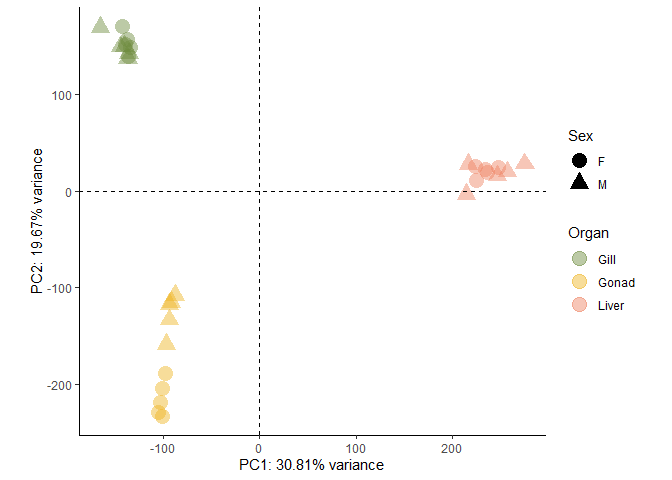

Differential Expression Analysis in *Syngnathus fuscus*
================
Coley Tosto
2024-07-16


- [Single factor analysis - Comparing Males v
  Females](#single-factor-analysis---comparing-males-v-females)
  - [Visualizing the results](#visualizing-the-results)
    - [MA-plot - MvF Diff.](#ma-plot---mvf-diff)
    - [Heatmap - Looking at patterns of overall
      expression](#heatmap---looking-at-patterns-of-overall-expression)
    - [Sample-dist Heatmap](#sample-dist-heatmap)
    - [PCA plots](#pca-plots)
- [Multifactor design - Comparing M v F across the diff tissue
  types](#multifactor-design---comparing-m-v-f-across-the-diff-tissue-types)
  - [Invesitgate the results of the differential
    expression](#invesitgate-the-results-of-the-differential-expression)
    - [M-F Liver Comparisson](#m-f-liver-comparisson)
    - [M-F Gill Comparisson](#m-f-gill-comparisson)
    - [M-F Gonad Comparisson](#m-f-gonad-comparisson)
    - [MA Plots](#ma-plots)
  - [Variation in FC across sex-bias and tissue
    type](#variation-in-fc-across-sex-bias-and-tissue-type)

``` r
#The abundance matrix generated via salmon and tximport to be used for the DE analysis
FU_txi.salmon <- readRDS("data/txi.salmon_FU.RDS")

#The samples file generated for tximport
FU_samples <- read.table("FU_samples.txt", header = TRUE)

#Make sure the conditions are in the samples file as a factor
FU_samples$Sex <- as.factor(FU_samples$Sex)
FU_samples$Organ <- as.factor(FU_samples$Organ)
```

The package `DESeq2` was used for the differential expression analysis
outlined below.

# Single factor analysis - Comparing Males v Females

I am starting with a single factor analysis to look at overall
differences between male and female expression across the organs and to
do some exploratory analysis of the data.

To analyze my data with DESeq2 I must first generate the DESeqDataSet.
In order to do this we need the abundance matrix generated with
`tximport` which is stored in the object “FU_txi.salmon” and was
generated at the end of the `Analyzing_fuscus_RNAseq_data_from_MSU.Rmd`
document and a `samples` file which is stored in the object “FU_samples”
that lays out all of the conditions.

``` r
#Create the DESeq dataset
dds_FU <- DESeqDataSetFromTximport(FU_txi.salmon, 
                                   colData = FU_samples,
                                   design = ~ Sex)
```

I am then going to pre-filter the data to remove low gene counts before
running further DESeq2 functions. By doing this we remove rows in which
there are very few reads thus reducing the memory size of the `dds`
object and increasing the speed at which we can use the transformation
and testing functions in DESeq2.

The cutoff used here was to remove reads that had a **total** count of
less than 10 in each row.

``` r
#only keeping rows that have at lead 10 reads total
keep <- rowSums(counts(dds_FU)) >= 10
dds_FU <- dds_FU[keep, ]
```

After filtering we can now perform the standard differential expression
analysis that is wrapped into DESeq2.

``` r
#Generate the expression values
dds_FU_exp <- DESeq(dds_FU)

#Compile the results
res <- results(dds_FU_exp)
res
```

    ## log2 fold change (MLE): Sex M vs F 
    ## Wald test p-value: Sex M vs F 
    ## DataFrame with 193637 rows and 6 columns
    ##                         baseMean log2FoldChange     lfcSE       stat    pvalue
    ##                        <numeric>      <numeric> <numeric>  <numeric> <numeric>
    ## TRINITY_DN0_c0_g1     1224.15627     -0.7105364  0.255547 -2.7804536 0.0054283
    ## TRINITY_DN0_c1_g1     4528.38058     -0.4239128  0.297621 -1.4243368 0.1543490
    ## TRINITY_DN0_c10_g1     552.52273     -0.0126323  0.182706 -0.0691402 0.9448780
    ## TRINITY_DN0_c11_g1      28.55379      0.7130072  0.506622  1.4073758 0.1593160
    ## TRINITY_DN0_c125_g1      2.62197      0.2234249  0.820431  0.2723262 0.7853712
    ## ...                          ...            ...       ...        ...       ...
    ## TRINITY_DN99991_c0_g1   0.644610       1.419240  1.615112   0.878725  0.379550
    ## TRINITY_DN99993_c0_g1   2.586928       0.660824  0.812081   0.813741  0.415793
    ## TRINITY_DN99995_c0_g1   0.361104       0.996595  2.973076   0.335206  0.737469
    ## TRINITY_DN99997_c0_g1   1.841278      -0.990609  1.293794  -0.765662  0.443878
    ## TRINITY_DN99999_c0_g1   0.452691      -2.016813  2.530238  -0.797084  0.425402
    ##                            padj
    ##                       <numeric>
    ## TRINITY_DN0_c0_g1      0.059560
    ## TRINITY_DN0_c1_g1      0.460392
    ## TRINITY_DN0_c10_g1     0.987621
    ## TRINITY_DN0_c11_g1     0.468337
    ## TRINITY_DN0_c125_g1    0.943650
    ## ...                         ...
    ## TRINITY_DN99991_c0_g1        NA
    ## TRINITY_DN99993_c0_g1  0.752957
    ## TRINITY_DN99995_c0_g1        NA
    ## TRINITY_DN99997_c0_g1  0.775208
    ## TRINITY_DN99999_c0_g1        NA

Once that has finished we can now start exploring some of the
single-factor analysis results.

``` r
##Ordering our results based on p-value
resOrdered <- res[order(res$pvalue),]
resOrdered
```

    ## log2 fold change (MLE): Sex M vs F 
    ## Wald test p-value: Sex M vs F 
    ## DataFrame with 193637 rows and 6 columns
    ##                        baseMean log2FoldChange     lfcSE      stat      pvalue
    ##                       <numeric>      <numeric> <numeric> <numeric>   <numeric>
    ## TRINITY_DN22310_c0_g1  804.2311        27.6241   1.89885   14.5477 6.03588e-48
    ## TRINITY_DN13824_c0_g1   92.1347        25.5625   1.92144   13.3039 2.19823e-40
    ## TRINITY_DN35004_c1_g2  129.5764        26.0372   2.10520   12.3680 3.89194e-35
    ## TRINITY_DN34941_c0_g1  260.2356        27.0195   2.24241   12.0493 1.95581e-33
    ## TRINITY_DN9279_c0_g1    23.3464        23.3498   1.95493   11.9441 6.97254e-33
    ## ...                         ...            ...       ...       ...         ...
    ## TRINITY_DN99935_c0_g1         0              0         0         0           1
    ## TRINITY_DN99938_c0_g1         0              0         0         0           1
    ## TRINITY_DN99956_c0_g1         0              0         0         0           1
    ## TRINITY_DN99961_c0_g1         0              0         0         0           1
    ## TRINITY_DN99973_c0_g1         0              0         0         0           1
    ##                              padj
    ##                         <numeric>
    ## TRINITY_DN22310_c0_g1 3.82524e-43
    ## TRINITY_DN13824_c0_g1 6.96563e-36
    ## TRINITY_DN35004_c1_g2 8.22172e-31
    ## TRINITY_DN34941_c0_g1 3.09873e-29
    ## TRINITY_DN9279_c0_g1  8.83769e-29
    ## ...                           ...
    ## TRINITY_DN99935_c0_g1          NA
    ## TRINITY_DN99938_c0_g1          NA
    ## TRINITY_DN99956_c0_g1          NA
    ## TRINITY_DN99961_c0_g1          NA
    ## TRINITY_DN99973_c0_g1          NA

``` r
summary(res)
```

    ## 
    ## out of 174116 with nonzero total read count
    ## adjusted p-value < 0.1
    ## LFC > 0 (up)       : 4003, 2.3%
    ## LFC < 0 (down)     : 3581, 2.1%
    ## outliers [1]       : 0, 0%
    ## low counts [2]     : 130262, 75%
    ## (mean count < 1)
    ## [1] see 'cooksCutoff' argument of ?results
    ## [2] see 'independentFiltering' argument of ?results

``` r
#Looking at  an alpha=0.05, the default is 0.1
res05 <- results(dds_FU_exp, alpha = 0.05)
summary(res05)
```

    ## 
    ## out of 174116 with nonzero total read count
    ## adjusted p-value < 0.05
    ## LFC > 0 (up)       : 2626, 1.5%
    ## LFC < 0 (down)     : 2488, 1.4%
    ## outliers [1]       : 0, 0%
    ## low counts [2]     : 123551, 71%
    ## (mean count < 1)
    ## [1] see 'cooksCutoff' argument of ?results
    ## [2] see 'independentFiltering' argument of ?results

``` r
sum(res05$padj < 0.05, na.rm = TRUE)
```

    ## [1] 5114

Looking at the summary of our results we can see that there are 2,626
male-biased genes and 2,488 female-biased genes when all of the organs
are organized together. While this is informative, I am more interested
in a multi-factor approach that takes into account both **Sex** and
**Tissue** type. Before the multi-factor analysis, we can visualize some
results from the single-factor analysis and use it for exploratory data
analysis.

Interestingly, the summary is saying that there are 0 outliers, which I
have a hard time believing.

## Visualizing the results

### MA-plot - MvF Diff.

Generate an MA-plot to show the log2 fold changes attributable to sex
over the mean of normalized counts for all of the samples in the `dds`.
Points will be colored if the adjusted p-value is less that 0.05.

<figure>

<figcaption aria-hidden="true">LogFC versus the mean normalized count
for all of the genes. Points that are blue have a p-value less than
0.05. The two plots are the same with the only difference coming from an
adjusted y-limit. Points that are triangles represent genes with a fold
change higher/lower than the y-limit.</figcaption>
</figure>

### Heatmap - Looking at patterns of overall expression

We can also generate a heat map to look ar overall expression levels
across our samples. Note, this is not differentially expressed genes.

<figure>

<figcaption aria-hidden="true">Heatmap showing the expression level
across all organs for the top 20 genes with the highest expression
levels.</figcaption>
</figure>

From the heatmap we can see that for a lot of the top expressed genes
the highest expression are found in the liver. There appears to be a few
genes that are highly expressed across all tissues and a few genes that
are highly expressed in the gill tissues relative to the other tissues.
With this heatmap we can also pull out the names of the Trinity genes
that are showing this high expression and BLAST the corresponding
sequences to see what the genes are.

``` r
#Pull out the corresponding trinity_geneIDS that are plotted in the heatmap
heatmap_TG <- cbind(row.names(assay(vsd)[select,]))

#Export the gene names
write.table(heatmap_TG,
            'FU_heatmap_trinitygenes.txt',
            sep = "",
            quote=FALSE,
            row.names = FALSE,
            col.names = FALSE)
```

### Sample-dist Heatmap

We can then generate a sample-to-sample distances heatmap that will give
an overview of the similarities and differences between our samples.

<figure>

<figcaption aria-hidden="true">Sample-to-sample distances heatmap
showing the similarities and differences between all of the samples. The
darker the color, the more similar the samples are. The diagonal line of
very dark blue represents the comparissons between the same
samples.</figcaption>
</figure>

We can see that the highest similarities (aside from same samples
comparisons) is between samples from the same organ. After that we can
see high similarities between the male gonads and the female gonads.
There are also a couple samples that may be an issue for use as they are
not similar to any of the other samples from the same group. This
includes FUG11M4 and FUT11M4. I may end up removing all organs related
to 11M4.

### PCA plots

Next we can look at PCA plots for our samples to see how our different
samples are grouping.

    ## Scale for colour is already present.
    ## Adding another scale for colour, which will replace the existing scale.
    ## Scale for colour is already present.
    ## Adding another scale for colour, which will replace the existing scale.
    ## Scale for colour is already present.
    ## Adding another scale for colour, which will replace the existing scale.
    ## Scale for colour is already present.
    ## Adding another scale for colour, which will replace the existing scale.
    ## Scale for colour is already present.
    ## Adding another scale for colour, which will replace the existing scale.
    ## Scale for colour is already present.
    ## Adding another scale for colour, which will replace the existing scale.

<figure>

<figcaption aria-hidden="true">Principal components analysis pairsplot
showing PCA axis 1 - 4.</figcaption>
</figure>

From the pairs plot we can see that PC1 appears to be explaining
differences between the liver and the other tissues, PC2 appears to be
explaining differences between gonadal and somatic tissues, PC3 seems to
account for differences between male and female samples, especially in
the gonads and in PC4 we can see the one problematic gill sample from
above sticking out from all the rest. I am going to plot all of PC2 - 4
against PC1 below for a clearer picture.

<figure>

<figcaption aria-hidden="true">Principal components analysis reflects
that most variation corresponds to differences in expression between
organs (green: gill; yellow: gonad; pink: liver), rather than variation
due to sex (circle = female; triangle = male). The first axis explains
31% of variation in the dataset, and largely explains differences
between the liver and the other tissues. The second axis explains 20% of
the variation in gene expression, with somatic tissues on the opposite
side of the axis from the gonads.</figcaption>
</figure>

<figure>

<figcaption aria-hidden="true">The same Principal Components Analysis as
above but with PC3. This third axis explains 10% of the variation,
largely attributed to differences between the sexes, particularily in
the gonads.</figcaption>
</figure>

<figure>

<figcaption aria-hidden="true">The same Principal Components Analysis as
above but with PC4. This fourth axis explains 6% of the variation,
largely attributed to one of the gill samples.</figcaption>
</figure>

#### Saving the PCA plots to use in figure creation

I will be including the PCAs describing the relationship between PC1 - 3
in the main text, as they account for the majority of the differences
between our samples. The plot with PC1 and PC4 I still want to export,
and will likely include as a supplemental to highlight why samples
related to 11M4 will be removed from the subsequent analyses.

``` r
#Setting the shapes I want to show up for the different organs
organ_shapes <- c(Gill = 16, Liver = 17, Gonad = 15)

#Setting the colors I want for each sex
sex_cols <- c("F" = "#7fc97f", "M" = "#beaed4")
```

``` r
#Create the blank pdf to store the plot in
pdf("docs/figs/Fig_PCA1v2.pdf",height = 6,width=6)

#Set the plotting parameters
par(mar=c(4,5,4,1), oma=c(2,2,2,2))

#Create the plot for PC1 v PC2
plot(pca_plotting_data$PC1,
     pca_plotting_data$PC2,
     col = paste0(sex_cols[pca_plotting_data$Sex],"75"),
     pch = organ_shapes[pca_plotting_data$Organ],
     cex = 2,
     cex.lab = 2,
     cex.axis = 1.75,
     xlab = paste0("PC1: ",percentVar[1], "% variance"),
     ylab = paste0("PC2: ",percentVar[2], "% variance"),
     bty = 'l',
     xpd = TRUE)

#Add a legend describing the sex
outer_legend("top",
             c("Female","Male"),
             pch = 18,
             bty = 'n',
             col=paste0(sex_cols,"75"),
             cex = 1.75,
             ncol = 2,
             pt.cex = 3)

dev.off()
```

``` r
#Create the blank pdf to store the plot in
pdf("docs/figs/Fig_PCA1v3.pdf",height = 6,width=6)

#Set the plotting parameters
par(mar=c(4,5,4,1), oma=c(2,2,2,2))

#Create the plot for PC1 v PC3
plot(pca_plotting_data$PC1,
     pca_plotting_data$PC3,
     col = paste0(sex_cols[pca_plotting_data$Sex],"75"),
     pch = organ_shapes[pca_plotting_data$Organ],
     cex = 2,
     cex.lab = 2,
     cex.axis = 1.75,
     xlab = paste0("PC1: ",percentVar[1], "% variance"),
     ylab = paste0("PC3: ",percentVar[3], "% variance"),
     bty = 'l',
     xpd = TRUE)

#Add  legend describing the organs
outer_legend("top",
             c("Gill","Gonad","Liver"),
             pch = c(16,15,17),
             bty = 'n',
             col = 'darkgrey',
             cex = 1.75,
             ncol = 3,
             pt.cex = 3)

dev.off()
```

``` r
#Create the blank pdf to store the plot in
pdf("docs/figs/Fig_PCA1v4.pdf",height = 6,width=8)

#Set the plotting parameters
par(mar=c(4,5,1,5),oma=c(2,2,2,2))

#Create the plot for PC1 v PC4
plot(pca_plotting_data$PC1,
     pca_plotting_data$PC4,
     col = paste0(sex_cols[pca_plotting_data$Sex],"75"),
     pch = organ_shapes[pca_plotting_data$Organ],
     cex = 2,
     cex.lab = 2,
     cex.axis = 1.75,
     xlab = paste0("PC1: ",percentVar[1], "% variance"),
     ylab = paste0("PC4: ",percentVar[4], "% variance"),
     bty = 'l',
     xpd = TRUE)

text(pca_plotting_data$PC1[pca_plotting_data$ID == "FUG11M4"] + 50,
     pca_plotting_data$PC4[pca_plotting_data$ID == "FUG11M4"] - 25,
     labels = pca_plotting_data$ID[pca_plotting_data$ID == "FUG11M4"])

#Add  legend describing the organs and sex
outer_legend("right",
             c("Gill","Gonad","Liver"),
             pch = c(16,15,17),
             bty = 'n',
             col = 'darkgrey',
             cex = 1.5,
             ncol = 1,
             pt.cex = 2.25)

outer_legend("topright",
             c("Female","Male"),
             pch = 18,
             bty = 'n',
             col=paste0(sex_cols,"75"),
             cex = 1.5,
             ncol = 1,
             pt.cex = 2.25)
dev.off()
```

#### Creating heatmaps based on the PCA axes

I now want to generate heatmaps based on the genes that have the highest
loadings for each of the PCA axes. I will be using a cut off of 0.02 to
determine which genes will be includd in the heatmaps. Once again I am
doing this for PCA1-4, but will likely only inlcude PCA1-3 in a figure
for the maintext and PC4 will go in the supplemental.

``` r
df <- as.data.frame(FU_samples[,c("Sex", "Organ")])
rownames(df) <- FU_samples$ID
df$Organ <- as.character(df$Organ)

organ_cols<-c("Gill" = "#20B2AA",
              "Gonad" = "#EEB422", 
              "Liver" = "#EE8262")

ann_colors = list(Sex=sex_cols,
                  Organ=organ_cols)

col_order <- c(rownames(df[df$Sex=="F" & df$Organ=="Gill",]),
               rownames(df[df$Sex=="M" & df$Organ=="Gill",]),
               rownames(df[df$Sex=="F" & df$Organ=="Gonad",]),
               rownames(df[df$Sex=="M" & df$Organ=="Gonad",]),
               rownames(df[df$Sex=="F" & df$Organ=="Liver",]),
               rownames(df[df$Sex=="M" & df$Organ=="Liver",]))

pca_rotation <- pca$rotation[, 1:4]
```

``` r
#Function to use to export the heatmaps to pdfs
# from https://stackoverflow.com/questions/43051525/how-to-draw-pheatmap-plot-to-screen-and-also-save-to-file
save_pheatmap_pdf <- function(x, filename, width=7, height=7) {
  stopifnot(!missing(x))
  stopifnot(!missing(filename))
  pdf(filename, width=width, height=height)
  grid::grid.newpage()
  grid::grid.draw(x$gtable)
  dev.off()
}
```

``` r
pc1 <- pheatmap(assay(vsd)[which(abs(pca_rotation[,1]) >= 0.02), col_order], 
                cluster_rows = FALSE, 
                show_rownames = FALSE, 
                cluster_cols = FALSE, 
                show_colnames = FALSE,
                annotation_col = df,
                annotation_colors = ann_colors,
                cellwidth = 9,
                fontsize = 16,
                annotation_legend = FALSE,
                main = "Top loading genes on PC1")

save_pheatmap_pdf(pc1, "docs/figs/Fig_pc1_heatmap.pdf",
                  width=6,
                  height=6)
```

``` r
pc2 <- pheatmap(assay(vsd)[which(abs(pca_rotation[,2]) >= 0.02), col_order], 
                cluster_rows = FALSE, 
                show_rownames = FALSE, 
                cluster_cols = FALSE, 
                show_colnames = FALSE,
                annotation_col = df,
                annotation_colors=ann_colors,
                cellwidth = 9,
                fontsize = 16,
                annotation_legend = FALSE,
                main = "Top loading genes on PC2")

save_pheatmap_pdf(pc2, "docs/figs/Fig_pc2_heatmap.pdf",
                  width=6,
                  height=6)
```

``` r
pc3 <- pheatmap(assay(vsd)[which(abs(pca_rotation[,3]) >= 0.02), col_order], 
                cluster_rows = FALSE, 
                show_rownames = FALSE, 
                cluster_cols = FALSE, 
                show_colnames = FALSE,
                annotation_col = df,
                annotation_colors=ann_colors,
                cellwidth = 9,
                fontsize = 16,
                border_color = NA,
                main = "Top loading genes on PC3")

save_pheatmap_pdf(pc3, "docs/figs/Fig_pc3_heatmap.pdf",
                  width=6,
                  height=6)
```

``` r
pc4 <- pheatmap(assay(vsd)[which(abs(pca_rotation[,4]) >= 0.02), col_order], 
                cluster_rows = FALSE, 
                show_rownames = FALSE, 
                cluster_cols = FALSE, 
                show_colnames = FALSE,
                annotation_col = df,
                annotation_colors=ann_colors,
                cellwidth = 9,
                fontsize = 16,
                border_color = NA,
                main = "Top loading genes on PC4")

save_pheatmap_pdf(pc4, "docs/figs/Fig_pc4_heatmap.pdf",
                  width=6,
                  height=6)
```

#### Making the combined figure

``` r
figPCAa <- image_ggplot(image_read_pdf('docs/figs/Fig_PCA1v2.pdf'),
                        interpolate = TRUE)
figPCAb <- image_ggplot(image_read_pdf('docs/figs/Fig_PCA1v3.pdf'),
                        interpolate = TRUE)
figPCAc <- image_ggplot(image_read_pdf('docs/figs/Fig_pc1_heatmap.pdf'),
                        interpolate = TRUE)
figPCAd <- image_ggplot(image_read_pdf('docs/figs/Fig_pc2_heatmap.pdf'),
                        interpolate = TRUE)
figPCAe <- image_ggplot(image_read_pdf('docs/figs/Fig_pc3_heatmap.pdf'),
                        interpolate = TRUE)

# make two patchworks
pcas <- figPCAa + figPCAb
hms <- figPCAc + figPCAd + figPCAe

# put the patchworks together
figPCA <-  wrap_plots(pcas,
                      hms,
                      ncol=1) + 
  plot_annotation(tag_levels = 'A') 

ggsave("docs/figs/FigPCA.pdf", figPCA, height=4, width=5)
ggsave("docs/figs/FigPCA.png", figPCA, height=4, width=5) # also save as a png
```

``` r
figPCA4 <- image_ggplot(image_read_pdf('docs/figs/Fig_PCA1v4.pdf'),
                        interpolate = TRUE)
figPCA4_hm <- image_ggplot(image_read_pdf('docs/figs/Fig_pc4_heatmap.pdf'),
                           interpolate = TRUE)

# put the patchworks together
figPCA_supp <-  wrap_plots(figPCA4, figPCA4_hm, ncol=2) + 
  plot_annotation(tag_levels = 'A') 

ggsave("docs/figs/FigPCA_supp.pdf", figPCA_supp, height=4, width=8)
ggsave("docs/figs/FigPCA_supp.png", figPCA_supp, height=4, width=8) # also save as a png
```

``` r
figPCA
```

<!-- -->

# Multifactor design - Comparing M v F across the diff tissue types

If we investigate the column data of our DESeq dataset we can see that
each sample has both a sex and organ type attached to it, we will be
using these two factors in our multi-factor analysis. Prior to running
the multi-factor analysis I am going to remove the samples that
correspond to the individual 11M4.

``` r
#Create an additional column the has the two conditions combined(sex and organ type)
FU_samples$group <- factor(paste0(FU_samples$Sex, FU_samples$Organ))

##Create a copy of the DESeq dataset
ddsMF_FU <- DESeqDataSetFromTximport(FU_txi.salmon,
                                     colData = FU_samples,
                                     design = ~ group)

##Remove all 11M4 organs from the dataset
ddsMF_FU <- ddsMF_FU[, !(ddsMF_FU$ID %in% c("FUT11M4", "FUG11M4", "FUL11M4"))]

##Filter the dataset, only keeping rows that have at least 10 reads total
keep <- rowSums(counts(ddsMF_FU)) >= 10
ddsMF_FU <- ddsMF_FU[keep, ]

#Run the differential expression analysis
ddsMF_FU_exp <- DESeq(ddsMF_FU)
resultsNames(ddsMF_FU_exp)
```

    ## [1] "Intercept"             "group_FGonad_vs_FGill" "group_FLiver_vs_FGill"
    ## [4] "group_MGill_vs_FGill"  "group_MGonad_vs_FGill" "group_MLiver_vs_FGill"

``` r
#Looking at the Normalized read counts for each sample
cbind(FU_samples[!(FU_samples$ID %in% 
                     c("FUT11M4", "FUG11M4", "FUL11M4")),],
      normalizedReads=colSums(counts(ddsMF_FU_exp, 
                                     normalized=TRUE)
                              )
      )
```

    ##         ID Sex Organ  group normalizedReads
    ## 1  FUG10M2   M  Gill  MGill        24127581
    ## 2  FUG11F1   F  Gill  FGill        25620273
    ## 3  FUG11M2   M  Gill  MGill        24773886
    ## 5  FUG12M1   M  Gill  MGill        25685953
    ## 6  FUG13F1   F  Gill  FGill        26212779
    ## 7  FUG13F4   F  Gill  FGill        24803053
    ## 8  FUG15M5   M  Gill  MGill        23866915
    ## 9   FUG2F2   F  Gill  FGill        28033979
    ## 10  FUG3F2   F  Gill  FGill        25512447
    ## 11 FUL10M2   M Liver MLiver        94425427
    ## 12 FUL11F1   F Liver FLiver        82595903
    ## 13 FUL11M2   M Liver MLiver       118909536
    ## 15 FUL12M1   M Liver MLiver       114375220
    ## 16 FUL13F1   F Liver FLiver        97875307
    ## 17 FUL13F4   F Liver FLiver        90282028
    ## 18 FUL15M5   M Liver MLiver       117231749
    ## 19  FUL2F2   F Liver FLiver       241462147
    ## 20  FUL3F2   F Liver FLiver        69932839
    ## 21 FUO11F1   F Gonad FGonad        32378203
    ## 22 FUO13F1   F Gonad FGonad        29331475
    ## 23 FUO13F4   F Gonad FGonad        25761811
    ## 24  FUO2F2   F Gonad FGonad        26870920
    ## 25  FUO3F2   F Gonad FGonad        29802282
    ## 26 FUT10M2   M Gonad MGonad        21635189
    ## 27 FUT11M2   M Gonad MGonad        21114528
    ## 29 FUT12M1   M Gonad MGonad        20609565
    ## 30 FUT15M5   M Gonad MGonad        20385206

If we look at the summary of normalized reads across the different
tissue types, we can see that there are considerably more in the liver
relative to the other tissue types. Because during a multi-factor
analysis normalization occurs across all of the tissues, I am opting to
also remove some of the extremely expressed genes to try and offset the
differences.

``` r
##Filter the dataset, only keeping rows that have at least 10 reads total AND less than one million
keep <- rowSums(counts(ddsMF_FU)) >= 10 & rowSums(counts(ddsMF_FU)) < 1e6
ddsMF_FU <- ddsMF_FU[keep, ]

#Re-run the differential expression analysis
ddsMF_FU_exp <- DESeq(ddsMF_FU)

#Re investigate the Normalized read counts for each sample
cbind(FU_samples[!(FU_samples$ID %in% 
                     c("FUT11M4", "FUG11M4", "FUL11M4")),],
      normalizedReads=colSums(counts(ddsMF_FU_exp, 
                                     normalized=TRUE)
                              )
      )
```

    ##         ID Sex Organ  group normalizedReads
    ## 1  FUG10M2   M  Gill  MGill        19883120
    ## 2  FUG11F1   F  Gill  FGill        20865455
    ## 3  FUG11M2   M  Gill  MGill        20543583
    ## 5  FUG12M1   M  Gill  MGill        20858795
    ## 6  FUG13F1   F  Gill  FGill        21316492
    ## 7  FUG13F4   F  Gill  FGill        20229015
    ## 8  FUG15M5   M  Gill  MGill        19923606
    ## 9   FUG2F2   F  Gill  FGill        22070324
    ## 10  FUG3F2   F  Gill  FGill        21008945
    ## 11 FUL10M2   M Liver MLiver        38972714
    ## 12 FUL11F1   F Liver FLiver        35640412
    ## 13 FUL11M2   M Liver MLiver        42259174
    ## 15 FUL12M1   M Liver MLiver        45477421
    ## 16 FUL13F1   F Liver FLiver        40097766
    ## 17 FUL13F4   F Liver FLiver        36257031
    ## 18 FUL15M5   M Liver MLiver        43583313
    ## 19  FUL2F2   F Liver FLiver        67407162
    ## 20  FUL3F2   F Liver FLiver        33148924
    ## 21 FUO11F1   F Gonad FGonad        29957898
    ## 22 FUO13F1   F Gonad FGonad        27326742
    ## 23 FUO13F4   F Gonad FGonad        23429206
    ## 24  FUO2F2   F Gonad FGonad        24666955
    ## 25  FUO3F2   F Gonad FGonad        28109050
    ## 26 FUT10M2   M Gonad MGonad        19290194
    ## 27 FUT11M2   M Gonad MGonad        18967681
    ## 29 FUT12M1   M Gonad MGonad        18757421
    ## 30 FUT15M5   M Gonad MGonad        18429583

With this change we can now see that there is more even levels of
expression across the different tissue types.

## Invesitgate the results of the differential expression

Thanks to the multi-factor analysis we can now explore differential
expression between all of the different combinations of tissues and
sexes:

- Male Liver v. Female Liver
- Male Gill v. Female Gill  
- Male Gonad v. Female Gonad  
- All of the within sex tissue comparisons (e.g. Male Liver v. Male
  Gill, etc.)

### M-F Liver Comparisson

``` r
##Pulling out the liver M-F results with an alpha of 0.05
FU_liver_con_res <- results(ddsMF_FU_exp, 
                            contrast = c("group", "MLiver", "FLiver"), 
                            alpha = 0.05)
FU_liver_con_res$trin_geneid <- rownames(FU_liver_con_res)
head(FU_liver_con_res)
```

    ## log2 fold change (MLE): group MLiver vs FLiver 
    ## Wald test p-value: group MLiver vs FLiver 
    ## DataFrame with 6 rows and 7 columns
    ##                       baseMean log2FoldChange     lfcSE      stat     pvalue
    ##                      <numeric>      <numeric> <numeric> <numeric>  <numeric>
    ## TRINITY_DN0_c0_g1   1259.36897      -0.946137  0.310797 -3.044227 0.00233279
    ## TRINITY_DN0_c1_g1   4676.25499       0.230724  0.265546  0.868866 0.38492048
    ## TRINITY_DN0_c10_g1   563.87777       0.199304  0.339963  0.586252 0.55770625
    ## TRINITY_DN0_c11_g1    29.98589       0.847210  0.747662  1.133146 0.25715309
    ## TRINITY_DN0_c125_g1    2.23427      -1.006939  1.512383 -0.665797 0.50554118
    ## TRINITY_DN0_c13_g1    24.89771       0.986249  0.775161  1.272314 0.20326140
    ##                          padj         trin_geneid
    ##                     <numeric>         <character>
    ## TRINITY_DN0_c0_g1   0.0284562   TRINITY_DN0_c0_g1
    ## TRINITY_DN0_c1_g1   0.7002120   TRINITY_DN0_c1_g1
    ## TRINITY_DN0_c10_g1  0.8367827  TRINITY_DN0_c10_g1
    ## TRINITY_DN0_c11_g1  0.5683710  TRINITY_DN0_c11_g1
    ## TRINITY_DN0_c125_g1        NA TRINITY_DN0_c125_g1
    ## TRINITY_DN0_c13_g1  0.5018550  TRINITY_DN0_c13_g1

``` r
summary(FU_liver_con_res)
```

    ## 
    ## out of 157005 with nonzero total read count
    ## adjusted p-value < 0.05
    ## LFC > 0 (up)       : 2302, 1.5%
    ## LFC < 0 (down)     : 1289, 0.82%
    ## outliers [1]       : 5538, 3.5%
    ## low counts [2]     : 114872, 73%
    ## (mean count < 6)
    ## [1] see 'cooksCutoff' argument of ?results
    ## [2] see 'independentFiltering' argument of ?results

I will be classifying sex-biased genes the same way that I did for
*Syngnathus floridae* as **genes with a p-value \< 0.05 AND a logFC
$\ge$ \|2\|**. With that criteria in the liver there are 1805
male-biased genes and 446 female-biased genes.

I have then pulled out all of the male-biased, female-biased, and
non-biased genes based on the criteria outlined above. I determined
non-biased genes as a p-vaule \> 0.05.

``` r
#Removing the rows where padj. is NA in results
FU_liver_con_res_noNA <- FU_liver_con_res[!is.na(FU_liver_con_res$padj),]
summary(FU_liver_con_res_noNA) #We can now see that there are no outliers or low counts since the NAs have been removed
```

    ## 
    ## out of 36595 with nonzero total read count
    ## adjusted p-value < 0.05
    ## LFC > 0 (up)       : 2302, 6.3%
    ## LFC < 0 (down)     : 1289, 3.5%
    ## outliers [1]       : 0, 0%
    ## low counts [2]     : 0, 0%
    ## (mean count < 6)
    ## [1] see 'cooksCutoff' argument of ?results
    ## [2] see 'independentFiltering' argument of ?results

``` r
#Creating a vector that contains all of the male-biased and female-biased genes in the liver
FU_liver_mal_biased <- FU_liver_con_res_noNA[which(FU_liver_con_res_noNA$log2FoldChange >= 2 &
                                                     FU_liver_con_res_noNA$padj <= 0.05),]

FU_liver_fem_biased <- FU_liver_con_res_noNA[which(FU_liver_con_res_noNA$log2FoldChange <= -2 &
                                                     FU_liver_con_res_noNA$padj <= 0.05),]

#Creating an object that contains all of the non-biased genes in the liver
FU_liver_non_biased <- FU_liver_con_res_noNA[which(FU_liver_con_res_noNA$padj > 0.05),]
```

I will be generating a table that outlines the genes that are the most
male or female biased in each organ type. To do this I need to pull the
top 50 differentially expressed genes in males or females, get the
Trinity gene IDs and then BLAST the corresponding sequences. Here I am
pulling out the Trinity gene IDs for those genes.

``` r
#Creating a subset of the results where the p-value is less than 0.05
FU_liver_con_res_p05 <- FU_liver_con_res_noNA[FU_liver_con_res_noNA$padj <= 0.05, ]


#Pulling the top 50 diff expressed genes in Males
top50_FU_MLiver <- head(FU_liver_con_res_p05[order(FU_liver_con_res_p05$log2FoldChange, 
                                                   decreasing = TRUE), ], 
                        n = 50)

#Run once to generate the file and then commented out
write.table(cbind(rownames(top50_FU_MLiver)),
            'FU_maleL_top50TRgenes.txt', 
             sep = "", 
            quote=FALSE, 
            row.names = FALSE, 
            col.names = FALSE)


#Pulling the top 50 diff expressed genes in Females
top50_FU_Fliver <- head(FU_liver_con_res_p05[order(FU_liver_con_res_p05$log2FoldChange, 
                                                   decreasing = FALSE), ], 
                        n = 50)

#Run once to generate the file and then commented out
write.table(cbind(rownames(top50_FU_Fliver)),
            'FU_femL_top50TRgenes.txt', 
             sep = "", 
            quote=FALSE, 
            row.names = FALSE, 
            col.names = FALSE)
```

### M-F Gill Comparisson

``` r
##Pulling out the gill M-F results
gill_con_res_FU <- results(ddsMF_FU_exp, 
                           contrast = c("group", "MGill", "FGill"), 
                           alpha = 0.5)
gill_con_res_FU$trin_geneid <- rownames(gill_con_res_FU)
head(gill_con_res_FU)
```

    ## log2 fold change (MLE): group MGill vs FGill 
    ## Wald test p-value: group MGill vs FGill 
    ## DataFrame with 6 rows and 7 columns
    ##                       baseMean log2FoldChange     lfcSE        stat    pvalue
    ##                      <numeric>      <numeric> <numeric>   <numeric> <numeric>
    ## TRINITY_DN0_c0_g1   1259.36897    -0.21026123  0.309346 -0.67969513  0.496698
    ## TRINITY_DN0_c1_g1   4676.25499    -0.00217425  0.265296 -0.00819557  0.993461
    ## TRINITY_DN0_c10_g1   563.87777    -0.04637597  0.333922 -0.13888259  0.889543
    ## TRINITY_DN0_c11_g1    29.98589     0.51752973  0.723823  0.71499451  0.474612
    ## TRINITY_DN0_c125_g1    2.23427    -1.09088174  1.238903 -0.88052246  0.378576
    ## TRINITY_DN0_c13_g1    24.89771     0.26373722  0.701413  0.37600843  0.706911
    ##                          padj         trin_geneid
    ##                     <numeric>         <character>
    ## TRINITY_DN0_c0_g1           1   TRINITY_DN0_c0_g1
    ## TRINITY_DN0_c1_g1           1   TRINITY_DN0_c1_g1
    ## TRINITY_DN0_c10_g1          1  TRINITY_DN0_c10_g1
    ## TRINITY_DN0_c11_g1          1  TRINITY_DN0_c11_g1
    ## TRINITY_DN0_c125_g1        NA TRINITY_DN0_c125_g1
    ## TRINITY_DN0_c13_g1          1  TRINITY_DN0_c13_g1

``` r
summary(gill_con_res_FU)
```

    ## 
    ## out of 157005 with nonzero total read count
    ## adjusted p-value < 0.5
    ## LFC > 0 (up)       : 71, 0.045%
    ## LFC < 0 (down)     : 46, 0.029%
    ## outliers [1]       : 5538, 3.5%
    ## low counts [2]     : 109489, 70%
    ## (mean count < 4)
    ## [1] see 'cooksCutoff' argument of ?results
    ## [2] see 'independentFiltering' argument of ?results

In the gills there were 14 genes that we can consider male-biased and 16
female-biased genes based on our criteria for sex-bias.

I have then pulled out all of the male-biased, female-biased, and
non-biased genes to save them into their own objects.

``` r
#Removing the rows where padj. is NA in results
FU_gill_con_res_noNA <- gill_con_res_FU[!is.na(gill_con_res_FU$padj), ]
summary(FU_gill_con_res_noNA) #We can now see that there are no outliers or low counts since the NAs have been removed
```

    ## 
    ## out of 41978 with nonzero total read count
    ## adjusted p-value < 0.5
    ## LFC > 0 (up)       : 71, 0.17%
    ## LFC < 0 (down)     : 46, 0.11%
    ## outliers [1]       : 0, 0%
    ## low counts [2]     : 0, 0%
    ## (mean count < 4)
    ## [1] see 'cooksCutoff' argument of ?results
    ## [2] see 'independentFiltering' argument of ?results

``` r
#Creating a vector that contains all of the male-biased and female-biased genes in the gills
FU_gill_mal_biased <- FU_gill_con_res_noNA[which(FU_gill_con_res_noNA$log2FoldChange >= 2 
                                                 & FU_gill_con_res_noNA$padj <= 0.05),]
FU_gill_fem_biased <- FU_gill_con_res_noNA[which(FU_gill_con_res_noNA$log2FoldChange <= -2 
                                                 & FU_gill_con_res_noNA$padj <= 0.05),]

#Creating an object that contains all of the non-biased genes in the gills, p>0.05
FU_gill_non_biased <- FU_gill_con_res_noNA[which(FU_gill_con_res_noNA$padj > 0.05),]
```

Here I am getting the trinity gene IDs that correspond to the top 50
differentially expressed genes for males and females.

``` r
#Creating a subset of results where p-value is less than 0.05
FU_gill_con_res_p05 <- FU_gill_con_res_noNA[FU_gill_con_res_noNA$padj <= 0.05,]

#Pulling the top 50 diff expressed genes in Males
top50_FU_MGill <- head(FU_gill_con_res_p05[order(FU_gill_con_res_p05$log2FoldChange, 
                                                 decreasing = TRUE),], 
                       n=50)

#Run once to generate the file and then commented out
write.table(cbind(rownames(top50_FU_MGill)),
            'FU_maleG_top50TRgenes.txt', 
            sep = "", 
            quote=FALSE, 
            row.names = FALSE, 
            col.names = FALSE)

#Pulling the top 50 diff expressed genes in Females
top50_FU_FGill <- head(FU_gill_con_res_p05[order(FU_gill_con_res_p05$log2FoldChange, 
                                                 decreasing = FALSE),], 
                       n=50)

#Run once to generate the file and then commented out
write.table(cbind(rownames(top50_FU_FGill)),
            'FU_femG_top50TRgenes.txt', 
            sep = "", 
            quote=FALSE, 
            row.names = FALSE, 
            col.names = FALSE)
```

### M-F Gonad Comparisson

``` r
##Pulling out the gonad M-F results
gonad_con_res_FU <- results(ddsMF_FU_exp, 
                            contrast = c("group", "MGonad", "FGonad"), 
                            alpha = 0.05)
gonad_con_res_FU$trin_geneid <- rownames(gonad_con_res_FU)
head(gonad_con_res_FU)
```

    ## log2 fold change (MLE): group MGonad vs FGonad 
    ## Wald test p-value: group MGonad vs FGonad 
    ## DataFrame with 6 rows and 7 columns
    ##                       baseMean log2FoldChange     lfcSE      stat      pvalue
    ##                      <numeric>      <numeric> <numeric> <numeric>   <numeric>
    ## TRINITY_DN0_c0_g1   1259.36897     -1.0427427  0.309652 -3.367466 7.58623e-04
    ## TRINITY_DN0_c1_g1   4676.25499     -1.3428381  0.264994 -5.067420 4.03243e-07
    ## TRINITY_DN0_c10_g1   563.87777     -0.0888395  0.333925 -0.266046 7.90204e-01
    ## TRINITY_DN0_c11_g1    29.98589      1.7127089  0.745281  2.298071 2.15578e-02
    ## TRINITY_DN0_c125_g1    2.23427      3.7538363  1.508099  2.489118 1.28060e-02
    ## TRINITY_DN0_c13_g1    24.89771     -1.9197578  0.710697 -2.701232 6.90831e-03
    ##                            padj         trin_geneid
    ##                       <numeric>         <character>
    ## TRINITY_DN0_c0_g1   3.87893e-03   TRINITY_DN0_c0_g1
    ## TRINITY_DN0_c1_g1   4.52179e-06   TRINITY_DN0_c1_g1
    ## TRINITY_DN0_c10_g1  9.67759e-01  TRINITY_DN0_c10_g1
    ## TRINITY_DN0_c11_g1  6.37398e-02  TRINITY_DN0_c11_g1
    ## TRINITY_DN0_c125_g1 4.19374e-02 TRINITY_DN0_c125_g1
    ## TRINITY_DN0_c13_g1  2.52487e-02  TRINITY_DN0_c13_g1

``` r
summary(gonad_con_res_FU)
```

    ## 
    ## out of 157005 with nonzero total read count
    ## adjusted p-value < 0.05
    ## LFC > 0 (up)       : 12259, 7.8%
    ## LFC < 0 (down)     : 7309, 4.7%
    ## outliers [1]       : 5538, 3.5%
    ## low counts [2]     : 90084, 57%
    ## (mean count < 2)
    ## [1] see 'cooksCutoff' argument of ?results
    ## [2] see 'independentFiltering' argument of ?results

Between the ovaries and testis (gonads) there were 8886 genes that we
can consider male-biased and 3884 female-biased genes based on our
criteria for sex-bias.

From the gonad M-F results I have then pulled out all of the
male-biased, female-biased, and non-biased genes and saved them to their
own objects.

``` r
#Removing the rows where padj. is NA in results
FU_gonad_con_res_noNA <- gonad_con_res_FU[!is.na(gonad_con_res_FU$padj), ]
summary(FU_gonad_con_res_noNA) #We can now see that there are no outliers or low counts since the NAs have been removed
```

    ## 
    ## out of 61383 with nonzero total read count
    ## adjusted p-value < 0.05
    ## LFC > 0 (up)       : 12259, 20%
    ## LFC < 0 (down)     : 7309, 12%
    ## outliers [1]       : 0, 0%
    ## low counts [2]     : 0, 0%
    ## (mean count < 2)
    ## [1] see 'cooksCutoff' argument of ?results
    ## [2] see 'independentFiltering' argument of ?results

``` r
#Creating an object that contains all of the male-biased and female-biased genes in the gonads
FU_gonad_mal_biased <- FU_gonad_con_res_noNA[which(FU_gonad_con_res_noNA$log2FoldChange >= 2 
                                                   & FU_gonad_con_res_noNA$padj <= 0.05),]
FU_gonad_fem_biased <- FU_gonad_con_res_noNA[which(FU_gonad_con_res_noNA$log2FoldChange <= -2 
                                                   & FU_gonad_con_res_noNA$padj <= 0.05),]

#Creating an object that contains all of the non-biased genes in the gonads, p>0.05
FU_gonad_non_biased <- FU_gonad_con_res_noNA[which(FU_gonad_con_res_noNA$padj > 0.05),]
```

I then pulled out the trinity gene IDs that corresponded to the top 50
differentially expressed genes in males and females so that I could
BLAST the sequences.

``` r
#Creating a subset of the results where the p-value is less than 0.05
FU_gonad_con_res_p05 <- FU_gonad_con_res_noNA[FU_gonad_con_res_noNA$padj <= 0.05,]

#Pulling the top 50 diff expressed genes in Males
top50_FU_MGonad <- head(FU_gonad_con_res_p05[order(FU_gonad_con_res_p05$log2FoldChange, 
                                                   decreasing = TRUE),], 
                        n=50)

#Run once to generate the file and then commented out
write.table(cbind(rownames(top50_FU_MGonad)),
            'FU_maleGon_top50TRgenes.txt', 
            sep = "", 
            quote=FALSE, 
            row.names = FALSE, 
            col.names = FALSE)

#Pulling the top 50 diff expressed genes in Females
top50_FU_FGonad <- head(FU_gonad_con_res_p05[order(FU_gonad_con_res_p05$log2FoldChange, 
                                                   decreasing = FALSE),], 
                        n=50)

#Run once to generate the file and then commented out
write.table(cbind(head(top50_FU_FGonad)),
            'FU_femGon_top50TRgenes.txt', 
            sep = "", 
            quote=FALSE, 
            row.names = FALSE, 
            col.names = FALSE)
```

### MA Plots

<figure>

<figcaption aria-hidden="true">MA-plots generated for each organ type
that compares logFC to the mean expression. Female-biased and
Male-biased genes are represented by color (green and purple
correspondingly) and are determing with a fc cutoff of 2 and a p-value
cutoff of 0.05.</figcaption>
</figure>

## Variation in FC across sex-bias and tissue type

I want to create a plot the highlights the variation we see in
fold-change both across the different biases groups (male-biased,
female-biased, and non-biased) within one tissue type and across all of
the tissue types. To do this I first need to create a “long” dataset in
the following format:

| Tissue_type |   Bias    | Fold-Change |
|:-----------:|:---------:|:-----------:|
|    Gill     | male_bias |    XXXXX    |
|    Gill     | male_bias |    XXXXX    |
|    Gill     | fem_bias  |    XXXXX    |
|    Gill     |  no_bias  |    XXXXX    |
|      …      |    ….     |      …      |
|    Liver    | male_bias |    XXXXX    |
|    Liver    | male_bias |    XXXXX    |
|    Liver    | fem_bias  |    XXXXX    |
|    Liver    |  no_bias  |    XXXXX    |
|      …      |    ….     |      …      |
|    Gonad    | male_bias |    XXXXX    |
|    Gonad    | male_bias |    XXXXX    |
|    Gonad    | fem_bias  |    XXXXX    |
|    Gonad    |  no_bias  |    XXXXX    |
|      …      |    ….     |      …      |

That dataset is created here, with the Trinity gene IDs included as
well:

``` r
FU_logFC_long <- data.frame(
  tissue=c(rep("Gill",nrow(FU_gill_fem_biased)),
           rep("Gill", nrow(FU_gill_mal_biased)),
           rep("Gill", nrow(FU_gill_non_biased)),
           rep("Gonad", nrow(FU_gonad_fem_biased)),
           rep("Gonad", nrow(FU_gonad_mal_biased)),
           rep("Gonad", nrow(FU_gonad_non_biased)),
           rep("Liver", nrow(FU_liver_fem_biased)),
           rep("Liver", nrow(FU_liver_mal_biased)),
           rep("Liver", nrow(FU_liver_non_biased))
         ),
  bias=c(rep("FB",nrow(FU_gill_fem_biased)),
         rep("MB",nrow(FU_gill_mal_biased)),
         rep("NB", nrow(FU_gill_non_biased)),
         rep("FB", nrow(FU_gonad_fem_biased)),
         rep("MB", nrow(FU_gonad_mal_biased)),
         rep("NB", nrow(FU_gonad_non_biased)),
         rep("FB", nrow(FU_liver_fem_biased)),
         rep("MB", nrow(FU_liver_mal_biased)),
         rep("NB", nrow(FU_liver_non_biased))
         ),
  logFC=c(FU_gill_fem_biased$log2FoldChange,
          FU_gill_mal_biased$log2FoldChange,
          FU_gill_non_biased$log2FoldChange,
          FU_gonad_fem_biased$log2FoldChange,
          FU_gonad_mal_biased$log2FoldChange,
          FU_gonad_non_biased$log2FoldChange,
          FU_liver_fem_biased$log2FoldChange,
          FU_liver_mal_biased$log2FoldChange,
          FU_liver_non_biased$log2FoldChange
          ),
  geneID=c(rownames(FU_gill_fem_biased),
           rownames(FU_gill_mal_biased),
           rownames(FU_gill_non_biased),
           rownames(FU_gonad_fem_biased),
           rownames(FU_gonad_mal_biased),
           rownames(FU_gonad_non_biased),
           rownames(FU_liver_fem_biased),
           rownames(FU_liver_mal_biased),
           rownames(FU_liver_non_biased)
           )
  
)
```

With the dataset in the proper format now, we can generate the plot

<figure>

<figcaption aria-hidden="true">Absolute value of the logFC for genes
that are female-biased, male-biased, and unbiased across each tissue
type. Raw fold-change values are added ontop of the boxplot as
jitters.</figcaption>
</figure>

There are some weird patterns popping up in this analysis. The first one
is the magnitude of differences in male- and female-biased genes in the
liver. This weirdness is then confirmed in the above plot, we can see
this clumping pattern showing um in the male-biased genes in the liver.
There is a cluster of genes with a logFC between 5 -15 and then another
clump at 25 and above, and very little in between. This may be a result
of normalizing across all of the organs. I am going to try re-running
the DE analysis within each organ and see if that helps anything.
