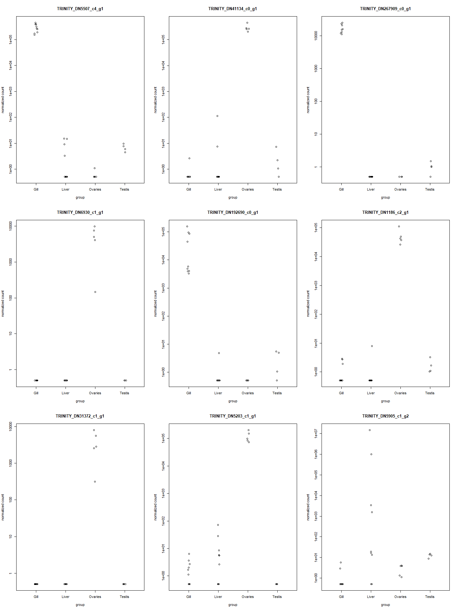
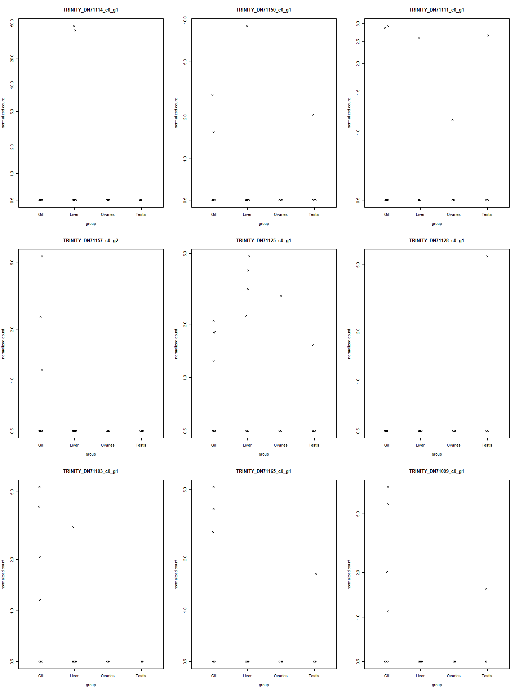

Tissue Specificity in *Syngnathus fuscus*
================
Coley Tosto
2024-07-31


- [Differential Expression Analysis](#differential-expression-analysis)
- [Calculating Tissue Specificity](#calculating-tissue-specificity)
  - [Pulling out TPM values](#pulling-out-tpm-values)
  - [Filtering the TPM dataset](#filtering-the-tpm-dataset)
  - [Generating $\tau$](#generating-tau)
  - [Validating the $\tau$
    calculations](#validating-the-tau-calculations)
- [Sex Bias and Tissue Specificity](#sex-bias-and-tissue-specificity)
  - [$\tau$ and logFC in sex-biased genes for each
    organ](#tau-and-logfc-in-sex-biased-genes-for-each-organ)
  - [$\tau$ and logFC for all the signficantly expressed genes in each
    organ](#tau-and-logfc-for-all-the-signficantly-expressed-genes-in-each-organ)
  - [Investigating genes with high tau and high
    logFC\`](#investigating-genes-with-high-tau-and-high-logfc)
    - [Gonads](#gonads)
    - [Liver](#liver)
    - [Gills](#gills)

``` r
#This is a cohesive list of all the libraries used in this document
library(DESeq2)
library(spfTools)
```

``` r
#The abundance matrix generated via salmon and tximport to be used for the DE analysis
txi.salmon <- readRDS("data/txi.salmon_FU.RDS")

#The samples file generated for tximport
samples <- read.table("FU_samples.txt", header = TRUE)

samples$group <- factor(paste0(samples$Sex, samples$Organ))

#Changing "Gonad" to be more specific to testis or ovaries
samples$Organ <- ifelse(samples$Sex == "F" & samples$Organ =="Gonad",
                        paste0("Ovaries"),
                        ifelse(samples$Sex == "M" & samples$Organ == "Gonad",
                               paste0("Testis"),
                               paste0(samples$Organ))
                        )

#Make sure the conditions are in the samples file as a factor
samples$Sex <- as.factor(samples$Sex)
samples$Organ <- as.factor(samples$Organ)

#Format colData to be used in the tau function
colData <- as.data.frame(samples)
rownames(colData) <- samples$ID
```

# Differential Expression Analysis

The main goal of this analysis is to relate measure of pleiotropic
constraints (tissue specificity) to sex bias. In order to do that I need
to combine my sex-bias data that I generated in a separate .Rmd
(`fuscus_diff_expr_analysis.Rmd`) with the tau values I will be
generating in this document.

Here I am reading in the sex-bias datasets that correspond to each of
the organ’s single-factor analysis. These datasets include all of the
genes where the p-value was not equal to “NA”.

``` r
liver_res <- read.csv("data/liver_res.csv", 
                      row.names = 1, 
                      header = TRUE)
gill_res <- read.csv("data/gill_res.csv", 
                      row.names = 1, 
                      header = TRUE)
gonad_res <- read.csv("data/gonad_res.csv", 
                      row.names = 1, 
                      header = TRUE)
```

# Calculating Tissue Specificity

To estimate tissue specificity, the TPM estimates are needed which is
the number of transcripts from a particular gene normalized first by
gene length, and then by sequencing depth (in millions) in the sample.
The output quant.sf files from salmon have the following format:

    Name | Length | EffectiveLength | TPM | NumReads

## Pulling out TPM values

From the salmon outputs I pulled out the TPM values for each sample. All
of the necessary .sf files are stored in a folder called
`fuscus_expression_files`.

The function below is pulling out the TPMs for each of the samples into
a column and then binding them together into one dataset. I then remove
the three samples that were not included in the differential expression
analysis.

``` r
#Get the list of file names/paths for all of the quant.sf files
files <- list.files(pattern = ".sf", path = "data/fuscus_expression_files", 
                    full.names = TRUE)

#For each quant.sf file pull out the TPM column
tpms <- do.call(cbind, lapply(files, function(file){

  dat <- read.delim(file, row.names = "Name")
  tpm <- dat["TPM"]
  colnames(tpm) <- gsub("data/fuscus_expression_files/(.*)_quant.sf","\\1",file)
  
  return(tpm)
}))

#Remove the samples that were removed in the diff. expression analysis
tpms <- tpms[, !(colnames(tpms) %in% c("FUT11M4",
                                       "FUG11M4",
                                       "FUL11M4"))]
```

## Filtering the TPM dataset

I know want to filter the TPM dataset to remove a few things. These
include similar things that I filtered out of the DESeq2 datasets prior
to performing the differential expression analysis. This includes:

1.  Keeping only the rows that weren’t filtered out in the DESeq2
    dataset due to low counts (rowSum $\le$ 10).

2.  Removing the rows that corresponded to genes that were “outliers” in
    the DESeq2 analysis.

3.  Removing the samples related to individual 11M4 that were removed in
    the differential expression analysis (see above).

This will be imperfect filtering in this case because I did an
individual single-factor analysis within each organ type. To try and
make life easier I am going to run the multi-factor analysis on the
DESeq dataset and then apply the filtering from that onto the TPM
dataset.

It should also be noted that the DESeq2 filtering was done based off of
the count data and not the TPMs, but as TPMs are just normalized counts
they should be correlated and something that was had low gene counts
should also have a low TPM and anything that was considered an outlier
in the counts could also be an outlier in terms of TPM, but it may not
be perfect.

``` r
#Running the MF diff. expr. analysis
#Create the DESeq dataset
dds_FU <- DESeqDataSetFromTximport(txi.salmon,
                                   colData = samples,
                                   design = ~ group)
```

    ## using counts and average transcript lengths from tximport

``` r
##Remove all 11M4 organs from the dataset
dds_FU <- dds_FU[, !(dds_FU$ID %in% c("FUT11M4", "FUG11M4", "FUL11M4"))]

##Filter the dataset, only keeping rows that have at least 10 reads total
keep <- rowSums(counts(dds_FU)) >= 10 
dds_FU <- dds_FU[keep, ]

#Generate the expression values
dds_FU_exp <- DESeq(dds_FU)
```

    ## estimating size factors

    ## using 'avgTxLength' from assays(dds), correcting for library size

    ## estimating dispersions

    ## gene-wise dispersion estimates

    ## mean-dispersion relationship

    ## final dispersion estimates

    ## fitting model and testing

``` r
#Filtering the tpm dataset
#Only keeping the rows that weren't filtered out due to low counts
tpms <- tpms[rownames(tpms) %in% rownames(dds_FU), ]

#Pulling out the geneIDs for genes that were categorized as "outliers" by DESeq2
#Calculating the Cooks threshold that would have been used
np <- length(resultsNames(dds_FU_exp))
nsamp <- ncol(dds_FU_exp)
cooks_thresh <- qf(0.99, df1 = np, df2 = nsamp-np)

out_ids <- names(mcols(dds_FU_exp)$maxCooks[mcols(dds_FU_exp)$maxCooks > cooks_thresh])

#Removing the rows in the tpm dataset that were deemed "outliers" by DESeq2
tpms <- tpms[!(rownames(tpms) %in% out_ids), ]
```

## Generating $\tau$

These filtered TPM estimates can then be used to estimate $\tau$, a
tissue specificity estimator that can range from 0 to 1. $\tau$ is
calculated for each tissue, $i$, as follows:

$$
\tau=\frac{\sum_i{[1-ln(TPM_i)/ln(TPM_{max})]}}{N-1}
$$

where $TPM_{max}$ is the maximum **average** TPM for a given tissue
type, and $TPM_i$ is the **average** TPM for tissue $i$. If $\tau = 0$,
that gene is evenly expressed across tissues; if $\tau=1$, the gene is
expressed in an entirely tissue-specific fashion. Because TPM values
approach 0 are impacted by sampling stochasticity, any genes that had an
expression approaching 0 were set to $TPM=2$.

``` r
#Function for estimating tau given the TPM matrix and metadata file
est_tau <- function(geneDat,colDat){
  
  #For each row in the TPM matrix cbind it with the metadata file,
  #this attaches organ type information to the TPM values
  tissue_dat<-data.frame(cbind(colDat,
                               geneDat))
  
  #For the TPM values approaching 0, set them to 2
  tissue_dat$geneDat[tissue_dat$geneDat < 2] <- 2
  
  
  #Get the average TPM for each tissue type (TPMi)
  tissue_avgs <- tapply(tissue_dat$geneDat,tissue_dat$Organ,mean)
  
  #Get the maximum value from the average TPMS (TPMmax)
  tpmMax <- max(tissue_avgs, na.rm=TRUE)
    
  #IF running tau on JUST males of JUST females, this accounts for the
  #fact that ovary or testis will return an NA in the averaging
  if(length(unique(tissue_dat$Organ)) == 3){
    
    #calcualte tau
    tau <- sum(1-(log(tissue_avgs[unique(tissue_dat$Organ)])/log(tpmMax)))/
      (length(unique(tissue_dat$Organ))-1)
    
    #pull out appropriate organ
    if(tau == 0){
    
    organ <- paste0(NA)
    
    }else{
    
    organ <- names(tissue_avgs[tissue_avgs == tpmMax])
    
    }
  
  #Combine tau and the organ information together
  tau_organ <- data.frame(tau = tau, organ = organ)
  
  return(tau_organ)
    
  }
  
  #IF using the WHOLE dataset, calculate tau
  tau <- sum(1-(log(tissue_avgs)/log(tpmMax)))/(length(unique(tissue_dat$Organ))-1)
  
  #Pull out the information about WHICH tissue the expression is specific in
  ##If tau == 0 (not tissue specific) then return NA, but if above zero
  ##pull out the name of the organ with the highest expression
  if(tau == 0){
    
    organ <- paste0(NA)
    
  }else{
    
    organ <- names(tissue_avgs[tissue_avgs == tpmMax])
    
  }
  
  #Combine tau and the organ information together
  tau_organ <- data.frame(tau = tau, organ = organ)
  
  return(tau_organ)
}
```

I then applied that function across each row in the TPMs matrix with my
metadata stored in the object `colData`. The metadata file includes the
sample ID, Sex, and Organ type for every column present in the TPM
matrix.

I ran the $\tau$ function with the whole dataset, and then for just
males and just females.

``` r
colData <- colData[!(colData$ID %in% c("FUT11M4", "FUG11M4", "FUL11M4")),]

tau <- do.call(rbind, apply(tpms, 1, est_tau, colDat=colData))


tau_fem <- do.call(rbind, apply(tpms[,which(colData$Sex=="F")], 1, est_tau,
                                colData[which(colData$Sex=="F"),]))

tau_mal <- do.call(rbind, apply(tpms[,which(colData$Sex=="M")], 1, est_tau,
                                colData[which(colData$Sex=="M"),]))
```

<figure>

<figcaption aria-hidden="true">Distribution of tissue specificity
estimates for only the male samples (left) versus only the female
samples (middle) versus the male samples and the female samples
(right).</figcaption>
</figure>

We can see that the distribution of $\tau$ doesn’t vary drastically when
looking at only male/female samples versus when we included all of the
samples in the calculation. Because of this, I can be confident in using
the $\tau$ with all the samples moving forward.

## Validating the $\tau$ calculations

To make sure $\tau$ is being calculated in a way that makes sense, I am
checking some of the TPM values and plotting the corresponding counts
for the genes with a high tissue specificity index and a low tissue
specificity index.

I also want to make sure that the organ classification I implemented in
the tissue specificity function is accurate.

    ##                              tau   organ
    ## TRINITY_DN5507_c4_g1   0.9320775    Gill
    ## TRINITY_DN41134_c0_g1  0.9317676 Ovaries
    ## TRINITY_DN267909_c0_g1 0.9277302    Gill
    ## TRINITY_DN6930_c1_g1   0.9258133 Ovaries
    ## TRINITY_DN192690_c0_g1 0.9224122    Gill
    ## TRINITY_DN1186_c2_g1   0.9222358 Ovaries
    ## TRINITY_DN31372_c1_g1  0.9220840 Ovaries
    ## TRINITY_DN5203_c1_g1   0.9216494 Ovaries
    ## TRINITY_DN5905_c1_g2   0.9201969   Liver

    ##                       FUG10M2  FUG11F1  FUG11M2  FUG12M1  FUG13F1  FUG13F4
    ## TRINITY_DN5507_c4_g1 19777.27 25944.81 26820.53 30563.74 37748.11 37098.78
    ##                       FUG15M5   FUG2F2  FUG3F2  FUL10M2  FUL11F1  FUL11M2
    ## TRINITY_DN5507_c4_g1 17677.93 31498.43 16204.4 0.408263 0.462261 0.068661
    ##                       FUL12M1 FUL13F1 FUL13F4 FUL15M5 FUL2F2 FUL3F2 FUO11F1
    ## TRINITY_DN5507_c4_g1 0.192583       0       0       0      0      0       0
    ##                      FUO13F1  FUO13F4 FUO2F2 FUO3F2  FUT10M2  FUT11M2  FUT12M1
    ## TRINITY_DN5507_c4_g1       0 0.099184      0      0 1.014572 1.463632 1.859761
    ##                       FUT15M5
    ## TRINITY_DN5507_c4_g1 0.788966

    ##                       FUG10M2 FUG11F1 FUG11M2 FUG12M1 FUG13F1 FUG13F4 FUG15M5
    ## TRINITY_DN41134_c0_g1       0       0       0       0       0       0       0
    ##                       FUG2F2   FUG3F2 FUL10M2 FUL11F1 FUL11M2 FUL12M1 FUL13F1
    ## TRINITY_DN41134_c0_g1      0 0.117978       0       0       0       0       0
    ##                       FUL13F4 FUL15M5   FUL2F2  FUL3F2 FUO11F1  FUO13F1
    ## TRINITY_DN41134_c0_g1       0       0 1.439704 0.17896 32838.6 25016.87
    ##                        FUO13F4   FUO2F2   FUO3F2  FUT10M2  FUT11M2 FUT12M1
    ## TRINITY_DN41134_c0_g1 26196.31 20893.05 24119.07 0.065602 0.203414       0
    ##                        FUT15M5
    ## TRINITY_DN41134_c0_g1 0.826125

    ##                         FUG10M2  FUG11F1  FUG11M2  FUG12M1  FUG13F1  FUG13F4
    ## TRINITY_DN267909_c0_g1 15861.43 18979.82 17814.45 20319.39 27249.73 25673.48
    ##                         FUG15M5   FUG2F2   FUG3F2 FUL10M2 FUL11F1 FUL11M2
    ## TRINITY_DN267909_c0_g1 16809.72 24157.54 18606.81       0       0       0
    ##                        FUL12M1 FUL13F1 FUL13F4 FUL15M5 FUL2F2 FUL3F2 FUO11F1
    ## TRINITY_DN267909_c0_g1       0       0       0       0      0      0       0
    ##                        FUO13F1 FUO13F4 FUO2F2 FUO3F2 FUT10M2 FUT11M2  FUT12M1
    ## TRINITY_DN267909_c0_g1       0       0      0      0       0 1.32893 2.616365
    ##                         FUT15M5
    ## TRINITY_DN267909_c0_g1 1.416825

    ##                      FUG10M2 FUG11F1 FUG11M2 FUG12M1 FUG13F1 FUG13F4 FUG15M5
    ## TRINITY_DN6930_c1_g1       0       0       0       0       0       0       0
    ##                      FUG2F2 FUG3F2 FUL10M2 FUL11F1 FUL11M2 FUL12M1 FUL13F1
    ## TRINITY_DN6930_c1_g1      0      0       0       0       0       0       0
    ##                      FUL13F4 FUL15M5 FUL2F2 FUL3F2  FUO11F1  FUO13F1  FUO13F4
    ## TRINITY_DN6930_c1_g1       0       0      0      0 17354.72 8823.398 11856.55
    ##                       FUO2F2   FUO3F2 FUT10M2 FUT11M2 FUT12M1 FUT15M5
    ## TRINITY_DN6930_c1_g1 18735.4 339.0367       0       0       0       0

    ##                         FUG10M2  FUG11F1  FUG11M2  FUG12M1  FUG13F1  FUG13F4
    ## TRINITY_DN192690_c0_g1 23487.56 24211.85 894.8261 1008.716 1293.544 1019.839
    ##                         FUG15M5   FUG2F2   FUG3F2  FUL10M2 FUL11F1 FUL11M2
    ## TRINITY_DN192690_c0_g1 13587.53 1028.793 39327.73 0.317268       0       0
    ##                        FUL12M1 FUL13F1 FUL13F4 FUL15M5 FUL2F2 FUL3F2 FUO11F1
    ## TRINITY_DN192690_c0_g1       0       0       0       0      0      0       0
    ##                        FUO13F1 FUO13F4 FUO2F2 FUO3F2  FUT10M2  FUT11M2 FUT12M1
    ## TRINITY_DN192690_c0_g1       0       0      0      0 2.226906 0.296346       0
    ##                         FUT15M5
    ## TRINITY_DN192690_c0_g1 2.633663

    ##                       FUG10M2 FUG11F1 FUG11M2 FUG12M1 FUG13F1  FUG13F4 FUG15M5
    ## TRINITY_DN1186_c2_g1 0.219755       0       0       0       0 0.229783       0
    ##                      FUG2F2  FUG3F2 FUL10M2 FUL11F1 FUL11M2 FUL12M1 FUL13F1
    ## TRINITY_DN1186_c2_g1      0 0.12584       0       0       0       0       0
    ##                      FUL13F4 FUL15M5   FUL2F2 FUL3F2  FUO11F1 FUO13F1  FUO13F4
    ## TRINITY_DN1186_c2_g1       0       0 0.152474      0 13155.28 7254.93 5955.645
    ##                        FUO2F2   FUO3F2  FUT10M2  FUT11M2  FUT12M1  FUT15M5
    ## TRINITY_DN1186_c2_g1 4321.204 6469.144 0.109197 0.223647 0.103766 0.526084

    ##                       FUG10M2 FUG11F1 FUG11M2 FUG12M1 FUG13F1 FUG13F4 FUG15M5
    ## TRINITY_DN31372_c1_g1       0       0       0       0       0       0       0
    ##                       FUG2F2 FUG3F2 FUL10M2 FUL11F1 FUL11M2 FUL12M1 FUL13F1
    ## TRINITY_DN31372_c1_g1      0      0       0       0       0       0       0
    ##                       FUL13F4 FUL15M5 FUL2F2 FUL3F2  FUO11F1  FUO13F1  FUO13F4
    ## TRINITY_DN31372_c1_g1       0       0      0      0 8751.549 15466.85 5997.736
    ##                         FUO2F2   FUO3F2 FUT10M2 FUT11M2 FUT12M1 FUT15M5
    ## TRINITY_DN31372_c1_g1 5659.576 640.8449       0       0       0       0

    ##                       FUG10M2  FUG11F1 FUG11M2 FUG12M1  FUG13F1  FUG13F4
    ## TRINITY_DN5203_c1_g1 0.061455 0.045342       0       0 0.192052 0.022836
    ##                      FUG15M5   FUG2F2   FUG3F2 FUL10M2 FUL11F1  FUL11M2
    ## TRINITY_DN5203_c1_g1       0 0.103556 0.080138       0       0 0.681082
    ##                       FUL12M1  FUL13F1  FUL13F4  FUL15M5   FUL2F2 FUL3F2
    ## TRINITY_DN5203_c1_g1 0.018602 0.063119 0.110536 0.049911 0.230039      0
    ##                       FUO11F1  FUO13F1  FUO13F4   FUO2F2   FUO3F2 FUT10M2
    ## TRINITY_DN5203_c1_g1 9576.269 8729.695 5411.466 4883.741 6157.025       0
    ##                      FUT11M2 FUT12M1 FUT15M5
    ## TRINITY_DN5203_c1_g1       0       0       0

    ##                      FUG10M2 FUG11F1 FUG11M2  FUG12M1 FUG13F1 FUG13F4  FUG15M5
    ## TRINITY_DN5905_c1_g2       0       0       0 0.076948       0       0 0.041919
    ##                      FUG2F2 FUG3F2  FUL10M2 FUL11F1 FUL11M2  FUL12M1  FUL13F1
    ## TRINITY_DN5905_c1_g2      0      0 0.053721 0.07994       0 0.064351 7.515366
    ##                      FUL13F4 FUL15M5   FUL2F2   FUL3F2 FUO11F1 FUO13F1  FUO13F4
    ## TRINITY_DN5905_c1_g2 5348.33       0 47872.44 22.06734 0.06111 0.01846 0.014991
    ##                        FUO2F2  FUO3F2  FUT10M2  FUT11M2  FUT12M1  FUT15M5
    ## TRINITY_DN5905_c1_g2 0.090014 0.07987 0.239217 0.437166 0.370539 0.392304

<figure>

<figcaption aria-hidden="true">Plots of the counts from the DESeq2
Dataset for genes with the highest tau</figcaption>
</figure>

    ##                       tau organ
    ## TRINITY_DN71114_c0_g1   0    NA
    ## TRINITY_DN71150_c0_g1   0    NA
    ## TRINITY_DN71111_c0_g1   0    NA
    ## TRINITY_DN71157_c0_g2   0    NA
    ## TRINITY_DN71125_c0_g1   0    NA
    ## TRINITY_DN71128_c0_g1   0    NA
    ## TRINITY_DN71103_c0_g1   0    NA
    ## TRINITY_DN71165_c0_g1   0    NA
    ## TRINITY_DN71099_c0_g1   0    NA

    ##                       FUG10M2 FUG11F1 FUG11M2 FUG12M1 FUG13F1 FUG13F4 FUG15M5
    ## TRINITY_DN71114_c0_g1       0       0       0       0       0       0       0
    ##                       FUG2F2 FUG3F2 FUL10M2 FUL11F1  FUL11M2  FUL12M1 FUL13F1
    ## TRINITY_DN71114_c0_g1      0      0       0       0 0.800517 0.839772       0
    ##                       FUL13F4 FUL15M5 FUL2F2 FUL3F2 FUO11F1 FUO13F1 FUO13F4
    ## TRINITY_DN71114_c0_g1       0       0      0      0       0       0       0
    ##                       FUO2F2 FUO3F2 FUT10M2 FUT11M2 FUT12M1 FUT15M5
    ## TRINITY_DN71114_c0_g1      0      0       0       0       0       0

    ##                       FUG10M2 FUG11F1 FUG11M2  FUG12M1 FUG13F1 FUG13F4 FUG15M5
    ## TRINITY_DN71150_c0_g1       0       0       0 0.467926       0 1.03467       0
    ##                       FUG2F2 FUG3F2 FUL10M2 FUL11F1  FUL11M2 FUL12M1 FUL13F1
    ## TRINITY_DN71150_c0_g1      0      0       0       0 1.004014       0       0
    ##                       FUL13F4 FUL15M5 FUL2F2 FUL3F2 FUO11F1 FUO13F1 FUO13F4
    ## TRINITY_DN71150_c0_g1       0       0      0      0       0       0       0
    ##                       FUO2F2 FUO3F2 FUT10M2 FUT11M2  FUT12M1 FUT15M5
    ## TRINITY_DN71150_c0_g1      0      0       0       0 1.503289       0

    ##                       FUG10M2  FUG11F1 FUG11M2 FUG12M1 FUG13F1 FUG13F4  FUG15M5
    ## TRINITY_DN71111_c0_g1       0 0.799107       0       0       0       0 0.927938
    ##                       FUG2F2 FUG3F2 FUL10M2 FUL11F1 FUL11M2 FUL12M1 FUL13F1
    ## TRINITY_DN71111_c0_g1      0      0       0 0.23221       0       0       0
    ##                       FUL13F4 FUL15M5 FUL2F2 FUL3F2 FUO11F1 FUO13F1  FUO13F4
    ## TRINITY_DN71111_c0_g1       0       0      0      0       0       0 0.349856
    ##                       FUO2F2 FUO3F2 FUT10M2  FUT11M2 FUT12M1 FUT15M5
    ## TRINITY_DN71111_c0_g1      0      0       0 1.472693       0       0

    ##                       FUG10M2 FUG11F1  FUG11M2  FUG12M1 FUG13F1  FUG13F4
    ## TRINITY_DN71157_c0_g2       0       0 0.122256 0.824265       0 0.317157
    ##                       FUG15M5 FUG2F2 FUG3F2 FUL10M2 FUL11F1 FUL11M2 FUL12M1
    ## TRINITY_DN71157_c0_g2       0      0      0       0       0       0       0
    ##                       FUL13F1 FUL13F4 FUL15M5 FUL2F2 FUL3F2 FUO11F1 FUO13F1
    ## TRINITY_DN71157_c0_g2       0       0       0      0      0       0       0
    ##                       FUO13F4 FUO2F2 FUO3F2 FUT10M2 FUT11M2 FUT12M1 FUT15M5
    ## TRINITY_DN71157_c0_g2       0      0      0       0       0       0       0

    ##                       FUG10M2 FUG11F1  FUG11M2  FUG12M1  FUG13F1 FUG13F4
    ## TRINITY_DN71125_c0_g1       0       0 0.603372 0.680796 0.481815       0
    ##                       FUG15M5 FUG2F2   FUG3F2  FUL10M2 FUL11F1 FUL11M2 FUL12M1
    ## TRINITY_DN71125_c0_g1       0      0 0.313659 0.536639       0       0       0
    ##                        FUL13F1  FUL13F4 FUL15M5 FUL2F2   FUL3F2 FUO11F1 FUO13F1
    ## TRINITY_DN71125_c0_g1 0.242474 0.419704       0      0 0.686315       0       0
    ##                       FUO13F4   FUO2F2 FUO3F2 FUT10M2 FUT11M2 FUT12M1 FUT15M5
    ## TRINITY_DN71125_c0_g1       0 1.893492      0       0       0 0.92331       0

    ##                       FUG10M2 FUG11F1 FUG11M2 FUG12M1 FUG13F1 FUG13F4 FUG15M5
    ## TRINITY_DN71128_c0_g1       0       0       0       0       0       0       0
    ##                       FUG2F2 FUG3F2 FUL10M2 FUL11F1 FUL11M2 FUL12M1 FUL13F1
    ## TRINITY_DN71128_c0_g1      0      0       0       0       0       0       0
    ##                       FUL13F4 FUL15M5 FUL2F2 FUL3F2 FUO11F1 FUO13F1 FUO13F4
    ## TRINITY_DN71128_c0_g1       0       0      0      0       0       0       0
    ##                       FUO2F2 FUO3F2 FUT10M2 FUT11M2 FUT12M1  FUT15M5
    ## TRINITY_DN71128_c0_g1      0      0       0       0       0 1.635123

    ##                       FUG10M2 FUG11F1 FUG11M2  FUG12M1  FUG13F1 FUG13F4
    ## TRINITY_DN71103_c0_g1       0       0       0 0.580412 0.068605       0
    ##                        FUG15M5  FUG2F2 FUG3F2 FUL10M2 FUL11F1 FUL11M2 FUL12M1
    ## TRINITY_DN71103_c0_g1 0.509153 0.15601      0       0       0       0       0
    ##                       FUL13F1 FUL13F4  FUL15M5 FUL2F2 FUL3F2 FUO11F1 FUO13F1
    ## TRINITY_DN71103_c0_g1       0       0 0.081366      0      0       0       0
    ##                       FUO13F4 FUO2F2 FUO3F2 FUT10M2 FUT11M2 FUT12M1 FUT15M5
    ## TRINITY_DN71103_c0_g1       0      0      0       0       0       0       0

    ##                        FUG10M2 FUG11F1 FUG11M2 FUG12M1 FUG13F1  FUG13F4
    ## TRINITY_DN71165_c0_g1 1.371174       0       0       0       0 1.717833
    ##                        FUG15M5 FUG2F2 FUG3F2 FUL10M2 FUL11F1 FUL11M2 FUL12M1
    ## TRINITY_DN71165_c0_g1 1.086165      0      0       0       0       0       0
    ##                       FUL13F1 FUL13F4 FUL15M5 FUL2F2 FUL3F2 FUO11F1 FUO13F1
    ## TRINITY_DN71165_c0_g1       0       0       0      0      0       0       0
    ##                       FUO13F4 FUO2F2 FUO3F2 FUT10M2 FUT11M2 FUT12M1 FUT15M5
    ## TRINITY_DN71165_c0_g1       0      0      0 0.84644       0       0       0

    ##                       FUG10M2 FUG11F1 FUG11M2 FUG12M1  FUG13F1 FUG13F4  FUG15M5
    ## TRINITY_DN71099_c0_g1       0       0       0       0 0.786263       0 0.120757
    ##                         FUG2F2   FUG3F2 FUL10M2 FUL11F1 FUL11M2 FUL12M1 FUL13F1
    ## TRINITY_DN71099_c0_g1 0.994992 0.252156       0       0       0       0       0
    ##                       FUL13F4 FUL15M5 FUL2F2 FUL3F2 FUO11F1 FUO13F1 FUO13F4
    ## TRINITY_DN71099_c0_g1       0       0      0      0       0       0       0
    ##                       FUO2F2 FUO3F2 FUT10M2 FUT11M2 FUT12M1  FUT15M5
    ## TRINITY_DN71099_c0_g1      0      0       0       0       0 0.363972

<figure>

<figcaption aria-hidden="true">Plots of the counts from the DESeq2
Dataset for genes with the lowest tau</figcaption>
</figure>

We can see that for the genes that have high tau values the plots of the
normalized counts show higher expression in just that tissue, whereas
for the plots of the lower tau values no clear patterns are showing up
in the plots of the counts. This is what we want to see, increasing
confidence that the the calculations of tau are accurate. We can also
see that the assignment of the tissues from the est_tau function match
the outputs from looking at the raw counts.

# Sex Bias and Tissue Specificity

Now that I have calculated $\tau$ I want to relate it back to
information about sex bias to see what, if any, relationship exists. I
am going to do this separately for the different organs to see if the
relationship changes based on organ type.

## $\tau$ and logFC in sex-biased genes for each organ

A gene was determined to be sex-biased if it had a log-fold change
$\ge |2|$ AND an adjusted p-value of $< 0.05$. Earlier I read in four
datasets that contain information for all of the significantly expressed
genes in each organ (i.e. the genes that were not given a p-value of NA
from DESeq).

From these datasets I can pull out the female- and male-biased genes to
plot logFC against $\tau$ within the genes that are sex-biased.

<figure>

<figcaption aria-hidden="true">Sex bias (in terms of the square root of
the absolute value of the log2FoldChange) versus tissue specificity
(tau) for all genes that are sex biased in the gonads, liver, skin, and
brain.</figcaption>
</figure>

The absolute value of the log2 fold change was square root transformed.
There appears to be a relationship between $\tau$ and sex bias for the
gonads, but potentially not for the liver and the gills. This may be due
to a low number of sex-biased genes. We can look further into this
relationship with a Spearman’s rank correlation test. This was done
between $\tau$ and the $|log2FoldChange|$ for each organ separately.

    ## 
    ##  Spearman's rank correlation rho
    ## 
    ## data:  gonad_bias_tau$tau and sqrt(abs(gonad_bias_tau$log2FoldChange))
    ## S = 8.9942e+11, p-value = 0.01769
    ## alternative hypothesis: true rho is not equal to 0
    ## sample estimates:
    ##      rho 
    ## 0.017856

    ## 
    ##  Spearman's rank correlation rho
    ## 
    ## data:  liver_bias_tau$tau and sqrt(abs(liver_bias_tau$log2FoldChange))
    ## S = 893718, p-value = 0.007974
    ## alternative hypothesis: true rho is not equal to 0
    ## sample estimates:
    ##       rho 
    ## 0.1929684

    ## 
    ##  Spearman's rank correlation rho
    ## 
    ## data:  gill_bias_tau$tau and sqrt(abs(gill_bias_tau$log2FoldChange))
    ## S = 53683, p-value = 0.8749
    ## alternative hypothesis: true rho is not equal to 0
    ## sample estimates:
    ##        rho 
    ## 0.01930204

The liver and gonad both show a significant correlation. This isn’t
super obvious from just looking at the plot.

## $\tau$ and logFC for all the signficantly expressed genes in each organ

Only looking at the logFC for the sex-biased genes may be affecting the
relationship that I am seeing between sex bias and $\tau$, especially in
the organs where the samples size is very small if I am only including
sex-biased genes (like the liver and gills).

I used the same steps as above to see how the relationship changes when
I add in ALL of the genes that are significantly expressed for each
organ. In this datasets I have removed all rows where the adjusted
p-value is NA (outliers and low-counts).

<figure>

<figcaption aria-hidden="true">Sex bias (in terms of the absolute value
of the log2FoldChange) versus tissue specificity (tau) for all genes
that are signifcantly expressed in the gonads, liver, and
gills.</figcaption>
</figure>

The absolute value of the log2 fold change was square root transformed.
We can see similar patterns as when we only plotted the sex biased genes
with the strongest relationship showing up in the gonads. When we add in
all of the points, however, it seems that the best fit line for the
liver and gills now points downward. Let’s see how the Spearman’s rank
correlation test have changed. This was done between $\tau$ and the
$|log2FoldChange|$ for each organ separately.

    ## 
    ##  Spearman's rank correlation rho
    ## 
    ## data:  gonad_bias_tau_all$tau and abs(gonad_bias_tau_all$log2FoldChange)
    ## S = 3.3767e+13, p-value < 2.2e-16
    ## alternative hypothesis: true rho is not equal to 0
    ## sample estimates:
    ##       rho 
    ## 0.1126625

    ## 
    ##  Spearman's rank correlation rho
    ## 
    ## data:  liver_bias_tau_all$tau and abs(liver_bias_tau_all$log2FoldChange)
    ## S = 3.6241e+12, p-value < 2.2e-16
    ## alternative hypothesis: true rho is not equal to 0
    ## sample estimates:
    ##       rho 
    ## -0.121105

    ## 
    ##  Spearman's rank correlation rho
    ## 
    ## data:  gill_bias_tau_all$tau and abs(gill_bias_tau_all$log2FoldChange)
    ## S = 1.5541e+13, p-value < 2.2e-16
    ## alternative hypothesis: true rho is not equal to 0
    ## sample estimates:
    ##        rho 
    ## -0.1856574

All correlations are now significant, however, for the gills and the
liver there is a significantly negative correlation between $\tau$ and
the degree of sex bias.

## Investigating genes with high tau and high logFC\`

Because we have information about which tissue each gene is specific in,
I was to see if genes that are very sex-biased in a tissue are also
tissue-specific in that same tissue.

### Gonads

<figure>

<figcaption aria-hidden="true"><em>Sex bias (in terms of the absolute
value of the log2FoldChange) versus tissue specificity (tau) for all
genes that are sex-biased in the gonads. Color represents the tissue
that it is specific in which may be either the testis or ovaries
(yellow), the liver (pink), the gills (blue), or none
(black).</em></figcaption>
</figure>

In the gonads it looks like a lot of the genes that are extremely
sex-biased are also tissue specific in the gonads (whether that is
tissue-specific in the testis or in the ovaries).

### Liver

<figure>

<figcaption aria-hidden="true"><em>Sex bias (in terms of the absolute
value of the log2FoldChange) versus tissue specificity (tau) for all
genes that are sex-biased in the liver. Color represents the tissue that
it is specific in which may be either the testis or ovaries (yellow),
the liver (pink), the gills (blue), or none (black).</em></figcaption>
</figure>

Similar to the gonads, most of the extremely biased genes in the liver
are also tissue specific in the liver, expect for a few cases. It looks
like some of the most biased genes in the liver are showing more
expression in the gonads and there are two cases where tau is 0. Other
than that, many of the more intermediately sex-biased genes show the
highest expression in gonads.

### Gills

<figure>

<figcaption aria-hidden="true"><em>Sex bias (in terms of the absolute
value of the log2FoldChange) versus tissue specificity (tau) for all
genes that are sex-biased in the gills. Color represents the tissue that
it is specific in which may be either the testis or ovaries (yellow),
the liver (pink), the gills (blue), or none (black).</em></figcaption>
</figure>

There aren’t many biased genes in the gills, however, of the ones that
are there is quite a mix in terms of which tissue is showing the highest
overall expression.
